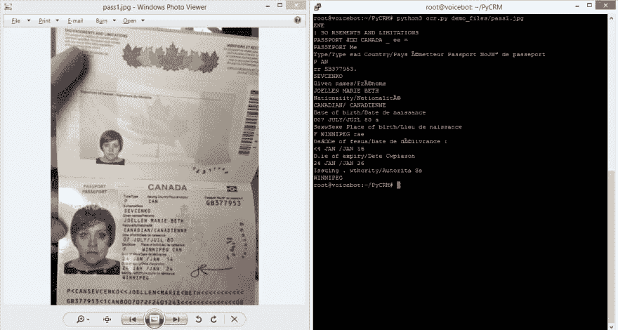
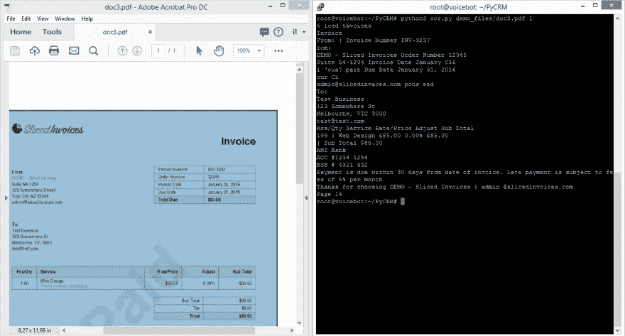

# 使用人工智能实现更智能的文档管理

> 原文：<https://blog.devgenius.io/smarter-document-management-using-a-i-9a9aa51e134b?source=collection_archive---------9----------------------->

许多企业(包括我自己的企业)苦于低效的流程，比如手工数据处理。这些问题可以通过自动化解决，使用结构化系统，如 CRM 和定制工具。这些年来，我一直在处理需要大量数据处理、分析和报告的复杂环境。“数据”可以指任何数字化的东西。

一段时间以前，我遇到一个客户，他有数千个非结构化文档，这些文档多年来堆积如山。它已经成为一个非常低效的环境，尤其是在必须检索信息，但却无法高效检索时。幸运的是，科技可以帮助我们。OCR 代表光学字符识别，它是一种机器学习学科，专注于从图像/图片中提取文本。

假设你有数百份档案，其中大部分是护照、合同和发票的复印件。一些图像是通过电话制作的，一些是扫描的，一些是包含文本和/或图像的 PDF 文件。下面的演示截图说明了我们如何从这些类型的文档中提取文本/关键词。



使用提取的文本/关键字，我们可以根据自己的业务规则处理这些文件，例如重命名/复制/移动/备份；但是我们也可以将这些文件发送/上传到其他管道进行进一步处理。请记住，OCR 非常好，但它并不完美，它在图像清晰且不包含奇怪字符时效果最佳。支持大多数语言。

```
# Basic usage of our OCR libraryimport ocryour_file = './demo_files/doc1.pdf'
text = ocr.process(your_file)# your business rules
if 'CONTRACT' in text:
  ...
else:
  ...
```

如此简单，您只需要基本的 python 知识就可以开始了。欲了解更多信息，请访问我们的 Git 资源库。

[https://github.com/healzer/PyCRM](https://github.com/healzer/PyCRM)

“PyCRM”项目为您的业务收集了有用的工具、提示和技巧。这些可以用于几乎任何有一些数字流程的行业:管理客户/数据、数据提取和分析、报告、流程自动化等。