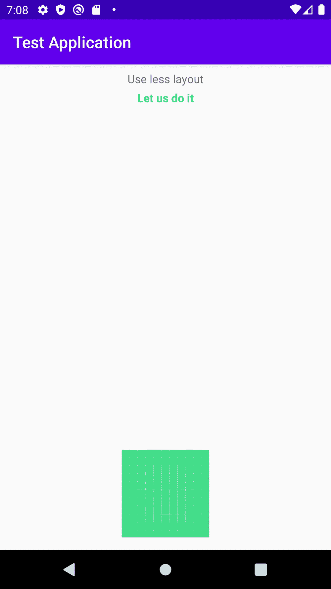

# Android 应用程序上流畅简单的动画

> 原文：<https://blog.devgenius.io/smooth-and-easy-animations-on-android-apps-e7541c5ded78?source=collection_archive---------9----------------------->

照片由[克里斯蒂安·威迪格](https://unsplash.com/@christianw?utm_source=medium&utm_medium=referral)在 [Unsplash](https://unsplash.com?utm_source=medium&utm_medium=referral) 上拍摄

在这篇文章中，我们将学习在 Android 应用程序中创建流畅的动画，同时编写最少的代码行。我确信我不必解释应用程序中动画的重要性。它们是 UX 设计师的最爱。它们提升了用户的体验。但是创造它们并不容易。

要进一步理解内容，你必须对`ConstraintLayout`有所了解。网上有很多文章，但为了完整起见:[https://developer.android.com/training/constraint-layout](https://developer.android.com/training/constraint-layout)。

注意:我不赞成任何写代码的方式。此处的代码只是为了进行说明，并给出演练的概念。你可以随意组织。

每个动画都有一个开始场景和结束场景。我们必须尽可能平稳地从开始场景过渡到结束场景。对于这个实例，我们将尝试在单击图像(是的，屏幕上的绿点)时，从场景 1(左侧的图像)过渡到场景 2(右侧的图像)。

左边的图像:场景 1。右边的图像:场景 2

这是场景 1 的布局。不要看`id(s)`而是看约束。

活动 _ 主要 _v1

这是场景 2 的布局。做`id(s)`还要看约束。万一你错过了，`id(s)`是相同的，但是约束是不同的。

活动 _ 主要 _v2

一旦你创建了这两个场景，是时候进行过渡了。

进行转换的代码

让我们一行一行的演练代码:
1。首先，我们创建`ConstraintSet`，它允许您以编程方式定义一组与`[ConstraintLayout](https://developer.android.com/reference/androidx/constraintlayout/widget/ConstraintLayout)`一起使用的约束，我们从场景 2【activity _ main _ v2】克隆约束。
2。然后，我们在图像上注册一个`clickListener`，它将作为过渡的触发器。
3。在被点击时，我们告诉`TransitionManager`在调用这个方法和下一个渲染帧之间，动画到一个由给定场景根内的所有变化定义的新场景。调用此方法会导致 TransitionManager 捕获场景根中的当前值，然后提交请求以在下一帧运行过渡。
4。最后，我们对原始布局应用新的约束。

最后一段代码中缺失的部分是`createTransition()`。下面是代码的样子。

简单过渡

我们创建一个过渡并指定各种可用的参数来相应地调整动画。比如我把`duration`指定为 3000ms。所有这一切之后的结果将类似于 gif 中所示

更改界限转换

我们可以一起使用各种过渡来创建多种效果。

多个过渡协同工作示例

上面的代码片段会产生类似下面的 gif。仅供参考，我已经将`no_use_motivation`的可见性标记为在场景 1 中消失，在场景 2 中可见。

有各种各样的过渡可用，它们可以组合起来创建漂亮的用户体验。

这里也提到了一些限制。应用于`[SurfaceView](https://developer.android.com/reference/android/view/SurfaceView)`的动画可能无法正确显示。`[SurfaceView](https://developer.android.com/reference/android/view/SurfaceView)`实例从非 UI 线程更新，因此更新可能与其他视图的动画不同步。
2。某些特定的过渡类型在应用到`[TextureView](https://developer.android.com/reference/android/view/TextureView)`时可能不会产生想要的动画效果。
3。扩展了`[AdapterView](https://developer.android.com/reference/android/widget/AdapterView)`的类，比如`[ListView](https://developer.android.com/reference/android/widget/ListView)`，以与转换框架不兼容的方式管理孩子的视图。如果您尝试基于`[AdapterView](https://developer.android.com/reference/android/widget/AdapterView)`制作视图动画，设备显示可能会挂起。
4。如果您试图用动画调整`[TextView](https://developer.android.com/reference/android/widget/TextView)`的大小，在对象完全调整大小之前，文本将弹出到一个新的位置。为避免此问题，请不要对包含文本的视图进行动画调整。