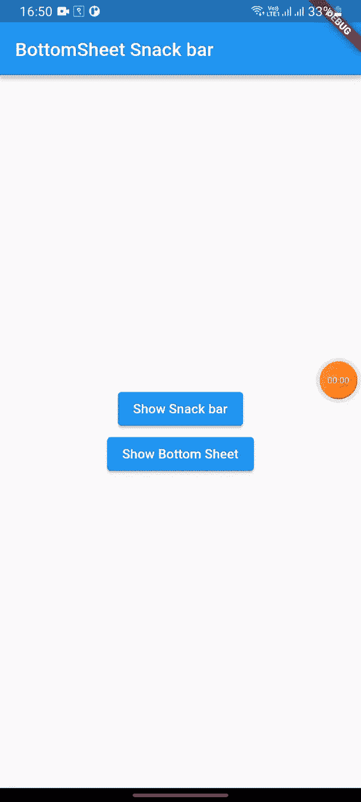

# 飘起的小吃店

> 原文：<https://blog.devgenius.io/snack-bar-in-flutter-3492f5997d1c?source=collection_archive---------11----------------------->

小吃店是移动应用程序中广泛使用的小部件。小吃栏用于在用户执行某个操作时显示消息和信息，或者显示错误或成功消息。

在这篇文章中，我们将讨论如何显示小吃店，也在 BottomSheet。我们的应用程序表现如下:



小吃店的骚动

在直接进入代码之前。让我们讨论一下这篇文章中我们将要提出的主题。

*   模态底部表单是菜单或对话框的替代品，它阻止用户与应用程序的其他部分进行交互。它是一个从应用程序底部打开的容器或对话框。
*   **SnackBar:** 是一个用来临时显示消息的小工具。它为用户交互提供动作。

## 让我们开始吃吧

首先，我们在 ***lib*** 文件夹中创建一个 ***homepage.dart*** 。如上面的 gif 所示，当用户按下按钮时，我们显示小吃店。

我们可以展示小吃店如下:

```
ScaffoldMessenger.of(context).showSnackBar(
const SnackBar( content:Text("This Snack bar")));
```

展示小吃店并不难，但是当要在底层展示小吃店时，就有点棘手了，因为小吃店展示在底层的后面。

首先，我们需要通过单击按钮来显示模态底部表单。

我们可以用***showModalBottomSheet***方法得到底部的工作表。

如上所述，我们在 ***的构建器 showModalBottomSheet*** 中使用 ***脚手架*** ，是因为它为我们的 ***SnackBar 提供了上下文。***

# 让我们连接起来

我们可以成为朋友。在[脸书](https://www.facebook.com/nabin.dhakal.714/)、 [Linkedin](https://www.linkedin.com/in/nabindhakal/) 、 [Github](https://github.com/nbnD) 、 [Youtube](https://www.youtube.com/channel/UCW6oYt_3QSl7J2HSHNqwXWw) 、 [BuyMeACoffee](https://www.buymeacoffee.com/nabindhakal) 和 [Instagram](https://www.instagram.com/nbn_d_/) 上查找。

访问:[颤振连接](https://flutterjunction.com/)

**投稿:** [BuyMeACoffee](https://www.buymeacoffee.com/nabindhakal)

# 结论

希望这篇文章对你有所帮助，让你学到新的东西。我在这篇文章中使用了一些对你们中的一些人来说可能是新的东西。

如果你学到了新的东西或者想提出一些建议，请在评论中告诉我。

如果你喜欢这篇文章，请点击👏图标，它为您提供了传递所有新事物的动力。

此外，关注令人兴奋的文章和项目的更新。

通过分享学习对学习过程产生了巨大的影响，并使社区越来越大。

分享是吸引其他爱好者的磁石。

因此，让我们朝着扩大我们的学习社区迈出一小步。

与你的朋友分享这篇文章，或者如果你喜欢这篇文章，就在推特上发表评论。

## **在:**吃得饱

[](https://github.com/nbnD/bottomSheet_snackBar) [## GitHub-nbnD/bottom sheet _ snack bar

### 此时您不能执行该操作。您已使用另一个标签页或窗口登录。您已在另一个选项卡中注销，或者…

github.com](https://github.com/nbnD/bottomSheet_snackBar)