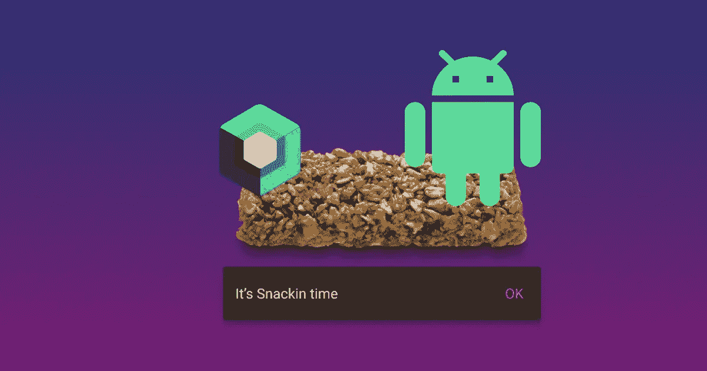
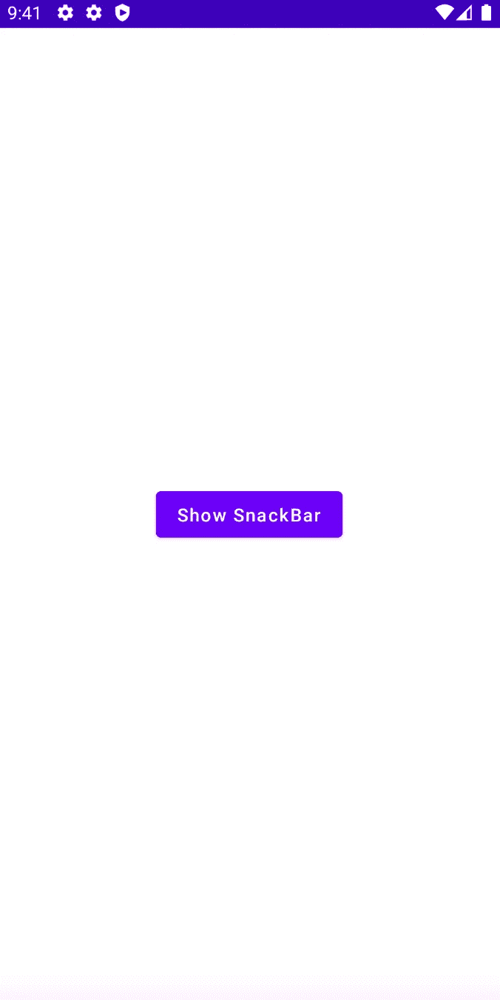

# Jetpack 撰写中的 Snackbars

> 原文：<https://blog.devgenius.io/snackbars-in-jetpack-compose-d1b553224dca?source=collection_archive---------5----------------------->



在本文中，我们将了解 Android 中的 Snackbar 是什么，以及在 Jetpack Compose 中实现它的不同方法。我们还将简要介绍 Kotlin 中的**流**，以及在实现 Snackbar 时使用哪个流。

*注意:本文假设您对 Jetpack Compose 有一些基本的经验。*

## 什么是小吃店？

一个 [Snackbar](https://material.io/components/snackbars/android) 是一个 UI 组件，显示一个带有消息文本的浮动覆盖图。它可能包含也可能不包含动作按钮，这取决于实现。它主要用于向不需要复杂 UI 的用户显示简短的通用消息。

## 基本项目设置

*   在 Android 中创建一个空的合成项目。在预先创建的 **MainActivity.kt** 中，删除*问候语*撰写函数，使文件如下

```
class MainActivity : ComponentActivity() {
    override fun onCreate(savedInstanceState: Bundle?) {
        super.onCreate(savedInstanceState)
        *setContent* **{** *SnackBarTutTheme* **{** *Scaffold* **{** *Column*(
                        Modifier.*fillMaxSize*(),
                        verticalArrangement = Arrangement.Center,
                        horizontalAlignment = Alignment.CenterHorizontally
                    ) **{** *Button*(onClick = {}) **{** *Text*(text = "Show SnackBar")
                        **}
                    }
                }
            }
        }** }
}
```

这将为您提供以下 UI，这是一个位于屏幕中央的简单按钮。



目前，我们的按钮不做任何事情。我们将在课程接近尾声时解决这个问题，因为我们将学习如何在单击按钮时显示 Snackbar。

## 使用 StateFlow 实现 Snackbar

*   创建一个名为 **SnackbarViewModel.kt** 的文件，并向其中添加以下代码。

```
class SnackBarScreenViewModel : ViewModel() {

    private val _isMessageShown = *MutableStateFlow*(false)
    val isMessageShownFlow = _isMessageShown.*asStateFlow*()

    fun setMessageShown() {
        *viewModelScope*.*launch* **{** _isMessageShown.emit(true)
        **}** }
}
```

我们来分析一下上面的代码:

*   我们已经添加了 **_isMessageShown** 属性。这是一个私有变量，它创建一个初始值设置为 false 的 MutableStateFlow。StateFlow 是一个热流，这意味着不管是否有人在收集它，它都会发出值。
*   **isMessageShown** 是一个公共属性，暴露在我们的视野中进行观察。使用 *asStateFlow()* 将可变状态流转换为只读不可变状态流，这确保了视图不会发出任何值，并且 SnackBarScreenViewModel 是事件的唯一生产者。
*   **setmessageshowed**是一个将*_ is messageshown*StateFlow 的值更新为 true 并发出新值供 UI 收集的函数。

现在让我们更新一下 **MainActivity。Kt** 观察这个状态流，并在它为真时显示一个 Snackbar。更新主活动。Kt 看起来像下面的代码。

```
class MainActivity : ComponentActivity() {
    override fun onCreate(savedInstanceState: Bundle?) {
        super.onCreate(savedInstanceState)
        *setContent* **{** *SnackBarTutTheme* **{** val viewModel: SnackBarScreenViewModel by *viewModels*()
                val scaffoldState = *rememberScaffoldState*()

                *LaunchedEffect*(Unit) **{** viewModel.isMessageShownFlow.collectLatest **{** if (**it**) {
                            scaffoldState.snackbarHostState.showSnackbar(
                                message = "Hello World",
                                duration = SnackbarDuration.*Short* )
                        }
                    **}
                }** *Scaffold* **{** *Column*(
                        Modifier.*fillMaxSize*(),
                        verticalArrangement = Arrangement.Center,
                        horizontalAlignment = Alignment.CenterHorizontally
                    ) **{** *Button*(onClick = viewModel::setMessageShown) **{** *Text*(text = "Show SnackBar")
                        **}
                    }
                }
            }
        }** }
}
```

让我们分析一下上面的代码

*   **viewModel** 是通过委托检索 SnackBarScreenViewModel 实例的变量。
*   **scaffoldState** 是一个变量，它提供了一个脚手架状态上下文，该上下文稍后将用于创建一个 SnackbarHost。ScaffoldState 有助于提供确定在何处绘制 Snackbar 覆盖图的上下文。
*   LaunchedEffect 提供了一个协程作用域，我们可以在其中执行所有导致副作用的代码。在我们的例子中，我们将收集器连接到我们的 isMessageShownFlow 流。这确保了每当发出一个新值时，它都在这里被收集，并显示一个 Snackbar。通过提供*单元*作为 *LaunchedEffect* 的参数，我们确保收集器只连接到流一次，即当可组合组件最初被呈现时。
*   **showSnackbar** 是 SnackbarHost 公开的一个函数。此功能显示屏幕上当前活动的脚手架内的零食条。目前我们为它提供两个参数:*消息*和*持续时间。*

现在，每当我们单击按钮时，它都会调用我们的*视图模型*中的*setmessageshowed()*函数。然后，这将更新我们的 ui 收集的状态，以显示 Snackbar。

## 好的，它起作用了..那么问题出在哪里？

当你第一次点击这个按钮时，它按预期显示，但是当你再次点击它时会发生什么呢？也尝试改变设备的方向，你可以看到 snackbar 得到显示，即使没有点击按钮。那么为什么会出现这种情况呢？

首先，如果提供给 stateflow 的新的更新值与以前的值相同，那么它简单地拒绝发出新值。这解释了为什么 snackbar 只是第一次出现。第二，每当设备经历方向改变时，Stateflow 再次发出当前值，导致每次旋转设备时显示 snackbar。

## 分享给救援🦸🏻

SharedFlow 也是一个热流，但是它解决了上述两个问题:每当更新流值时它都发出，而当设备旋转时它不发出当前值。

*   修改**SnackBarScreenViewModel**使其看起来像下面的代码

```
class SnackBarScreenViewModel : ViewModel() {

//  private val _isMessageShown = MutableStateFlow(false)
//  val isMessageShownFlow = _isMessageShown.asStateFlow()

    private val _isMessageShown = *MutableSharedFlow*<Boolean>()
    val isMessageShownFlow = _isMessageShown.*asSharedFlow*()

    fun setMessageShown() {
        *viewModelScope*.*launch* **{** _isMessageShown.emit(true)
        **}** }
}
```

让我们分析一下上面的代码:

*   我们已经将我们的 **_isMessageShown** 从一个 MutableStateFlow 转换成了一个 *MutableSharedFlow* ，并将值的类型指定为 Boolean。
*   我们还使用 *asSharedFlow* ()函数将**is messageshownsharedflow**转换为只读的 SharedFlow，以便通过 ui 进行观察。

现在尝试运行应用程序。这一次，它会在你每次点击按钮时工作，不会不必要地在每次设备旋转时显示 Snackbar。

瞧，就是这样。希望你对小吃和流动有了比你开始时更好的理解。如果你有任何疑问，请不吝赐教。下次再见，*一路平安！🦄*