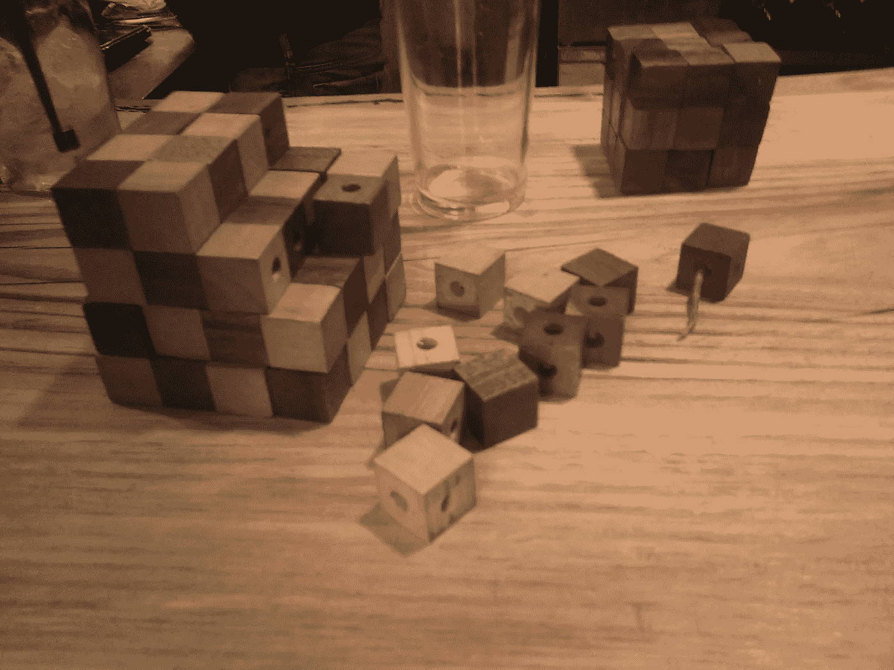

# 蛇形立方体

> 原文：<https://blog.devgenius.io/snaky-cube-42ef002188d5?source=collection_archive---------31----------------------->

前段时间，我遇到了一个谜题，引起了我的注意。那是在特拉维夫的一家酒吧里，他们有几种谜语可以玩，但那一种很特别。酒吧向任何成功解决问题的人提供免费饮料。这是一张拼图的图片

拼图的目标是将这个蛇形形状折叠成 4x4x4 的立方体。这是一个类似的，但更小的 3x3x3 游戏的更大版本。这些小立方体用绳子连接在一起，所以只能在特定的地方旋转它们。
缩小版拼图

较小版本的拼图

我们的目标是:

解决

不要被它的 3x3x3 版本所迷惑，这确实是一项艰巨的任务。他们告诉我，一个特定的客户拿着那个拼图在家里试了试，过了两个星期他才放弃。了解我的人大概都能猜到我当时脑子里在想什么。我拍了你在上面看到的照片，所以我有这个谜题需要的所有信息。我不打算用手去尝试，但我可以利用编程的力量骗一瓶免费啤酒。

我的计划是:

1.  在家写剧本解谜。
2.  记忆解决方案。
3.  领取我的价值约 10 美元的奖品(特拉维夫的啤酒很贵)。

**第一步，编程**

我发现用 Python 解决这个难题特别有趣。我认为这对任何一个刚开始涉足编程领域的人来说都是一个很好的练习。

我不会深入编程细节，因为有人告诉我每行代码都会损失 10%的读者。我只是建议你在面临任何类似挑战时采用以下步骤:

1.  你需要想出一个好办法来模块化这个难题。意思是找到用代码描述它的有效方法。
2.  编写代码来显示结果和多维数据集状态。
3.  选择一个算法求解并实现。
4.  使用 3x3x3 版本进行测试和尝试，以节省调试时间

我的解决方案可以在这里找到[https://github . com/assafnativ/Gaya _ puzzles/tree/master/cube-snake](https://github.com/assafnativ/gaya_puzzles/tree/master/cube-snake)

如果你想自己尝试，你可以使用下面的长度数据。[3,1,2,1,1,3,1,2,1,2,1,2,1,1,1,1,1,1,1,1,2,2,1,1,1,1,1,2,3,1,1,1,3,1,2,1,1,1,1,1,1,1,1,1,3,1]

**第二步，记忆**

我已经将结果翻译成有效移动的第一个字母的字符串(左、右、上、下、进、出)，只是为了得到 46 个字母的字符串“rulodriuloliurorirodloluuiuodirouirdoiduldrolur”。

接下来，我从字符串中显化了一个句子，这样更容易记忆。这方面有在线工具。这是我想到的:

> 最近，在得知牙齿恢复后，伊恩·安德伍德笑出声来。安德伍德说，在笑中，最佳恢复得以实现。通常，在大声笑的过程中，普遍的意象展开了。是吗？不考虑普遍的意象，年老的垂死的低能儿很少笑。安德伍德说，不要破坏我们的笑声。

**线程步，领取奖品**

在这里，我和我的两个好朋友一起回到了酒吧，他们帮我假装在寻找解决方案的过程中不断尝试错误。我表现得好像不知道自己在做什么。就在解决方案的最后一步，一个破裂的声音回荡在这个地方，让我困惑地看着发生了什么。

.

.

.

.

.

唉！！！我大声喊道，意识到我不仅不能得到免费的一餐，而且我可能还得给他们买一个新的拼图。幸运的是，主人告诉我不要担心，这种事情经常发生，他会更换电线，所以我可以下周再试一次。

三个星期过去了，他们还是没有修好！我开始查找这个谜题，以检查他们在哪里买的，我发现了以下网站:
[【http://www.gaya-game.co.il/】
我想我会尝试从那个地方解决更多的谜题。](http://www.gaya-game.co.il/)

