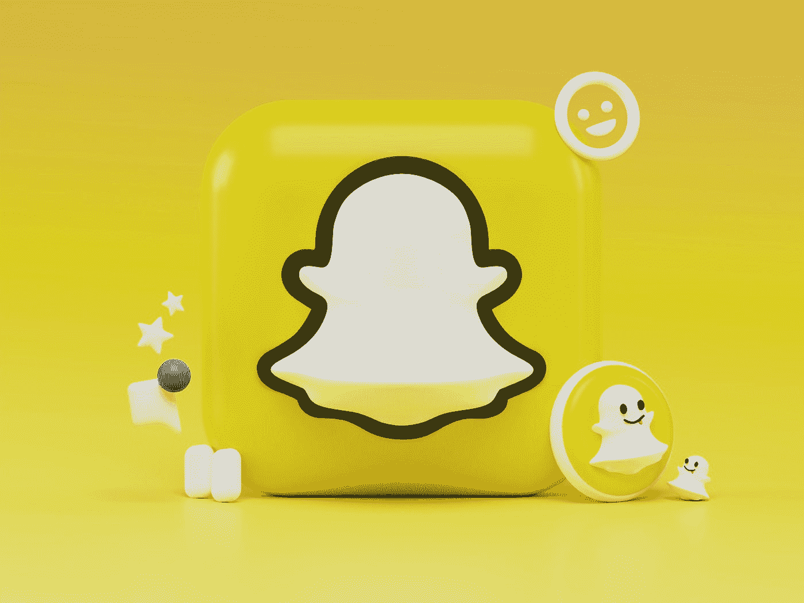

# Snapchat 似乎无法摆正它的广告船

> 原文：<https://blog.devgenius.io/snapchat-and-the-rise-of-digital-marketing-8634210dbc4b?source=collection_archive---------7----------------------->

## 苹果的 iOS 更新不应该受到指责。

亚历山大·沙托夫在 [Unsplash](https://unsplash.com?utm_source=medium&utm_medium=referral) 上拍摄的照片

数字营销始于 1994 年，当时美国电话电报公司推出了一个数字广告横幅，正值互联网公司以不可逾越的速度快速扩张的网络泡沫时期。近 30 年后，每个人都有了电脑和电话，上网唾手可得。

因此，脸书、谷歌和 Snapchat 等科技巨头的数字营销带来了总收入的很大一部分。

> 仅 Snapchat 的广告收入就占到了公司总收入的惊人的 99%。

科技公司通过参与产品销售或广告点击量从广告中赚钱。

## 数字广告是千禧一代的主要营销形式。

网络横幅或产品植入形式的数字广告已经存在了近 30 年。对于千禧一代(Snapchat 的主要用户群)来说，这是他们整个生活的大部分，如果不是全部的话。随着时间的推移，数字营销已经演变为由流行的网络创作者、短视频或 Snapchat 上地理标签中使用的贴纸进行的产品推广。

广告牌形式的营销不再吸引消费者了。观众包括在繁忙的高速公路上匆忙上下班的人，限制了对市场的暴露。广告牌需要拿起电话打给某人(这是任何千禧一代最糟糕的噩梦)。打电话给某人，用你的声音，听他们的声音，然后接通你需要的东西，尤其是在销售的情况下？对于千禧一代来说，这可能是能想象到的最糟糕的事情了。

## 像 Snapchat 这样的平台上的数字广告很容易获取，也很容易从用户的角度考虑。

在他们的家里，在沙发上。获得用户需要的所有信息，以了解他们是否想在公司网站上购买产品或在谷歌上购买产品的评级。

用户根据他们通常购买的东西获得定制的推荐。最重要的是，不需要和任何人交谈，尤其是只给顾客销售所需的东西的销售人员。用户不必穿过销售语言的废话，可以专注于他们想要和需要的产品。

## 技术革新

作为 Snapchat 吸引更多用户并留住现有用户的努力的一部分，Snapchat 正在研究增强现实等技术。

> 增强现实(AR)是应用于物理世界的数字、视觉元素。

75%的千禧一代和新新人类平均每天使用 Snapchat 30 分钟。新技术让用户保持兴趣，并随着用户变得更加技术化而移动。随着用户变得越来越聪明，他们使用的技术也必须如此。否则，科技巨头们可能会因为竞争对手而失去一部分用户。

疫情向顾客和用户表明，离开房子不仅是不必要的，而且是一个麻烦。

当无接触交付可用时，为什么要离开家去购买衣服或杂货？

即使在疫苗获得批准后，任何东西的非接触式递送也被证明是存在的。它几乎不需要与你不需要认识也不想认识的人交流，尤其是通过闲聊。Snapchat 的数字营销允许用户在自己家中舒适地购买所需的一切，而无需与他人交谈。

## 依赖的问题

尽管 Snapchat 以用户为中心，但它也存在一些问题。他们的广告，因此也是他们收入的主要驱动力，高度依赖于苹果的 iOS 更新。Snapchat 首席执行官埃文·斯皮格尔将收入未达到预期归因于苹果最近的 iPhone 更新。他们的应用并不孤立于其他科技公司的高层方向。Snapchat 的 Ads 无法管理技术和运营风险，这些风险来自与对其应用基础设施至关重要的设备上的系统或硬件更新不兼容。

## 知识差距

此外，Snapchat 广告团队也存在知识空白。广告团队负责 Snapchat 99%的收入。在对 Snapchat 广告团队成员的采访中，他们表示团队缺乏理解报告流程的人才。报告流程是将有关广告的信息从 Snap 的内部用户界面平台传输到广告商的第三方平台。了解 Snapchat 广告团队对于确保广告主在数字平台上持续拿出数字营销广告空间，以及确保信息的准确性和广告主的投资回报至关重要。

尽管 Snapchat 开展了以用户为中心的数字营销，但严重的知识差距和技术依赖仍有待解决。事实已经证明，这给他们的股价带来了问题，在盘后 30 分钟内股价下跌了 37%。