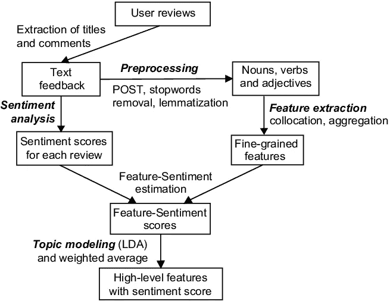

# Snapchat 评论分析

> 原文：<https://blog.devgenius.io/snapchat-reviews-analysis-4c79397b8f9c?source=collection_archive---------11----------------------->

照片由[思想目录](https://unsplash.com/@thoughtcatalog?utm_source=medium&utm_medium=referral)在 [Unsplash](https://unsplash.com?utm_source=medium&utm_medium=referral) 上拍摄

情感分析和特征提取在大约。10k 评论。

*   随着新冠肺炎的出现，视频会议和视频电话比以往任何时候都更加普及。视频会议应用 Zoom 就是一个很好的证明。在过去几年中，视频会议应用的使用量增长了十倍(Rahul De '，Neena Pandey，Abhipsa Pal，2020)。就在最近，我和我的一个朋友在 Snapchat 上进行了一次视频通话。我们经历了很多问题。视频和音频一直滞后。除此之外，电话响了好几次。这就引出了一个问题，“SnapChat 的视频通话普遍不好吗？”或者“这只是我和我的朋友因为糟糕的服务或者因为电话是国际的而面临的一个问题吗？”。
*   因为我刚刚完成[谷歌的数据分析专业认证课程](https://www.credly.com/badges/501ca27e-770f-4c1a-a0eb-14fa5285c628?source=linked_in_profile)。我想试试我新发现的超能力，回答我迫切的问题。因此，我从 [Kaggle](https://www.kaggle.com/) 下载了一个数据集，即[“10K Snapchat 评论”](https://www.kaggle.com/datasets/databar/10k-snapchat-reviews)，用于执行我的分析。为了实现我的目标，我将使用由 **Python** 提供的流行数据分析库，以及 **nltk** 、**Vader perspection**和 **textblob** ，用于数据集的*情感分析*和*特征提取*。这两个概念有助于我回答关于 Snapchat 的紧迫问题。跟随我的旅程，让我们看看我们发现了什么。🧐

# 所用数据集的描述。

数据集中的数据来自苹果的应用商店。它包含每个用户的评论、评级和发布日期。这个数据集不仅可以用来回答我的问题，还可以用来查看哪些功能需要改进，哪些功能最受 Snapchat 用户群的青睐，等等

注意:为了简洁，我不打算在这里展示数据准备和数据清理过程。但是我会在参考资料部分留下完整代码的链接。现在，我将数据加载到一个名为 df 的数据框架中，并对其进行了清理。

# 情感分析和可视化

*   正如题目所说。我们将查看所有 10k 评论的[情绪](https://www.google.com/search?q=Sentiment&oq=sentiment&aqs=chrome.0.69i59l2j0i67i433j0i67l2j69i60l2j69i61.1668j0j7&sourceid=chrome&ie=UTF-8)，换句话说，意见或信念，并查看每个评论是 ***正面*** 、 ***负面、*** 还是 ***中性*** 。为了实现这一点，我们将使用两个已经导入到这个笔记本中的库，即***Vader presence***和 ***textBlob*** 。另外，对于那些尖叫着为什么不用 nltk 的维达的人，这是它给我的错误([错误](https://stackoverflow.com/questions/69720269/importerror-cannot-import-name-pairwise-from-nltk-util))。请如果知道如何解决这个问题。留下评论解释如何解决它。谢谢你。
*   回到正题。让我们为情感分析的任务准备我们的评论。我们将使用函数 ***clean_text()*** 删除评论中的所有链接、标点符号和其他语言错误。我们将使用两个库来查找情感，因为无论是***Vader perspection***还是 ***textblob*** 都没有被证明比另一个更准确。我们马上就会看到证据。让我们用函数来找出每个评论的极性。

# 极性是如何工作的

*   如果情绪是 ***消极*** 、 ***积极*** 或 ***中性*** ，极性通常是我们如何量化的。
*   它通常是一个-1 到 1 的值。
*   如果值< 0 then sentiment is ***为负***
*   如果值> 0，则人气为 ***正***
*   如果值= 0，则情绪为 ***中性***

现在，让我们获取每个评论的极性，并将它们添加到我们的数据框架中。

除此之外，让我展示一个例子，证明库 textblob 和 other 情操没有一个比另一个更准确。上面我们可以看到，根据 textblob 的第五次评论的情绪是积极的，而根据 Vader perspection 的情绪是消极的。让我们回顾一下这篇评论，好吗？

照片由 [**乔丹服从**](https://www.yahoo.com/lifestyle/50-best-dad-jokes-kids-173813824.html?guccounter=1&guce_referrer=aHR0cHM6Ly93d3cuZ29vZ2xlLmNvbS8&guce_referrer_sig=AQAAAKVGmlewl_K_NkfPFtUnwS7zg8e1RU8bVSNbVN7Rnwyg8zIAWEj4AiIHkXv7kl2Wk60GbyWpiu19PVkWVYBhXujfrDWhz1OD8HQqw2UCclMGpTw1FvSwSUr_eDa-5ijZarUK3fMmx3HnEwQ31yPPx2kMi_B_NGyuedpZg-p17iWS)

这是一篇对 Snapchat 更新的 ***负面*** 评论。然而 ***textblob*** 却认定它 ***正*** 。这不是图书馆的错，虽然评论中有一些像“完美”这样的好词，可能让图书馆感到困惑。接下来，我们将创建情感栏

# 提问和回答问题

为了得到我们最初问题的答案，我们还必须回答几个问题。这些将帮助我们更好地理解数据集并得出结论。

## 是否有用户留下了不止一条评论？如果是这样的话，这个人的观点每次都以积极或消极的方式改变了吗？

似乎不管这个人是谁，他或她的评价从第一天到最后都是负面的。😅。这个人的抱怨变了，但他的意见没变。不要被 **textblob 的**二评给骗了。我们去看看，

嗯，这个人肯定讨厌广告，我不会说这个评论是正面的。这个人明确地说“这个应用以前很好”。这进一步证明了我为什么同时使用 **textblob** 和**Vader 情操**进行情感分析的观点😂

## 那么在不同的回顾中有多少评论是负面的呢？

*   根据**Vader 情操**？
*   根据 **textblob** ？
*   意思是负面评价？

## 那么在不同的回顾中有多少评论是正面的呢？

*   根据**Vader 情操**？
*   根据 **textblob** ？
*   意思是正面评价？

## 那么在不同的回顾中有多少评论是中立的呢？

*   根据**Vader 情操**？
*   根据 **textblob** ？
*   平均中立评论？

## 每种情绪的百分比是多少？

*   从两个库中， **textblob、**和**Vader perspection**
*   还有，每种情绪的平均百分比是多少？

Snapchat 有很多正面评价。鉴于 Snapchat 的受欢迎程度，发现该应用获得的**正面**评论的比例如此之高并不奇怪。该应用在[2019 年福布斯十大下载最多应用(社交媒体部分)榜单](https://www.forbes.com/sites/johnkoetsier/2020/12/30/top-100-apps-of-2019-netflix-uber-spotify-google-pay-wish-and-more/?sh=5374d5c54ca0)上**第 6**，在【2020 年福布斯十大下载最多应用榜单上**第 7**，在[2021 年福布斯十大下载最多应用榜单](https://www.forbes.com/sites/johnkoetsier/2021/12/27/top-10-most-downloaded-apps-and-games-of-2021-tiktok-telegram-big-winners/?sh=538359e63a1f)上第 6。毕竟我们不是来谴责 app 的。我们在这里找出应用程序的哪个功能拥有最高数量的**负面**评论。因此，我们将仅从数据集中过滤出负面评论，包括通过**Vader perspection**和 **textblob** 获得的评论，并对这些评论执行特征提取。但在此之前，让我们来看看一些单词云

## 词云

我们终于准备好开始回答我的主要问题了。“SnapChat 视频通话普遍不好吗？”或者“我是不是连接不良？”。回答这个问题的一个简单快捷的方法是创建一个词云，其中的词用于显示人们在 Snapchat 上分享他们的想法时留下的评论中最常用的词。如果 Snapchat 的视频通话普遍不好。这两个词中的一个，介于“视频”和“通话”之间，必然会以非常大的尺寸出现在词云中。

视频确实出现了(在“看”这个词下面看)，但看起来它在评论中不是一个经常使用的词。让我们来看看评论中使用频率最高的词语，正面**情绪和负面**情绪**。对于**Vader presence**和 **textblob** 来说都是一样的。**

对于**正文本 blob**

对于**消极维达**

对于**负文本 blob**

*   上面的四个词云我们无法真正回答这个问题，“Snapchat 视频通话在其用户中普遍不好吗？”。因为单词“video”出现在所有四个单词云中，即(正面 Vader 的单词云、负面 Vader 的单词云、正面 TextBlob 的单词云以及负面 TextBlob 的单词云)，并且单词的大小在所有单词云中看起来相对相同，除了负面 TextBlob 的单词云看起来比其余的稍大。从这一点点观察中并不能推断出太多的东西
*   尽管如此，这就是为什么这个项目的名字叫做**情感分析**和**特征提取**的原因。旅程尚未结束。特征提取的时间到了

# 特征抽出

我们几乎到了旅程的终点。现在我们继续寻找答案。我们将对数据集上的 [nltk](https://www.youtube.com/watch?v=X2vAabgKiuM&t=1061s) 库执行所谓的[特征提取](https://www.youtube.com/watch?v=7YacOe4XwhY&t=49s)。基本上，我们有大量的数据，尤其是评论。我们将每篇评论分成一个单词列表，然后对列表进行词汇化，给每个单词分配适当的词性。然后我们找到两个搭配词和三个搭配词，并测量词组的极性。你以后会更明白的。关于我刚刚写的更详细的解释，请点击 nltk。这是用于此的算法:

[参考文献 1](https://www.researchgate.net/publication/282272480_How_Do_Users_Like_This_Feature_A_Fine_Grained_Sentiment_Analysis_of_App_Reviews) 中的方法概述

让我们只在负面情绪上运行这个过程，看看结果。注意，我将只显示结果。如果你有兴趣看我用来得到结果的完整代码，我会在参考资料中提供一个链接

我们从上面的四个图表可以看出，Snapchat 的视频通话至少从有意义的功能上来说，并不是一般的差。但是我们确实在所有的图表中看到了与“联系”相关的词汇。第一张 bigram 图明确写着“连接错误”。然后两个 Bigram 图表我们可以看到 Snapchat 的“bar bottom”= bottom bar 对 **textblob** 的负面评价最多，而“write review”对**Vader perspection**的负面评价最多。至于三元图表， **textblob** 的“讨厌新更新”排在第三位，而**fix please**排在第一位**Vader perspection**😂。

## 重复同样的过程，但这次是同时对所有的情感

为什么？因为这次我们想在平衡的尺度上检查事情。只是为了看看当每个人的评论都有发言权时会出现什么功能。

**结果:**

对所有评论(正面、负面和中性)同时进行的特征提取显示，人们肯定不喜欢苹果手机上 Snapchat 的底部栏，因为它出现在一般分析中😅。我们读到的第一篇评论中甚至谈到了这一点。你还记得吗？“客户关怀”是 Snapchat 需要努力的另一个功能。最后，“锁定原因”是 Snapchat 必须解决的另一个问题，也就是人们无缘无故被锁定。除此之外，人们似乎普遍喜欢 Snapchat 的“黑暗模式”。让我们检查一下这个数据集来自哪个时期。

[Snapchat 的“黑暗模式”](https://www.alphr.com/snapchat-night-dark-mode/)直到 2021 年 5 月才加入。我认为我们如何从数据中看到人们获得黑暗模式的旅程是令人惊讶的。从用户向开发者建议它，到开发者添加它，最后到它成为每个人在 app 上最好的功能。

# 总结和结论

1.  Snapchat 的视频通话一般还不错。这可能只是我和我的朋友有一个不良的连接，而不是一个连接错误
2.  根据该数据集，黑暗模式是 Snapchat 最受欢迎的功能，时间框架为 2019 年 3 月至 2021 年 5 月。它从一个建议功能变成了一个附加功能，最终在 2021 年 5 月[日](https://www.alphr.com/snapchat-night-dark-mode/)实现
3.  Snapchat 的底部栏、客户关怀和无缘无故地将人锁在外面是该应用公司需要解决的主要问题。

*   就这样了，伙计们，谢谢你们陪我走完这段旅程。希望你喜欢。请在评论区留下您的反馈。✌️

# 未来工作的局限性和范围:

1.  如果 pyspellchecker 变得更好，并且这个函数能够工作，那么给定一个单词字符串，形成一个单词列表，检查拼写错误的单词，纠正它们，用列表中正确的单词替换不好的单词，并将单词列表放回一个句子中。如果它没有提供我可能想表达的一系列似是而非的词语。

*   `!pip install pyspellchecker --quiet
    from nltk.tokenize import word_tokenize
    nltk.download('punkt')
    from spellchecker import SpellChecker
    spell = SpellChecker()
    def correction(text):
    sentence = ' '
    words_list = word_tokenize(text)
    j = 0 
    for word in words_list:
    print(word)
    if spell.unknown(word):
    words_list[j] = spell.correction(word)
    print(word)
    j = j + 1
    sentence = sentence.join(words_list)
    return sentence`

那么分析的结果将更不容易出错。现在不行了，因为我不是写评论的人，所以我不知道作者想写些什么😅

2.使用 TextBlob 和 VADER，情感分析的准确性不是很有说服力(即使在这一对中，变化也是显而易见的)。人工检查发现了错误。

3.类似的功能应该归类在一起，以提供一个更好的图片(这应该不是很耗时。)此外，在这里，最终的情感分数没有针对特征的频率进行调整。

4.我们需要非常准确的算法来检测虚假评论。

# 参考

[1.] [德，r，潘迪，n .，&帕尔，A. (2020)。新冠肺炎疫情期间数字化浪潮的影响:研究与实践的观点。国际信息管理杂志，55，102171。点击这里👉https://doi.org/10.1016/j.ijinfomgt.2020.102171](https://colab.research.google.com/drive/1vyZrS4_RTwZwbQVeHUDcBwVxh1BOyIgb#Citation)T2

[2.][https://medium . com/analytics-vid hya/feature-extraction-and-pension-analysis-of-reviews-of-3-apps-in-India-84b 665 E1 a 887](https://medium.com/analytics-vidhya/feature-extraction-and-sentiment-analysis-of-reviews-of-3-apps-in-india-84b665e1a887)

[3.][https://www.alphr.com/snapchat-night-dark-mode/](https://www.alphr.com/snapchat-night-dark-mode/)

[4.][https://github . com/kingtroga/SnapChat _ Reviews _ sensation _ Analysis _ and _ Feature _ Extraction _ using _ Python](https://github.com/kingtroga/SnapChat_Reviews_Sentiment_Analysis_and_Feature_Extraction_using_Python)