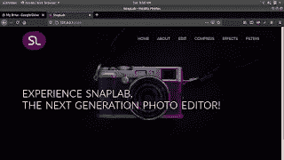
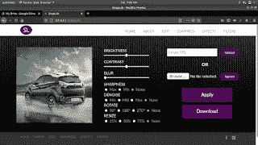
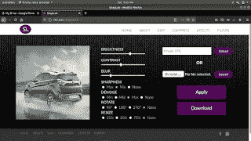
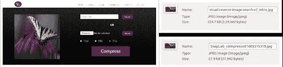
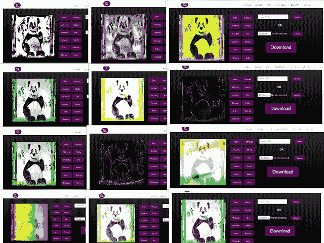
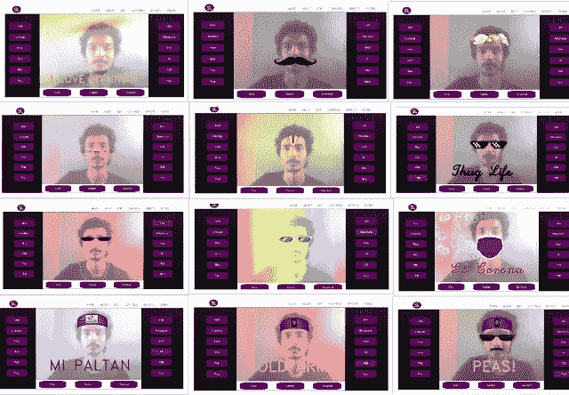

# 使用 OpenCV 的图像编辑器 Web 应用程序

> 原文：<https://blog.devgenius.io/snaplab-an-image-editor-web-application-59a6ec36e7e?source=collection_archive---------2----------------------->

[Github](https://github.com/ashish-mj/SnapLab)

# 介绍

**计算机视觉**是一个研究领域，涉及计算机如何从数字图像或视频中获得高层次的理解。它使用了许多技术，图像处理只是其中之一。计算机视觉任务包括获取、处理、分析和理解数字图像的方法，以及从现实世界中提取高维数据，以便以决策的形式产生数字或符号信息。

**数字图像处理**是一种通过使用算法来处理图像的技术。它是为了获得更大的图像或从图像中提取一些有用的信息。常见的图像处理包括图像增强、恢复、编码和压缩。图像处理技术使用滤波器来增强图像。它们的主要应用是变换图像的对比度、亮度、分辨率和噪声水平。轮廓绘制、图像锐化、模糊、浮雕和边缘检测是典型的图像处理功能。

**图像**是描绘视觉感知的人工产物，例如照片或其他二维图片，其类似于主题——通常是物理对象——并因此提供对其的描绘。
数字图像是由单个像素或图片元素组成的。像素以行和列的形式排列以形成图像区域。图像中的像素数是图像尺寸以及水平和垂直方向上每单位长度(例如，英寸)的像素数的函数。

**OpenCV** 是一个巨大的开源库，用于计算机视觉、机器学习和图像处理，现在它在实时操作中发挥着重要作用，这在当今的系统中非常重要。通过使用它，人们可以处理图像和视频来识别物体、人脸，甚至是人的笔迹。当与各种库(如 NumPy)集成时，python 能够处理 OpenCV 数组结构进行分析。为了识别图像模式及其各种特征，我们使用向量空间并对这些特征执行数学运算。

# 什么是快照实验室？

[**SnapLab**](https://github.com/ashish-mj/SnapLab) 是一个图像编辑器 web 应用程序，允许用户对图像执行各种操作。用户需要上传图像或加载 URL。SnapLab 允许用户执行以下操作:

主页

*   **编辑** —图像编辑是指使用不同的技术修改或改善数字图像。进行编辑是为了创建图像的最佳外观，并根据不同的参数提高图像的整体质量。亮度、对比度、锐度、模糊、去噪、旋转、调整大小是一些技巧。

编辑前

编辑后

*   **压缩** —图像压缩是一种应用于数字图像的数据压缩，以降低其存储成本。它可以是有损的或无损的。有损压缩是消除不明显的数据的方法，而无损压缩不消除不明显的数据。

图像压缩

*   **效果** —图像效果是预定义的算法，能够为图像添加特殊效果。图像效果被用作改变图像以增加艺术外观的一种方式。在大多数程序中，你只需选择图像效果的名称，程序就会生成带有该效果的图像，然后你可以保存更改后的图像。

效果

*   **滤镜** —滤镜是你可以添加到你的照片和视频中的过渡效果。面部滤镜通过检测面部图像并将虚拟元素叠加到该面部上来工作。

过滤

# 结论

图像处理是通过调整图像的许多参数和特征来增强图像的领域。它是计算机视觉的一个子集，将变换应用于输入图像，并返回结果输出图像。“ **SnapLab** ”是一个图像编辑器 web 应用程序，允许用户编辑、压缩图像，向图像添加效果和滤镜，并将结果图像存储在本地。从而得出结论，使用 OpenCV one 可以操纵图像和视频。

[Github](https://github.com/ashish-mj/SnapLab) [网站](https://ashish-mj.vercel.app/) [Linkedin](https://www.linkedin.com/in/ashish-mj/)