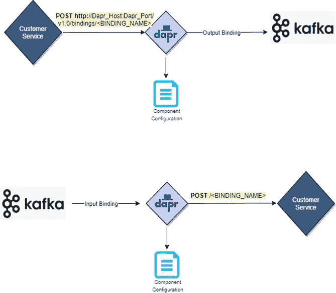

# 先睹为快 DAPR 世界

> 原文：<https://blog.devgenius.io/sneak-peek-into-the-dapr-distributed-application-runtime-world-9dca2b76584b?source=collection_archive---------2----------------------->

# 目标

在本文中，我将尝试解释名为**Dapr**aka Distributed Application Runtime 的开源项目的概念，以及它如何在分布式微服务范例中宣传和推广不同集成、服务发现和治理组件的最佳实践。我将通过运行一个简单的应用程序来说明这一点，该应用程序将首先部署在本地，然后部署在单节点 Kubernetes 集群中。

我假设读者已经了解了微服务、服务网格和分布式系统的基本概念，尽管我会尽可能地触及基础，但不会转移讨论的主要话题。

最后，我还讨论了 Dapr 和服务网格之间的区别，以及这两者如何互补，以创建一个更易于观察、更灵活和更松散耦合的应用程序。

因此，让我们首先从当前技术空间的简要概述开始，然后我们将逐步建立 Dapr。

希望你会喜欢这个旅程。

# 分布式世界

旧的**单片**模式已经一去不复返，在这种模式下，我们将复杂的捆绑应用程序部署在高容量昂贵的硬件中，在部署和维护生命周期的每个阶段都需要人工干预。

现在，随着**分布式应用**的引入，我们有过多的互连应用(服务器),它们具有不同的功能(微服务),通过各种协议与其他应用通信，从硬件监控和治理的角度来看，事情变得非常复杂。

随之而来的是容器化和容器编排引擎，如 Kubernetes(K8s ),它们通过预定义的模板和定义的网络和连接方面的流程将配置外部化，从而简化了上述方面。

随着云的出现，it 极大地简化了基础架构治理、监控、可扩展性、冗余和网络方面的工作，现在只需点击一个按钮或通过基于脚本的自动化操作即可调配不同的分发组件。随着从资本支出模式向更受控制的 OPEX 模式的转变，项目经理现在可以喘口气了，应用管理员现在可以在硬件采购上不花时间，并专注于可扩展和冗余的自动化基础架构脚本编写。

随着舞台的搭建和分布式应用的出现，现在让我们来看看 Dapr 及其带来的好处。

# 什么是 Dapr

[Dapr](https://dapr.io/) 由微软于 2019 年 10 月推出。

它是一个**开源**，可移植，事件驱动的运行时，使得开发者可以轻松地构建在云和边缘上运行的弹性、无状态和有状态的应用。Dapr 包含了**所有编程语言**和开发者框架的多样性，并简化了应用程序的构建。

虽然随着云的发明，硬件和基础设施供应取得了巨大的进步，但是从应用程序编码的角度来看，没有特定的模板或框架提供实用程序来帮助分布式组件和服务的通信和集成。

例如，为了接收来自 Kafka 主题的消息，程序员需要在他们的代码中包括 Kafka 特定的依赖性和配置。如果你**永远不需要将** **it** 作为你应用程序的一部分，那不是很好吗？

Dapr 旨在使开发人员能够专注于编写业务逻辑，而不是解决分布式系统挑战，从而显著提高他们的生产力并减少开发时间。

我们将在后面的章节中探讨它是如何做到这一点的。

但是现在让我们更深入地了解一下 Dapr 的整体特性。

# 为什么选择 Dapr

现在，我们为什么需要 Dapr？它带来了什么？

## 预制组件

Dapr 以**易插拔构建模块**的形式整理了构建微服务应用的最佳实践，这些模块解决了最常见的交叉问题，如状态管理、服务间通信、与 Redis 等发布订阅组件的集成等。、与 Kafka 等分布式代理的事件驱动集成以及与其他外部系统的绑定等等。这些构件是完全独立的，您可以在您的应用程序中使用它们的任意组合。

## 轻便

Dapr 是平台无关的，这意味着它可以在本地工作站或 Kubernetes 集群或任何安装了它的托管环境中运行。这极大地简化了在本地集群或任何云或边缘位置运行应用程序。

## 多语言组件支持

设计人员和程序员可以使用他们喜欢的编程语言来构建松散耦合的多语言组件，而无需担心不同集成方面的布线和管道，同时利用 Dapr 附带的预构建模块提供的内置集成支持。

## 巨大的 Kubernetes 支持

Dapr 很容易与 Kubernetes 的事件驱动自动缩放器 [KEDA](https://github.com/kedacore/keda) (本文未涉及)集成。大多数 Dapr 组件与后者无缝集成，从而将自动扩展能力整合到应用程序组件中。开发人员可以只关注业务逻辑实现，而不必担心应用程序的可伸缩性。

## **丰富的可观察性**

Dapr 提供了与各种可观察性和日志工具的无缝集成，以监控应用程序中的事件流。随着标准 Dapr 安装，像 Zipkin 这样的工具自动内置，它在默认情况下提供了事务可追溯性。此外，它利用开放的遥测标准，因此任何接受相同格式的工具都可以插入以接收度量和日志数据。有关可观察性的细节将在后续章节中重点介绍。

**标准化事件消息格式**

Dapr 使用 CloudEvents 1.0 规范为跨不同目标组件的事件驱动通信传递消息的格式。这种格式的好处包括跨所有下游和上游组件传播上下文信息的标准化。这使得异构系统能够使用标准化的消息格式相互通信。

细节将在随后的章节中再次提供。

# 它是如何工作的

现在，让我们更深入地了解 Dapr 是如何工作的。

## 边车模式

边车架构:[来源](https://docs.dapr.io/concepts/overview/)

Dapr 利用了 **sidecar 设计模式**，其中 Dapr 容器在单个 Kubernetes pod 或云 VM 实例中与应用程序容器并排运行。Dapr 容器作为 sidecars 注入到正在运行的应用程序容器实例中。

在 Kubernetes，这是通过标签来实现的，确保 Dapr 边车被注入到安装后创建的任何新 pod 中。详细情况将在安装部分说明。

应用程序和 sidecar 共享相同的生命周期。它们都作为一个单元进行部署和扩展。围绕边车图案的细节可以在这个[链接](https://www.c-sharpcorner.com/article/microservices-design-using-sidecar-pattern/)中找到。

## 在更高的水平上

Dapr sidecars 通过 gRPC 协议相互对话，而应用程序容器可以通过 HTTP/gRPC 与 Dapr 容器对话。

Dapr 使用**相互 TLS 来保护边车之间的通信**。Dapr sidecars 使用特定于 sidecar 的证书进行相互验证，这些证书的根是集群级 CA(当在 Kubernetes 上运行时)，或者是客户提供的根证书。服务和它相关的 sidecar 之间的**通信通常是不受保护的**,因为 sidecar 被认为和服务在同一个安全域中，但是您可以通过 Dapr 在两个服务之间配置端到端加密(不在本博客的讨论范围之内)

如果您看到上面的图表，样本流可能是这样的:

服务 1 想要调用服务 2。为此，它通过 HTTP/gRPC 调用它的 Dapr sidecar。请注意，由于两者都驻留在同一个 pod/vm 实例中，因此可以使用 localhost 访问后者。

Dapr sidecar 然后使用 gRPC 调用服务 2 的 sidecar(关于发现的细节，将在服务调用构造块描述中详述)

然后，服务 2 的 Dapr 实例在本地调用服务 2 实例。

类似地，Dapr sidecars 也有构建模块，可以集成发布/订阅、外部绑定、可观察性和其他功能，如图所示。

下一节讨论如何在本地设置 Dapr 和 Springboot 应用程序。一旦完成，后续步骤将处理运行应用程序的一些构建块。最后，我们将在 Kubernetes 中部署应用程序。

是时候找点乐子了。

# 本地运行应用程序

本练习使用了以下软件版本。

JDK 11

Maven 3.6.x

任何 IDE

Docker 20.10.0

Dapr CLI 1.7.0

## 安装 Dapr

Dapr 可以安装在 Kubernetes 模式或自托管模式(有 Docker 或没有 Docker)。

**在本文中，我们将考虑 Dapr 自托管模式，Docker 用于本地安装**。

我们将分别检查 Kubernetes 装置。

请在官方 Dapr 文档中找到本地安装 Dapr 的[步骤。](https://docs.dapr.io/getting-started/install-dapr-cli/)

本地安装 Dapr 的步骤摘要:

安装 Dapr CLI

这包括安装 Dapr CLI，随后将使用它来下载 Dapr 二进制文件并初始化 Dapr 运行时。

**初始化 Dapr**

作为这个步骤的一部分( *dapr init* 命令)，dapr 二进制文件被下载、安装，Dapr 环境被创建。

它在您的本地环境中创建 Dapr 控制平面。

此外，默认情况下，下面的容器是初始化的。

一个 Redis 容器实例，用作状态管理的本地状态存储

用于查看应用程序跟踪的 Zipkin 容器实例。

用于本地参与者支持的 Dapr 放置服务容器实例。作为本文的一部分，我们将不研究演员模型。

此外，在“ *%UserProfile%/下会创建一个默认组件文件夹。dapr* "具有上述组件定义。这些组件定义(。yml 文件)被 Dapr 运行时引用来与相应的组件/容器集成。此外，如果在“dapr run”命令中没有指定组件目录，后者将指向这个默认的目录位置来引用组件。

一旦安装了 Dapr，运行“docker ps”将给出下面三个处于运行状态的容器，如前所述。

## 设置 Springboot 应用程序

整个代码库可以从下面的 **Github 位置**下载。

【https://github.com/chowju1983/dapr-customer-service 客服——[客服](https://github.com/chowju1983/dapr-customer-service)

**订单服务**——[https://github.com/chowju1983/dapr-order-service](https://github.com/chowju1983/dapr-order-service)

CustomerService 是面向 Springboot 应用程序的客户端，它公开了某些 REST 端点，这些 REST 端点又调用 OrderService 来获得一些额外的细节。下载代码并为这两个服务运行*“mvn 全新安装*”。

当 Dapr 在本地以自托管模式**运行时，它作为**独立的运行时进程** (sidecar)与主应用程序一起运行。我们将在下面的单个构造块部分中对此进行更深入的探讨。**

# 构建块和组件

Dapr 构建块:[来源](https://docs.dapr.io/concepts/overview/)

Dapr 提供了几个模块化构建块，为构建微服务提供了通用的最佳实践。这些构造块通过 HTTP 或 gRPC 公开。

上图展示了一些构建模块及其包含的功能。

有关构建模块的详细信息可以在 Dapr [文档](https://docs.dapr.io/concepts/building-blocks-concept/)中找到。

这里有一些我们将作为示例应用程序的一部分来介绍。

## 什么是 Dapr 组件

[Dapr 文档](https://docs.dapr.io/concepts/terminology/)将组件描述为"*模块化类型的功能，通过 Dapr 构建块，可以单独使用，也可以与其他组件集合一起使用"*。

为了简化起见，**构建模块被实现为组件**。这些组件是可插拔的，所以您可以很容易地用不同的实现来切换它们。例如，从 Azure 存储队列、Apache Kafka 等切换消息代理依赖。通过更改组件的配置文件。构件块可以使用组件的组合(例如，行动者和状态管理都使用状态组件)。

不同 Dapr 组件的详细信息可在官方 [Dapr 文档](https://docs.dapr.io/concepts/components-concept/)中找到。

下面详细阐述了其中的一些组成部分。

现在，让我们更深入地研究每一个构件，并通过运行 Springboot 应用程序来验证我们的理解。

# 深入探究构建模块

通过使用 Dapr SDKs 或通过 Dapr APIs，可以从您的应用程序中调用 Dapr 组件。我们将在这里使用 API 方法，因为它将从您的应用程序代码库中移除任何 SDK 依赖性。现在，让我们看一下下面的每个服务块组件，看看我们正在运行的应用程序如何利用这些组件。

## 服务调用

概念

应用程序可以使用服务调用块与其他应用程序/服务进行可靠、安全的通信。服务间通信过程中的一些要点是:

> 服务发现
> 
> 安全性
> 
> 可追踪性

Dapr 以“***invoke***”API 的形式解决了所有这些问题，该 API 充当反向代理，具有隐式服务发现和分布式跟踪、错误处理、加密等内置功能。从程序上来说，特别是对于服务调用构建块来说，有另一种方法可以达到同样的效果，那就是使用请求头。这将在接下来的几行中解释。

每个应用程序与它的 Dapr sidecar 对话(通过 http/grpc 协议), Dapr sidecar 随后与[名称解析组件](https://docs.dapr.io/reference/components-reference/supported-name-resolution/)协商以触发目标应用程序的相应 sidecar。后一种调用是使用 **gRPC** 和 **mTLS** 组合进行的。因此，Dapr **边车到边车的通信是安全且加密的**。

请参考下图以获得清晰的理解。

一个值得一提的方面是**步骤 2** ，其中我们传递请求头“ **dapr-app-id** ”，其值是运行时提供的目标 dapr 应用程序的名称。

**名称解析组件**参考该报头参数，并随后通过**循环负载平衡**将调用转发给适当的 Dapr 应用。

用于负载均衡的协议是用于自托管机器的**mDNS**或托管平台的相应**可插拔名称解析组件实现**(例如用于 Kubernetes 的 Kubernetes DNS 服务)。

循环负载均衡:[来源](https://docs.dapr.io/developing-applications/building-blocks/service-invocation/service-invocation-overview/)

运行示例

在[**dapr-customer-service**](https://github.com/chowju1983/dapr-customer-service)**repo 中，请检查 CustomerService 的 getOrderDetails()方法。**

**这里我们将调用 url 构建为，**

**string URL =***DAPR _ 主机***+**DAPR _ 港口**+"/order/"+orderId；**

**restTemplate.exchange(url，HttpMethod。 ***得到*** ，**

**…….);**

**其中，dapr 属性值是为特定于 CustomerService 的 Dapr 边车定义的值。**

****/order** url 路径是[**dapr-order-service**](https://github.com/chowju1983/dapr-order-service)**模块的一个端点的相对资源路径。****

****另外，请注意，在调用过程中，HttpHeader 由以下值填充。****

******var**headers =**new**http headers()；****

****headers.set("Content-Type "，" application/JSON ")；****

> ******headers.set("dapr-app-id "，" order-service ")；******

****返回新的 HttpEntity <>(表头)；****

****突出显示的行由名称解析组件在运行时使用。****

****现在，让我们使用以下命令启动这两个服务:****

*****dapr 运行—日志级调试— app-id 客户服务—app-port 9000—app-protocol http—dapr-http-port 3500—Java-jar target/CustomerService-0 . 0 . 1-snapshot . jar*****

*****dapr 运行—日志级调试—app-id order-service—app-port 8080—app-protocol http—dapr-http-port 3501—Java-jar target/OrderService-0 . 0 . 1-snapshot . jar*****

****这些创建了主应用程序和它们的 sidecar 进程，其中 Dapr 进程使用提到的 http 端口( *dapr-http-port* )与相应的主应用程序通信。****

****请注意各个应用程序的 app-id。剩下的就不用解释了。****

****现在，从 Postman 或通过 curl 点击客户服务 HTTP GET 端点[HTTP://localhost:9000/customer/order/1](http://localhost:9000/customer/order/1)，您将获得订单服务的响应。在内部，呼叫被加密并通过 Dapr sidecars 路由，此外还提供了可跟踪性，我们将在后续部分中探讨这一点。****

****您还可以通过在不同的端口运行订单服务的多个实例来验证 mDNS 方面。****

****此外，Dapr 服务调用构建块有一些内置的**支持指数回退**重试，没有编码/配置/依赖性的改变。详情可在此[页面](https://docs.dapr.io/developing-applications/building-blocks/service-invocation/service-invocation-overview/)中找到。****

****现在让我们转向国家管理。****

## ****状态管理****

****概念****

****有状态的应用程序可以利用这个构建块来**在** [**支持的有状态存储**](https://docs.dapr.io/reference/components-reference/supported-state-stores/) 中以键值对的形式存储日期，就像 Redis 一样。这使得应用程序能够避免构建并发控制和数据一致性、批量执行 CRUD 操作以及查询和过滤键值数据等功能的复杂编码工作。****

****Dapr 的状态管理 API 使用状态存储组件以键值对的形式查询、读取和保存数据。以下是一些简单的附加功能:****

******可插拔状态存储**与一系列[支持的状态存储](https://docs.dapr.io/reference/components-reference/supported-state-stores/)无缝集成。****

******可配置行为** Dapr 允许您使用某些元数据字段作为状态管理 API 的一部分来**控制**并发性和一致性需求**。******

****默认情况下，它遵循**乐观并发控制(OCC)进行并发。**这是使用 **ETags 完成的。**仅当状态存储中的 ETag 值与作为请求有效负载正文或请求标头的一部分传递的值匹配时，才允许更新数据。否则，请求会被拒绝。如果您的应用程序在编写请求时省略了 ETag，Dapr 会在处理请求时跳过 ETag 检查。与具有 ETags 的**首次写入获胜**模式相比，这实质上启用了**最后写入获胜**模式。****

****对于一致性，默认情况下 Dapr 使用最终一致性，尽管它有使用强一致性的规定。关于如何设置，请参考 [API 参考](https://docs.dapr.io/reference/api/state_api/)。****

******多重操作******

****Dapr 支持两种类型的批量操作。****

*******批量读取*** :这里 Dapr 将读取请求作为单独的请求提交给底层数据存储，并将它们作为单个结果返回。****

*******事务性* :** 在这里，Dapr 可以将多个 CRUD 操作组合成一个请求，然后自动执行这些单独的事务。****

****除此之外，Dapr 还为各种其他功能提供内置和可定制的支持，如状态加密、跨应用程序的状态共享、基于不同标准的查询状态等。****

****进一步的细节在[官方文件](https://docs.dapr.io/developing-applications/building-blocks/state-management/state-management-overview/)中提供。****

****运行示例****

****这个应用程序展示了一个简单的例子，在 Redis 存储中保存一个键值项目，然后使用 Dapr 的状态管理 API 获取相同的项目。****

****用于保存键值对列表的状态管理 POST API 端点是****

****[http://DAPR _ 主机](http://DAPR_HOST)+DAPR _ 端口+"/v 1.0/STATE/<**STATE _ STORE _ NAME**>****

****这里，状态存储名称是状态存储组件的名称。这个组件需要被定义为类路径中的 yaml 配置，并将被称为 Dapr 运行时。****

****下面给出了 Redis 状态存储的示例片段:****

********

****类似地，获取键值的 GET 端点是****

****DAPR _ 主机+DAPR _ 端口+"/v 1.0/STATE/< **STATE _ STORE _ NAME**>/<**key**>****

****就这么简单。****

****运行应用程序的一个小区别在于组件文件必须在" *%UserProfile%/中。dapr/components* 目录或路径必须使用“— components-path”符号指定。一个示例命令如下所示:****

*****dapr run—app-port 9000—app-id customer-service—components-PATH<PATH _ TO _ FOLDER _ CONTAINING _ COMPONENT _ FILE>—app-protocol http—dapr-http-port 3500—Java-jar target/CustomerService-0 . 0 . 1-snapshot . jar*****

*****dapr run—app-port 8080—app-id order-service—components-PATH<PATH _ TO _ FOLDER _ CONTAINING _ COMPONENT _ FILE>—Java-jar target/OrderService-0 . 0 . 1-snapshot . jar*****

## ****发布和订阅****

****概念****

****Dapr 中的发布/订阅 API 提供了**至少一次保证**，并与各种**消息代理和排队系统**集成。您的服务使用的特定实现是可插拔的，并在运行时配置为 Dapr 发布/订阅组件。这种方法消除了服务的依赖性，从而使服务更具可移植性，对变化更灵活。****

****Dapr 发布/订阅组件的完整列表在这里[。](https://docs.dapr.io/reference/components-reference/supported-pubsub/)****

********

****详细内容可以在[这个链接](https://docs.dapr.io/developing-applications/building-blocks/pubsub/pubsub-overview/)中找到。****

****运行示例****

****其组成文件如下所示:****

********

****它指向一个 Redis 实例。****

****Dapr 的发布端点是:****

****[http://DAPR _ HOST](http://DAPR_HOST)+DAPR _ PORT+"/v 1.0/publish/<pub sub _ NAME>/<TOPIC _ NAME>****

****这里的 PUBSUB_NAME 指的是组件文件中 PUBSUB 组件的名称。****

****在调用发布端点作为公开的客户服务 API 端点的一部分("/customer/pubSub/order ")时，消息被发布到 Redis 主题，然后该主题触发 order-service 服务中用 **"/ < TOPIC_NAME"** POST 端点注释的相应方法。****

****这一系列事件是由 Dapr sidecars 精心策划的。为了便于理解，请参考上面的图表。****

****请注意“**/Dapr/subscribe**”**由 Dapr sidecar 自动调用，以订阅组件文件中提到的主题。因此，对于发布/订阅主题中发布的任何消息，所有标注有“/ <主题名称”**端点的发布方法都将由 Dapr sidecar 触发。****

****要运行应用程序，请使用与状态管理的[运行示例](#_Running_Example)中所示相同的命令。****

## ****粘合剂****

****概念****

****使用绑定，应用程序可以由于来自外部系统的事件而被触发。有两种类型的绑定——输入和输出。**输入绑定**用于在外部系统发生事件时触发应用程序。**当应用程序中发生的一些事件可能调用外部资源时，使用输出绑定**。****

****对于这两个绑定，在**绑定组件文件**中需要必要的配置，在启动过程中需要再次引用 Dapr 运行时来建立绑定。该构造块提供了以下关于开发简易性的附加价值。****

*   ****消除连接到消息传递系统(如队列和消息总线)和从消息传递系统轮询的复杂性****
*   ****关注业务逻辑，而不是如何与系统交互的实现细节****
*   ****让你的代码远离 SDK 或库****
*   ****处理重试和故障恢复****
*   ****运行时在绑定之间切换****
*   ****构建可移植的应用程序，其中设置了特定于环境的绑定，并且不需要更改代码****

****详情可以在[这个链接中找到。](https://docs.dapr.io/developing-applications/building-blocks/bindings/bindings-overview/)****

****此外，所有支持的绑定组件的列表可以在[这里](https://docs.dapr.io/operations/components/setup-bindings/)找到。****

******运行实例******

****在这种情况下，我们将看到一个输入和输出绑定的例子。****

****Kafka 源代码绑定的示例组件文件如下所示:****

********

****正如您在上面的代码片段中看到的，您还可以定义使用者组来促进并行消息使用。****

****客户服务的“/customer/binding/order”REST 端点向上面组件文件中指定的输出绑定发送一条消息。它使用端点来执行此操作:****

****[http://DAPR _ 主机](http://DAPR_HOST)+DAPR _ 端口+ "/v1.0/bindings/ <绑定 _ 名称>****

****在这里，BINDING_NAME 通常是上面提到的文件中的组件名。****

****在订户端，订单服务使用输入绑定，同样在同一组件文件中指定，并使用端点 *"/ < BINDING_NAME >"，*Dapr sidecar 为通过绑定触发的任何事件触发该端点。****

********

## ****中间件****

******概念******

****Dapr 使您能够以**中间件**组件的形式创建定制的代码执行管道，为您提供按顺序链接代码执行块的能力。这些块可以公开一组通用的功能，如身份验证和授权(Oauth2)、速率限制等。[支持的中间件组件列表](https://docs.dapr.io/reference/components-reference/supported-middleware/)页面提供了 Dapr 当前支持的所有中间件组件的列表。****

****像其他构建块一样，中间件组件也是可扩展的，可以在[components-contrib Github repo](https://github.com/dapr/components-contrib/tree/master/middleware/http)中找到。****

****话虽如此，这是一个像大多数学科一样仍在发展的领域，目前只支持 HTTP 协议。****

********

******默认情况下，Dapr 将跟踪和 CORS 中间件组件附加到中间件链的顶端**，之后您可以将您的组件添加到链中。**中间件组件按照您的配置文件中指定的顺序执行。******

****您还可以定义自己的**定制中间件组件**来实现一个中间件接口，它定义了一个返回 **fasthttp 的 **GetHandler** 方法。请求处理器**和**错误**。这个应该是用 Go 语言写的。****

**类型中间件接口{**

**GetHandler(metadata 元数据)(func(h fasthttp。RequestHandler) fasthttp。请求处理程序，错误)**

**}**

**然后需要使用基于拉请求的策略将其添加到 [components-contrib 存储库](https://github.com/dapr/components-contrib/tree/master/middleware/http)中。关于添加定制中间件组件的细节可以在官方文档中找到[。](https://docs.dapr.io/developing-applications/middleware/)**

****跑步实例****

**让我们添加一个简单的中间件组件，它将利用请求负载。为此，您需要添加一些配置。**

**1.将突出显示为黄色的片段添加到您的“ *%UserProfile%/中。dapr/config . YAML "**或者您的配置文件所在的位置。***

***API 版本:dapr.io/v1alpha1***

***种类:配置***

***元数据:***

***名称:daprConfig***

***规格:***

> *****http 管道:*****
> 
> *****经手人:*****
> 
> *****-名称:大写*****
> 
> *****类型:middleware.http.uppercase*****

***跟踪:***

***采样率:" 1 "***

***齐普金:***

***端点地址:[http://localhost:9411/API/v2/spans](http://localhost:9411/api/v2/spans)***

***2.将下面的 yaml 文件添加到/components 目录下。***

***API 版本:dapr.io/v1alpha1***

***种类:组件***

***元数据:***

***名称:大写***

***规格:***

***类型:middleware.http.uppercase***

***版本:v1***

***这两个步骤将把中间件组件添加到链中。***

***现在，如果您使用一个示例文本有效负载调用 CustomerController.java 端点“/customer/verify/middleware”，您可以看到响应有效负载通过组件被大写。***

***[这个链接展示了](https://github.com/dapr/samples/tree/master/middleware-oauth-google)如何将认证组件添加到整个代码执行中。***

## ***可观察性***

*****追踪*****

******

***Dapr 为您提供了**分布式跟踪**的内置功能，使用广泛接受的协议，如 [Zipkin](https://zipkin.io/) ，使您能够与各种后台监控工具集成，如上图所示。***

***此外，它还集成了一个 **OpenTelemetry Collector 组件**，使您能够挂接任何支持 OpenTelemetry 标准的后台监控工具。***

*****日志和指标*****

******

***除了分布式跟踪之外，Dapr 还提供了开箱即用的集成功能，包括第三方监控工具，如 **Prometheus** 和 **Grafana** 以及日志聚合器，如 **Fluentd** 。除了侧柜发出的**日志**之外，这些有助于 Dapr **侧柜和系统服务度量**的可观察性。***

***例如，用户应用程序和它的侧柜之间的度量可能涉及呼叫等待时间、流量率和故障等。而系统服务度量可能涉及边车注入故障、CPU 使用等。***

***Dapr 还**公开了一个 http 健康检查端点**，容器编排平台可以利用它来进行就绪性和活性探测。***

***关于可观察性的细节可以在链接中找到[。](https://docs.dapr.io/concepts/observability-concept/)***

***附加链接***

***[为 DAPR 的可观测性设置普罗米修斯和格拉夫纳](https://docs.dapr.io/operations/monitoring/metrics/grafana/#:~:text=Configure%20Prometheus%20as%20data%20source,-First%20you%20need&text=Add%20Prometheus%20as%20a%20data%20source.&text=In%20this%20guide%20the%20server,Name%3A%20Dapr)***

***[用 EFK 设置测井](https://docs.dapr.io/operations/monitoring/logging/logs/)***

*****Dapr 仪表板*****

***Dapr Dashboard 是 Dapr 的一个基于 web 的 UI，允许用户查看本地或 Kubernetes 集群中运行的 Dapr 应用程序、组件和配置的信息、查看日志等。***

***您可以运行命令 **dapr dashboard** ，然后导航到链接[**http://localhost:8080**](http://localhost:8080)**。**下面的快照显示了用户界面中的不同选项。***

******************

# ***在 Kubernetes 运行 Dapr***

## ***在单节点 K8s 集群中设置 Dapr***

***这里给出了在 Kubernetes 集群[中部署 Dapr 的详细步骤。你可以使用命令 **dapr init -k** 或者使用**舵图**来安装它。](https://docs.dapr.io/operations/hosting/kubernetes/kubernetes-deploy/)***

***无论哪种方式，一旦安装了 Dapr，运行命令 ***dapr status -k*** 。***

***如果安装正确，您会发现下面 5 个服务运行在 dapr-system 名称空间中。***

******

***您也可以在高可用性模式下安装 Dapr(集群中每个控制面板 pod 有 3 个副本)或在 Dapr 初始化期间禁用 mTLS，但我们现在将保留默认设置，这涉及到用于边车间通信的**无副本**和 **mTLS=true** 。***

***现在，让我们简要检查一下这 5 个服务的功能。***

## ***Dapr 系统服务***

******

***这些服务的详细信息可在此链接中找到[。](https://docs.dapr.io/operations/hosting/kubernetes/kubernetes-overview/)***

## ***使用 Dapr 部署示例应用程序***

*****安装 Dapr 组件*****

***[Dapr-客户服务](https://github.com/chowju1983/dapr-customer-service)和[Dapr-订单服务](https://github.com/chowju1983/dapr-order-service)应用程序现在需要与 Dapr sidecar 支持一起部署到 K8s 中。Dapr 的美妙之处在于**对于这个**，两个应用程序中的任何一个都不需要改变。我们**只需要配置几个 Kubernetes 配置文件**。***

***首先，让我们在 Kubernetes 集群中为 PubSub 和 StateStore 安装 Redis，为绑定安装 Kafka，为分布式跟踪安装 Zipkin。***

***如果您已经安装了 Helm，以下命令将有助于在集群中快速设置这些组件:***

*****添加舵回购*****

***赫尔姆回购加比特纳米[https://charts.bitnami.com/bitnami](https://charts.bitnami.com/bitnami)***

*****安装 Redis*****

***掌舵安装 redis bitnami/redis***

*****安装卡夫卡*****

***1.helm install zookeeper bitnami/zookeeper—set replica count = 1—set auth . enabled = false—set allowAnonymousLogin = true***

***2.helm install Kafka bitnami/Kafka-set zookeeper . enabled = false-set replica count = 1-set external zookeeper . servers = zookeeper . default . SVC . cluster . local***

*****安装 Zipkin*****

***kubectl 创建部署 zipkin —映像 openzipkin/zipkin***

***接下来，让我们**安装**所有用于状态存储、绑定和发布订阅的 Dapr 组件(K8s [CRDs](https://kubernetes.io/docs/concepts/extend-kubernetes/api-extension/custom-resources/) )。所有这些文件都在 dapr-customer-service 的[**/src/man/resources/components _ k8s**](https://github.com/chowju1983/dapr-customer-service/tree/master/src/main/resources/components_k8s)**目录下。*****

*****例如，对于输入/输出绑定组件，它现在指向安装在 K8s 集群中的 Kafka 代理。*****

**********

*****其他组件文件也是如此。*****

*****此外，对于 Zipkin，您需要在 Dapr 配置 CRD 中启用跟踪。*****

**********

*****现在可以使用命令*kubetcl apply-f<filename>. YAML .*将这些 CRD 安装到 K8s 中*****

*****一旦所有这些都安装完毕，你就可以在 Dapr Dashboard(***Dapr Dashboard-k***)或者使用命令***Dapr components-k****进行验证。******

********************

*******安装应用程序*******

*****1.写相关的。以 OpenJDK 11 或其 alpine 版本作为基础映像的应用程序的 Dockerfile*****

*****2.Kubernetes 部署文件。您只需要**在应用程序窗格的元数据标签下添加 Dapr 注释**。此链接中给出了受支持的 Kubernetes 注释列表[。](https://docs.dapr.io/reference/arguments-annotations-overview/)示例文件以 deploy.yaml 的名称存在于 Github 服务下。*****

*****一个片段如下:*****

**********

*****3.使用 *kubectl apply -f* 命令部署应用程序。*****

*****好了，在库伯内特斯的部署差不多结束了。*****

*****超级容易和超级灵活。*****

*****最后，您可能需要为**创建一个**节点端口**或入口服务，为 dapr-customer-service 公开其余的端点**。*****

***之后，您只需调用端点[http://localhost:<NODE _ PORT>/customer/<resource _ URL>，应用程序将照常工作。](http://localhost:%3cNODE_PORT%3e/customer/%3cresource_url%3e,%20and)***

***您可以扩大和缩小实例，Dapr 将隐式使用 **Kubernetes DNS 服务**进行**服务发现和负载平衡**。***

*****可观察性*****

***要检查 Zipkin 日志，您需要进行端口转发。***

****kubectl 端口转发 svc/zipkin 9411:9411****

***现在，[**http://localhost:9411/zipkin/**](http://localhost:9411/zipkin/)**会调出 Zipkin 仪表盘。*****

# *****与 Istio 等服务网格的区别*****

*****现在，我想我已经成功地记下了 Dapr 在简化开发和无缝集成横切关注点以最小化开发时间方面带来的优势。你们中的一些人可能想知道它与现有的服务网格(如 Istio)的 sidecar 设计模式有什么不同。*****

*****我将尝试指出几个关键的区别:*****

**********

*****除了这些差异，还有一些重叠。*****

*****[来源](https://docs.dapr.io/concepts/service-mesh/)*****

*   *****使用 mTLS 加密实现安全的服务对服务通信*****
*   *****服务对服务指标收集*****
*   *****服务到服务的分布式跟踪*****
*   *****重试恢复能力*****

*****Dapr 可以与服务网格结合使用，尽管其中重叠的特征可以从两个特征中的任何一个中选择，并且单独的特征用于各自的提供商。这样可以两全其美。但这都归结于你的要求。*****

# *****在编写本报告时获得通过*****

*****Dapr 团队在他们的公告博客帖子中建议[他们计划将 Dapr 引入一个厂商中立的基础，以实现开放治理和协作。2021 年初，Dapr 团队提议](https://cloudblogs.microsoft.com/opensource/2019/10/16/announcing-dapr-open-source-project-build-microservice-applications/)[向云原生计算基金会(CNCF)捐赠 Dapr 作为孵化项目](https://github.com/cncf/toc/pull/617)。它于 2021 年 11 月被接受为孵化项目，在撰写本文时仍处于该状态。*****

# *****摘要*****

*****在当前的技术和商业环境中，上市速度是重中之重，最小化任何交付组件的时间表不仅可以促进更快的发布周期，还可以提高反馈循环的效率，从而最终提高产品质量。*****

*****Dapr 的引入是朝着这个方向迈出的一大步，因为它缩短了开发时间，也减轻了总体横切和集成的复杂性。它在解决与微服务相关的几个常见挑战方面显示出很大的前景，它在任何基于 Kubernetes 的平台(独立或云)上的部署的容易性将极大地增加它在未来几天的整体可接受性。*****