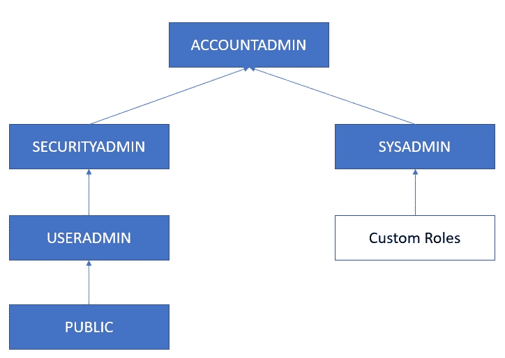
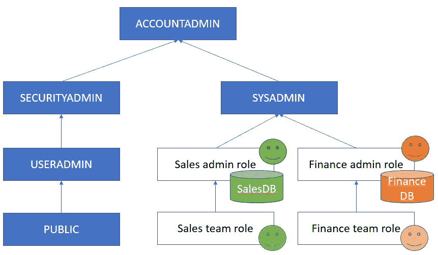
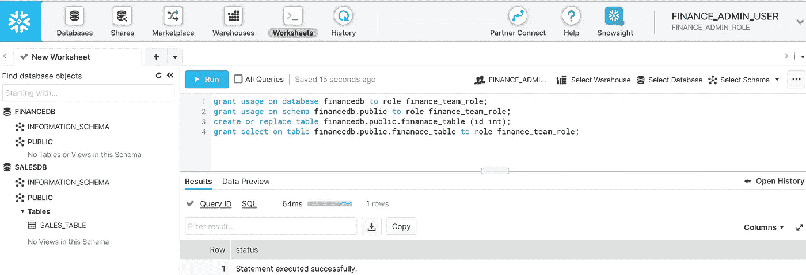
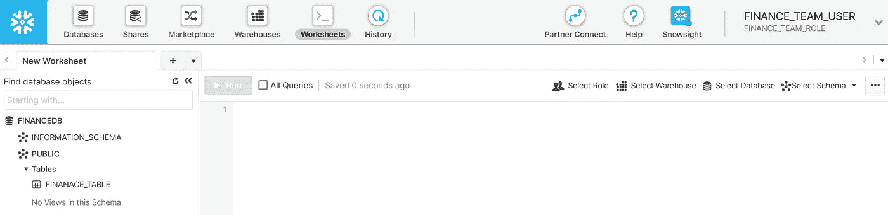

# 雪花访问管理简介

> 原文：<https://blog.devgenius.io/snowflake-access-management-in-brief-770be7cabe18?source=collection_archive---------6----------------------->


箭头省立公园，2022 年 10 月 8 日

访问管理中有两个关键概念:1)用户/角色和 2)对象/权限。所有用户都属于一个或多个角色，而角色与权限(使用、选择、删除等)相关联。)到对象(数据仓库、数据库、表等)上。)

雪花中有 5 个现成的角色:帐户管理员、安全管理员、系统管理员、用户管理员和公共用户。可以根据组织团队添加自定义角色。



角色和关系

**ACCOUNTADMIN** 是顶级角色，是所有其他角色的父角色。它不应用作日常操作。父角色拥有子角色拥有的所有权限。

**SECUTIRYADMIN** 可以授予/撤销角色对象的权限，无论对象的所有者是谁。听起来是一种超能力。不要在日常操作中使用它。

**从 2020 年 4 月发布开始，用户管理员**与安全管理员分离。它专门用于管理用户/角色，授予用户或其他角色角色等。

**SYSADMIN** 是管理对象，并为角色授予对象权限。该角色负责日常管理任务。

**PUBLIC** 是任何新创建用户的默认角色。

**自定义角色**是由用户管理员角色根据组织层次结构创建的角色。它们通常被分配给父 SYSADMIN。在这种情况下，SYSADMIN 创建的对象可以与具有预期权限的角色相关联。

**鉴于上述角色目的，最佳实践通常可能是:**

1 作为用户管理员，为团队创建自定义角色/用户。将顶级自定义角色指定为 SYSADMIN 的子级。

2 作为自定义角色，创建仓库、数据库、模式、表、阶段等。并为顶级自定义角色下的角色授予对这些对象的适当权限。

3 作为 SYSADMIN，创建对象并跨不同的自定义角色授予权限。

以下是为销售和财务两个团队设置角色、对象和授予权限的示例。



**步骤 1，**我们将创建 4 个角色:销售管理角色、销售团队角色、财务管理角色和财务团队角色。另外，在每个角色中创建 4 个用户。

```
// switch role to USERADMIN
use role useradmin;// create sales admin and team roles
create role sales_admin_role;
create role sales_team_role;
grant role sales_team_role to role sales_admin_role;
grant role sales_admin_role to role sysadmin;// create finance admin and team roles
create role finance_admin_role;
create role finance_team_role;
grant role finance_team_role to role finance_admin_role;
grant role finance_admin_role to role sysadmin;// create sales admin and team users, assign roles respectively
create user sales_admin_user password='123' default_role=sales_admin_role must_change_password=true;
grant role sales_admin_role to user sales_admin_user;
create user sales_team_user password='123' default_role=sales_team_role must_change_password=true;
grant role sales_team_role to user sales_team_user;// create finance admin and team users, assign roles respectively
create user finance_admin_user password='123' default_role=finance_admin_role must_change_password=true;
grant role finance_admin_role to user finance_admin_user;
create user finance_team_user password='123' default_role=finance_team_role must_change_password=true;
grant role finance_team_role to user finance_team_user;
```

**步骤 2，**然后作为系统管理员，创建销售和财务数据库，并将所有权授予团队管理员。

注意，需要明确授予数据库和模式的所有权。

```
use role sysadmin;create or replace database salesdb;
grant ownership on database  salesdb to role sales_admin_role;
grant ownership on schema salesdb.public to role sales_admin_role;create or replace database financedb;
grant ownership on database  financedb to role finance_admin_role;
grant ownership on schema financedb.public to role finance_admin_role;
```

**第三步，**现在以 sales_admin_user 的身份登录雪花。您将看到 salesdb 数据库。

然后，该管理员用户可以创建表，并向销售团队角色授予权限。

```
grant usage on database salesdb to role sales_team_role;
grant usage on schema salesdb.public to role sales_team_role;create or replace table salesdb.public.sales_table (id int);grant select on table salesdb.public.sales_table to role sales_team_role;
```

财务管理员用户也可以进行类似的操作。

**第 4 步，**最后，作为系统管理员，我们将授予财务管理员角色，以便能够查看销售数据库。这是跨角色授权。

```
use role sysadmin;
grant usage on database salesdb to role finance_admin_role;
grant usage on schema salesdb.public to role finance_admin_role;
grant select on table salesdb.public.sales_table to role finance_admin_role;
```



财务管理员用户能够看到 salesdb



财务团队用户只能查看财务 b

快乐阅读！

[](https://medium.com/@fengliplatform/membership) [## 通过我的推荐链接-李冯加入媒体

### 写作帮助我们自己，分享帮助很多人。从我自己的学习笔记开始，没有要求完美的压力…

medium.com](https://medium.com/@fengliplatform/membership)