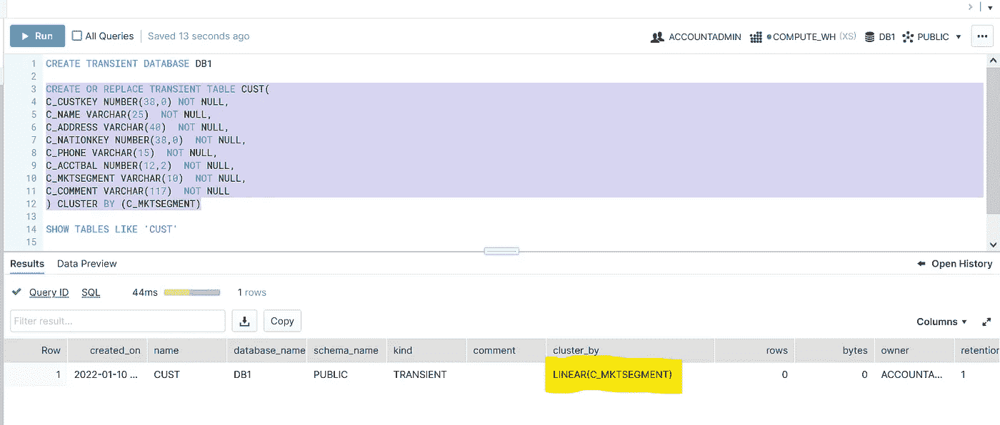

# 雪花—关于 it 架构、缓存、集群和虚拟仓库的一切

> 原文：<https://blog.devgenius.io/snowflake-all-about-it-architecture-caching-clustering-and-virtual-warehouse-f2feb5fbe57b?source=collection_archive---------1----------------------->

在本文中，我将更多地讨论雪花架构、雪花中不同缓存层的详细解释、虚拟仓库以及雪花中集群的概念。

# 行动纲要

1.  雪花建筑
2.  雪花缓存
3.  缓存时应注意的几点
4.  雪花聚类的概念
5.  微分区深度
6.  选择聚类键
7.  群集时的注意事项
8.  雪花虚拟仓库
9.  虚拟仓库中的自动扩展与最大化模式
10.  虚拟仓库中的扩展策略

# 雪花建筑

雪花建筑

雪花架构解决了共享一切和不共享任何架构的问题。雪花将存储和计算分开，使两者相互独立。这有助于独立地扩展和缩减存储和计算。雪花创建了一个云服务层来实现存储和计算之间的通信。云服务层为您处理一切。您不必担心手动管理存储和计算。

> 由于存储不与计算捆绑在一起，并且计算可以独立扩展，这一特性使雪花成为一种**多集群共享数据架构**

*参考—*[*https://docs . snow flake . com/en/user-guide/intro-key-concepts . html*](https://docs.snowflake.com/en/user-guide/intro-key-concepts.html)

# 雪花缓存

当我们在雪花工作表中运行查询时，该查询将被提交给云服务层，云服务层将检查是否需要优化查询，然后将其提交给虚拟仓库层，再将数据从存储层拉入虚拟仓库层。考虑下面的参考图:

让我们用一个例子来了解更多关于雪花中的缓存。我在雪花样本表' *CUSTOMER'* '中对整个数据运行一个选择查询。一旦查询完成，我们可以通过点击查询来查看整个时间消耗和统计数据

当您查看查询配置文件时，自从我第一次运行查询以来，它从**远程磁盘 IO** 读取数据，这是我们的存储层。查询中的处理(在我的运行中占 57%)是将来自存储层的列数据(高度压缩和加密)处理成所需的结果输出。如果您不知道配置文件概述中的**本地磁盘 IO** ，它是来自虚拟仓库的存储缓存。

从客户中选择*

在另一个例子中，我再次在同一个表上运行不同的查询。现在，由于已经从远程磁盘 IO 扫描了数据，这次更多地从本地磁盘 IO 使用数据，这意味着结果已经缓存到虚拟仓库的本地缓存中。

从客户中选择 DISTINCT(*)

一段时间后，我的虚拟仓库被挂起，现在如果我再次运行 select 查询，它将不会再次启动我的虚拟仓库来处理该查询，但它会再次从云服务层缓存中获取相同的结果。您可以看到这样的结果，我重用了旧查询的结果，并花了几毫秒来处理它。

这证实了雪花的智能特性，即任何用户运行相同的查询，都不必一次又一次地计算成本。因为相同的结果被缓存在云服务层，所以它独立于用来生成它的虚拟仓库，也独立于运行它的用户。

从客户中选择*

您也可以通过运行 ALTER SESSION SET USE _ CACHED _ RESULT = FALSE 来禁用云服务层缓存；通过这样做，如果您再次运行相同的查询，那么它将不会使用来自云服务层的缓存结果，而是会使用本地磁盘 IO 缓存，即虚拟仓库层缓存。

从虚拟仓库本地磁盘缓存生成的结果

## 需要注意的要点:

1.  无论何时运行查询，都需要将虚拟仓库附加到工作表中。
2.  如果您正在寻找数据的概览，则在运行 Select * from 表查询时，始终首选 limit 子句。否则，如果您的表是 TB 大小的，您可能会在运行虚拟仓库上花费更多的时间。
3.  每当虚拟仓库进入挂起状态时，本地磁盘缓存就会被清除。因此，在开发环境中，始终要尽量长时间保持自动挂起状态，这样就不必花费更多的计算成本从存储层提取数据
4.  总是与一组在公共桌子上工作的人共享虚拟仓库。由于它们将使用相同的查询，因此您可以利用云服务缓存以及本地磁盘 IO 缓存的优势。
5.  在雪花中重用查询结果是免费的。
6.  从最后一次执行查询开始，雪花查询结果被缓存 **24 小时**。
7.  雪花不收取缓存结果的费用。
8.  如果您在表中进行任何更改(更新/删除)，这些更改会实时反映出来，如果您再次提取数据，刷新后的数据将再次从远程磁盘 IO 中提取。因此，***总是立即执行更新/删除查询，然后提取数据，否则您将花费越来越多的计算成本来从远程磁盘 IO(存储层)提取数据***

> **注意:如果禁用云服务层缓存，每当虚拟仓库进入挂起状态时，在虚拟仓库中进行的缓存将被清除。在这种情况下，将再次从存储层(远程磁盘 IO)获取数据。**

***参考—*[*https://community . snow flake . com/s/article/Caching-in-snow flake-Data-Warehouse*](https://community.snowflake.com/s/article/Caching-in-Snowflake-Data-Warehouse)**

# **雪花聚类**

**每当我们在雪花中运行查询时，它首先被提交到云服务层。云服务层将执行查询优化，并创建执行计划，然后提交给虚拟仓库节点。**

**然后，节点首先下载所有文件的表文件头，并基于来自这些头文件的元数据信息，相应地扫描微分区。**

**微分区中的数据列以高度压缩的列存储形式存储。**

> **在微分区内对记录进行分组的过程称为聚类。**

**我们用一个例子来讨论。假设您在雪花工作表上运行一个查询 **Select EMPID，NAME from EMPLOYEE where EMP JD = 11/2**。然后，虚拟仓库层将从微分区中提取头文件，并将处理元数据信息满足查询结果要求的微分区，并修剪剩余的分区。**

****

**如果该表有 4 个微分区(例如，按照映像)，它将只选择前 3 个微分区，因为它们满足查询条件。根据查询，它将只在头文件中存在的列偏移量的帮助下请求列，这是存储所需要的(而不是整个表的列)。**

> **微分区是在数据被插入/加载到表中时根据数据的排序自动创建的。我们还可以通过在 create 或 alter query 中使用 CLUSTER BY (COLUMN)来添加我们自己的聚集键。**

****

**在雪花中创建集群键的示例**

****雪花中的微分区大小在 50–500 MB 范围内****

## **微分区深度:**

**在上面的图像示例中，我们注意到分区 2 和 3 有重叠的数据(11/2 和其他日期的组合)。如果有更多的重叠，雪花将不得不扫描所有的分区，以满足结果请求。重叠的程度被称为微分区深度。**

****

**微分区深度示例**

**从上图中，您可以注意到重叠越多，微分区的深度就越高。您会注意到，深度 1 被称为恒定微分区，它没有任何重叠。如果您想检查您的表聚类深度和细节，请尝试运行以下查询:**

***SELECT SYSTEM $ CLUSTERING _ INFORMATION(' TABLE _ NAME ')；***

****

**SYSTEM＄CLUSTERING _ INFORMATION 命令的结果输出**

**如果我们想要重新集群现有的表，我们可以使用 alter 命令，然后我们可以执行*ALTER TABLE ' TABLE _ NAME ' re cluster；*为了洗牌分区。**

## **如何选择一个聚类键？**

1.  **列更常用于 where 子句中。**
2.  **列更常用于连接条件中。**
3.  **在聚集键中，列的排序必须是从最低基数到最高基数。*求列的基数—(列中不同的记录数/表中记录总数)***

## **创建集群时的注意事项:**

1.  **聚集键并不适用于雪花图中的所有表**
2.  **表的大小和表的查询性能定义了表的聚集键。**
3.  **通常，当定期或持续对表执行 DML 时，范围内 TB 大小的表会从聚类中受益。**
4.  **在创建集群之后，snowflake 对在微分区中安排数据所使用的计算成本进行收费。**
5.  **如果您确定主要查询哪些数据的聚类键，您可以按这些键的顺序将数据加载到表中，而无需创建聚类。它将在此基础上自动创建微分区，从而降低集群的成本。**

***参考—*[*https://docs . snow flake . com/en/user-guide/tables-clustering-keys . html*](https://docs.snowflake.com/en/user-guide/tables-clustering-keys.html)**

# **雪花虚拟仓库**

**虚拟仓库只不过是我们用来处理数据的计算资源。虚拟仓库有不同的大小。**

**虚拟仓库的规模随着它使用的服务器数量的增加而增加。XS 最少，仅使用 1 台服务器，而 6XL 最大，使用 512 台服务器。**

****

**雪花中可用的虚拟仓库类型**

> **单个虚拟仓库可以分配给多个用户，单个用户可以分配多个虚拟仓库**

****

**当多个用户单个虚拟仓库时，我们可以得到查询开始排队时的情况。在这种情况下，我们可以利用多集群虚拟仓库功能，该功能可以根据负载自动扩展和缩减虚拟仓库。**

****

**在创建仓库时，我们得到两个选项——最大集群和最小集群，它们可用于定义**自动缩放模式**。虚拟仓库在启动时会增加最小的群数量，并将根据负载达到最大的群数量。**

**如果设置*最大集群=最小集群*，虚拟仓库将在**最大化模式**下启动所有最大集群。**

**如果您将最大集群选择为 1，它将不会向您显示添加最小集群的选项，并且不会成为多集群虚拟仓库。**

## **虚拟仓库中的扩展策略**

**如果查询排队，或者如果系统检测到有多个查询，则当前运行的集群系统可以执行，标准策略会立即旋转集群。**

**另一方面，经济策略会一直等待，直到系统估计有足够的查询负载可以让新集群保持忙碌至少 6 分钟。**

**对于标准策略，在连续 2-3 次成功检查(1 分钟间隔)后，雪花会检查负载最少的群集是否可以将其负载重新分配给其他群集。对于经济保单，雪花执行相同的操作，但它会连续检查 5-6 次成功的检查。**

***参考—* [*https://docs .雪花. com/en/user-guide/warehouse-overview . html*](https://docs.snowflake.com/en/user-guide/warehouses-overview.html)**

**想了解更多关于雪花雪专业认证的教学大纲和指南吗？访问我关于“完成 Snow-Pro 证书的路线图”的文章**

** [## 完成雪花雪专业证书的路线图

### 数据工程、数据分析或数据科学领域的所有人员都曾一度需要学习……

medium.com](https://medium.com/@divyanshsaxenaofficial/roadmap-to-complete-snowflake-snow-pro-certificate-d20cd91699d6)** 

## **关于我**

**我是 Divyansh Saxena，在 IBM 工作的云数据工程师。我是一个数据发烧友，对多个云平台有所了解，比如微软 Azure、亚马逊 Web 服务、雪花和谷歌云存储。**

**如果你喜欢这个博客，请分享你的观点，访问[https://beacons.ai/data.dude](https://beacons.ai/data.dude)了解我更多；)**

> **关注我的媒体频道，了解类似话题的定期更新**