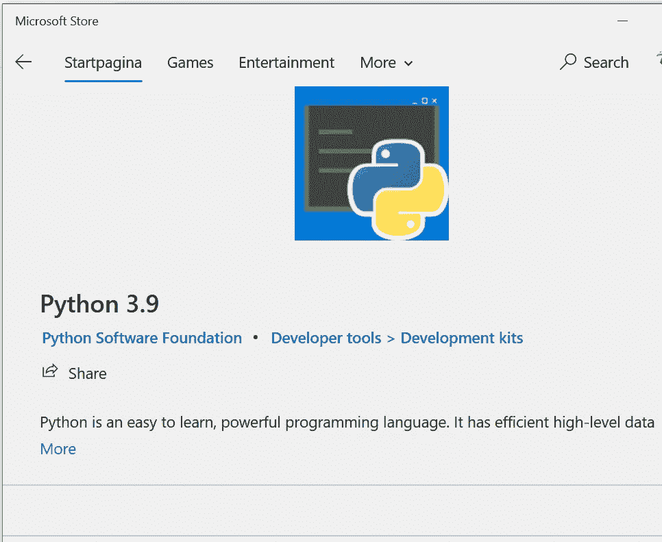
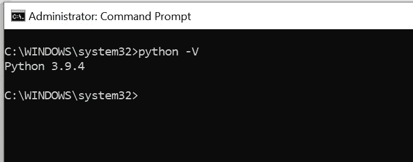
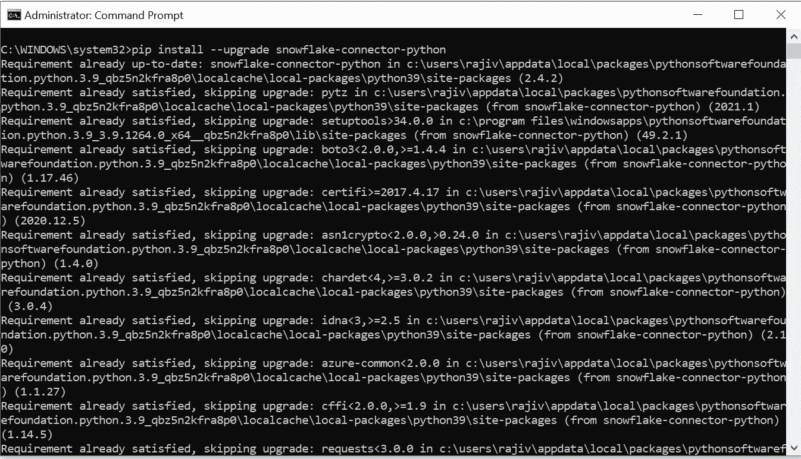
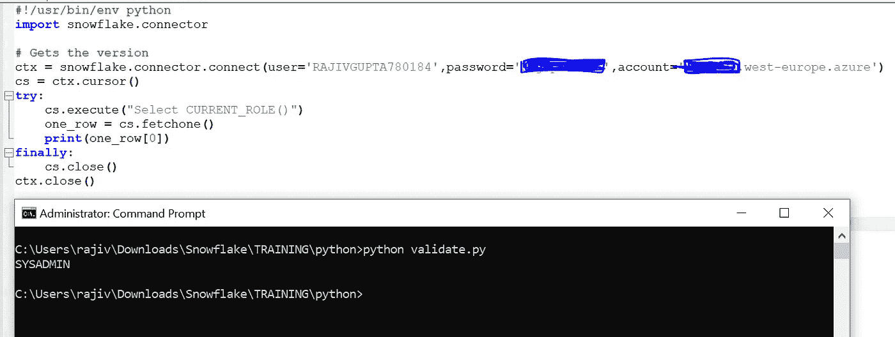
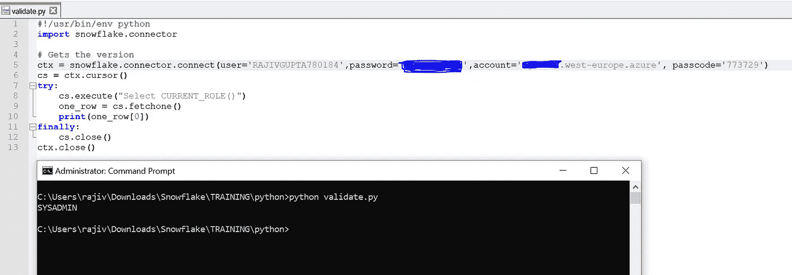
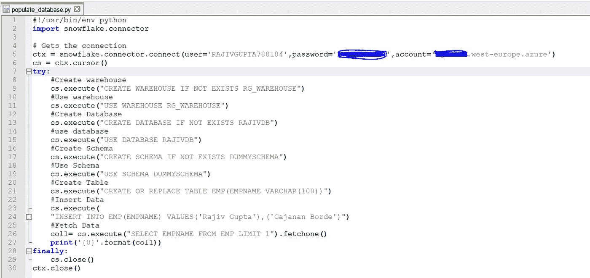
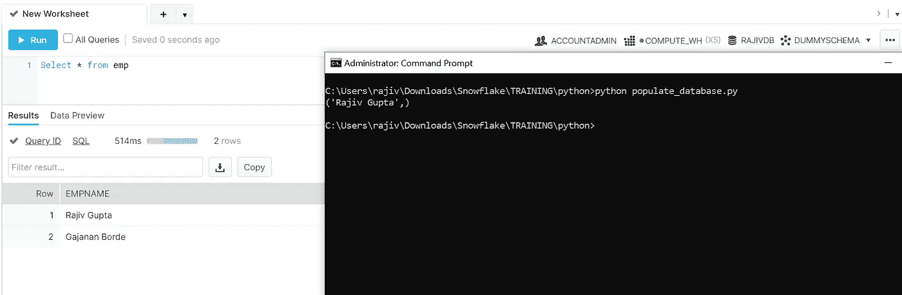
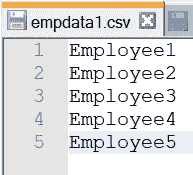
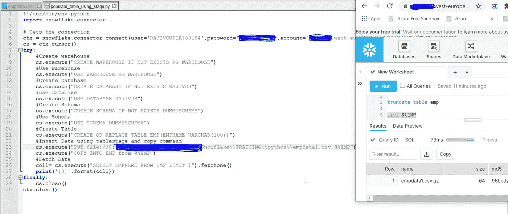
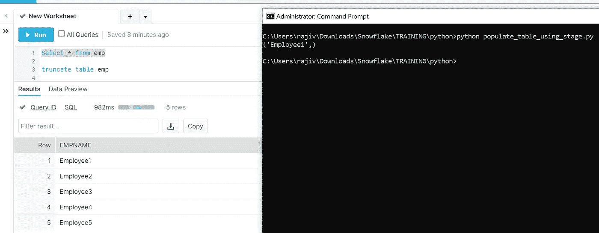

# 雪花和 Python:开始

> 原文：<https://blog.devgenius.io/snowflake-and-python-the-beginning-95a9c317acbe?source=collection_archive---------3----------------------->

这篇博客是关于如何开始为雪花使用 Python 的基础。

## 先决条件

*   熟悉 Python。

**本博客将包含以下内容:**

*   如何在 Windows 中安装 Python
*   测试已安装的 Python 版本。
*   如何为雪花设置 Python 连接器
*   测试你和雪花的联系。
*   如果账户中启用了 MFA，如何从 Python 连接雪花？
*   如何使用 Python 创建仓库、数据库、模式、表以及用数据填充表？
*   如何用 table stage 填充雪花表，用 Python 上传本地文件？

**步骤 1:** 如果你已经在电脑上安装了 Python，那么你可以跳过这一步，否则你可以从下面的链接下载 Python 并安装在你的电脑上。

**下载 Python:**https://www.python.org/downloads/

如果你使用的是微软 Windows 10，你可以直接从微软商店下载 Python 3.9(它是免费的)。

.

**步骤 2:** 检查是否安装了正确的版本，并在 windows CLI 中运行以下命令。如果它输出 3.5 或更高，你就可以走了！如果没有，你需要安装一个新版本的 Python。

**python -V**

一旦您获得了 Python 的最新版本，您就可以为 Python 安装雪花连接器了。您将通过 Python 包安装程序 pip 并通过运行以下命令来完成此操作:

**pip 安装—升级雪花-连接器-python**

如果上述步骤成功完成，那么你就可以开始第三步了。

**步骤 3:** 您可以编写简单的 **validate.py** python 脚本来测试您与雪花的连接。请参见下面的示例代码片段。

**第四步:** **如果你的雪花账户开通了 MFA 如何连接？**

上面的代码将在应用程序中推送 DUO 通知，然后你必须从应用程序中手动批准才能连接。

## 用 Python 使用 MFA**(来源:雪花)**

MFA 可用于通过雪花 Python 连接器连接到雪花。默认情况下，当用户在 MFA 中注册时，使用双推身份验证机制；不需要对 Python API 调用进行任何更改。

要使用阿朵生成的密码而不是推送机制，必须在 to connect()方法中为驱动程序指定以下参数之一:

> `*passcode=<passcode_string>*` *或* `*passcode_in_password=True*`

其中:

*   `*passcode_string*`是阿朵为正在连接的用户生成的密码。这可以是由 Duo 移动应用程序生成的密码，也可以是 SMS 密码。
*   如果为`passcode_in_password=True`，则密码和通行码以`<password_string><passcode_string>`的形式连接在一起。

我在连接脚本中提供了“密码”作为额外的参数，以避免通过应用程序手动批准。请参见示例代码。

**关于雪花 MFA 的更多详情:**

 [## 多因素认证(MFA) -雪花文档

### 雪花支持多因素身份验证(即 MFA ),为连接到的用户提供更高的登录安全性

docs.snowflake.com](https://docs.snowflake.com/en/user-guide/security-mfa.html#connecting-to-snowflake-with-mfa) 

现在你知道如何使用 Python 连接到雪花，让我们使用 Python 脚本创建仓库、数据库、模式和表。

**第五步:**连接雪花，如果不存在，创建自定义仓库。使用同一个仓库创建一个名为“RAJIVDB”的新数据库，然后创建一个名为“DUMMYSCHEMA”的模式。创建一个名为 EMP 的表，并用 2 条记录填充它。获取 1 条记录并显示它们。

填充 _ 数据库. py

输出截图

**步骤 6:如何使用表阶段&复制命令填充 EMP 表？**

抽样资料

希望这篇博客能帮助你深入了解如何在雪花中使用 python。如果你对此有任何疑问，欢迎在评论区提问。如果你喜欢这个博客，请鼓掌。保持联系，看到更多这样的酷东西。谢谢你的支持。

**你看了我下面的博客了吗:**

雪花雪景:炒作还是真的？

[为什么雪花在云世界获得牵引力？](https://rajivgupta780184.medium.com/why-snowflake-is-getting-traction-in-cloud-world-7ecc610c8020)

**你可以找我:**

**跟我上媒:**[https://rajivgupta780184.medium.com/](https://rajivgupta780184.medium.com/)

**在推特上关注我:【https://twitter.com/RAJIVGUPTA780】T22**

**在 LinkedIn 跟我连线:**[https://www.linkedin.com/in/rajiv-gupta-618b0228/](https://www.linkedin.com/in/rajiv-gupta-618b0228/)

**订阅我的 YouTube 频道:**[https://www.youtube.com/channel/UC8Fwkdf2d6-hnNvcrzovktg](https://www.youtube.com/channel/UC8Fwkdf2d6-hnNvcrzovktg)

#坚持学习#坚持分享#每天学习。

# 参考资料:-

*   [https://www.snowflake.com/](https://www.snowflake.com/)