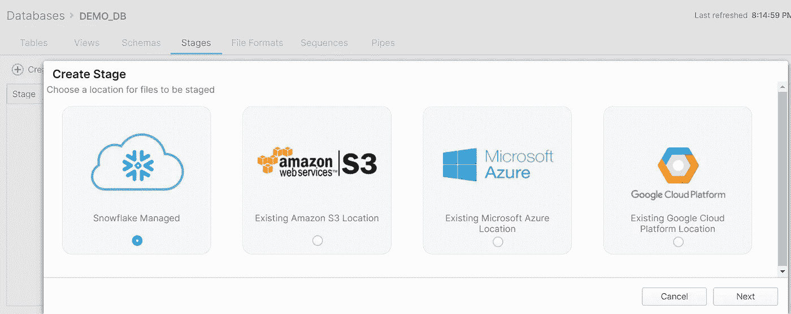
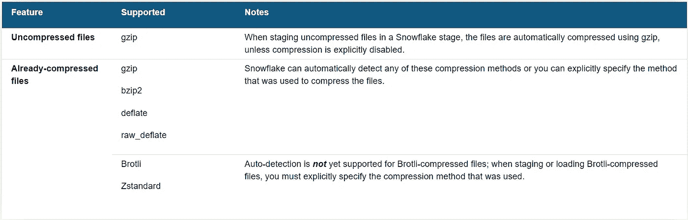

# 雪花数据加载:概览

> 原文：<https://blog.devgenius.io/snowflake-data-loading-overview-7c8853ef1a0e?source=collection_archive---------0----------------------->


由[米卡·鲍梅斯特](https://unsplash.com/@mbaumi?utm_source=medium&utm_medium=referral)在 [Unsplash](https://unsplash.com?utm_source=medium&utm_medium=referral) 拍摄的照片

在这篇博客中，我们将看到如何像其他数据仓库一样将数据加载到雪花中。当我们谈到结构化或半结构化数据加载时，所有格式雪花支持什么，以及是什么使雪花如此吸引人。使用 stage 加载数据。

**此主题与 SnowPro 核心考试的相关程度如何？**

这个主题非常重要，你可能会在 SnowPro 考试中遇到一些问题。

**雪花中是什么阶段？**

用外行人的话来说，stage 是雪花中的一个数据着陆区。

**雪花账户有不同类型的阶段吗？**

是的，我们有 4 种类型的阶段。

*   用户阶段
*   台式舞台
*   内部命名阶段
*   外部命名阶段

**如何创建数据加载的阶段？**

您可以使用雪花 Web UI 来创建阶段(数据库>阶段>+创建),也可以使用代码方式。



> **内部名称阶段代码:**
> 
> `CREATE STAGE “DEMO_DB”.”PUBLIC”.TestStage;`

**为什么我们需要 4 种不同类型的舞台？目的是甚麽？**

所有的舞台都有利弊。让我们看看怎么做。

**用户阶段:**不能创建用户阶段**。**为每个用户分配一个用户级，用于存储文件。此登台类型旨在存储由单个用户登台和管理但可以加载到多个表中的文件。不能更改或删除用户阶段。要上传文件，你必须使用 put 命令，要下载文件，你必须从 snowsql 命令行使用 get 命令。

**表格阶段:**不能创建表格阶段**。**在雪花中创建的每个表格都有一个表格阶段。此登台类型旨在存储由一个或多个用户登台和管理但仅加载到单个表中的文件。不能更改或删除表阶段。请注意，表阶段不是一个单独的数据库对象；相反，这是一个与桌子本身相关的隐含阶段。要上传文件，你必须使用 put 命令，要下载文件，你必须从 snowsql 命令行使用 get 命令。

**内部命名阶段:**您可以创建一个命名的内部阶段**。**命名内部阶段是在模式中创建的数据库对象。此登台类型可以存储由一个或多个用户登台和管理并加载到一个或多个表中的文件。因为命名阶段是数据库对象，所以可以使用安全访问控制权限来控制创建、修改、使用或删除它们的能力。要上传文件，你必须使用 put 命令，要下载文件，你必须从 snowsql 命令行使用 get 命令。您不能使用雪花 Web UI 将任何文件上传/下载到内部命名阶段。

**外部命名阶段:**外部阶段就像命名内部阶段，只是它是在云存储服务而不是雪花内部存储之上创建的。该对象将文件的 URL 存储在云存储中。雪花支持 AWS S3，天蓝色 Blob & GCP 桶用于外部阶段。要上传和下载，您必须使用云本地实用程序或特定云支持的任何外部实用程序。雪花专有的 put & get 命令在这里不起作用。

**雪花有什么加载方式？**

雪花覆盖了使用“ **COPY INTO** ”命令的批量数据加载场景和使用 [**Snowpipe**](https://rajivgupta780184.medium.com/real-time-iot-data-ingestion-using-snowflake-snowpipe-on-azure-4a113bc4092c) 的增量/连续数据加载场景。Copy Into 旨在加载大量数据，而 Snowpipe 旨在持续加载少量数据。

**这项服务是如何运作的？**

复制到命令使用用户提供的虚拟仓库 Snowpipe 使用雪花提供的计算。

**加载数据时所有格式雪花支持什么？**

雪花支持多种文件格式。见下文:

**分隔文件(CSV、TSV 等。):**支持任何有效分隔符；默认为逗号(即 CSV)。

JSON: JSON 代表 JavaScript 对象符号。JSON 是一种用于存储和传输数据的轻量级格式

**Avro:** 包括自动检测和处理使用 Snappy 压缩的分段 Avro 文件。

**ORC:** 包括自动检测和处理使用 Snappy 或 zlib 压缩的暂存 ORC 文件。

**拼花:**包括自动检测和处理使用 Snappy 压缩的分段拼花文件。

**XML:** 支持预览功能。

**可以在雪花加载数据的同时做转换吗？**

是的，在使用任何一种加载方法加载数据时，简单的转换都是可能的。选项包括:

*   列重新排序
*   列省略
*   投
*   截断超过目标列长度的文本字符串

不要求数据文件与目标表具有相同的列数和顺序。

如果我不想加载数据，但只想从文件中查询少量数据，该怎么办？

雪花为您提供了外部表的工具来满足这一需求。外部表支持查询存储在外部云存储中的现有数据进行分析，而无需先将其加载到雪花中。数据的真实来源仍然在外部云存储中。

**stage 的文件压缩怎么样？可能吗？**

是的，您可以暂存该文件，并且根据它是压缩的还是未压缩的，它将由雪花处理。下面是一个图表，以了解更多细节。



(来源:雪花)

**我们的数据在 Stage 中有多安全？它们加密了吗？**

在雪花内部位置暂存未加密的文件时，会使用 128 位密钥自动加密这些文件。可以启用 256 位密钥(为了更强的加密)；但是，需要额外的配置。已经加密的文件可以从外部云存储加载到雪花中；用于加密文件的密钥必须提供给雪花。

在 Snowflake 中加载数据时，我们需要遵循什么指导原则或注意事项吗？

是的，有完整的文档。请在这里找到 [**。**](https://docs.snowflake.com/en/user-guide/data-load-considerations-prepare.html)

**雪花如何克服两次加载同一个文件？**

雪花维护数据加载到的每个表的详细加载元数据，包括:

*   从中加载数据的每个文件的名称
*   文件大小
*   文件的 ETag
*   文件中分析的行数
*   文件上次加载的时间戳
*   关于加载期间文件中遇到的任何错误的信息

此加载元数据将在 64 天后过期。

**如果加载元数据过期或者有人出于某种原因强行想要加载同一个文件怎么办。？**

要加载元数据已过期的文件，将**LOAD _ uncertainty _ FILES**copy 选项设置为 true。复制选项引用加载元数据(如果可用)以避免数据重复，但也会尝试加载加载元数据过期的文件。

或者，设置 **FORCE** 选项加载所有文件，忽略加载元数据(如果存在)。请注意，此选项会重新加载文件，可能会复制表中的数据。

**我们实际上是如何使用 COPY INTO 命令加载数据的？**

下面是示例代码:

```
copy into dummy_data from @%dummy_data/data1/
 pattern=’.*dummy_data[0-9].csv’;
```

```
copy into dummy_data from @%dummy_data/data1/
files=(‘dummyfile1.csv’,’dummyfile2.csv’,’dummyfile3.csv’)
```

**Snowpipe 代码是什么样子的？**

下面是示例代码:

```
CREATE OR REPLACE PIPE TEMPARATURE_PIPE
 auto_ingest = true
 integration = ‘TEMPARATURE_NI’
 as
 copy into “IOTDB”.”IOTDEMO”.”TEMPARATURE”
 (data)
 from @TEMPARATURE_STAGE
 file_format = (type = ‘JSON’);
```

如需手动加载数据，请点击 [**这里。**](https://rajivgupta780184.medium.com/snowflake-bulk-data-loading-hands-on-a2b5985d8c93)

要查看更多关于复制到命令的细节，你可以参考雪花文档 [**这里**](https://docs.snowflake.com/en/sql-reference/sql/copy-into-table.html) **。**

要查看 Snowpipe 命令的更多细节，你可以参考雪花文档 [**这里**](https://docs.snowflake.com/en/sql-reference/sql/create-pipe.html) **。**

希望这篇博客能帮助你了解雪花数据加载概述。如果你对此有任何疑问，欢迎在评论区提问。如果你喜欢这个博客，请鼓掌。保持联系，看到更多这样的酷东西。谢谢你的支持。

**你可以找我:**

**跟我上媒:**[https://rajivgupta780184.medium.com/](https://rajivgupta780184.medium.com/)

**在推特上关注我:**[https://twitter.com/RAJIVGUPTA780](https://twitter.com/RAJIVGUPTA780)

**在 LinkedIn 跟我连线:**[https://www.linkedin.com/in/rajiv-gupta-618b0228/](https://www.linkedin.com/in/rajiv-gupta-618b0228/)

**订阅我的 YouTube 频道:**[https://www.youtube.com/channel/UC8Fwkdf2d6-hnNvcrzovktg](https://www.youtube.com/channel/UC8Fwkdf2d6-hnNvcrzovktg)


#坚持学习#坚持分享#每天学习。

# 参考资料:-

*   [https://www.snowflake.com/](https://www.snowflake.com/)