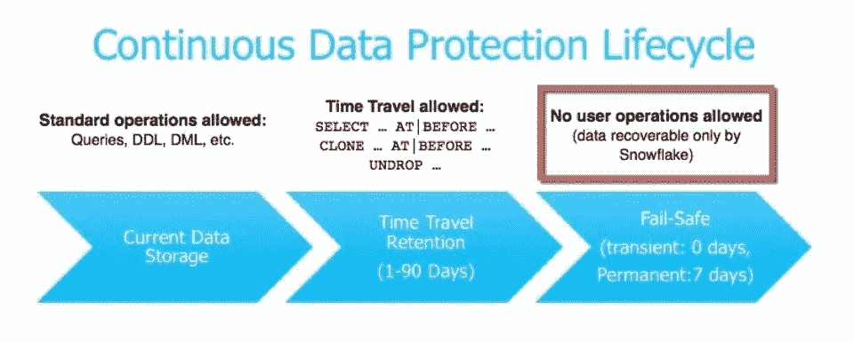
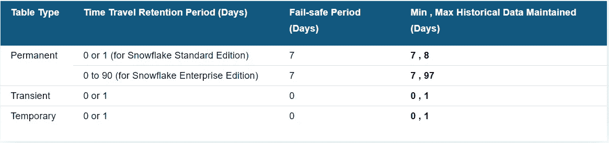
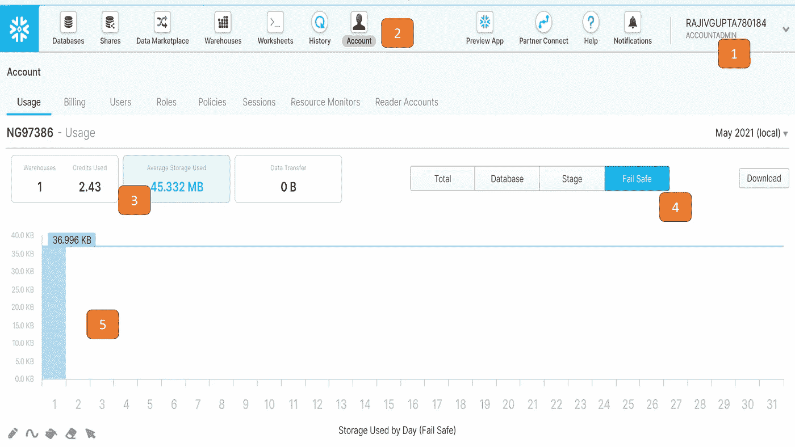
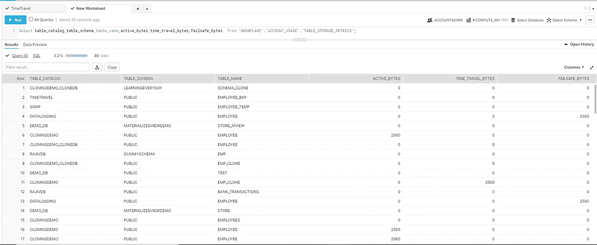

# 具有故障保护功能的雪花数据保护

> 原文：<https://blog.devgenius.io/snowflake-data-protection-with-fail-safe-688e74cc35e5?source=collection_archive---------2----------------------->

在这篇博客中，我们将看看雪花故障安全。故障安全是数据生命周期(CDP)的第三和最后阶段。故障安全不同于时间旅行，时间旅行的唯一目的是确保在发生系统故障或其他灾难性事件(如硬件故障或安全漏洞)时保护历史数据。

自动防故障功能附带 7 天不可配置的数据恢复阶段。这在时间旅行后立即开始。在这个阶段之后，任何人都不能从雪花中恢复历史数据。

此阶段由 Snowflake 所有，不能作为时间旅行保留期结束后访问历史数据的手段。仅供雪花*使用，用于恢复可能因极端操作故障而丢失或损坏的数据。*

*Fail-safe 是一种数据恢复服务，它是在尽最大努力的基础上提供的，仅在尝试了所有其他恢复选项后才使用。根据历史数据的数量，这可能需要几个小时或几天的时间。*

***如何计算防故障存储成本？***

*存储成本从数据更改之时起按日平均(24 小时)计算。历史数据保留的天数取决于表的类型和故障安全期。瞬态表和临时表没有故障安全期。*

**

*(来源:雪花)*

***Web 用户界面上的故障安全存储是否可见？***

*是的，您可以使用 Web UI 查看故障保护存储。您将需要 ACCOUNTADMIN 角色才能查看相同的内容。步骤如下:*

1.  *切换到简档级别的帐户管理员角色。*
2.  *点击账户*
3.  *点击平均使用存储*
4.  *点击故障安全标签。*

**

***如何通过查询查看防故障存储？***

*您可以查询下面的查询来查看数据生命周期的变化。*

> *Select table_catalog，table_schema，table_name，active_bytes，time_travel_bytes，failsafe_bytes from 雪花。账户 _ 用途。表存储指标；*

**

*希望这篇博客能帮助你了解雪花自动防故障系统。如果你有兴趣了解更多关于时间旅行的细节，你可以参考[雪花文档](https://docs.snowflake.com/en/user-guide/data-time-travel.html)。如果你对此有任何疑问，欢迎在评论区提问。如果你喜欢这个博客，请鼓掌。保持联系，看到更多这样的酷东西。谢谢你的支持。*

***你可以找我:***

***跟我上媒:**[https://rajivgupta780184.medium.com/](https://rajivgupta780184.medium.com/)*

***在推特上关注我:**[https://twitter.com/RAJIVGUPTA780](https://twitter.com/RAJIVGUPTA780)*

***在 LinkedIn 联系我:**【https://www.linkedin.com/in/rajiv-gupta-618b0228/ *

*【https://www.youtube.com/channel/UC8Fwkdf2d6-hnNvcrzovktg】订阅我的 YouTube 频道:*

**

*#坚持学习#坚持分享#每天学习。*

# *参考资料:-*

*   *[https://www.snowflake.com/](https://www.snowflake.com/)*