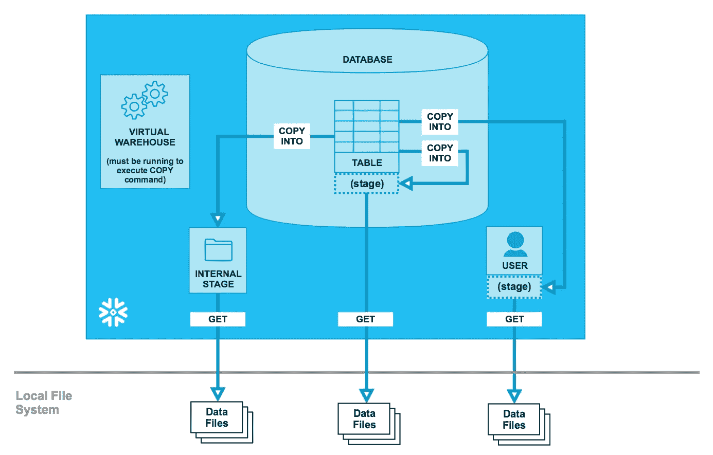
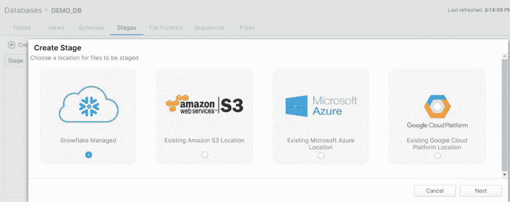

# 雪花数据卸载

> 原文：<https://blog.devgenius.io/snowflake-data-unloading-f78948aa2066?source=collection_archive---------1----------------------->

马库斯·斯皮斯克在 [Unsplash](https://unsplash.com?utm_source=medium&utm_medium=referral) 上的照片

在这篇博客中，我们将看到如何像其他数据仓库一样从雪花中批量导出数据。所有格式雪花支持什么和其他重要细节。雪花数据导出也是一个两步的过程，就像数据导入一样。

1.  使用【复制到…】命令将原始数据导出到指定阶段(内部或外部)的平面文件中。
2.  使用获取命令行功能从雪花内部阶段下载导出的数据文件。如果您使用外部 stage，如 AWS、Azure 或 GCP，请使用云原生工具提取导出的数据。

从雪花的下图中很好地解释。

**此主题与 SnowPro 核心考试的相关程度如何？**

这个题目不是很重要，你可能会在 SnowPro 考试中看到这个题目的 1-2 个问题。但是了解所有的主题是有好处的，因为雪花考试每天都在发展。

**雪花中的 stage 是什么？**

用外行话来说，stage 是雪花中的一个数据着陆区。

**雪花账户有不同类型的阶段吗？**

是的，我们有 4 种类型的阶段。

*   用户阶段
*   台式舞台
*   内部命名阶段
*   外部命名阶段

**如何创建数据加载的阶段？**

您可以使用雪花 Web UI 来创建阶段(数据库>阶段>+创建),也可以使用代码方式。

> ***内部名称阶段代码:***
> 
> *创建阶段“DEMO_DB”。“公”。ExportStage*

**为什么我们需要 4 种不同类型的舞台？目的是甚麽？**

所有的舞台都有利弊。让我们看看怎么做。

**用户阶段:**不能创建用户阶段**。**为每个用户分配一个用户级，用于存储文件。此登台类型旨在存储由单个用户登台和管理的文件，但可以加载到多个表中。不能更改或删除用户阶段。要上传文件，你必须使用 put 命令，要下载文件，你必须从 snowsql 命令行使用 get 命令。

**用户阶段被标识为** @~

**工作台阶段:**您不能创建工作台阶段**。**雪花中创建的每个表都有一个表阶段。这种暂存类型旨在存储由一个或多个用户暂存和管理的文件，但只加载到一个表中。不能更改或删除表格阶段。请注意，表阶段不是一个单独的数据库对象；相反，它是一个与桌子本身联系在一起的隐性舞台。要上传文件，您必须使用 put 命令，要下载文件，您必须使用 snowsql 命令行中的 get 命令。

**表期标识为@% <表名>**

**内部命名阶段:**您可以创建一个命名的内部阶段**。**命名内部阶段是在模式中创建的数据库对象。此阶段类型可以存储由一个或多个用户转移和管理并加载到一个或多个表中的文件。因为命名阶段是数据库对象，所以可以使用安全访问控制权限来控制创建、修改、使用或删除它们的能力。要上传文件，您必须使用 put 命令，要下载文件，您必须使用 snowsql 命令行中的 get 命令。您不能使用雪花网络用户界面上传/下载任何文件到内部命名阶段。

**内部命名阶段标识为@ <内部阶段名称>**

**外部命名阶段:**外部阶段类似于命名的内部阶段，只是它是在云存储服务之上创建的，而不是雪花内部存储。该对象将文件的 URL 存储在云存储中。雪花支持 AWS S3，Azure Blob & GCP 桶为外部舞台。要上传和下载，您必须使用云本地实用程序或特定云支持的任何外部实用程序。雪花专有的放&获取命令在这里将不起作用。

**外部命名阶段标识为@ <外部阶段名称>**

**如何在雪花中导出数据？**

雪花支持在 COPY 语句中指定 SQL 查询而不是直接表名。您可以将数据导出到内部或外部阶段。SQL 查询的结果被写入一个或多个文件，如命令中指定的一个阶段。

COPY 语句中的 SELECT 查询支持雪花 SQL 查询的全部语法和语义，包括 JOIN 子句，该子句允许从多个表中下载数据。

复制到代码示例如下:

> 复制到<database>。<schema>。<stage_name>《T21》出自<数据库>。< SCHEMA >。<TABLE _ NAME>
> FILE _ FORMAT =(FORMAT _ NAME =<FILE _ FORMAT _ NAME>COMPRESSION = none)；</stage_name></schema></database>

**如何在雪花中导出数据？**

**当您的雪花中有空值时&如何用引号将数据导出？**

**当你有空白的& Null 值时，如何使用引号导出雪花中的数据？**

**如何创建文件格式？**

这是非常直接的，更多细节见文档[这里](https://docs.snowflake.com/en/sql-reference/sql/create-file-format.html)。

**数据卸载支持哪些格式？**

截至目前，雪花支持如下:

1.  结构化(CSV，TSV)-支持任何单字节分隔符。
2.  半结构(JSON、拼花地板)

**如何在雪花中导出 JSON 格式的数据？**

**如何在雪花中导出拼花格式的数据？**

希望这篇博客和 YouTube 视频能帮助你深入了解**雪花数据卸载特性**。如果你有兴趣了解更多关于雪花数据卸载的细节，可以参考[雪花文档](https://docs.snowflake.com/en/user-guide-data-unload.html)。如果你对此有任何疑问，欢迎在评论区提问。如果你喜欢这个博客，请鼓掌。保持联系，看到更多这样的酷东西。谢谢你的支持。

**你可以找我:**

**跟我上媒:【https://rajivgupta780184.medium.com/】T22**

**在推特上关注我:**[https://twitter.com/RAJIVGUPTA780](https://twitter.com/RAJIVGUPTA780)

**在 LinkedIn 跟我连线:**[https://www.linkedin.com/in/rajiv-gupta-618b0228/](https://www.linkedin.com/in/rajiv-gupta-618b0228/)

**订阅我的 YouTube 频道:**[https://www.youtube.com/c/RajivGuptaEverydayLearning](https://www.youtube.com/c/RajivGuptaEverydayLearning)

#坚持学习#坚持分享#每天学习。

# 参考资料:-

*   [https://www.snowflake.com/](https://www.snowflake.com/)