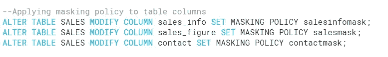

# 雪花动态数据屏蔽概述

> 原文：<https://blog.devgenius.io/snowflake-dynamic-data-masking-overview-4ebaa29c20aa?source=collection_archive---------1----------------------->

照片由[阿南德·塔库尔](https://unsplash.com/@oversorted?utm_source=medium&utm_medium=referral)在 [Unsplash](https://unsplash.com?utm_source=medium&utm_medium=referral) 拍摄

在这篇博客中，我们将讨论**雪花数据治理特性:动态数据屏蔽**。该功能属于“**保护您的数据**”类别。此功能适用于所有**企业版(或更高版本)**的帐户。如果你最近看了我的关于 [**行访问策略**](https://rajivgupta780184.medium.com/snowflake-data-governance-row-access-policy-overview-91b50d604a57) 的博客，那么就在同一行上 [**行访问策略**](https://rajivgupta780184.medium.com/snowflake-data-governance-row-access-policy-overview-91b50d604a57) 保护/控制**行**并使其仅被授权的人或人群可见，而**动态数据屏蔽**将保护/控制**列数据**并使其仅被授权的人或人群可见。

**雪花是如何隔离数据治理的？**

上述主题属于三个类别之一。

**什么是动态数据屏蔽？**

动态数据屏蔽特性是**雪花数据治理:列级安全性**下的两个特性之一。此功能有助于屏蔽表格的列平面图-文本数据屏蔽数据。这是模式级对象，目前只能应用于表&视图。动态数据屏蔽功能是逻辑的，在查询时应用。它不会持久地屏蔽数据库中的数据。根据掩码策略条件、SQL 执行上下文和角色层次结构，雪花查询运算符可能会看到纯文本值、部分掩码值或完全掩码值。

屏蔽数据的外观示例。在下面的示例中，您可以看到 Sales_info 列被散列，Sales_figure 值默认为 0，Contact 列对未授权用户部分屏蔽。

**动态数据屏蔽的一些好处:**

**我们如何创建屏蔽策略？**

下面，您可以看到 3 种不同的示例来创建屏蔽策略。

1.  如果用户不拥有特定角色，则使用 0(零)值屏蔽 sales_figure 列。
2.  使用部分屏蔽来屏蔽联系人列，如果用户不拥有特定角色，则仅显示电子邮件域值。
3.  如果用户不拥有特定角色，则使用哈希值屏蔽 sales_info 列。

**我们如何应用动态数据屏蔽策略？**

**我们如何审计动态数据屏蔽策略？**

雪花提供了两种特定于屏蔽策略的帐户使用视图。两个视图延迟可能高达 120 分钟(2 小时)。该视图仅显示会话的当前角色已被授予访问权限的对象。

*   [MASKING_POLICIES](https://docs.snowflake.com/en/sql-reference/account-usage/masking_policies.html) 提供了您雪花账户中所有屏蔽策略的列表。以下示例:

*   [POLICY_REFERENCES](https://docs.snowflake.com/en/sql-reference/account-usage/policy_references.html) 提供了设置了屏蔽策略的所有对象的列表。

您可以利用雪花文档进行动态数据屏蔽[故障排除](https://docs.snowflake.com/en/user-guide/security-column-ddm-intro.html#troubleshooting-dynamic-data-masking)。

来点演示怎么样？

**如何查看 DDM 策略体？**

**如何改变现有的屏蔽策略？**

**如何撤销 DDM 策略？**

**需要记住的事情:**

*   对掩码策略进行操作还需要对父数据库和方案具有 USAGE 权限。
*   雪花在[历史页面](https://docs.snowflake.com/en/user-guide/ui-history.html)(web 界面中)记录用户运行的原始查询。该查询位于 **SQL 文本**列中。
*   在特定查询中使用的屏蔽策略名称可以在[查询配置文件](https://docs.snowflake.com/en/user-guide/ui-query-profile.html)中找到。
*   查询历史只针对账户使用 [QUERY_HISTORY](https://docs.snowflake.com/en/sql-reference/account-usage/query_history.html) 视图。在这个视图中，**查询文本**列包含 SQL 语句的文本。QUERY_HISTORY 视图中不包括掩蔽策略名称。
*   如果您想要更新现有的屏蔽策略并需要查看策略的当前定义，请调用 [GET_DDL](https://docs.snowflake.com/en/sql-reference/functions/get_ddl.html) 函数或运行 [DESCRIBE MASKING POLICY](https://docs.snowflake.com/en/sql-reference/sql/desc-masking-policy.html) 命令。
*   目前，雪花不支持屏蔽策略中不同的输入输出数据类型，如定义屏蔽策略以时间戳为目标，返回字符串(如`***MASKED***`)；输入和输出数据类型必须匹配。
*   动态数据屏蔽权限可以在这里看到****。****

**希望这篇博客能帮助你深入了解**雪花动态数据屏蔽**特性。如果你有兴趣了解更多关于**动态数据屏蔽**的细节，可以参考[雪花文档](https://docs.snowflake.com/en/user-guide/security-column-ddm.html)。如果你对此有任何疑问，欢迎在评论区提问。如果你喜欢这个博客，请鼓掌。保持联系，看到更多这样的酷东西。谢谢你的支持。**

****你可以找我:****

****跟我上媒:**[https://rajivgupta780184.medium.com/](https://rajivgupta780184.medium.com/)**

****在推特上关注我:**https://twitter.com/RAJIVGUPTA780 T21**

****在 LinkedIn 跟我连线:**[https://www.linkedin.com/in/rajiv-gupta-618b0228/](https://www.linkedin.com/in/rajiv-gupta-618b0228/)**

****订阅我的 YouTube 频道:**[https://www.youtube.com/c/RajivGuptaEverydayLearning](https://www.youtube.com/c/RajivGuptaEverydayLearning)**

****

**#坚持学习#坚持分享#每天学习。**

# **参考资料:-**

*   **[https://www.snowflake.com/](https://www.snowflake.com/)**