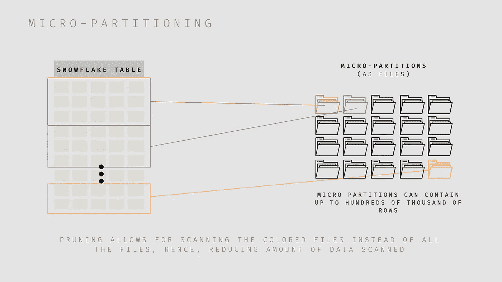
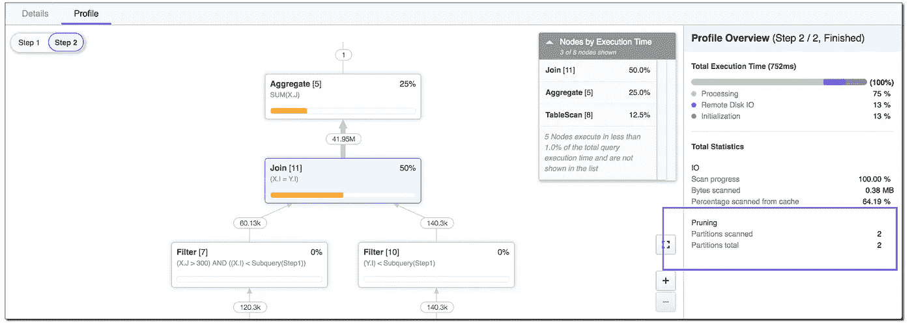
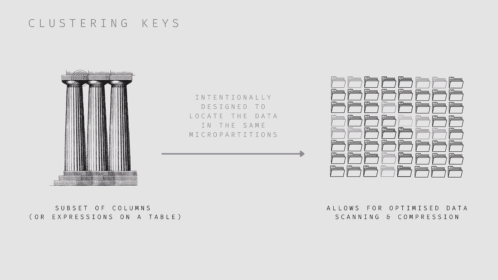
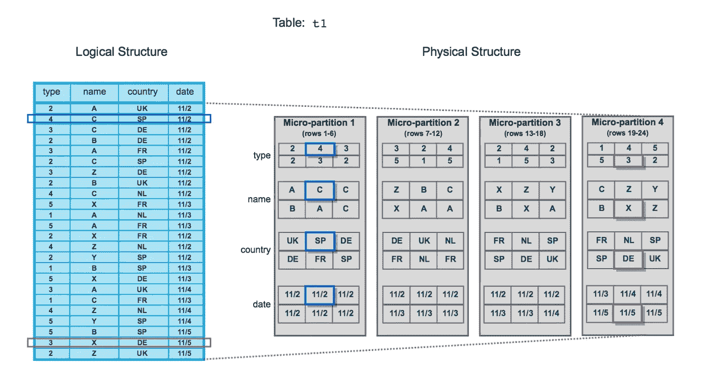
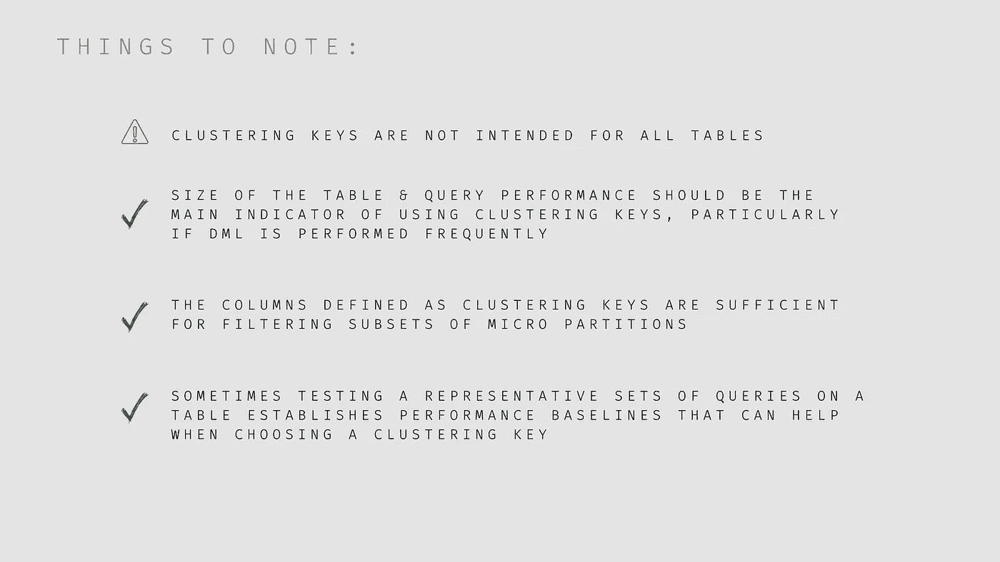
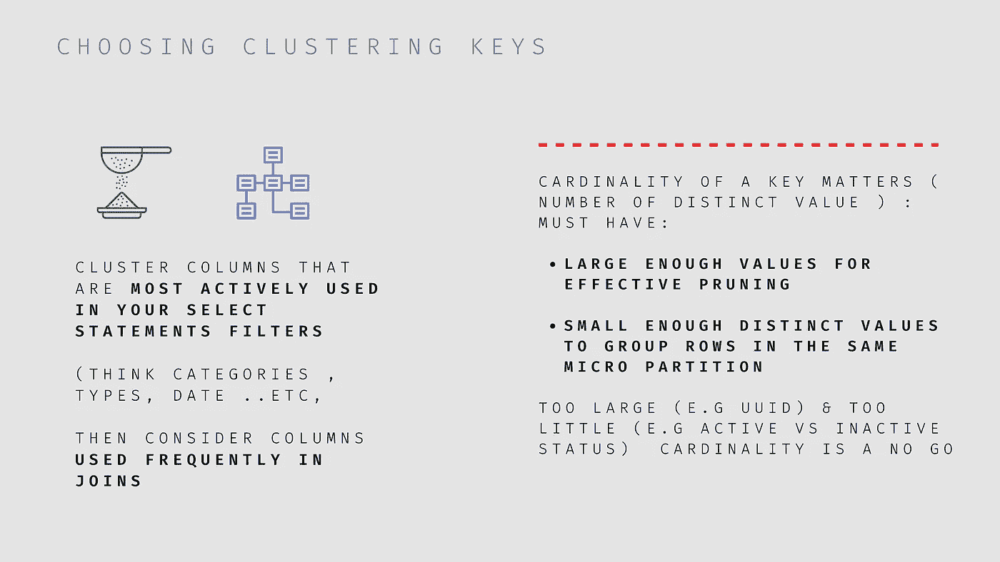
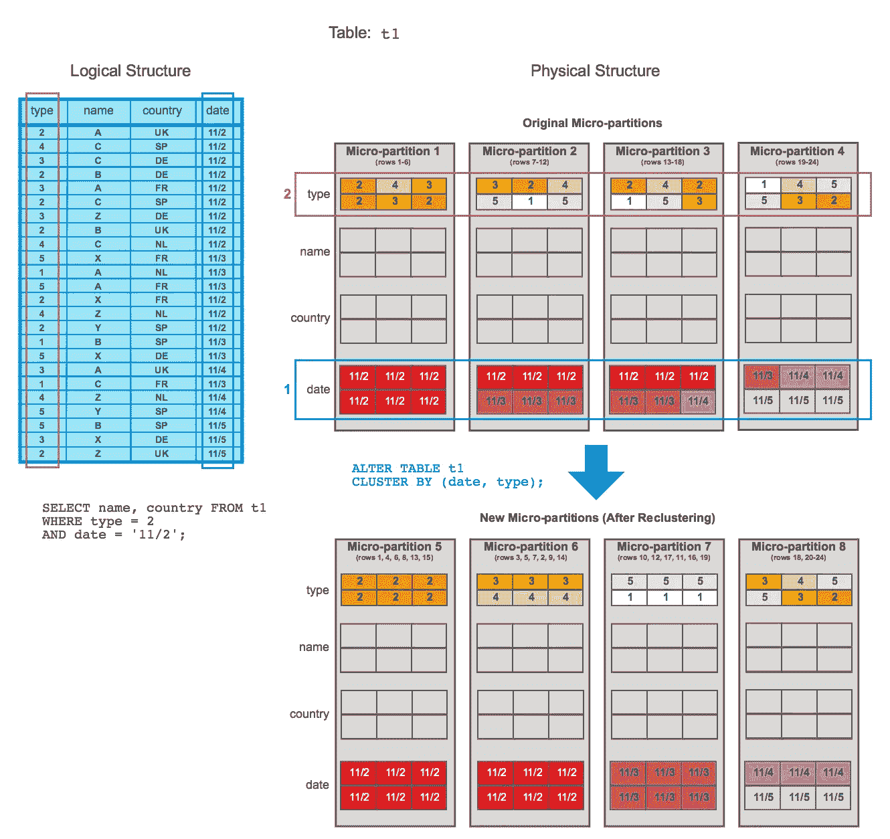

# 雪花:微分区、聚集键和 dbt

> 原文：<https://blog.devgenius.io/snowflake-micro-partitions-clustering-keys-dbt-b6cb1212dcbe?source=collection_archive---------4----------------------->


(来源:费萨尔·米沙)

这是对雪花的表格结构的一点深入探究。我们将关注以下内容:

1.  重要的定义，如微分区、修剪和聚类键
2.  实现聚类键时的策略和注意事项
3.  在 dbt 中使用聚类键

# **简介&托辞:**

雪花使用了一种不同于传统数据仓库的独特的分区形式，称为****‘微分区***，但这是什么意思呢？这是摘自[雪花文档](https://docs.snowflake.com/en/user-guide/tables-clustering-micropartitions.html)的微分区的官方定义:*

> *雪花表中的所有数据都被自动划分为微分区，这些微分区是连续的存储单元。每个微分区包含 50 MB 到 500 MB 的未压缩数据(注意，雪花中的实际大小更小，因为数据总是以压缩形式存储)。表中的行组被映射到单独的微分区，以列的方式组织。这种大小和结构允许对非常大的表进行非常细粒度的修剪，这些表可能包含数百万甚至数亿个微分区。*

**

*可视化微分区和修剪(来源:费萨尔米沙)*

*所以简单来说，*微分区*就像不可变文件(雪花中的存储单元)，每个文件都映射到一组行。当您有微分区时，您允许修剪。修剪是雪花中的一项技术，它允许查询扫描较少的微分区。修剪有助于减少扫描的数据量，从而优化表的查询性能。此外，雪花存储微分区中存储的所有行的元数据，例如分区中的最小值和最大值、总值和不同值的计数、空条目的数量。这些用于最大化查询性能。*

*某个表的查询**性能随时间下降怎么办？**如果我们想进一步**优化性能和成本**该怎么办？嗯，我们可以通过定义**集群键**来更有意识地*设置微分区的构成，这将有助于我们实现优化和降低成本的目标。**

***提示**:你可以随时查看 [*雪花查询概要*](https://docs.snowflake.com/en/user-guide/ui-query-profile.html) 来识别低效的剪枝，识别你的查询中潜在的瓶颈。修剪的效率可以通过观察下面所示的**表扫描**操作符中的*分区扫描*和*分区总计*统计数据得出。相对于*分区总数*，我们总是希望扫描的*分区数量更小。如果不是这样，您可以认为您的修剪效率低下。雪花文档的界面示例:**

**

*查询配置文件:右下方的修剪(来源:雪花)*

# *雪花中的聚类键*

**

*什么是聚类键？(来源:费萨尔·米沙)*

*聚集键的行为类似于列数据库中的索引，这允许通过使用修剪技术和更好的压缩提供过滤扫描来避免高成本的扫描。请看这张来自雪花文档的可视化图片，这是一个更直观的展示:*

**

*数据聚类的简单表示:“该表由 24 行组成，存储在 4 个微分区上，这些行在每个微分区之间平均分配。在每个微分区内，数据按列排序和存储”(来源:雪花)*

*添加聚集键确实有助于优化降级的表性能和长查询时间。这些问题的一些原因:*

*非常大/不断增长的底层表，在插入数据时数据的排序不理想，大量的 DML 导致表的**自然聚集**(例如，将 ETL 过程中的数据插入时间戳用作聚集键)随着时间的推移而退化。*

*成本优化也可以通过减少前面提到的表扫描来实现，或者有时如果您使用现成的解决方案，如[自动聚类](https://docs.snowflake.com/en/user-guide/tables-auto-reclustering.html)，成本会变得不可预测，您也会希望为此进行优化。*

*但是，非常重要的是要注意，聚集键并不适合所有的表，表应该遵守某些标准。*

***注意:**初始/自动聚类将导致雪花信用的使用。重新群集也会导致消耗配额，因此需要注意以下事项:*

**

*关于聚集键的注意事项(来源:费萨尔·米沙)*

***选择聚类键的一些策略:***

*Snowflake 强烈建议在选择集群键之前，在表上测试一组有代表性的查询，以获得一些性能基线**。然后可以使用一些[雪花系统聚类函数](https://docs.snowflake.com/en/sql-reference/functions/system_clustering_information.html) & [聚类深度](https://docs.snowflake.com/en/user-guide/tables-clustering-micropartitions.html#label-clustering-depth) & [其函数](https://docs.snowflake.com/en/sql-reference/functions/system_clustering_information.html)进行分析。***

*一个聚集键可以包含一个或多个列/表达式*

*   *雪花建议每个键最多 3-4 列*
*   *选择正确的列将显著提高性能*
*   *添加 3-4 个以上的按键会增加**成本**带来较少的好处*

***如何选择你的聚类键:***

**

*选择聚类键(资料来源:费萨尔·米沙)*

*[**注意:**](https://docs.snowflake.com/en/user-guide/tables-clustering-keys.html#important-usage-notes) 当选择一个 *VARCHAR* 类型列作为聚类键时，雪花将考虑前 5 个字节。所以你可以考虑使用一个像 [*substr()*](https://docs.snowflake.com/en/sql-reference/functions/substr.html) 这样的表达来更有针对性。*

*另外，注意时间戳和基数。考虑将时间戳转换为日期。*

*Snowflake 对你“重组”时会发生什么有一个很好的想象，摘自他们的[文档:](https://docs.snowflake.com/en/user-guide/tables-clustering-keys.html#reclustering-example)*

**

*微分区的重新聚类可视化。注意新的微分区以及它们是如何组织的(来源:雪花)*

> *首先，表`t1`由`date`跨微分区 1-4 自然地聚集。该查询(图中)需要扫描微分区 1、2 和 3。`date`和`type`被定义为聚类键。当表被重新聚集时，新的微分区(5-8)被创建。重新群集后，相同的查询只扫描微分区 5。*

# ***我的第一个成功故事***

*我有一个相对较宽的表，大约有 10 亿行，在 Looker 的语义层大量使用了聚合。Looker 的语义层充当雪花*表*顶部的*视图*。最常用的“Look”(单一可视化)基于上述表格进行报告，通常需要 6 到 7 分钟加载。正如你所想象的，由于这种可视化被许多人大量使用，我们需要优先优化它。*

*我决定根据最常用的*(where*filters)和连接中使用的内容，向我的 dbt 模型添加集群键。*

***结果:** *加载时间从 6–7 分钟减少到 30–40 秒。**

# *实现聚类键的方法*

*可以在创建表时使用 **CREATE TABLE** 命令或稍后使用 **ALTER** 命令定义一个聚类键。*

```
*/* clustering by a column */ 
alter table your_table_name cluster by (clustering_column_name) ;

/* clustering by an expression */ 
alter table your_table_name cluster by (left(clustering_column_name,2)) ;*
```

# *使用 dbt 的聚类键*

*您也可以使用 **dbt 模型配置**来定义聚类键。你可以在这里了解更多。这是我通常使用的方法，它可能看起来像这样:*

```
*{{config(

        materialized ='table',
        unique_key = 'unique_id',
        cluster_by=['category','city','created_at']
    )
}}

WITH first_cte AS (

   SELECT 

      user_id,      
      transaction_id,
      unique_id,
      category,   -- 60 distinct values  
      city,       -- 200 distinct values
      created_at, -- date (daily) column 
      revenue

   FROM {{ ref ('raw_customer_txs') }} 
   WHERE 1=1

),
...*
```

*请注意模型配置中 **cluster_by** 字段上方的代码片段。这就是你如何定义你选择的聚类键。*

*另一件需要注意的重要事情是**在 **cluster_by 配置中的列的顺序**，**我们从具有*最低*基数(唯一值)的列开始，即**“类别”(60 个值)，**之后是**城市(200 个不同值)**等等。在这个例子中，这些聚集键经常用于跨不同数据模型的连接，并且被业务涉众使用 BI 工具大量用于过滤。*

***提示:**确保分类列中每个唯一值的计数分布合理。举例来说，如果这些计数偏向十个值中的一个或两个值，那么它被认为是无效的。*