# 雪花性能:雪花搜索优化服务与表聚类

> 原文：<https://blog.devgenius.io/snowflake-performance-snowflake-search-optimization-service-vs-table-clustering-5b111a58e1b1?source=collection_archive---------1----------------------->

尼古拉斯·霍伊泽在 [Unsplash](https://unsplash.com?utm_source=medium&utm_medium=referral) 上拍摄的照片

在这篇博客中，我们将深入研究搜索优化服务和表聚类。我们将探索和比较这两种特性的结果。

如果你没有看过我在以下个别主题上的博客，我会分享我最近在这些主题上的博客供你参考。

## [雪花性能:搜索优化服务—第一部分](https://medium.com/@rajivgupta780184/snowflake-performance-search-optimization-service-part-1-8d42b4a96b14?source=your_stories_page-------------------------------------)

## [雪花性能:搜索优化服务—第二部分](https://medium.com/@rajivgupta780184/snowflake-performance-search-optimization-service-part-2-382714956588?source=your_stories_page-------------------------------------)

## [雪花微分区&表聚类](https://medium.com/snowflake/snowflake-micro-partitions-table-clustering-74beabaf780f?source=your_stories_page-------------------------------------)

既然你已经浏览了我的博客，那么你已经了解了我们将要比较的这两个特性的所有基础知识。

**第一步:让我们确定包含大量数据的表以及下面的数据集。**

1.  具有**高基数**(即不同值)的列，可以支持**点查找查询用例。**
2.  包含**低基数**(即冗余数据)的列，可以对其进行分组以支持表集群用例。

我从雪花样本数据库中识别出一个符合上述条件的**订单**表。我已经使用了 [APPROX_COUNT_DISTINCT](https://docs.snowflake.com/en/sql-reference/functions/approx_count_distinct.html) 函数来确定任何列的近似不同值。同时，我还获取了表中的总行数，以查看总行数与不同行的比例，从而更好地了解数据在表中是如何绘制的。如果您看到下面的输出订单表有**15 亿** **行**，其中 **O_ORDERKEY** 有**14.9 亿个大约**的唯一值。同时 **O_ORDERDATE** 有冗余值，有**高分组数据**满足表分组用例。

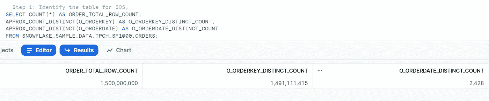

**步骤 2:为所有测试创建基础数据集**

现在，我将使用上面的 ORDERS 表为我的测试用例创建一些基表。我将对数据进行随机排序，这样我们的基本数据集就不会有任何自然的聚类优势，我们的用例也足够公平，可以评估这两种情况。我将把这个表命名为 ORDERS_WITHOUT_ANY_FEATURE。

现在我们已经创建了基表，我们将使用同一个表为不同的用例创建所有其他的表，这样在我们开始测试之前，我们就有了相同的数据集作为基表。

我为集群用例创建了两个基础表，使用了两个不同的列，一个列有唯一的数据，另一个列有熟悉的数据。

我还使用同一个基表为 SOS 测试用例创建了一个基表。

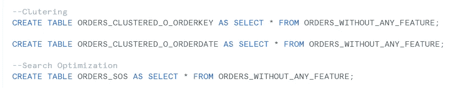

现在我们已经创建了我们的基表，让我们在继续下一步之前更好地了解一下元数据。你可以看到我们所有的基本表有 15 亿行，目前什么都没有启用。每个表的大小约为 41.0 GB。

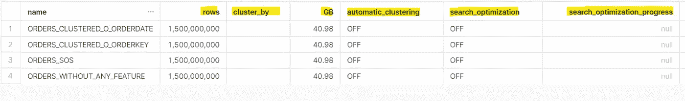

**步骤 3:让我们在基表上验证和应用表聚类。**

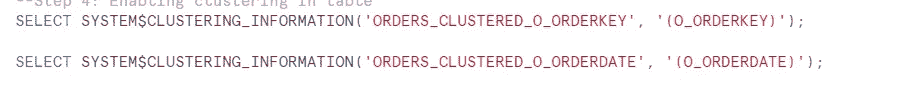

验证聚类信息

可以看到**SYSTEM＄CLUSTERING _ INFORMATION**函数已经给出了这个组合(O_ORDERKEY)不适合聚类的警告。我们将忽略这条消息，并为我们的用例创建集群。**SYSTEM $ CLUSTERING _ INFORMATION**函数已经共享了表的当前状态，但是会在聚类后改变。我们将在稍后看到这一点。

现在，当我们尝试查看新组合(即 O_ORDERDATE)的集群信息时，我们没有看到任何警告或警报，但我们确实看到所有数据都驻留在同一个微分区中。我们将忽略这条消息，并为我们的用例创建集群。**SYSTEM $ CLUSTERING _ INFORMATION**函数已经共享了表的当前状态，但是它会在聚类后改变。我们将在稍后看到这一点。

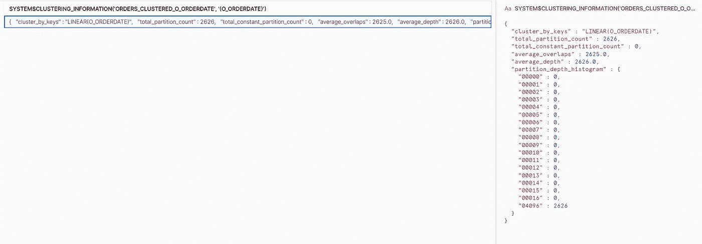

现在，我已经在两个表上启用了自动集群。

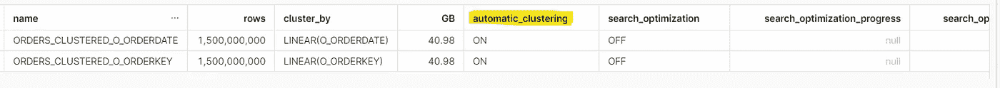

稍后，让我们再次检查两个基表的聚类信息，您将看到应用聚类后的差异。

现在，您可以看到数据已经根据为聚类选择的聚类键进行了分布。

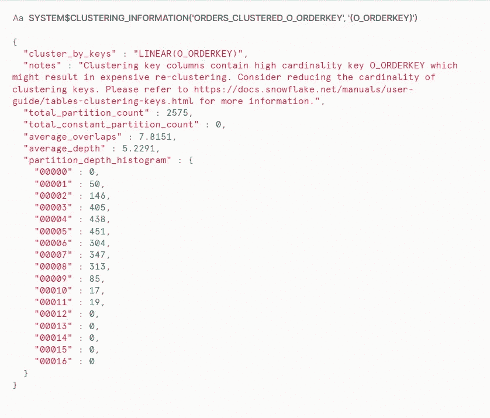

**系统＄CLUSTERING _ INFORMATION(' ORDERS _ CLUSTERED _ O _ order key '，'(O_ORDERKEY)**

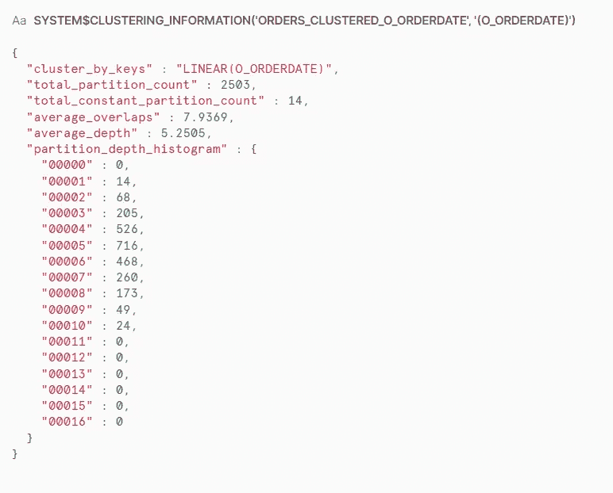

SYSTEM $ CLUSTERING _ INFORMATION(' ORDERS _ CLUSTERED _ O_ORDERDATE '，'(O _ ORDERDATE)

在聚类之后，我们看到，在两种情况下，数据被更好地压缩，表的大小从 41 GB 减少到 38 GB 以下。

**步骤 4:验证并启用表的搜索优化服务。**

让我们看看启用 SOS 的预计成本。请记住，这些是估计成本，而不是实际成本。雪花尽力给出更接近的估计值。

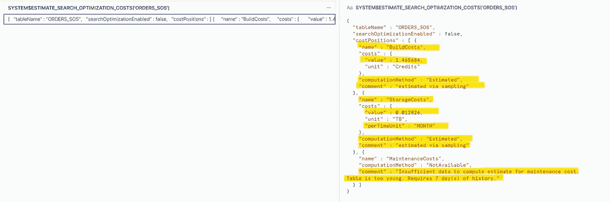

为表启用搜索优化服务，并保留两个列的相等(默认)选项。

由于 SOS 服务在后台运行，根据数据量需要一些时间来使 SOS 100%启用。当 search _ optimization _ progress = 100%时，可以验证这一点。

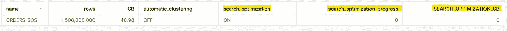

同时，让我们通过描述来查看 SOS 细节。您可以看到这两列都启用了 SOS，但是为这两列构建访问路径需要一些时间。

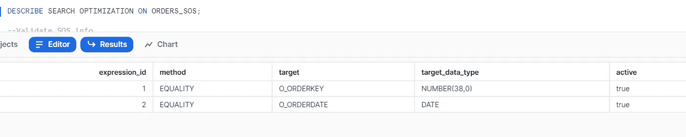

几分钟后，我们看到 SOS 100%启用，SOS 搜索访问路径功能占用了大约 2.64 GB 的存储空间来构建高效的平等搜索访问路径。

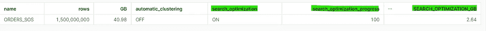

**步骤 5:让我们看看相同的谓词(过滤器)在所有不同的用例中是如何执行的，并跟踪所有用例以获得性能摘要。**

我们使用 **X-SMALL** 单集群仓库进行所有测试比较。我们暂停并重新启动我们的仓库，以避免任何形式的缓存。

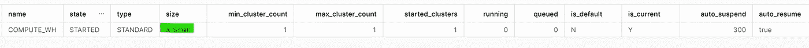

我们将禁用结果缓存，以克服缓存带来的任何性能提升。

> ALTER SESSION SET USE _ CACHED _ RESULT = FALSE；

**测试用例#1 —在 ORDERS_WITHOUT_ANY_FEATURE 表中运行查询以确定性能基准。**

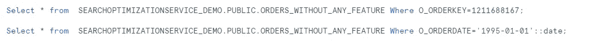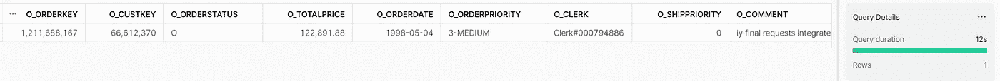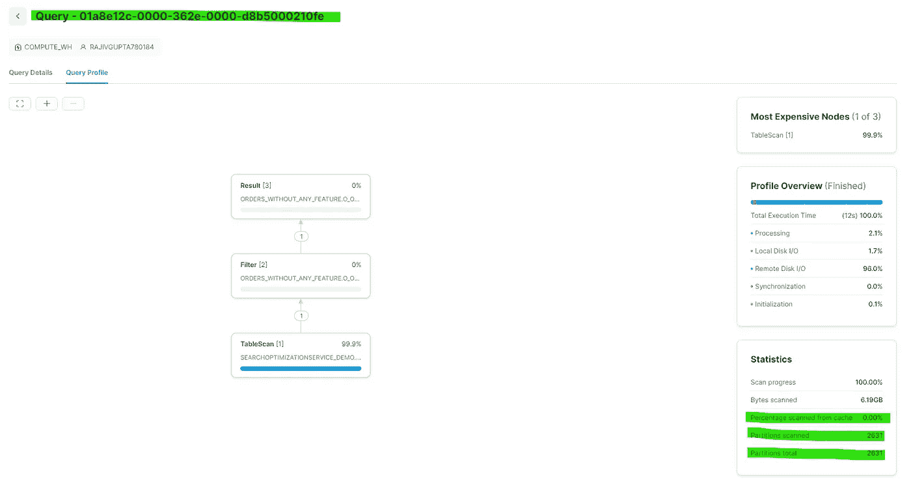

01a8e 12c-0000–362e-0000-d8b 5000210 Fe

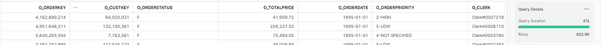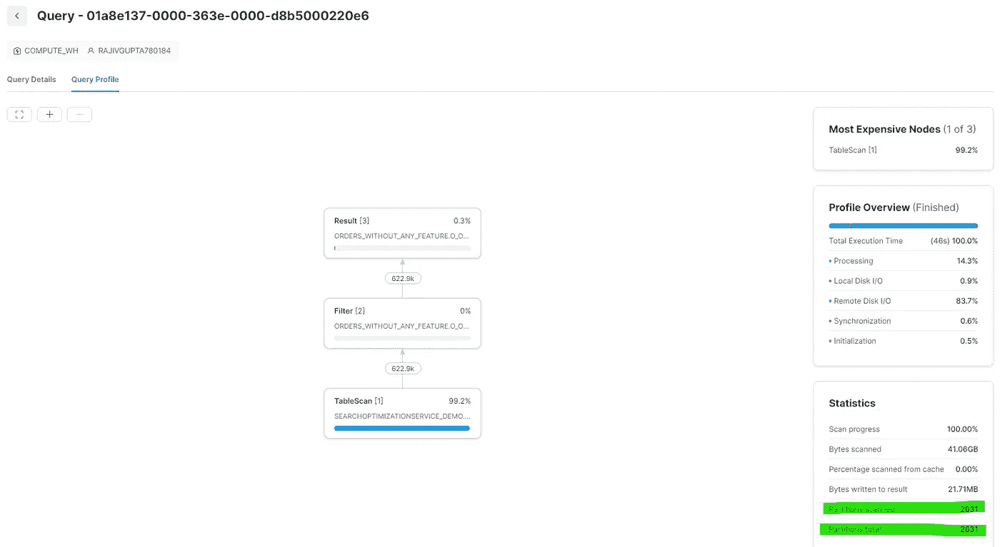

01a8e 137–0000–363 e-0000-d8b 5000220 E6

**测试用例#2 —在 ORDERS_CLUSTERED_O_ORDERKEY 表中运行查询来跟踪性能。**

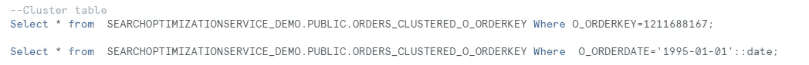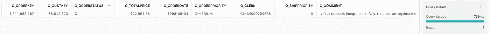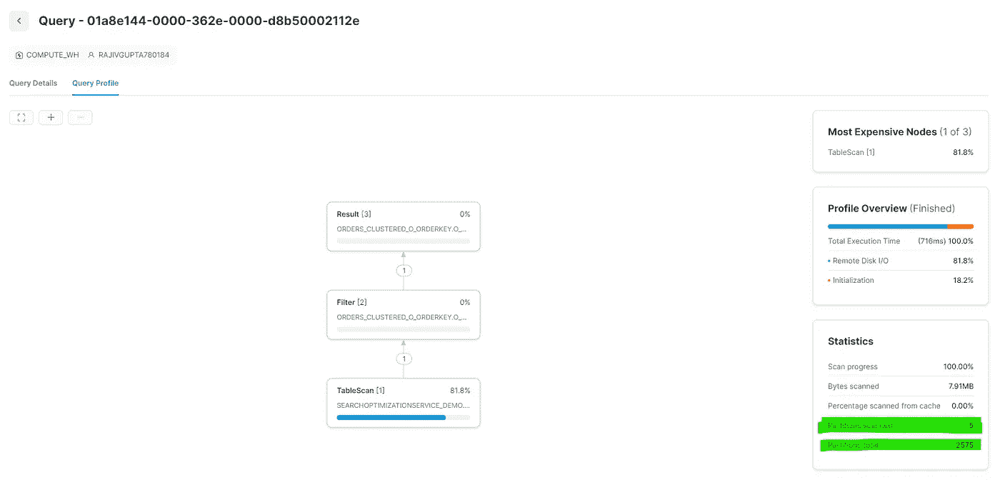

**01a8e 144–0000–362e-0000-d8b 50002112 e**

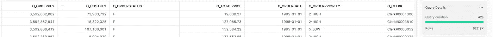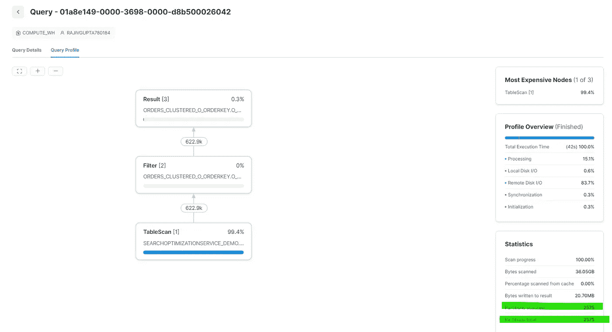

**01a8e 149–0000–3698–0000-d8b 500026042**

**测试用例#3 —在 ORDERS_CLUSTERED_O_ORDERDATE 表中运行查询来跟踪性能。**

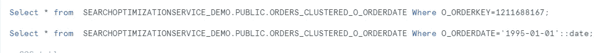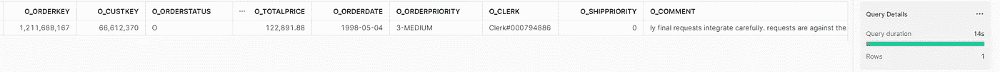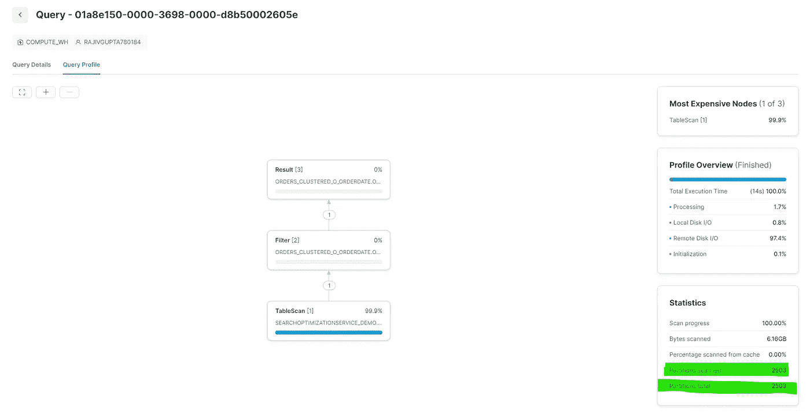

01a8e 150–0000–3698–0000-d8b 50002605 e

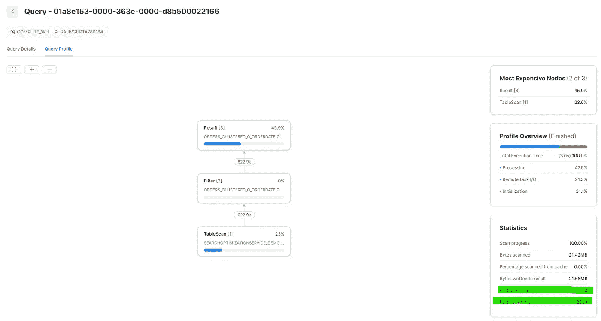

**01a8e 153–0000–363 e-0000-d8b 500022166**

**测试用例 4——在 ORDERS_SOS 表中运行查询来跟踪性能。**

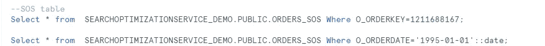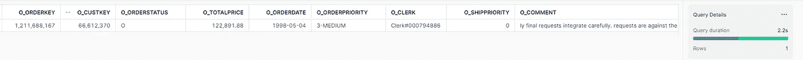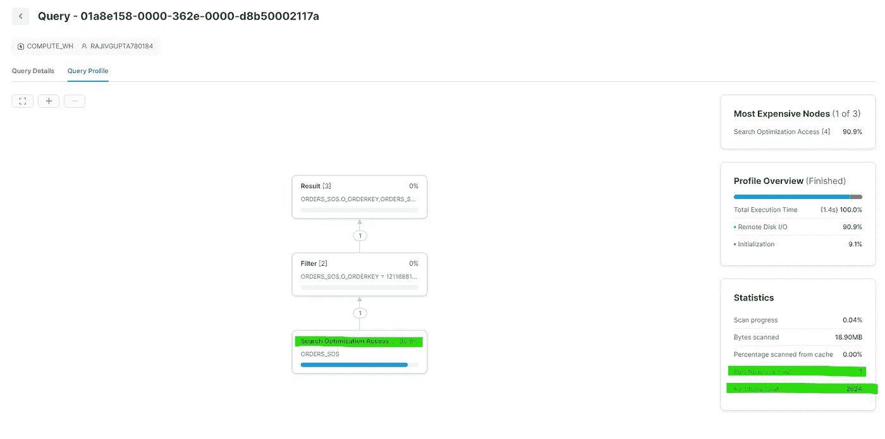

01a8e 158–0000–362e-0000-d8b 50002117 a

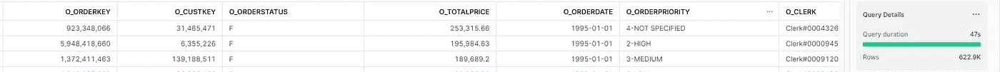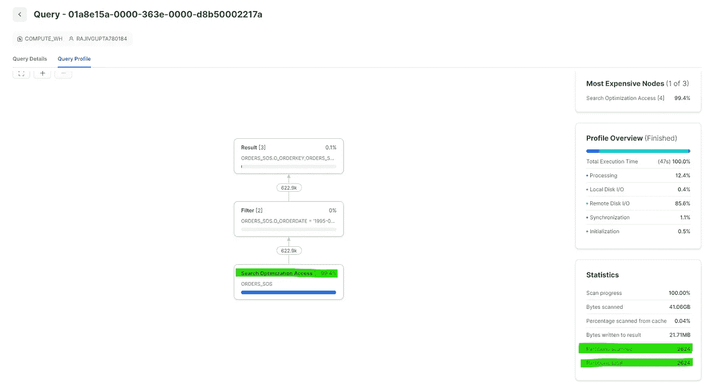

**01a8e 15a-0000–363 e-0000-d8b 50002217 a**

既然我们已经看到了所有查询的性能，现在是时候根据所有元数据总结我们的发现了。

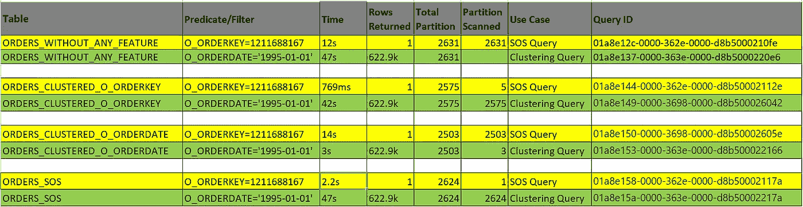

所有执行的摘要

**总结:**

1.  **针对所有表上的 O_ORDERKEY=1211688167 列运行的查询。**

a.当它在 O_ORDERKEY 上集群化时，它**花费了 769 毫秒，扫描了 2575 个分区中的 5 个分区，并返回了 1 行。**

b.当在 O_ORDERKEY 上启用 SOS 时，它**花费 2.2 秒扫描了 2624 个分区中的 1 个分区，并返回 1 行。**

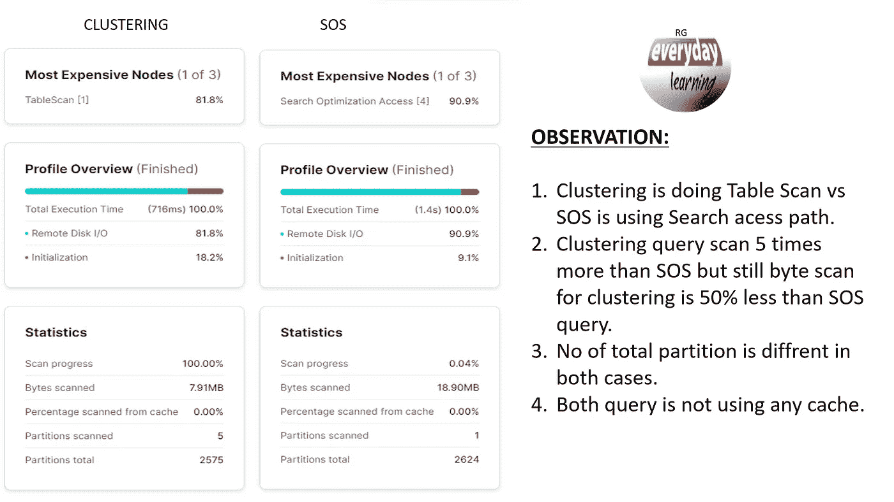

查询配置文件比较

虽然我们在上面的例子中看到集群列在时间比较的情况下表现良好，但是它扫描的分区比 SOS 服务扫描的分区多 5 倍。每当数据发生任何变化时，对高基数列进行聚集可能会导致代价高昂的重新聚集。启用 SOS 的表在这种情况下也表现不错，但不如预期，尽管它在这种最佳情况下应该表现得更好。其他查询花费的时间更多，而且几乎要进行全表扫描，因此它们无法进行比较。

**2。针对所有表上的 O _ ORDERDATE = ' 1995–01–01 '列运行的查询。**

a.当它在 **O_ORDERDATE** 上聚集时，它**花费 3 秒扫描了 2503 个分区中的 3 个分区，并返回 622.9k 行。**

b.当 SOS 在 **O_ORDERDATE** 上启用时，它**花费 47 秒扫描了 2624 个分区中的 2624 个分区，并返回 622.9k 行。**

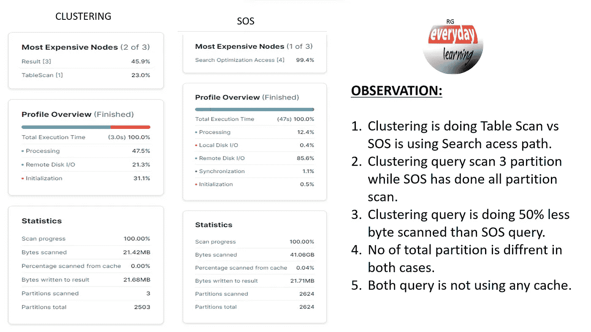

查询配置文件比较

毫无疑问，胜出者是聚集在 **O_ORDERDATE 列**上的表，因为这是最适合聚集表的场景，它提供了最佳性能，而 SOS 表查询的性能几乎与任何其他场景相同，因为这种查询不适合 SOS。在这里，查询返回了大量带有选定过滤器的数据，这不是 SOS 的最佳选择。

希望这个博客能帮助你深入了解雪花的这两个特性。如果你对此有任何疑问，欢迎在评论区提问。如果你喜欢这个博客，请鼓掌。保持联系，看到更多这样的酷东西。谢谢你的支持。

**你可以找我:**

**订阅我的 YouTube 频道:**[https://www.youtube.com/c/RajivGuptaEverydayLearning](https://www.youtube.com/c/RajivGuptaEverydayLearning)

**跟我上媒:**【https://rajivgupta780184.medium.com/ 

在推特上关注我:https://twitter.com/RAJIVGUPTA780

**在 LinkedIn 跟我连线:**[https://www.linkedin.com/in/rajiv-gupta-618b0228/](https://www.linkedin.com/in/rajiv-gupta-618b0228/)

**#继续学习#继续分享# RajivGuptaEverydayLearning # SnowflakeDataSuperhero # RajivGupta**

**参考资料:**[https://docs.snowflake.com/en/](https://docs.snowflake.com/en/)