# 雪花安全:密钥对认证和轮换

> 原文：<https://blog.devgenius.io/snowflake-security-key-pair-authentication-rotation-a2bf81fda6f5?source=collection_archive---------4----------------------->

马科斯·费雷拉在 [Unsplash](https://unsplash.com?utm_source=medium&utm_medium=referral) 上的照片

在这篇博客中，我们将了解如何增强认证安全性，作为基本认证(即用户名和密码)的替代方案。有多种方法可以连接或保护通往雪花的道路。如果你看到下图，所有可能的方法都列在下面。

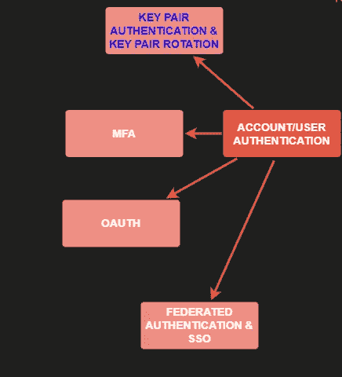

雪花认证

在这篇博客中，我们将重点关注密钥对认证和密钥对轮换(手动)。

# 密钥对认证的用例是什么？

如果您不想对您的服务帐户使用基本(用户名和密码)身份验证，您的集成应用程序将使用 snowsql CLI 或支持的驱动程序或连接器使用该帐户连接到雪花。

您希望为您的客户端应用程序提供更加增强和安全的身份验证方式。

# 什么是密钥对认证？谁能用这个？

密钥对身份验证是增强的身份验证安全性或从支持的客户端连接到雪花的替代方式。在密钥对身份验证中，用户使用私有-公共密钥对进行身份验证，而公共密钥驻留在具有各自用户设置的雪花内部，而私有密钥安全地存储在他们想要连接到雪花的客户端。

这种认证方法至少需要一个 **2048 位 RSA 密钥对**。您可以使用 OpenSSL 生成**隐私增强邮件(即 PEM)私有-公共密钥对。**

这种身份验证方式不适用于 Web UI 连接。这仅适用于使用连接器或驱动程序或 Snowsql CLI 连接到雪花客户端。

这种连接方式更加安全，因为我们不必使用密码进行连接，而从任何支持的客户端进行连接时，密码可能容易受到攻击。

# 密钥对身份验证支持哪些客户端？

雪花支持加密和未加密的私钥来连接大多数客户端，除了 **Go 驱动程序**只支持加密的私钥。更多详情见下图:

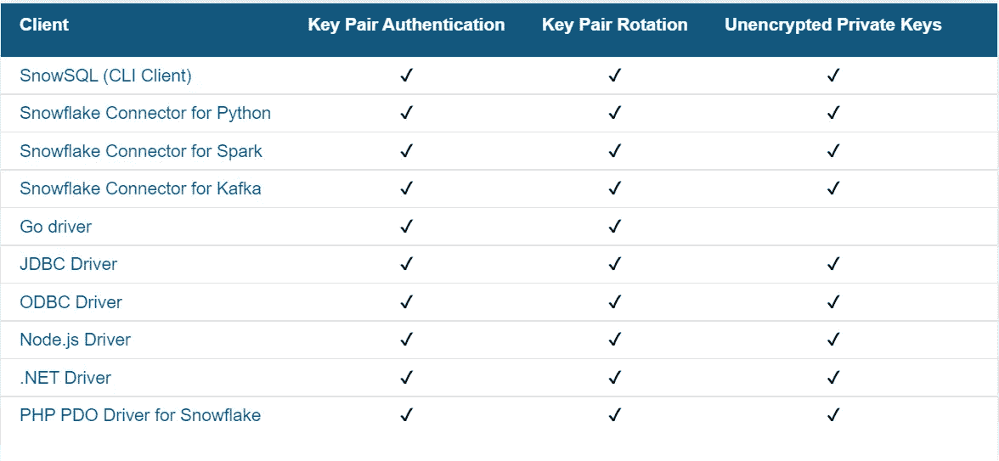

来源:雪花

# 我们如何在雪花中为我们的客户设置密钥对？

以下是在雪花中进行这种设置的高级步骤。

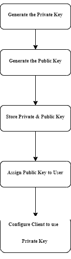

# 来个快速演示怎么样？

## 步骤 1:我们将首先提供环境和用户，以开始我们的演示。将计算赋予公共角色，让我们的生活变得轻松。

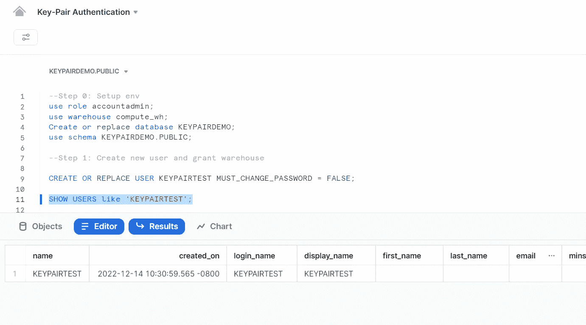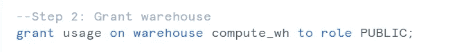

## 第二步:下载 OpenSSL，并将解压后的文件夹保存在任何你有读写权限的驱动器中

## 步骤 3:设置以下两个环境变量

我是在我的 Win 10 笔记本电脑上做的，所以我在那里设置了环境变量。

**OPENSSL _ CONF**=<OPENSSL 路径>\ bin \ OPENSSL . CNF
**RANDFILE**=<OPENSSL 路径> \bin\。rnd

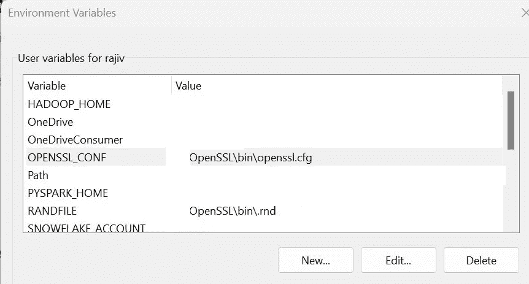

## 步骤 4:打开命令提示符并生成私钥的加密版本。请选择严格的短语

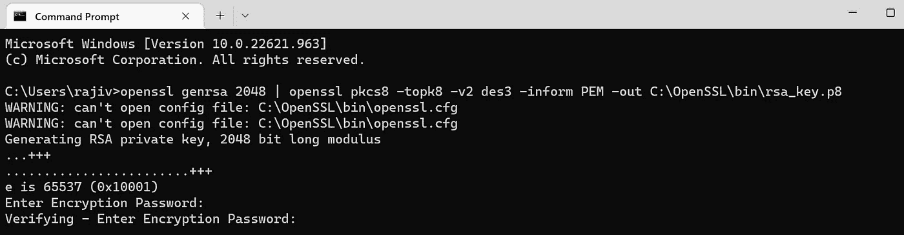

可以看到 **rsa_key.p8** 私钥是在指定的输出文件夹中生成的。

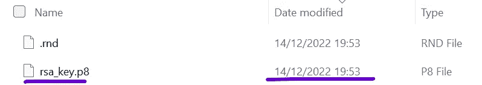

## 步骤 5:生成一个公钥&验证它看起来像什么

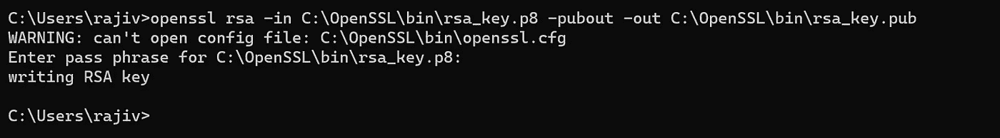

可以看到 **rsa_key.pub** 公钥是在指定的输出文件夹中生成的。

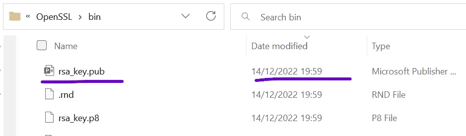

这是打开时公钥文件的样子。pub 文件。

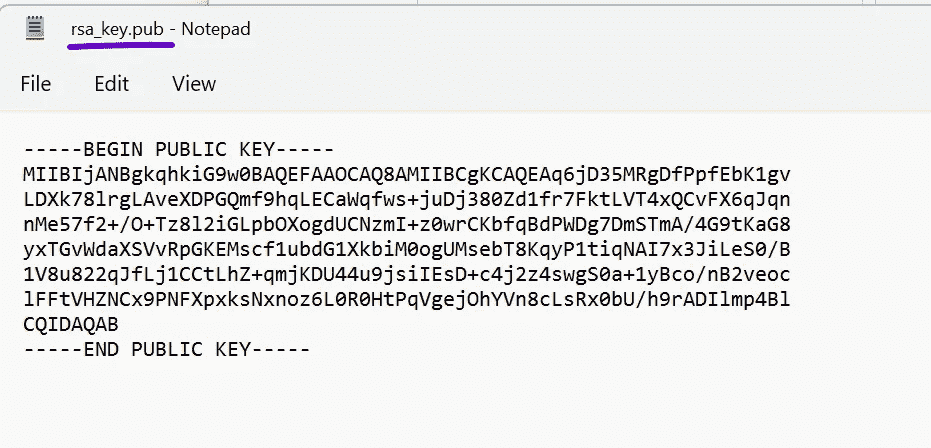

## 步骤 6:将公钥分配给雪花密钥对测试用户

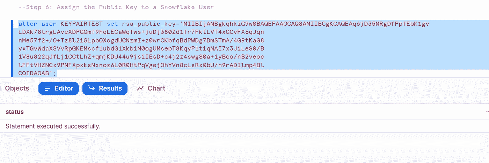

## 步骤 7:验证用户 RSA 设置是否正确，以及用户的公钥指纹

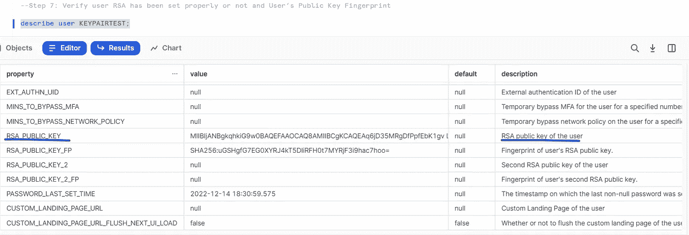

## 步骤 8:使用密钥对认证通过 Snowsql 连接

在从 CLI 连接时，您必须确保包含— private-key-path 参数，并键入您在生成私钥时使用的正确私钥密码。宾果，然后你登录没有密码。您也可以将密码留空，但建议您保留一个复杂的密码，并使用文件权限保护您的私钥文件。

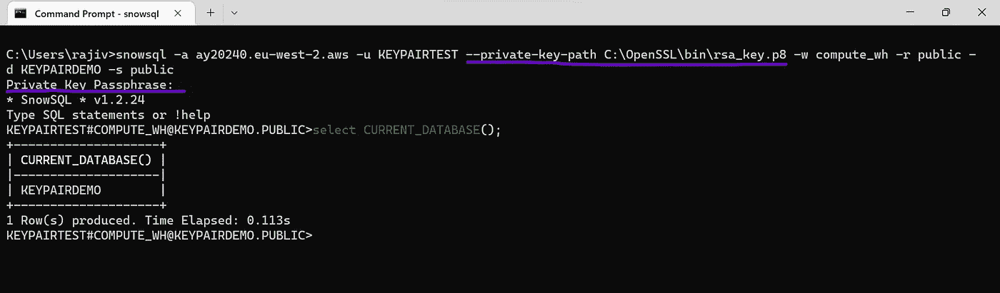

## 如何旋转密钥对值？

重复上面演示中的**步骤 4、5，重新生成私有&公钥。**

## **步骤 1:** 改变用户 **rsa_public_key_2** 字段，而不是上面演示的 **rsa_public_key 字段**。这将有助于在下一步中通过从 **rsa_public_key** 字段中移除旧密钥来轮换密钥

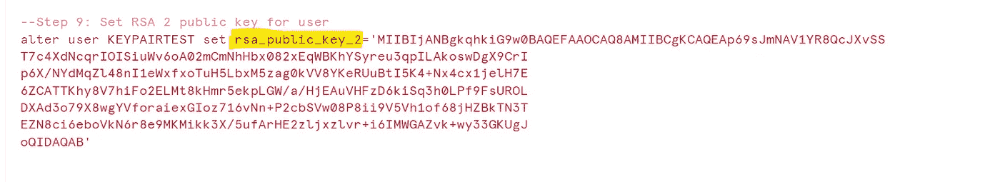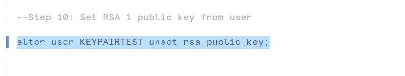

## **步骤 2:** 验证哪个 RSA 密钥已设置给用户。

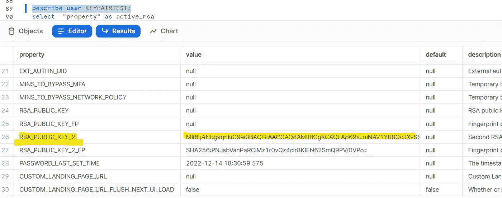

## 步骤 3:使用密钥对认证通过 Snowsql 连接

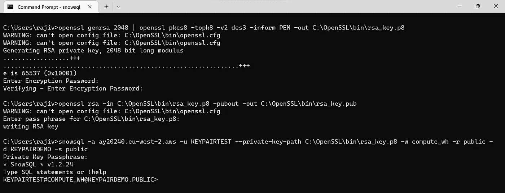

希望这篇博客能帮助你深入了解即将到来的**密钥对认证和轮换特性工程**。如果你对此有任何疑问，欢迎在评论区提问。如果你喜欢这个博客，请鼓掌。保持联系，看到更多这样的酷东西。谢谢你的支持。

**你可以找我:**

**订阅我的 YouTube 频道:**[https://www.youtube.com/c/RajivGuptaEverydayLearning](https://www.youtube.com/c/RajivGuptaEverydayLearning)

**跟我上媒:**[https://rajivgupta780184.medium.com/](https://rajivgupta780184.medium.com/)

**在推特上关注我:**[https://twitter.com/RAJIVGUPTA780](https://twitter.com/RAJIVGUPTA780)

**在 LinkedIn 跟我连线:**[https://www.linkedin.com/in/rajiv-gupta-618b0228/](https://www.linkedin.com/in/rajiv-gupta-618b0228/)

**#继续学习#继续分享# RajivGupta everyday learning # SnowflakeDataSuperhero # RajivGupta**