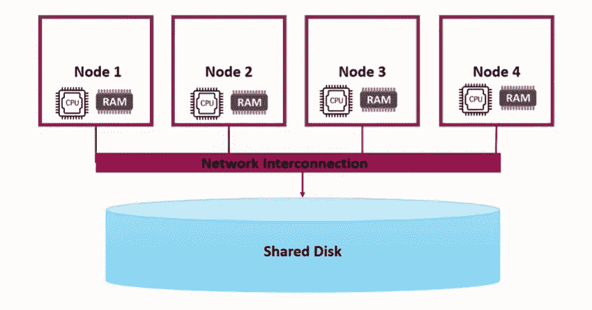
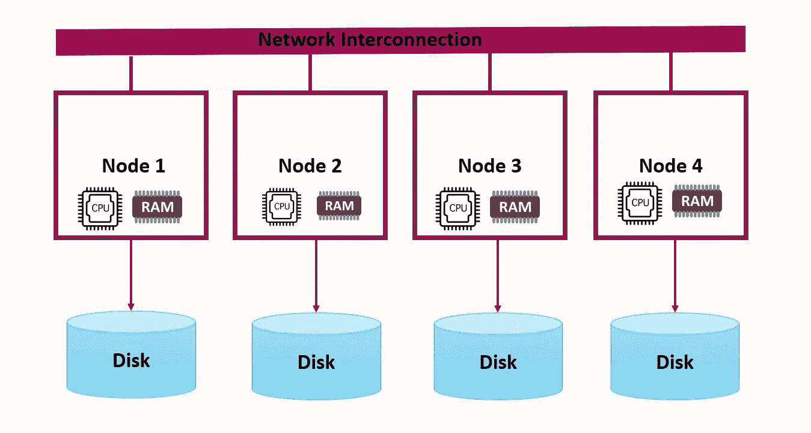
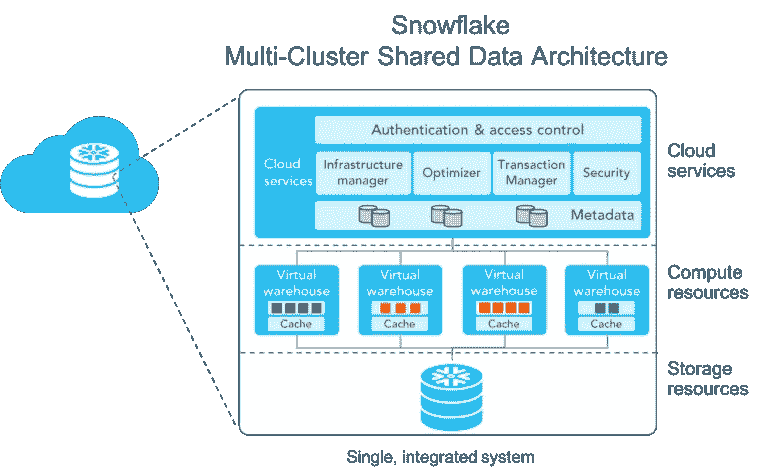
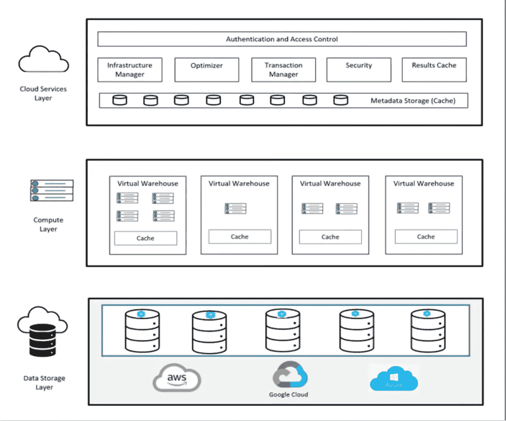
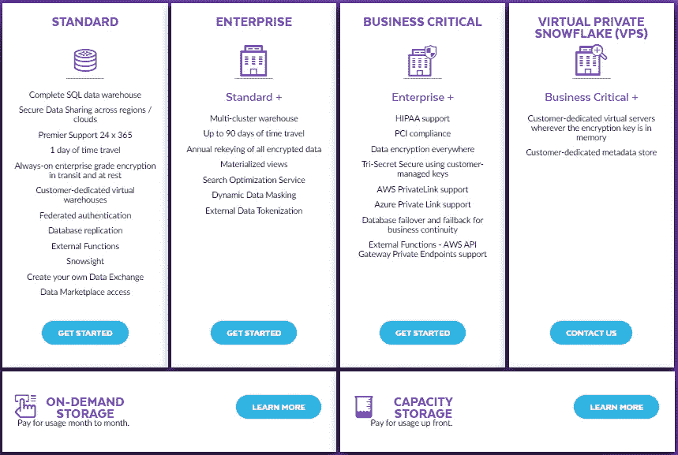

# 雪花系列-第 1 部分:雪花建筑深潜

> 原文：<https://blog.devgenius.io/snowflake-series-part-1-snowflake-architecture-deep-dive-3a9ca082a531?source=collection_archive---------3----------------------->

雪花标志

**什么是雪花？** 简单来说，我们可以说雪花是为云构建的数据仓库。雪花是一个 SaaS 平台，运行在所有三个主要的云提供商(亚马逊网络服务、微软 Azure 和谷歌云平台)上，以管理结构化和非结构化数据。它服务于数据仓库、数据工程和数据科学用例。

S nowflake 是一个基于云的数据仓库，由三位数据仓库专家于 2012 年创建，他们曾就职于甲骨文公司。

工作和架构与下面讨论的传统仓库不同，这使得它成为云数据仓库的市场领导者之一。它是唯一一个以服务形式交付的云无关数据仓库。

它以软件即服务的形式提供，这意味着我们无需担心此类实施的硬件或软件需求。在内部，它利用我们部署的云中可用的计算和存储选项。

**为什么是雪花？** 在讲述为什么雪花之前，我们将了解传统的分布式系统架构及其弊端。

***共享磁盘架构***它是分布式系统可用的架构之一，其中每个节点共享存储磁盘，但它有自己的内存/CPU。

共享磁盘架构

该系统的主要优势是读写操作一致且高效，因为它没有任何分布式存储。

在这个共享磁盘系统中，多个节点或多个计算资源(如 BI 仪表板、IDE、ETL 工作负载等)访问单个存储磁盘。当我们装载越来越多的 ETL 工作负载时，系统变得非常慢，因为只有一个存储系统。这也产生了单点故障。

主要缺点是分布式锁定和两阶段提交，因为所有人都共享公共存储。

****

**无共享架构**

**在这里，存储和计算是紧密联系在一起的。添加越来越多的节点可以水平扩展，但是计算和存储不能独立扩展。
随着负载的增加，体系结构会横向扩展，管理成本也会增加。
这里的主要缺点是，由于数据需要在网络上被混洗，当有大量数据需要在节点上被混洗时，这将是一个开销。
Ex: Hadoop、Cloudera Impala、Cassandra 等。**

**但是，如果我们考虑当今的分布式体系结构，它们更多的是存储和计算相互分离。**

**现在雪花来了…**

**雪花的独特架构遵循共享磁盘和无共享架构的混合方法，即**多集群共享数据架构**。
与传统方法相比，最大的变化是分离存储和计算，即独立扩展它们。**

****

**雪花建筑(来源:youtube)**

**雪花架构被称为三层架构，我们将在下面讨论那三层。**

****1。云服务层** :
这也被称为全球服务层，它被称为雪花的**大脑**，因为这一层管理雪花中的所有查询处理和管理。这一层独立扩展，跨多个可用性区域运行，雪花确保了它的高可用性。
这一层的服务包括:**

*   **基础设施管理**
*   **认证和访问控制**
*   **元数据管理(零拷贝克隆、时间旅行、数据共享、缓存)**
*   **事务管理**
*   **安全性**
*   **查询处理管理、优化和数据清理**

**该层的定价包含在雪花定价中，但如果使用量比计算层增加 10%,则只对其计费。费用按 UTC 时区每天计算。关于定价的更多细节可以在这里找到[。](https://www.snowflake.com/pricing/)**

****2。计算层:** 这也称为查询处理层或虚拟仓库层。所有的查询处理都在这一层使用一个叫做虚拟仓库的概念来执行。 ***虚拟仓库*** 是由多个节点组成的计算集群。这些节点执行大规模并行处理，以提供更快的查询处理和数据加载。它们可用于加载数据或运行查询，能够同时独立执行这两项任务，并且可以在不干扰查询执行的情况下随时扩展/缩小和暂停集群。重新调整完成后，所有后续查询都将利用新创建的大小仓库。
我们可以创建一个或多个不同节点和不同大小的虚拟仓库，如下所述，每个虚拟仓库将独立执行。
每个虚拟仓库都有自己的计算集群(节点组合),并在底层云提供商上创建。
X-小型 1 节点群集，小型 2 节点群集…4X-大型 128 节点群集。
最多 10 个节点的多节点集群，即具有 128 个节点的集群，即 128*10 = 1280 个节点。**

****

**雪花虚拟仓库大小**

**集群的扩展可以通过两种方式完成
(i)在容量增加的情况下调整现有集群的大小。
(ii)向仓库添加更多的集群。**

**虚拟仓库可以访问相同的数据存储或数据层。
雪花支持多达 10 个虚拟仓库的自动扩展多集群仓库。
对于 AWS，它是 EC2 实例，对于 Azure，它是 Azure VM，对于 Google，它是 GCP VM。**

**这一层的定价是按秒计费，即执行时间和计算机能力决定整个成本。应该有严密的滴定来得到准确的数字。**

****3。存储层:** 在这一层中，雪花存储了数据库中的所有数据，每个数据库都包含一个雪花实例中的对象。这些对象可以是表和视图。
你可以存储任何结构化的关系数据或者半结构化的非关系数据。
雪花使用 AWS S3、Azure Blob 和 Google Cloud Bucket 等各自的 can 存储来存储数据。一旦数据加载到系统中，Snowflake 会将其重新组织为优化的列格式(仅适用于 snowflake ),并以微分区的形式存储。
当数据加载到雪花中时，它将数据组织成优化的、压缩的、列格式，并将优化的数据存储在云存储中。雪花使用列存储格式来存储数据，这提高了查询性能并降低了存储成本。
雪花管理文件大小、结构、压缩、元数据、统计和数据存储的其他方面。
在存储层，默认情况下数据总是被加密和压缩，数据使用 AES 256 加密进行加密。**

**存储的定价将基于压缩数据而非未压缩数据的每日平均大小。任何已删除但可恢复的数据都将收费。
存储成本包括
(i)存储在永久表中的持久数据。
(ii)用于批量加载/卸载数据的暂存文件。**

****

**雪花层(来源:youtube)**

****雪花查询的生命周期:****

**用户可以通过 snowflake 提供的任何受支持的客户端/连接器(经典 Web UI、SnowSQL、JDBC、ODBC、SnowCD、Spark 连接器、Node.js 驱动程序)提交查询。然后，云服务层根据用户提供的指示(x-small 或 x-large)扩大/缩小仓库，并相应地执行。
云服务层首先创建一个会话，并使用 MFA 和 IP 地址(如果适用)检查用户凭证是否有效，以使用雪花帐户。
一旦认证完成，然后
i)查询的逻辑计划被创建。
ii)如果相应的用户具有访问对象的权限，则验证查询中的所有对象和操作，包括仓库。
iii)然后生成优化的查询计划并提交给计算机层。
iv)如果集群关闭或根据需要加速/减速，它也会恢复集群。最后，计算层从存储层读取数据，并将结果提供给用户。
vi)结果也将被缓存 24 小时，如果我们再次运行相同的查询，结果将自动从缓存的数据中获取。**

****

**查询生命周期**

**雪花提供了以下多个版本，组织可以根据自己的需要和用途进行选择。根据版次和地区成本会相应调整，存储在计算整体成本中也起着重要作用。**

****

**雪花版**

**以下是雪花的一些独特之处**

*   **时间旅行**
*   **压缩存储成本**
*   **数据缓存**
*   **数据共享**
*   **虚拟仓库**
*   **零克隆拷贝**
*   **微观分割**
*   **7 天故障安全**
*   **跨云数据库复制**

****感谢阅读并鼓掌如果这篇文章是有用的，对于改进或反馈请评论，更多的文章在未来，请关注并订阅支持我。****