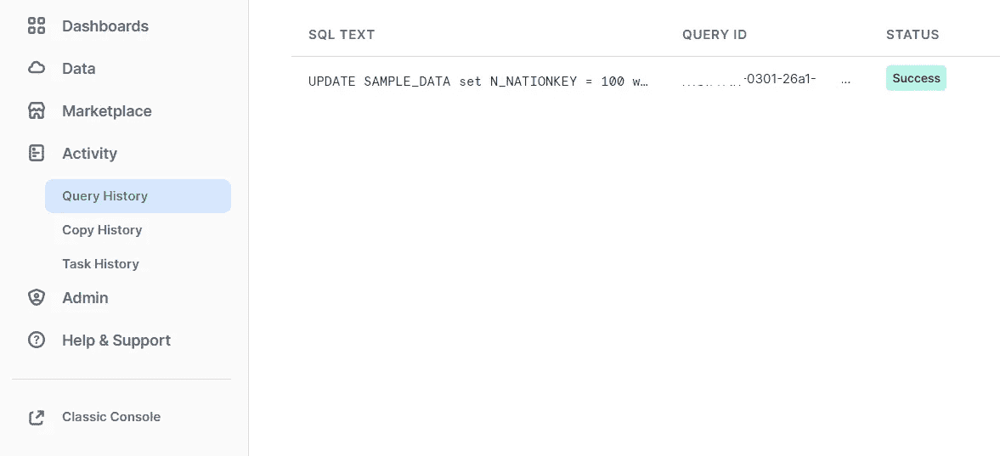
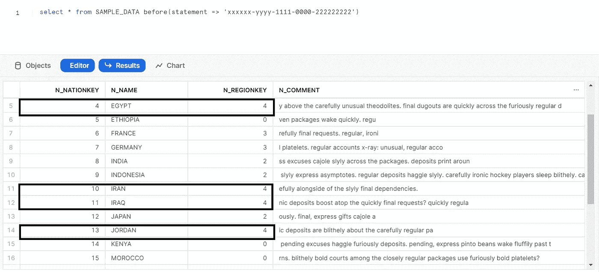

# 雪花系列第二部分:时间旅行和故障安全

> 原文：<https://blog.devgenius.io/snowflake-series-part-2-time-travel-and-fail-safe-5d6f50b9f519?source=collection_archive---------4----------------------->


时间旅行

# 时间旅行

ime Travel 是雪花数据仓库中的一个独特功能，它允许我们访问过去某个时间点的历史数据。我们可以访问历史数据，直到时间旅行期间，之后，数据被移动到雪花故障安全。时间旅行期也称为保留期，直到我们可以访问历史数据。

特别是在 PROD 环境中，这个特性非常有用，如果发生任何错误，我们回滚的时间会非常少。

在数据领域工作的每个人在其职业生涯的早期阶段都可能会遇到一两次以下问题

*   更新了错误的数据，并希望回滚 3 到 4 个版本。
*   错误地删除了架构/表/数据库。
*   分析所需的历史数据。

在传统的数据仓库中，很难实现上述场景，这就是雪花独特的时间旅行功能帮助我们解决上述问题的地方。


时间旅行(来源:雪花)

这是一个有趣的工具，可以帮助我们执行以下任务:

*   查询历史数据直到保留期。
*   取消删除错误删除的数据库、模式和表。
*   通过克隆创建数据库、模式和表的快照。
*   分析不同时期的数据操作。

这些时间旅行功能的成本更高，因此在设计项目的架构时，总是希望完全了解数据保留的要求，否则项目的成本会增加。

此功能有助于我们查看历史上某个时间的数据，也有助于分析从一种状态更改为另一种状态的数据，或者恢复被意外修改或删除的数据。

保留期将因雪花版本和对象类型而异，如下所述。


保留期(来源:雪花)


企业版时间旅行

在传统的仓库中，我们无法看到 v0、v1、v2 等版本的数据..只有最新版本(v93)可用，在雪花中，我们可以根据保留期实现这一点。

这可以通过使用**DATA _ RETENTION _ TIME _ IN _ DAYS**参数在**账户或数据库或模式或表**级别实现。这可以通过使用扩展 SQL 来实现。

以下是使用扩展 SQL 的方法，我们可以在之前的|使用时间旅行功能**。**

```
(1) select * from table_name at(statement => 'QueryID')(2) select * from table_name before(statement => 'QueryID')(3) select * from table_name at(offset => -60*5)(4) select * from table_name at(timestamp =>'Mon,26 dec 2020     05:06:23.189-0800':: timestamp_tz)
```


来源:雪花

*   关键字 **AT** 指定请求指向一个恰好等于指定参数的点。
*   关键字之前的**指定请求指向紧接在指定参数之前的点。**
*   如果在之前的 | **子句的**中指定的**时间戳**、**偏移量**或**语句**超出了表的数据保持期，查询将失败并抛出错误。****

无论如何都不能禁用时间旅行。具有帐户管理员角色的用户可以使用期限来设置数据保留期限。但是，通过在创建时将**DATA _ RETENTION _ TIME _ IN _ DAYS**参数指定为 0，可以为单个对象(如数据库、模式和表)禁用时间旅行。

一旦保留期结束，数据将自动移动到故障保护层，时间旅行操作将无法再执行。

因此，如果保留期是在帐户级别定义的，那么所有子对象(如数据库、模式和表)将具有相同的值，除非在创建子对象时显式指定该值。

让我们用一个例子来理解

我使用雪花提供的示例数据在企业版中创建了一个名为 SAMPLE_DATA 的表。为了安全起见，我在查询时直接使用了表名(SAMPLE_DATA)。

```
CREATE TABLE SAMPLE_DATA AS SELECT * FROM SNOWFLAKE_SAMPLE_DATA.TPCH_SF1000.NATIONselect * from SAMPLE_DATA
```


要查看表的保持期，我们可以执行下面的查询

```
show tables like 'SAMPLE_DATA'
```


让我们使用下面的查询更新 N_REGIONKEY = 4 的 N_NATIONKEY 列的几行。

```
UPDATE SAMPLE_DATA set N_NATIONKEY = 100 where N_REGIONKEY = 4
```


从上面的查询中，我们可以看到 4 行已经被更新，并记下雪花活动历史中的查询 ID，如下所示



从雪花的查询历史中获取查询 ID

现在我们将执行

```
select * from SAMPLE_DATA
```


我们可以看到 N_REGIONKEY = 4 的行已经从方形框中更新。

现在，我们将使用查询 ID 和 before 关键字来使用时间旅行功能，如下所示

```
select * from SAMPLE_DATA before(statement => 'xxxxxx-yyyy-1111-0000-222222222')
```



时间旅行特征

我们也可以使用下面的命令来查看使用 offset 关键字的以前版本的数据，时间将以秒为单位。

```
select * from SAMPLE_DATA at(offset => -60*5)
```

我们还使用下面的命令改变现有表的保持期。

```
alter table SAMPLE_DATA set data_retention_time_in_days = 5
```


现在，我们将检查更改临时表的保持期，如下所示


临时表创建


从上图中，我们可以看到该表是临时的，保留期是 1 天，这是默认值。


因此，正如最初讨论的那样，临时表的默认保持期是 1 天，无论雪花版本如何，都不能增加。

现在我们将看到取消拖放一个错误的表。


创建新表以测试取消截取功能

```
DROP table SAMPLE_DATA_UNDROP
```


```
SELECT * FROM SAMPLE_DATA_UNDROP
```


```
UNDROP table SAMPLE_DATA_UNDROP
```


还原删除的表


同样，我们也可以恢复数据库和模式。

使用克隆功能和时间旅行功能创建快照


克隆+时间旅行


从上图中，我们可以看到，尽管表 SAMPLE_DATA 已经更新，但当我们使用时间旅行进行克隆时，我们可以看到新克隆的表中的数据与更新前的原始表(SAMPLE_DATA)相同。

**时间旅行的存储成本**

我们可以通过下面的查询看到时间旅行的存储成本。要了解更多关于存储成本的信息，请访问 snowflake [文档](https://docs.snowflake.com/en/user-guide/data-cdp-storage-costs.html)。

```
SELECT * FROM snowflake.account_usage.table_storage_mterics WHERE schema = schema_name;
```

根据上面的查询，下面的参数在计算成本时更重要。

活动 _ 字节 *—* 实际表开销时间 _ 行程 _ 字节 *—* 时间行程开销失效 _ 安全 _ 字节 *—* 失效安全开销

# 故障安全

F 对于雪花中的永久对象，一旦雪花对象的保留期完成 7 天，所有安全期将被激活。


故障安全(来源:snowfalke)

故障安全的目的完全不同于时间旅行，这主要是由雪花用来恢复数据，每当有一个灾难性的事件，机器/节点关闭。与时间旅行相比，故障安全恢复数据的成本更高，因为数据只能通过雪花支持团队的干预来恢复。
无论雪花版本如何，临时和瞬态表的故障安全期始终为 0。我们将为您的数据库和表在故障安全中的存储和天数付费。

**感谢阅读并鼓掌如果这篇文章是有用的，对于改进或反馈请评论，未来会有更多的文章，请关注并订阅以支持我。**