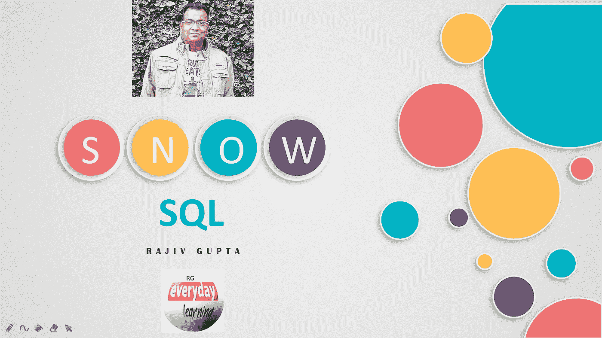

# 雪花 SnowSql:命令行之旅

> 原文：<https://blog.devgenius.io/snowflake-snowsql-a-command-line-tour-977d7aae1795?source=collection_archive---------0----------------------->

SnowSQL 是连接雪花的命令行工具。它是一个交互式查询工具，用于执行 SQL 查询和所有 DDL 和 DML 操作，包括在雪花中向数据库表加载数据和从数据库表中卸载数据。

我们为什么需要 SnowSql？

SnowSql 是一个为雪花云数据仓库设计的现代命令行工具，它建立在高安全标准之上，并与雪花核心架构紧密集成。它具有非常强大的脚本功能，如果与 Python 一起使用，还可以进一步增强。此外，要上传/下载任何文件到雪花内部阶段，你需要 SnowSql 作为 put 和 get 命令，只使用命令行而不是 Web UI。

**SnowSql 是自动升级的吗？**

默认情况下，SnowSQL 会自动升级到最新的补丁版本。新的主要或次要版本需要手动下载和安装。当有新的补丁版本可用时，SnowSQL 在后台进程中下载新的二进制文件并执行当前版本。下次运行 SnowSQL 时，新版本就会启动。

**什么是 SnowSql 版本控制？**

通常，以下准则适用于不同的版本类型:

**主要版本:**主要版本的变化表明了底层雪花服务的巨大改进。一个新的主要版本打破了向后兼容性。您需要从 web 界面下载并安装最新的 SnowSQL 版本。

**次要版本:**次要版本中的变化表明在 SnowSQL 或底层雪花服务中支持向前兼容性的改进。新的次要版本不会破坏向后兼容性，但是我们强烈建议您从 web 界面下载并安装最新的 SnowSQL 版本。

**补丁版本:**补丁版本的变化表示应用了小的增强或错误修复。自动升级功能会自动安装所有修补程序版本。

## 自动完成和语法突出显示

有了上下文相关的自动完成特性，SnowSql 用户就不用输入冗长且容易出错的对象名了。相反，他们可以使用该工具提供的建议来完成 SQL 关键字和函数。用不同的颜色突出显示 SQL 语句可以提供更好的可读性。

## 连接时如何指定密码？

密码不能通过连接参数传递。必须以下列方式之一指定密码:

*   通过 SnowSQL 中的交互提示输入(仅适用于密码)。细节在下面的视频中提到。
*   使用**密码**选项在 SnowSQL 配置文件中定义。细节在下面的视频中提到。
*   使用 **SNOWSQL_PWD** 环境变量指定。

## 安全连接和加密

SnowSQL 使用 TLS(传输层安全性)和 OCSP(在线证书状态协议)检查来保护与雪花的连接。自动升级二进制文件总是使用 RSA 签名进行验证。除了安全连接之外，SnowSQL 还使用 AES(高级加密标准)为 Snowflake 的 PUT 和 GET 命令提供了往返于 Snowflake 的数据移动的端到端安全性。

**如何安装、配置&连接 Snowsql 命令行？**

下面的视频将帮助您了解从哪里可以下载 SnowSql，如何通过 SnowSql 进行配置和连接。

希望这个博客能帮助你了解 SnowSql。如果你对此有任何疑问，欢迎在评论区提问。如果你喜欢这个博客，请鼓掌。保持联系，看到更多这样的酷东西。谢谢你的支持。

**你看了我下面的博客了吗:**

[SNOWPRO 自我评估工具](https://rajivgupta780184.medium.com/snowpro-self-assessment-tool-163e2a9805bd)

[从零到雪花中的英雄(2-3 周内通过 SNOWPRO 认证)](https://rajivgupta780184.medium.com/zero-to-hero-in-snowflake-snowpro-certified-in-2-week-8ec62cd89674)

**你可以找我:**

**跟我上媒:**[https://rajivgupta780184.medium.com/](https://rajivgupta780184.medium.com/)

**在推特上关注我:**[https://twitter.com/RAJIVGUPTA780](https://twitter.com/RAJIVGUPTA780)

**在 LinkedIn 跟我连线:**[https://www.linkedin.com/in/rajiv-gupta-618b0228/](https://www.linkedin.com/in/rajiv-gupta-618b0228/)

**订阅我的 YouTube 频道:**[https://www.youtube.com/channel/UC8Fwkdf2d6-hnNvcrzovktg](https://www.youtube.com/channel/UC8Fwkdf2d6-hnNvcrzovktg)

#坚持学习#坚持分享#每天学习。

## 参考资料:-

*   [https://www.snowflake.com/](https://www.snowflake.com/)