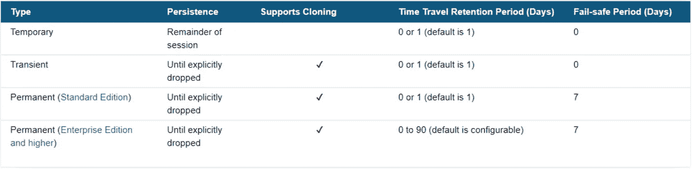
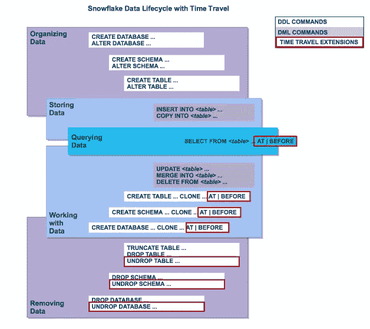
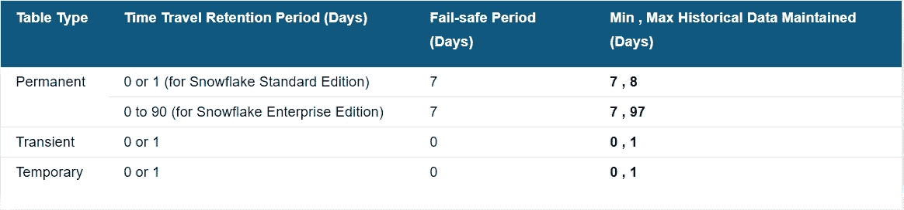

# 雪花:时间旅行…这多酷啊？

> 原文：<https://blog.devgenius.io/snowflake-time-travel-how-cool-is-this-62523ff81db?source=collection_archive---------2----------------------->

你过去有没有搞砸过你的数据库？

您是否更新了任何表中的错误数据，并希望恢复旧数据？

您是否错误地删除了表、模式或数据库？

曾经面临过从过去进行时间点恢复的需求吗？

这听起来相似吗？

所有人都在某个时候经历过这个阶段…！

在我职业生涯的早期阶段，我在测试一些东西的时候也搞砸了我的数据库环境。对于任何数据库开发人员来说，这都是一个非常普遍的情况。

想象一下，您过去是如何说服 DBA 团队修复您的错误的。

**这个话题与 SnowPro 核心考试有多大关系？**

这个主题非常重要，你可能会在 SnowPro 考试中遇到一些问题。

**什么是雪花时间旅行？**

**时间旅行**是雪花中非常强大的功能，由雪花的元数据&存储层提供支持。它是执行以下任务的强大工具:

*   查询过去已经更新或删除的数据。
*   在过去的特定时间点或之前创建整个表、模式和数据库的克隆。
*   还原已删除的表、模式和数据库。

**时间旅行数据周期有保留期限吗？**

如果数据周期低于周期，数据将被转移到雪花自动防故障模式(7 天不可配置的周期，用于雪花的灾难恢复支持),这些操作将无法再执行。**对象的 0 天保留期实际上禁用了对象的时间旅行**。

*   **标准版 0–1 天**。
*   **0–90 天，企业版或以上**。

(来源:雪花)

**关于数据保留时间天数参数的更多信息**

这可以使用[**DATA _ RETENTION _ TIME _ IN _ DAYS**](https://docs.snowflake.com/en/sql-reference/parameters.html#data-retention-time-in-days)参数在**帐户或数据库或模式或表**级别设置。最低(表)级别的值优先于最高级别(帐户)。如果在较低级别没有指定任何内容，则所有下划线对象的默认值都是在顶级指定的值。更改您的帐户或单个对象的保留期会更改所有未明确设置保留期的低级对象的值。例如:

*   如果在帐户级别更改保持期，所有没有显式保持期的数据库、模式和表都会自动继承新的保持期。
*   如果在模式级别更改保持期，则模式中没有显式保持期的所有表都将继承新的保持期。

**如何查看不同级别的数据保留时间天数？**

> —显示账户参数
> 显示账户参数；
> 
> —显示特定数据库的参数
> 显示数据库时间旅行的参数；
> 
> —显示特定表的参数
> 显示表 EMPLOYEE 的参数；

**如何在不同级别修改数据保留时间天数？**

要修改此参数，您必须拥有 ACCOUNTADMIN 角色或同等权限。

> —设置账户级参数(必须是 ACCOUNTADMIN)
> 更改账户集 DATA _ RETENTION _ TIME _ IN _ DAYS = 30；
> 
> 显示帐户的参数；
> 
> —设置数据库级参数
> ALTER DATABASE TIME travel Set DATA _ RETENTION _ TIME _ IN _ DAYS = 20；
> 
> 显示数据库 TIMETRAVEL 的参数；
> 
> —设置表级参数
> ALTER TABLE 员工集 DATA _ RETENTION _ TIME _ IN _ DAYS = 10；
> 
> 显示雇员表的参数；

**我们如何在数据生命周期的不同阶段使用时间旅行？**

我们可以以 3 种方式利用时间旅行 SQL 扩展，以及 Select & Create… Clone 语句中的 **AT | BEFORE** 子句。

*   **时间戳:**基于过去的某个时间戳
*   **偏移:**过去与当前时间的时间差，单位为秒。
*   **语句:**基于 SQL 查询 ID。

**T22【来源:雪花】:前的 AT |注**

*   **AT 关键字指定请求包含时间戳等于指定参数的语句或事务所做的任何更改。**
*   **BEFORE 关键字指定请求引用紧接在指定参数之前的点。**
*   **如果 AT | BEFORE 子句中指定的时间戳、偏移量或语句超出了表的数据保持期，查询将失败并返回错误。**

****

**来源(雪花)**

**如果我们能很好地撤销日常生活中的错误步骤，那该多好啊，这是完全不可能的，但是我们可以在雪花中撤销数据库/模式/表格。那不是很酷吗？**

**雪花元数据和存储层使我们能够从过去的时间点**取消删除、克隆&查询，而无需求助于数据库管理员，前提是数据生命周期尚未进入故障安全阶段。****

**时间旅行的快速演示怎么样？**

**时间旅行是免费的吗？**

**不，雪花里没有免费的:)**

**所有版本都默认启用时间旅行，没有任何额外费用。它只收取存储费。数据保留期越长，数据存储成本越高。不管要花多少钱，它都是值得的。雪花通过只维护恢复被更新或删除的单个表行所需的信息，最大限度地减少了历史数据所需的存储量。因此，存储使用量是以发生更改的表的百分比来计算的。只有在删除或截断表时，才会维护表的完整副本。**

****

****需要记住的事情:****

*   **删除对象后，创建同名对象不会恢复该对象。相反，它创建对象的新版本。被删除的原始版本仍然可用，并且可以恢复。**
*   **恢复已删除的对象会将该对象恢复到原位(即不会创建新对象)。**
*   **如果同名的对象已经存在，UNDROP 将失败。您必须重命名现有对象，这样您就可以恢复对象的先前版本。**
*   **当删除表、模式或数据库时，它不会立即被覆盖或从系统中删除。相反，它会在对象的数据保留期内保留，在此期间可以恢复对象。**
*   **对象的保留期过后，该对象已被清除，它不再显示在显示 *< object_type >* 历史输出中。**

**希望这篇博客能帮助你了解雪花时间旅行的特点。如果你有兴趣了解更多关于时间旅行的细节，你可以参考[雪花文件](https://docs.snowflake.com/en/user-guide/data-time-travel.html)。如果你对此有任何疑问，欢迎在评论区提问。如果你喜欢这个博客，请鼓掌。保持联系，看到更多这样的酷东西。谢谢你的支持。**

****可以找我:****

****跟我上媒:**[https://rajivgupta780184.medium.com/](https://rajivgupta780184.medium.com/)**

****在推特上关注我:**[https://twitter.com/RAJIVGUPTA780](https://twitter.com/RAJIVGUPTA780)**

****在 LinkedIn 联系我:**[https://www.linkedin.com/in/rajiv-gupta-618b0228/](https://www.linkedin.com/in/rajiv-gupta-618b0228/)**

****订阅我的 YouTube 频道:【https://www.youtube.com/channel/UC8Fwkdf2d6-hnNvcrzovktg】T22****

****

**#坚持学习#坚持分享#每天学习。**

# **参考资料:-**

*   **[https://www.snowflake.com/](https://www.snowflake.com/)**