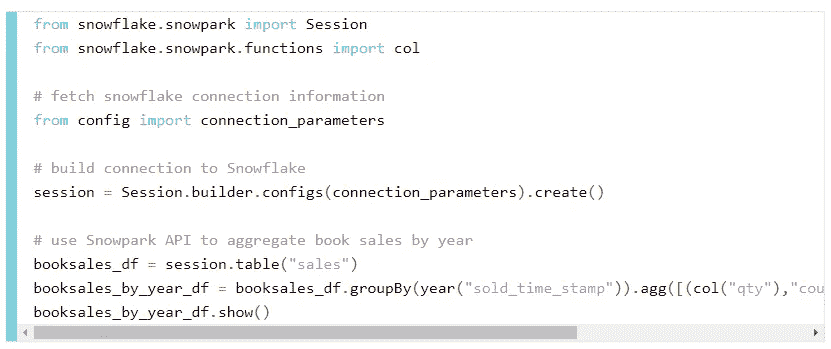
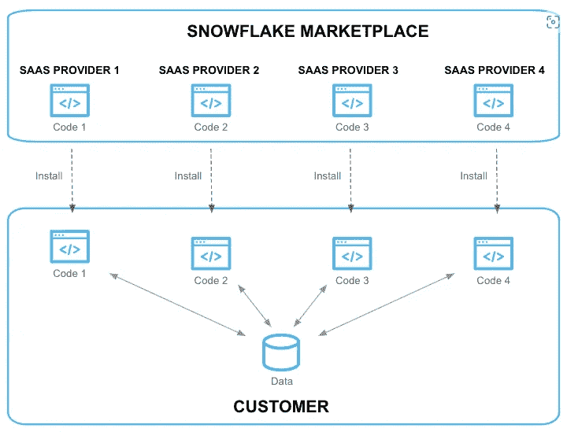
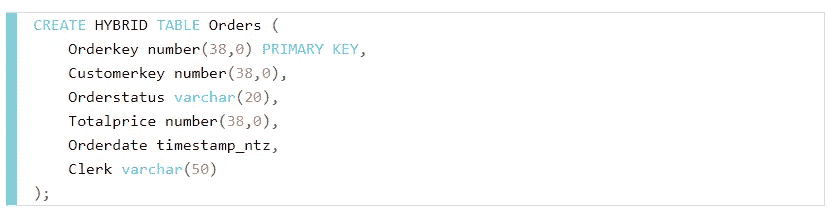

# 雪花想要淘汰基础设施

> 原文：<https://blog.devgenius.io/snowflake-wants-to-make-infrastructure-obsolete-d63933c236ae?source=collection_archive---------4----------------------->

本周，我与数千名其他数据专业人士一起参加了雪花峰会，他们希望了解数据和分析领域的最新趋势。当公司希望用最新最棒的功能来激励与会者，以激发他们对产品未来的兴奋时，看到伴随会议的公告总是很有趣的。这些公告通常会让我们看到公司在未来设定产品发展方向时所追求的方向。

如果这些公告有一个共同的主题，那就是雪花希望成为企业的统一数据平台，而不仅仅是数据仓库。几个特性背后的事实是，他们希望减少访问和转换雪花中的数据时的摩擦。雪花在构建动态和可扩展的消费引擎方面做得非常好，因此，可以利用这一点的东西越多，您就越不需要专注于维护基础架构，而需要将更多时间花在业务增值上。

峰会上宣布的一个主要产品就是 Snowpark 对 Python 的支持。雪花正在与 Anaconda 合作，让某些 Python 包在雪花中直接可用。这意味着不再需要维护一个单独的环境，其中包含运行在雪花之上的所有 Python 依赖项，现在您可以直接在雪花的计算之上运行您的 Python 代码，并利用可扩展的基础架构。这将允许数据科学家摆脱对企业隐藏的本地数据库和笔记本电脑运行模型，并将它们展现在众人面前。你可以在他们的公告页面[点击](https://www.snowflake.com/blog/snowpark-python-innovation-available-all-snowflake-customers/)了解更多详情。

雪地公园里的蟒蛇

会议上发布的另一个有趣的公告是原生应用程序框架。该特性旨在通过几次点击将数据处理直接带到您的雪花实例中。这个概念非常有说服力，因为它将数据转换视为等式中的“应用程序”部分。假设您有一堆客户人口统计数据，并且正在寻找一个符合事实的来源。不同的提供商可以提供实体协调应用程序，这些应用程序读取您的数据并执行逻辑以输出协调列表。您可以从该逻辑的消费中受益，而不必花费时间和精力来编写它。这是一种能力的延伸，通过购买支持数据开发的应用程序来专注于构建或购买心态中的核心优势，而这些应用程序并不属于您的主要业务价值。你可以在这里阅读更多关于功能[的信息。](https://www.snowflake.com/blog/introducing-snowflake-native-application-framework/)

本机应用程序框架

在我看来，最激动人心的发布之一是 Unistore 功能的发布。该特性将基于事务和分析的表一起放在雪花中。以前，雪花一直专注于分析优化表和查询。这意味着优化列存储，使其在报告和可视化的数据聚合下表现良好。现在，您希望从基于行的表中获得的特性已经存在，比如主键和参照完整性强制。以前，您可以为雪花定义这些来为分析应用程序提供提示，但它们不会被强制执行。现在，您可以使用 Snowflake 来支持更传统的应用程序风格的程序，这些程序总是动态地读写行。这也意味着这些表也位于您的仓库中，不再需要从外部来源引入，它们可以立即被查询并从分析角度受益。你可以在这里阅读更多关于这个功能[的信息。](https://www.snowflake.com/blog/introducing-unistore/)

Unistore 表

上面提到的所有特性以及更多特性不断推进这样一种理念，即企业数据平台是可以消费的，而不是企业需要运行和托管的。对于大多数组织来说，如果操作正确，这应该是一个好处。它允许关注您为您的数据平台增加了什么价值，而不是维护它的开销。