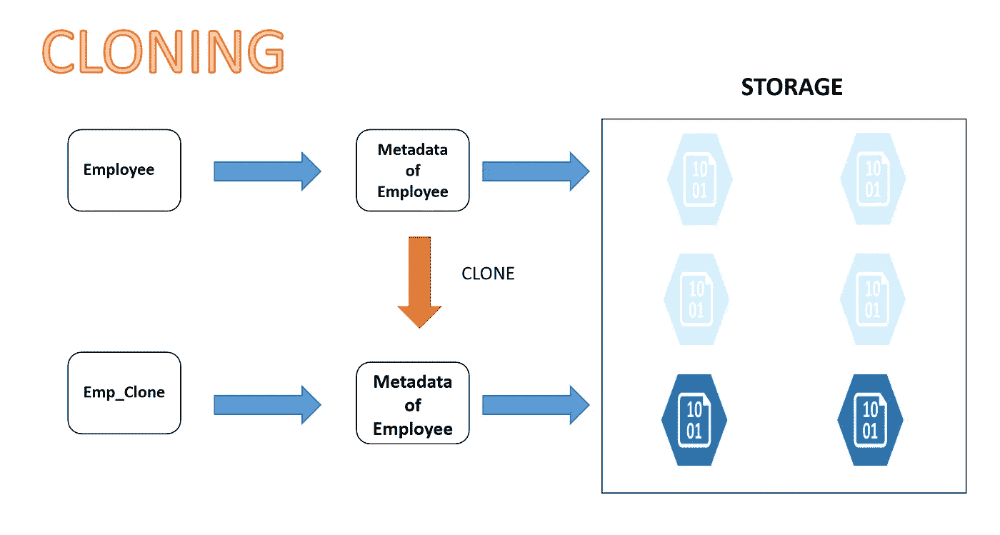
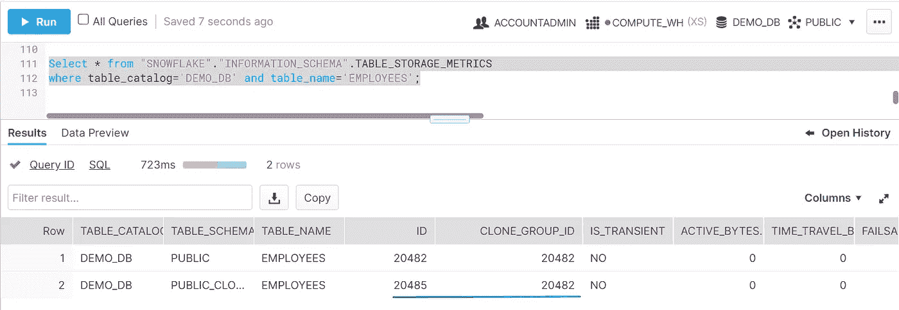

# 雪花:零拷贝克隆和演示

> 原文：<https://blog.devgenius.io/snowflake-zero-copy-clone-demo-ec1c8676bed4?source=collection_archive---------1----------------------->

在这篇博客中，我们将详细讨论零拷贝克隆。在我们开始学习雪花之前，我想让你对数据库克隆有个基本的了解。

**这个话题与 SnowPro 核心考试有多大关系？**

这个主题非常重要，你可能会在 SnowPro 考试中遇到一些问题。

# 什么是数据库克隆？

数据库克隆是创建生产数据库或其备份集的时间点副本的过程。

克隆的数据库可用于多种目的:

*   在应用程序开发周期中，测试必须使用当前数据库结构和内容实现的功能。
*   通过数据提取和操作工具来填充数据仓库。
*   用于恢复被错误删除或更改的数据。

数据库克隆功能使您能够同时克隆所有数据库，或者从许多数据库中选择特定的数据库。一般来说，当我们进行克隆时，可能需要几个小时的努力、存储和其他资源才能获得最终结果。它主要由 DBA 团队或运营团队执行，由开发人员、测试人员和其他人使用。

现在，您已经知道了什么是数据库克隆，让我们继续学习雪花，看看是什么让雪花在克隆方面如此不同，以及雪花如何让这里的生活变得简单。

**雪花中的零拷贝克隆是什么？**

雪花零拷贝克隆功能是雪花中最强大的功能之一，它提供了一种方便的方法来快速获取任何表、模式或数据库的时间点“快照”，并创建对下划线分区的引用，该分区最初共享底层存储，除非我们进行任何更改。这对于创建不会产生任何额外成本的即时备份非常有用，直到对克隆对象进行了更改。

雪花中的克隆

如果你看到上图，Emp_Clone 已经克隆了 Employee 表的元数据，在存储中被引用为**淡出块**。其他块是在对 Emp_Clone 表进行任何更改的情况下创建的附加分区。两个表都可以有自己更改周期。

过去，我们常常要等上一两天才能获得环境供应，现在这种日子一去不复返了。与其他数据库中的克隆相比，雪花中的克隆速度更快。这可能需要几分钟时间，具体取决于源对象的大小。

虽然雪花克隆是共享下划线存储，直到你不做任何改变。但是，当您做出更改时，它就开始遵循其独立的生命周期对分区进行更改。有时这会使存储计算变得复杂，但因为它是由雪花管理的，所以我们不必在这里承担负担。这意味着可以相互独立地对原始对象或克隆进行更改，并且这些更改通过 CDP 得到保护。

在 Snowflake 中，可以无限制地进一步克隆 n 次克隆，每个克隆都有一部分共享存储和独立存储(如果有更改)。

雪花中的每个表都有唯一标识雪花中的表的 ID。类似地，每个表也有 CLONE_GROUP_ID，它给出了表是否是克隆的信息。如果两列具有不同的 ID，则意味着该表是克隆的表，否则。在下面的屏幕截图中，您可以看到 PUBLIC_CLONE 模式下的表“EMPLOYEE”具有不同的 ID。您必须使用帐户管理员角色查询[**TABLE _ STORAGE _ METRICS**](https://docs.snowflake.com/en/sql-reference/info-schema/table_storage_metrics.html)视图来获取此信息。

**雪花中可以克隆哪些对象？**

以下是可在雪花中克隆的对象列表。对于数据库、模式和非临时表，CLONE 支持额外的 AT | BEFORE 子句，以便使用时间旅行进行克隆。

1.  数据库
2.  计划
3.  桌子
4.  流
5.  阶段
6.  文件格式
7.  顺序
8.  工作

**如何在雪花中克隆一个对象？**

**对于数据库、模式、表格、流，您可以使用以下:**

雪花文档的代码片段

> CREATE [或 REPLACE]{ DATABASE | SCHEMA | TABLE | STREAM }[如果不存在] <object_name>CLONE<source _ object _ name>
> [{ AT | BEFORE }({ TIMESTAMP =><TIMESTAMP>| OFFSET =><time _ difference>| STATEMENT =><id>})]</object_name>

**对于阶段、文件格式、顺序&任务，您可以使用下面的:**

> 创建[或替换] {阶段|文件格式|序列|任务} [如果不存在] <object_name>克隆<源 _ 对象 _ 名称></object_name>

# **零拷贝克隆演示:**

**克隆任何对象都需要哪些权限？**

要克隆对象，您必须拥有最低要求的权限。要创建克隆，您的当前角色必须对源对象拥有以下权限:

*   **表格:**选择
*   管道、流、任务:所有权
*   **其他对象:**用法
*   此外，要克隆方案或方案中的对象，您的当前角色必须对源和克隆的容器对象具有所需的权限。

**访问控制如何处理克隆对象？**

克隆对象在克隆过程中不会自动复制源对象的权限。系统管理员或克隆对象的所有者必须明确授予新创建的克隆所需的任何权限。

但是，如果源对象是数据库或方案，对于源中包含的子对象，克隆将复制相应子对象上的所有授予权限:

**需要记住的事情(来源:雪花):**

*   克隆数据库或模式时，源容器中引用内部(即雪花)阶段的任何管道都是 ***而不是*** 克隆的。但是，任何引用外部阶段的管道都会被克隆。
*   当克隆一个包含默认序列的列的表时，克隆的表仍然引用原始的序列对象。如果您不希望新表继续使用旧序列，那么您必须更改该表以使用新序列而不是旧序列。
*   某些限制适用于克隆操作。例如，在克隆操作期间影响源对象的 DDL 语句可能会改变结果或导致错误。
*   克隆不是即时的，尤其是对于大型对象(数据库、模式、表)，并且不会锁定被克隆的对象。因此，在克隆操作仍在运行时，克隆不会反映应用于表数据的任何 DML 语句(如果适用)。
*   克隆数据库或模式时，源容器中引用内部(即雪花)阶段的任何管道都是 ***而不是*** 克隆的。但是，任何引用外部阶段的管道都会被克隆。
*   当克隆包含任务的数据库或方案时，默认情况下，克隆中的任务会被挂起。这些任务可以手动恢复。
*   克隆表会复制源表的结构、数据和某些其他属性(例如，登台文件格式)。克隆的表不包括源表的加载历史。加载到源表中的数据文件可以再次加载到其克隆中。
*   [CREATE TABLE … CLONE](https://docs.snowflake.com/en/sql-reference/sql/create-table.html) 语法包括 COPY GRANTS 关键字，这些关键字对新表克隆的影响如下:

1.  如果使用了 COPY GRANTS 关键字，那么新对象将继承对原始表授予的任何显式访问权限，但 ***不会继承*** 为模式中的对象类型定义的任何未来权限。
2.  如果使用复制授权关键字 ***而非*** ，则新对象克隆不会继承在原始表上授予的任何显式访问权限，但会继承在模式中为该对象类型定义的任何未来授权(使用[GRANT<privileges>…TO ROLE](https://docs.snowflake.com/en/sql-reference/sql/grant-privilege.html)…ON FUTURE syntax)。

*   克隆数据库或方案时:

1.  克隆操作开始时，源中存在的外部命名阶段将被克隆。
2.  表被克隆，这意味着与每个表相关联的内部阶段也被克隆。源数据库或方案的表阶段中存在的任何数据文件都不会复制到克隆中(即克隆的表阶段为空)。
3.  内部命名的阶段是 ***而不是*** 克隆的。

但是，下列对象类型是 ***而不是*** 克隆的:

*   外部表格
*   内部(雪花)阶段

希望这个博客能帮助你深入了解雪花零拷贝克隆特性。如果你对此有任何疑问，欢迎在评论区提问。如果你喜欢这个博客，请鼓掌。保持联系，看到更多这样的酷东西。谢谢你的支持。

**你可以找我:**

**跟我上媒:**[https://rajivgupta780184.medium.com/](https://rajivgupta780184.medium.com/)

**在推特上关注我:**[https://twitter.com/RAJIVGUPTA780](https://twitter.com/RAJIVGUPTA780)

**在 LinkedIn 跟我连线:**[https://www.linkedin.com/in/rajiv-gupta-618b0228/](https://www.linkedin.com/in/rajiv-gupta-618b0228/)

**订阅我的 YouTube 频道:**[https://www.youtube.com/channel/UC8Fwkdf2d6-hnNvcrzovktg](https://www.youtube.com/channel/UC8Fwkdf2d6-hnNvcrzovktg)

#坚持学习#坚持分享#每天学习。

# 参考资料:-

*   [https://www.snowflake.com/](https://www.snowflake.com/)