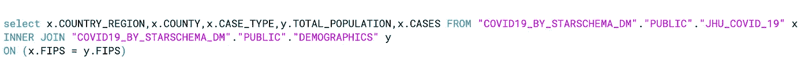
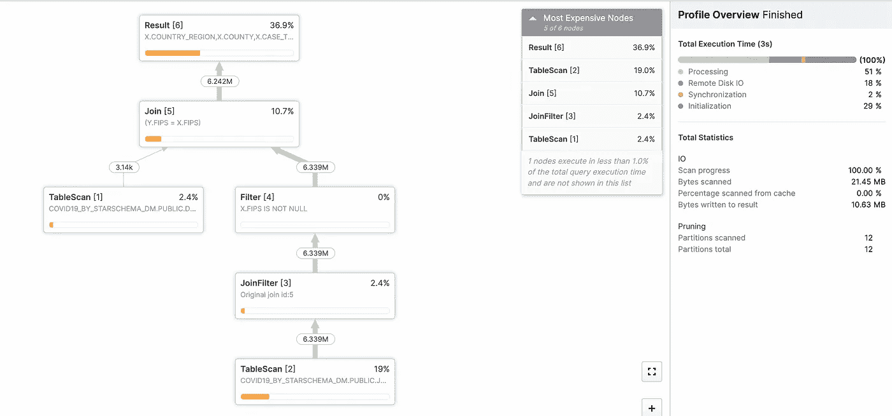
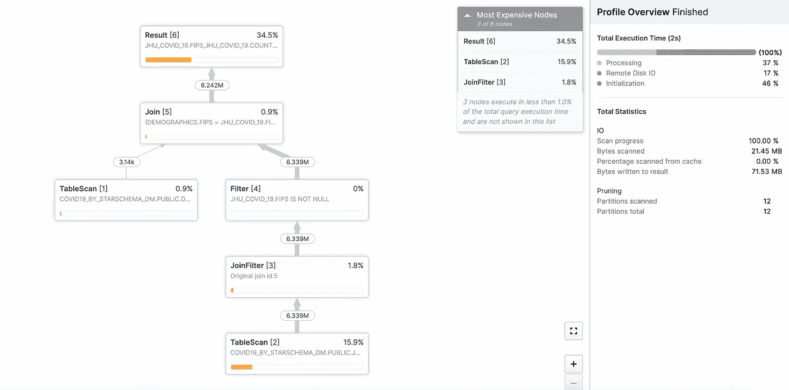

# Snowpark vs 雪花连接器

> 原文：<https://blog.devgenius.io/snowpark-vs-snowflake-connector-5c6baa44bde2?source=collection_archive---------0----------------------->


当 Snowpark API 可供使用时，一个明显的问题浮现在脑海中:-它与现有的雪花连接器/驱动程序有什么不同？虽然 Snowpark 和 Connectors 的唯一目的是相同的，即:-连接到雪花数据库并对数据进行操作，但这两者之间有一些重要的区别，如下所列。

注意:-为了更好地理解，我们将考虑**snow park For Python**VS**snow flake Python Connector**。

***雪花蟒连接器:***

1.  它提供了一个开发 **Python 应用**的接口，可以连接到雪花并执行 DDLs、DMLs 和 SQL 的标准操作。
2.  您可以从 python 程序建立与 SF 的连接，并将复杂的查询传递给雪花，雪花将在 SF 数据库中运行。
3.  这里要注意的关键点是:-将被利用的处理/Cpu 在雪花生态系统内，并且并行处理的好处将基于雪花仓库的大小来利用。
4.  但是，一些开发人员习惯于数据框架风格的编程，对编写 SQL 查询不太适应。因此，他们可能希望将表数据发送到 Pandas DF，然后使用 Pandas dataframe 方法对数据进行复杂的计算。
5.  Python Pandas DF 的挑战和处理边界来了，它将在非常大的数据集上表现不佳，因为处理不会发生在雪花生态系统内，而是发生在资源有限的客户机上。
6.  将大量数据从 SF 提取到 Pandas DF 也会导致资源争用，因为大量数据从 SF 移动到客户端系统。

Snowpark 来帮忙了！！！

***雪域巨蟒:***

1.  Snowpark 库为查询和处理数据管道中的数据提供了一个直观的 API。使用这个库，您可以构建在雪花中处理数据的应用程序**,而不用将数据移动到您的应用程序代码运行的系统中**
2.  Snowpark 的核心抽象是 Dataframe，它为开发人员提供了 DF 风格的编程结构，具有与 SQL 查询相同的性能。
3.  Snowpark 操作是在服务器上延迟执行的，这减少了客户机和雪花数据库之间传输的数据量。除非您在 DF 上执行操作，否则不会有数据从 SF 传输到客户端系统。
4.  最棒的是，它使用了**代码下推**方法，将包括您最喜欢的 Python 函数(UDF)在内的所有代码都推送到服务器，并在 Snowflake 的计算引擎中本地运行，为您提供最佳性能。

**IMP 注意:-用于 Python/Scala 的雪花连接器可能存在资源争用问题，但是 Spark 连接器性能更好，因为 Spark 集群本身是分布式的，并且能够非常快速地进行内存计算。但是你可以考虑转投 Snowpark，因为:-**

*   Snowpark 支持所有操作的下推，包括雪花 UDF。
*   数据不需要从 SF 拉到 Spark DF，计算可以在有数据的地方运行。
*   Snowpark **不需要雪花**之外的独立集群进行计算。所有的计算都是在雪花内部完成的
*   您可以在 Spark connector 和 Snowpark-Spark 之间运行一些样本负载，以决定是否可以从基于 Spark 的应用程序迁移到 Snowpark，这样就可以完全消除 Spark 集群维护。

# 测试以确定事实(SQL 查询与 Snowpark DF 性能)

**SQL 查询:-**

数据库中触发的示例查询:-在 XS·WH 上运行



1.  两个表的简单连接
2.  3s 内完成
3.  处理了 600 万行
4.  第一次运行，不涉及缓存
5.  扫描了 12 个分区

**雪场 DF:-**

用 Python 编写的 Snowpark DF 程序示例:-在 XS·WH 上运行

```
df1 = session.table('JHU_COVID_19')
df2 = session.table('DEMOGRAPHICS')

df1.join(df2, df1.col("FIPS") == df2.col("FIPS")).select(df1["FIPS"].as_("FIPS"), "COUNTRY_REGION", df1["COUNTY"], "CASE_TYPE", "TOTAL_POPULATION","CASES").collect()
```



1.  使用 Snowpark DF 简单连接两个表
2.  **在内部，它被转换成下面的 SQL**
3.  2s 内完成
4.  处理了 600 万行
5.  第一次运行，不涉及缓存
6.  扫描了 12 个分区

内部转换的 SQL


**最终要点:-**

因此，我们了解到 Snowpark 提供了一种 DF 风格的编程结构，其中应用程序代码被推送到 SF 环境中，并在雪花中本地运行，并且**提供了与我们通过向雪花发出 SQL 查询**所获得的相同的性能。

谢谢大家！快乐阅读