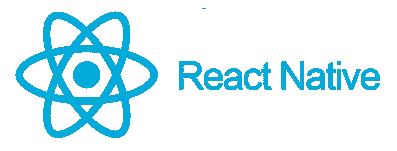
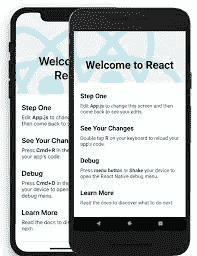
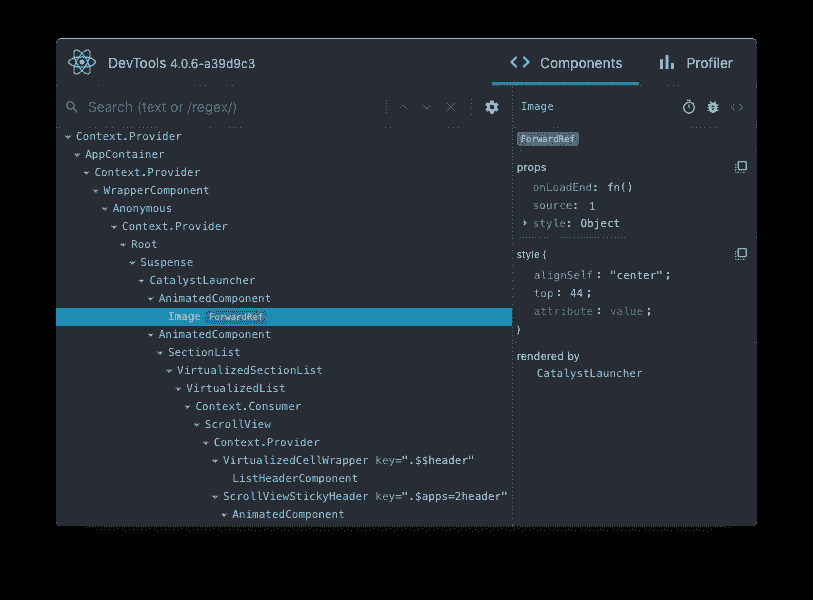

# 所以，你想被聘为 React 本地开发人员

> 原文：<https://blog.devgenius.io/so-you-wanna-get-hired-as-a-react-native-developer-3c99bdab605d?source=collection_archive---------1----------------------->

## 从面试和聘用 React 本土工程师看学习 React 本土



反应自然

尽管在跨平台移动开发中有比以往更多的选择，React Native 仍然是一种构建高质量移动应用程序的优秀方式，同时利用了您组织中许多人可能已经知道的技能集和技术(有时甚至是代码)。

我在 React Native 论坛上看到的一个最常见的问题是人们问如何开始学习 React Native。因为 React Native 比 React 本身更像是一种小众技术，所以关于这个主题的文章要少得多，而且很多已经过时了。



在本文中，我将根据我自己学习框架以及面试和雇用其他工程师的经验，讨论开发人员如何开始努力获得 React 原生开发人员的职位。

# 第一要务:学会反应

这是最重要的因素:**如果你是一名优秀的 React 开发人员，加入一个现有的 React 原生项目，你从第一天起就可以高效工作。**这并不意味着你会在第一天就成为项目领导，但你应该能够立即对 React 原生代码库做出有意义的贡献。

最有可能的是，你在 React Native 项目上 90%的工作将与你在 ReactJS webapp 上的工作完全相同。事实上，作为一名面试 React 本地职位候选人的招聘经理，**我真的不在乎你是否有 React 本地工作经验，**只要你在 React 的工作经验扎实。

那么，如今“从里到外学习反应”是什么意思呢？您应该理解并乐于讨论以下所有内容:

*   学习核心的 React 概念，如组件、JSX、虚拟 DOM 等。
*   尽你所能了解功能组件和挂钩。[爱他们](https://medium.com/weekly-webtips/react-hooks-6d0741bb97d2)或[恨他们](https://www.google.com/url?sa=t&rct=j&q=&esrc=s&source=web&cd=&cad=rja&uact=8&ved=2ahUKEwiS07Dx85j4AhWRZDABHdwPC48QFnoECAcQAQ&url=https%3A%2F%2Fmedium.com%2Fackee%2Fwhat-i-dont-like-about-react-hooks-e6ec7da863d5&usg=AOvVaw1WcbOJ0F8Egmj1ikn_mxHH)，钩子是现代 React 开发中的一个核心概念。
*   了解如何掌握 API 集成(fetch、Axios 等)和状态管理(Redux、反冲、MobX 等)

# 第二要务:了解差异

一旦你知道了 React，是时候复习一下 React on web 和 React Native 之间的区别了。你不需要记住所有这些—**只要意识到这一点并知道何时查阅文档**。只要花一些时间在 React 原生项目上，您就可以很容易地发现这些差异。

## **没有 HTML DOM 标签**

这一条很简单，但是很基本:你不再使用 HTML 了。在 React Native 中，你将习惯于使用一些 RN 组件类似物:`<View />`、`<Text />`、`<Image/>`和`<Button />`，而不是像`<div />`、`<p />`、``和`<a />`这样的 HTML DOM 标签。这些本地组件类似于基于 web 的组件，但不是它们的精确副本，所以请务必查阅文档以了解它们的特性和行为。核心组件的完整列表可在 [React 本地文档](https://reactnative.dev/docs/flatlist)中找到。

## **指定样式**

React 和 React Native 之间的最大区别之一是样式和布局:React JS 在 web 上的核心是使用熟悉的 CSS 样式和类，就像在任何 HTML 页面中一样。另一方面，React Native 使用内联样式，看起来或多或少有点 CSS 的味道，但是有一些不同的语法和不同的行为。

开箱即用，React 本机组件通常使用内联样式的属性，而不是类名。下面的简短示例显示了两种环境下*典型*造型的差异:

```
**/////// React on the web ///////**
// styles.css
.box {
   background-color: #f00;
}// Component.jsx
<div className="box" />**/////// React Native ///////** // Component.jsxconst styles = {
  box: {
    backgroundColor: "#f00"
  }
}
<View style={styles.box} />
```

这里需要注意的区别是:

*   在 RN 中，样式属性是一个包含样式规范的对象
*   样式声明键是**驼峰式**
*   *虽然它看起来像 CSS，但它不是——并不是所有的 CSS 声明都被支持，而且有些事情的行为方式不同*

关于支持什么和不支持什么的确切细节，请参见 React Native 中关于[样式的文档。](https://reactnative.dev/docs/style)

和 React 在 web 上一样，有一些软件包可以帮助简化和组织样式。[风格化组件](https://styled-components.com)是帮助组织你的风格的一个很好的方式，并且有额外的好处，在很大程度上标准化了 React & React Native 之间的用法和行为模式。

## **布局**

React Native 中的布局在某种程度上是从你可以在 web 上做的事情中剥离出来的，但在我看来，要简单得多:*所有的布局都是用 Flexbox 完成的。熟悉一下`display: flex`在网络上的工作方式，你就会很好地理解 React Native 中的布局工作方式。*

有时，您肯定会遇到一些与您在 web 上对 CSS 和 Flexbox 的预期不太一样的行为。React 本机文档中的几个示例:

> 除了一些例外，Flexbox 在 React Native 中的工作方式与在 web 上的 CSS 中的工作方式相同。默认不同，`flexDirection`默认为`column`而不是`row` , `alignContent`默认为`flex-start`而不是`stretch` , `flexShrink`默认为`0`而不是`1`,`flex`参数只支持一个数字

和

> 在某些情况下，React Native 与 CSS 在 web 上的工作方式不匹配，例如触摸区域永远不会超出父视图边界，并且在 Android 上不支持负边距。

同样，你可能会发现 Android 和 iOS 在布局和行为上的细微差别。请注意这些差异的潜在性，并相应地测试您的应用程序和布局。

## **动画**

动画在某种程度上是“造型&布局”的延伸，但它们值得被单独叫出来。在 web 上，您可能习惯于直接在 CSS 中实现动画，或者可能使用构建在 CSS 动画之上的 JavaScript 库。在 React Native 中，您需要采用一种不同的方法，要么使用内置的`[Animated](https://reactnative.dev/docs/animated)` API，要么使用像`[react-native-reanimated](https://docs.swmansion.com/react-native-reanimated/)`这样的第三方库，这两者的功能类似。

这些 API 通过构造包含从“动画值”计算的动态参数的样式属性来工作。这里有一个从**重新激活的**文档中摘下来的样本，展示了如何使用`useAnimatedStyle`钩子来激活`Animated.View`组件:

```
// when the button is clicked, animate the offset from 0.0-1.0,
// use that offset to compute a transform.function Box() { 
  const offset = useSharedValue(0)
  const animatedStyles = useAnimatedStyle(() => {    
    return { transform: [{ translateX: offset.value * 255 }] }
  }) return (<>
      <Animated.View style={[styles.box, animatedStyles]} />      
      <Button onPress={() => (offset.value = 1.0)} title="Move" />    
    </>)
}
```

内置的`Animated`组件以类似的方式工作，尽管由于增强的功能和性能，我推荐使用重新激活的。值得注意的是，Renimated 允许使用可以在本机应用程序主 UI 线程上运行的隔离 JavaScript 小程序，从而实现更高的帧速率和更好的触摸事件交互性。

关于上面例子的另一个注意事项:“transform”样式属性不同于它的 CSS 对应物，所以一定要[参考文档](https://reactnative.dev/docs/transforms)来理解它是如何工作的。

## **事件&交互**

事件处理和交互非常类似于*原则上*在 web 上的反应，但是细节却非常不同:各个组件触发的具体事件并不相同。特别是，您将希望使用特定的本地组件来处理交互——您不能像您可能习惯的 HTML 那样简单地将类似`onClick`的事件添加到任何标签中。事实上，你根本不会处理“点击”，而是处理“触摸”和“手势”。此外，这些事件只在某些本地组件上可用，如`Button`或更通用的`Touchable`。React 本机文档更详细地介绍了这些组件的使用。

[](https://reactnative.dev/docs/handling-touches) [## 处理触摸反应自然

### 用户主要通过触摸与移动应用程序进行交互。他们可以使用各种手势的组合，比如在一个…

反应性发展](https://reactnative.dev/docs/handling-touches) 

## **开发环境**


这可能是您在使用 React Native 时遇到的第一个*不同之处，但这并不意味着您需要提前理解它。您可能会通过运行`react-native run-ios`或`react-native run-android`来启动您的开发环境，这取决于您选择的平台和项目的设置方式。从那里，您将获得运行 React webapp 的所有熟悉功能。您将能够编辑您的代码和风格，并看到他们热实时重装。*

然而，开发环境与 React on web 有一些显著的不同。首先，你会马上注意到，你将在 iOS 模拟器或 Android 模拟器中运行你的应用程序，而不是在网络浏览器中！这不应该是一个惊喜，但是如果您还不熟悉这些工具，请花一些时间浏览它们，看看它们是如何工作的:注意配置和模拟某些设备功能和传感器的能力。这将让你像在设备上一样与你的应用程序互动。

另外不同的是，React Native 使用了[Metro**bundler**](https://facebook.github.io/metro/)而不是 Webpack。在很大程度上，这种差异对您来说应该是看不到的——但是如果您碰巧需要调试您的绑定过程、清除您的缓存或者进行配置更改，熟悉 Metro 至少应该给你一些线索，告诉你到哪里去找。

## **调试工具**

使用 React Native 进行调试通常与在 web 上进行调试非常相似，但也有一些问题。一般来说，可以使用 Chrome 或 Safari 开发工具来调试 React 本机应用程序，但您也可以选择独立的`[react-devtools](https://www.npmjs.com/package/react-devtools)`。



一些问题:

*   一些项目使用不同的 JavaScript 引擎，根据您使用的引擎，调试工具和工作流可能略有不同。像往常一样，查阅文档
*   您可能会遇到带有本机功能的模块，这些模块不能很好地与调试器配合使用，或者需要稍微不同的工作流。例如，先前描述的复活的工作小程序不能用标准调试器来调试。

简而言之，了解 JS 引擎的规则和限制以及您正在使用的依赖项，并找到适合您项目的工具和工作流。

# 优先级#3:深入构建和部署流程

如果您正在加入一个现有的 React 本地团队和项目，您可能不会在第一天就负责构建过程和部署，但这是一个需要熟悉的重要领域。

*注意:如果您碰巧使用了“Expo 工作流”(将在下面详细讨论)，您可能会发现它会自动为您处理大部分构建过程&部署问题(以一些灵活性为代价)。*

随着对 React 原生开发的深入研究，您会希望熟悉每个平台的原生构建工具:Xcode 和 Android Studio。事实是，如果不接触这些工具，您可以在开发过程中走得很远，但是在某些时候，您可能需要启动一个工具来运行构建或更改构建设置。

Xcode 和 Android Studio 都是复杂的工具，你不会马上掌握，但我建议你通过打开项目、构建、学习如何修改构建设置等来熟悉它们。

# 需要熟悉的其他主题

作为 React 原生开发人员，您需要熟悉许多其他主题，即使您不一定每天都要处理这些主题。下面简要讨论其中的几个主题。

## **Expo vs“裸工作流”**

一旦你开始做任何 React 原生开发，你很可能会遇到 [Expo](https://expo.dev) ，它是一套帮助加速 React 原生开发的工具和工作流。Expo 做了一些很酷的事情，比如启用无线应用更新和管理整个构建过程，这样你就不需要直接使用 Xcode 或 Android Studio 了。代价是您放弃了对构建过程和项目设置的一些控制。


世博会

我个人不喜欢在我的项目中使用 Expo 工作流，但这是基于我工作过的各种应用程序的个人偏好。一个合理的方法可能是**利用世博会，直到你有理由不去**。例如，在某些时候，您可能希望对 Xcode 项目进行一些 Expo 不公开或不支持的修改。或者某些本机模块会要求您对本机项目文件进行更改。这可能是提示你从 Expo 中“退出”,自己管理项目文件和构建过程。

Expo 的一个附带说明:他们的团队还开发了许多有用的 React 原生模块，用于音频支持、资产管理、OpenGL 等等。这些模块由 Expo 发布，依赖于它们的“核心”模块，但实际上并不需要“Expo 工作流”——所以你很可能最终“使用 Expo”，即使是在使用“裸工作流”的时候

## 平面列表

在构建移动应用程序的某些时候，您可能需要显示一个很长的项目列表。将所有项目呈现在滚动视图中的幼稚方法，随着列表的增长，可能会遇到严重的性能问题。相反，你应该熟悉`[FlatList](https://reactnative.dev/docs/flatlist)`，这是一个组件，它回收视图并只渲染屏幕上显示的内容所需的内容，类似于 Android 上的`RecyclerView`或 iOS 上的`UITableView`。

## **反应本土化**

导航是 React webapp 和 React Native 之间的另一个非常不同的领域。尽管 React webapps 经常使用诸如 [React Router](https://reactrouter.com) 之类的库，但大多数 React 原生应用使用一个名为 [React Navigation](https://reactnavigation.org/) 的库。您需要熟悉这个库，以及常见的本机导航模式，如堆栈、模态、标签栏和抽屉，它们都使用自己独立的子库。

## **本地模块、本地组件&JavaScript 桥**

作为一名新的 React 原生开发人员，您可能不会编写原生模块和组件。事实上，你可能永远都不需要这么做。但是您应该很好地理解 React Native 是如何工作的，以及它是如何将 JavaScript 代码连接到本机功能的。

简而言之，React Native 允许 JavaScript 使用 *JavaScript 桥*与本地代码通信并控制本地代码。[原生模块](https://reactnative.dev/docs/native-modules-intro) 系统是将原生代码暴露给 JavaScript 的接口(通过桥)。[原生组件](https://reactnative.dev/docs/native-components-android) 是实际的原生视图，被包装起来作为组件中的组件公开和使用。如果您需要更深入地了解这些概念或构建自己的本机集成，请查阅文档。

## **JavaScript 运行时&赫尔墨斯**

使用 React Native 时，您可能会遇到对 Hermes 的引用。Hermes 是一个可供选择的 JavaScript 引擎，你可以选择用于你的 RN 应用。


Hermes JS 运行时

你不需要知道 Hermes 的来龙去脉或者它是如何工作的——但是关键的要点是 1)它存在并且一些项目使用它，2)它*应该*比默认的 JS 运行时执行得更好，3)可能有细微的不同行为，4)它可能稍微修改你的构建和调试过程。我的建议是使用 Hermes，但是要彻底测试你的应用，确保你可以根据需要构建& debug。

## **《新建筑》**

当你开始使用 React Native 时，你会开始看到对新架构的引用。新架构是对 RN 架构的一系列重大改进，尤其是在模块系统和渲染器方面。目前，这些变化被贴上实验性的标签，完全是自愿的。

和 Hermes 一样，了解新的架构很重要，但你很可能暂时不需要在应用程序中做任何事情，除非你参与的是相当低级的工作。如需进一步阅读，请参阅 React 原生文档“采用新架构”。

[](https://reactnative.dev/docs/new-architecture-intro) [## 采用新的架构反应原生

### 本迁移指南是为 React 本地库作者和应用程序开发人员设计的。它概述了您…

反应性发展](https://reactnative.dev/docs/new-architecture-intro) 

# 你的速成课程结束了

如果你很好地理解了本文中概述的内容，你就满足了我在面试 React 本地工程师时寻找的标准——即使你不是每个方面的专家，即使你以前没有专业的 React 本地开发经验。

祝你在学习母语和获得新职位的旅途中好运！

*原载于*[*Blixtdev*](https://blixtdev.com/so-you-wanna-get-hired-as-a-react-native-developer/)*。*

Jonathan 拥有超过 20 年的工程领导经验，曾在大型和小型创业公司&任职。