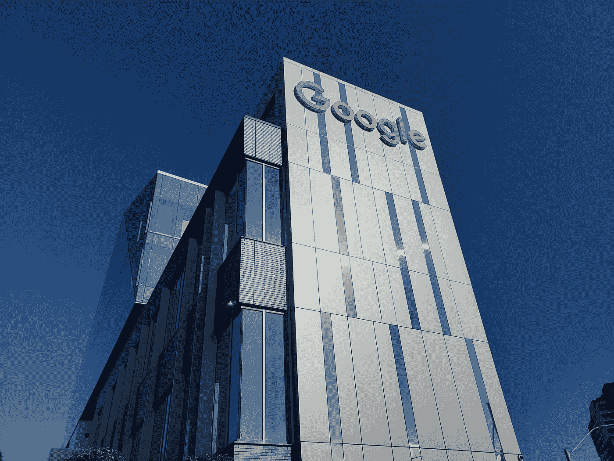
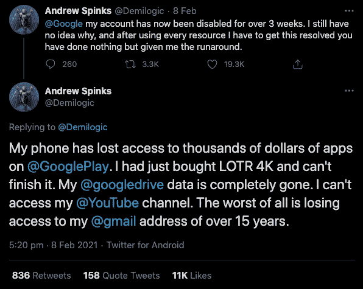

# 所以，你激怒了我们的数字霸主。

> 原文：<https://blog.devgenius.io/so-youve-angered-our-digital-overlords-5a117b1b4c77?source=collection_archive---------2----------------------->

如果您的数字身份被盗用，您会怎么办？

我第一个承认，现在我们都太依赖技术了。我对此没有太大的问题，因为它让我的生活变得更加方便、愉快，而且它通常是有效的。通常情况下。

迪伦·卡尔在 [Unsplash](https://unsplash.com/s/photos/google?utm_source=unsplash&utm_medium=referral&utm_content=creditCopyText) 上的照片

我是谷歌生态系统的重度用户。从 Pixel 手机和 Chromebooks 到 Google Home，当然还有 Gmail——这个搜索巨头渗透到了我生活的方方面面，我过去从未对此有过任何异议。

人们总是提到谷歌是如何出售我们的数据的，等等，当你看到像你的谷歌地图时间线这样的东西时，它会让你感到不寒而栗，但我总是想“嗯，他们可能比我更有效率地使用这些数据”，就是这样。

前几天，我偶然发现了这条推特:

这无疑让我心里有些害怕。我非常依赖谷歌生态系统，我开始考虑如果我不知何故无法访问我的主要谷歌账户会发生什么。

首先，那将是我的 Gmail 和 google drive 消失了，我在那里保存了无数重要文件和对话的记录。

接下来让我担心的是我“用谷歌登录”的网站数量。根据我的谷歌账户设置，有 47 种不同的服务。

当你无法登录到这些网站时会发生什么？他们会给你发密码重置吗？你被禁用的谷歌账户。

齿轮开始转动，我越想越害怕。

我需要一个后备计划。字面上。

# 这个计划

## 云存储

我最关心的是保护我储存在谷歌硬盘上的大量重要文件。把这样的东西存储在云上并抱最好的希望可能不是最聪明的想法，但这种便利肯定是好的。

经过一些简短的搜索，我决定最快的解决方案是建立一个 Synology NAS，并使用附带的云备份包从我的各种云存储提供商那里获取所有数据。我一直想为我的家庭电脑安装一个备份系统，所以我想现在是最好的时机，NAS 也可以帮助我。我从亚马逊上买了一个 Synology DS118 磁盘站，还有一个 4TB 的希捷铁狼 NAS 驱动器。

设置非常简单，到那天结束时，我已经有了所有 google drive 数据的完整副本，放在我卧室的架子上，不断检查新的变化。干净利落。

当然，我可以自己动手做一些更便宜的东西，但有时你只是想要一个简单的解决方案，并乐意为此付费。此外，DS118 是 Synology 产品中价格较低的一款。

## 电子邮件

我的数字世界末日准备清单上的下一件事是电子邮件。我用我的 Gmail 处理一切事情，个人的，商业的，几乎是我所有的在线账户。这一次会困难得多。

最重要的是，我需要保留我已经拥有的任何电子邮件和附件，以及未来的任何新邮件和附件。你可以说我是一个数据储存者，但是你永远不知道什么时候你需要一封五年前的电子邮件的晦涩的附件。已经发生了。

除了备份我现有的和未来的电子邮件，我想要一个相对干净的电子邮件地址，如果发生了可怕的事情，我可以使用它，并且我不再依赖谷歌。为此，我注册了[质子邮件](https://protonmail.com/)，这是一家以隐私和安全为荣的电子邮件提供商，而且它——这一点非常重要——并不控制我的数字身份的所有其他方面。

我现在处理邮件的计划是双管齐下。Synology NAS 有各种各样的包，用于挑选各种不同的数据源，如果没有包，您可以直接 SSH 进来，自己动手做。

我找到了[这个关于在 NAS 上设置 Gmvault](https://jeangalea.com/backup-gmail-synology-diskstation/) 的好教程，可以抓取我所有现有电子邮件的副本。这对我来说只有大约 7GB，所以不要太大。此任务可以按计划运行，以确保备份始终是最新的。与此同时，如果我们想要开始向我们的第二电子邮件提供商(在我的例子中是 Proton mail)发送电子邮件，我们还可以设置一个过滤器，将所有收到的邮件转发到我们的新地址。这意味着从现在开始，所有这些邮件在 NAS 和 Proton Mail 上都将是安全的。很好。

## 身份

这张也很吓人。现在，我的谷歌账户之前还没有被暂停过，但我想如果上面的推文是什么的话，很多东西都停止工作了。显而易见，你“登录谷歌”的能力也可能被剥夺。那是一个问题，我经常使用它。

根据我谷歌账户的 Oauth 授权，我用谷歌登录了 47 个应用。如果我无法访问所有这些应用程序，那将不是一个好日子，尤其是[概念。所以](https://notion.so)，我在那里整理我所有的在线笔记和想法(也是我起草这篇文章的地方)。

这些应用中的大多数都允许你添加额外的登录方式(像其他社交登录一样)或者——更好的是——密码。我花了周末的大部分时间来检查，尽可能地在这些服务中添加替代的登录方法，并关闭任何我不再需要或使用的服务。

找到一个替代的社交登录是困难的。我不想受制于任何一家大型科技公司，你能一直普遍使用的唯一选择就是脸书和谷歌。

最后，在可预见的未来，我将继续使用谷歌社交登录，但如果出现问题，至少我仍然可以用我的密码登录。

就目前而言，其他事情都不太重要。如果明天一切都没了，我在谷歌没有足够多的付费应用或电影，如果我无法访问它们，我会特别崩溃。

在更注重隐私的技术人群中，取消谷歌搜索是一种相当普遍的做法。到目前为止，这还不是我真正关心的大问题。我一直认为服务的便利性超过了你为之付出的代价(你的数据和隐私)。在为这篇文章搜索信息时，我想到了人们为避免搜索巨头的监视而采取的常见解决方案，于是我决定安装 Firefox，将 DuckDuckGo 设置为我的默认搜索引擎，并看看远离我们搜索引擎霸主的警惕指导的生活是什么样的。

事实证明，到目前为止还不错。我知道 Firefox 并不差，但当涉及到有意义的搜索结果时，DuckDuckGo 确实令人印象深刻。

我认为做最坏的打算，抱最好的希望是很重要的。做好应急准备很重要，这样如果你丢失了你网络身份的关键部分，你就不会死在水里。

还有一些我需要解决的问题，比如我的谷歌照片和我的谷歌主页，但总的来说，在没有太多工作的情况下，我现在处于一个更好的位置，对我的数字身份的状态感到更舒服。

到目前为止，我还没有停止使用谷歌生态系统的计划，但是如果到了紧要关头，我会活下来。