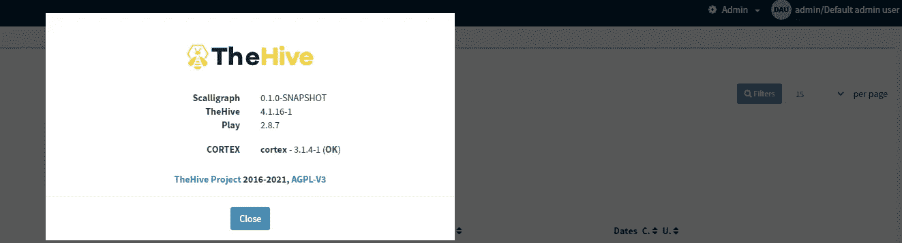

# 借助 HEV、Cortex 和 Elasticsearch 实现 SOC

> 原文：<https://blog.devgenius.io/soc-implementation-with-thehive-cortex-elasticsearch-672e89219f0c?source=collection_archive---------1----------------------->


# 目录页

[什么是足球？](#e0c8)
∘[the hive](#0c47)
∘[cortex](#5b50)
[the hive 安装](#08ca)
∘ [安装 java 虚拟机](#dc5a)
∘ [安装 Cassandra 数据库](#7870)
∘ [Cassandra 配置](#b18b)
∘ [Thehive 安装步骤](#eb3e)
∘ [索引引擎](#1fbe)
∘ [文件存储 以及对 elastic search](#aef3)
[Cortex 安装](#88ca)
∘ [安装分析器](#dcec)
∘ [启用滥用 IP](#6fba)
[将 hive 与 cortex 连接](#95c7)
[运行演示](#a62c)

# 什么是足球？

安全运营中心(SOC)是一个包含信息安全团队的结构，该团队负责持续监控和评估组织的安全状况。SOC 团队的目的是使用技术解决方案和一套强大程序的组合来识别、评估和响应网络安全问题。安全分析师、工程师和管理安全运营的经理通常在安全运营中心工作。SOC 的工作人员与组织的事故响应团队密切合作，以确保安全漏洞一经发现即得到处理。

网络、服务器、端点、数据库、应用程序、网站和其他系统由安全运营中心监控和分析，安全运营中心检查可能表明安全事件或违规的异常行为。SOC 负责正确识别、分析、防御、调查和报告可能的安全事件。

在这篇博客中，我计划使用 3 个基本的开源工具来实现一个简单的 SOC 环境，这 3 个工具分别叫做 Thehive、Cortex 和 Elasticsearch。在我们动手之前，让我们先了解一下这些工具

## TheHive

hive 是一个可扩展的、开源的、免费的安全事件响应平台，与 MISP(恶意软件信息共享平台)紧密集成，旨在让 SOC、CSIRTs、CERTs 以及任何处理需要快速调查和响应的安全事件的信息安全从业者的生活更加轻松。

## 皮质

如果您使用 Cortex，就不必在每次想要利用服务或工具来评估可观察的事物并帮助调查案件或遏制风险时都重新发明轮子。使用它丰富的分析器选项，或者用任何支持 Linux 的编程语言编写自己的分析器或响应器，并与您的团队或者更好的是整个社区共享。您也可以同时查询几个 MISP 实例。

现在让我们安装所有必要的工具来实现示例 SOC

# 蜂巢装置

## 正在安装 java 虚拟机

在本次演示中，我将使用 CentOS 8 安装 Hive。作为安装的第一步，我们需要使用以下命令导入 GPG 密钥

```
sudo rpm --import https://raw.githubusercontent.com/TheHive-Project/TheHive/master/PGP-PUBLIC-KEY
```

现在我们需要为配置单元安装一些依赖项。以有序的方式运行以下命令

```
yum install -y java-1.8.0-openjdk-headless.x86_64 echo JAVA_HOME="/usr/lib/jvm/jre-1.8.0" >> /etc/environment export JAVA_HOME="/usr/lib/jvm/jre-1.8.0"
```

有时可能会应用这个命令，有时不会使用这个命令来使 java 1.8 open jdk 默认

```
update-java-alternatives --list
```

然后选择版本 1.8 并运行

```
sudo update-java-alternatives --set /path/to/java/version 1.8
```

## 安装 Cassandra 数据库

Apache Cassandra 是一个可伸缩的高可用性数据库。该版本支持 Cassandra 的最新稳定版本 **3.11.x** 。

然后让我们将 Cassandra 添加到 repo 来安装

```
vim /etc/yum.repos.d/cassandra.repo
```

然后粘贴以下内容

```
[cassandra] 
name=Apache Cassandra baseurl=https://downloads.apache.org/cassandra/redhat/311x/ gpgcheck=1 
repo_gpgcheck=1 
gpgkey=https://downloads.apache.org/cassandra/KEYS
```

那就跑

```
yum install -y cassandra
```

## 卡珊德拉构型

为此，如果你的电脑没有运行 python 2，我们需要安装 python 2

```
yum install python2
```

然后我们需要启动卡森德拉服务

```
service cassendra start 
```

然后启动下面的命令，通过

```
cqlsh localhost 9042
```

**如果在执行该命令时**出现错误，运行以下命令

首先找到 cqlshlib 所在的路径

```
find /usr/lib/ -name cqlshlib
```

使用下面的变量名导出路径

```
export PYTHONPATH=/usr/lib/python2.7/site-packages/
```

在这两步之后，再次运行前一个命令，它应该可以工作了

然后获取 cassendra 数据库并运行以下查询

```
cqlsh> UPDATE system.local SET cluster_name = 'thp' where key='local';cqlsh> exit
```

退出并运行

```
nodetool flush
```

然后转到位于/etc/cassandra/cassandra.yaml 这个位置的 Cassandra 配置文件

将以下详细信息添加到该文件中

```
# content from /etc/cassandra/cassandra.yamlcluster_name: 'thp'
listen_address: 'xx.xx.xx.xx' # address for nodes
rpc_address: 'xx.xx.xx.xx' # address for clients
seed_provider:
        - class_name:org.apache.cassandra.locator.SimpleSeedProvider
          parameters:
              # Ex: "<ip1>,<ip2>,<ip3>"
              - seeds: 'xx.xx.xx.xx' # self for the first nodedata_file_directories:- '/var/lib/cassandra/data'
commitlog_directory: '/var/lib/cassandra/commitlog'
saved_caches_directory: '/var/lib/cassandra/saved_caches'hints_directory:
     - '/var/lib/cassandra/hints'
```

然后通过运行以下命令重新启动该服务

```
systemctl daemon-reload 
service cassandra start 
chkconfig cassandra on
```

现在让我们安装直升机

## 六个安装步骤

然后我们需要创建 RPM 存储库来安装驱动程序。在这里，我打算使用稳定版本的 HEV。下面你可以找到这个阶段的必要命令

```
vim /etc/yum.repos.d/thehive-project.repo
```

将以下详细信息粘贴到创建的文件中

```
[thehive-project]
enabled=1 
priority=1 
name=TheHive-Project RPM repository 
baseurl=https://rpm.thehive-project.org/stable/noarch 
gpgcheck=1
```

要安装 run

```
sudo yum install thehive
```

安装好硬盘后，我们需要创建一些目录来存储所有的数据索引。

## 索引引擎

创建一个专用于存放文件索引的文件夹

```
mkdir /opt/thp/thehive/indexchown thehive:thehive -R /opt/thp/thehive/index
```

## 文件存储器

要在本地文件系统上存储文件，首先选择专用文件夹:

```
mkdir -p /opt/thp/thehive/files
```

该路径将用于车辆的配置。向该路径授予以下权限

```
chown -R thehive:thehive /opt/thp/thehive/files
```

要使用 Cassandra 数据库，必须使用以下行编辑和更新有效配置文件(`/etc/thehive/application.conf`):

```
db {
  provider: janusgraph
  janusgraph {
    storage {
      backend: cql
      hostname: ["127.0.0.1"] # seed node ip addresses
      cql {
        cluster-name: thp       # cluster name
        keyspace: thehive           # name of the keyspace
        local-datacenter: datacenter1   # name of the datacenter where TheHive runs (relevant only on multi datacenter setup)
        # replication-factor: 2 # number of replica
        read-consistency-level: ONE
        write-consistency-level: ONE      }
    }
  }
}update data storage part db {
  provider: janusgraph
  janusgraph {
    storage {
      [..]
    }
    ## Index configuration
    index.search {
      backend : lucene
      directory:  /opt/thp/thehive/index
    }
  }
}
```

## 文件系统

如果您选择在本地文件系统上存储文件:

确保文件夹的权限

```
chown -R thehive:thehive /opt/thp/thehive/files
```

将以下几行添加到 Hive 配置文件(`/etc/thehive/application.conf`)

```
## Storage configuration 
storage { 
provider = localfs 
localfs.location = /opt/thp/thehive/files 
}
```

保存对配置文件所做的所有更改并运行

```
service thehive start
```

然后打开浏览器，通过以下链接登录系统

```
http://YOUR_SERVER_ADDRESS:9000/
```

当你得到那个网址时，你可能会得到一个如下所示的网页


活跃的登录页面

***登录:admin@thehive.local***

***密码:秘密***

# 弹性搜索装置

在所有这些实施后，我计划整合 wazuh 经理。因此，我将安装 wazuh 推荐的 elasticsearch opendisro 版本，它与普通的 elasticsearch 没有太大区别。

安装安装所需的软件包:

```
yum install curl unzip wget
```

导入 GPG 密钥:

```
rpm --import [https://packages.wazuh.com/key/GPG-KEY-WAZUH](https://packages.wazuh.com/key/GPG-KEY-WAZUH)
```

添加存储库:

```
cat > /etc/yum.repos.d/wazuh.repo << EOF
[wazuh]
gpgcheck=1
gpgkey=[https://packages.wazuh.com/key/GPG-KEY-WAZUH](https://packages.wazuh.com/key/GPG-KEY-WAZUH)
enabled=1
name=EL-\$releasever - Wazuh
baseurl=[https://packages.wazuh.com/4.x/yum/](https://packages.wazuh.com/4.x/yum/)
protect=1
EOF
```

安装 Elasticsearch 的开放发行版:

```
yum install opendistroforelasticsearch
```

然后转到/etc/elastic search/elastic search . yml 文件，编辑下面的详细信息

```
# ------------------------------ Network --------------------------network.host: 192.168.0.1http.port: 9200
```

在“网络”下，删除“收件人”中的哈希标记，并重新启动服务

***这部分不是必须的，除非你想在通信之间有 SSL 连接。如果出于测试目的，则不需要它；如果出于某种生产目的，则需要启用安全性。***

安装 Elasticsearch 后，下载预配置的配置文件:

```
curl -so /etc/elasticsearch/elasticsearch.yml [https://packages.wazuh.com/resources/4.2/open-distro/elasticsearch/7.x/elasticsearch.yml](https://packages.wazuh.com/resources/4.2/open-distro/elasticsearch/7.x/elasticsearch.yml)
```

## 弹性搜索角色和用户

您需要添加用户和角色才能正确使用 Wazuh Kibana 插件。

```
curl -so /usr/share/elasticsearch/plugins/opendistro_security/securityconfig/roles.yml [https://packages.wazuh.com/resources/4.2/open-distro/elasticsearch/roles/roles.yml](https://packages.wazuh.com/resources/4.2/open-distro/elasticsearch/roles/roles.yml)
curl -so /usr/share/elasticsearch/plugins/opendistro_security/securityconfig/roles_mapping.yml [https://packages.wazuh.com/resources/4.2/open-distro/elasticsearch/roles/roles_mapping.yml](https://packages.wazuh.com/resources/4.2/open-distro/elasticsearch/roles/roles_mapping.yml)
curl -so /usr/share/elasticsearch/plugins/opendistro_security/securityconfig/internal_users.yml [https://packages.wazuh.com/resources/4.2/open-distro/elasticsearch/roles/internal_users.yml](https://packages.wazuh.com/resources/4.2/open-distro/elasticsearch/roles/internal_users.yml)
```

## 为 Elasticsearch 创建和部署证书

删除演示证书:

```
rm /etc/elasticsearch/esnode-key.pem /etc/elasticsearch/esnode.pem /etc/elasticsearch/kirk-key.pem /etc/elasticsearch/kirk.pem /etc/elasticsearch/root-ca.pem -f
```

生成并部署证书:

a.下载`wazuh-cert-tool.sh`创建证书:

```
curl -so ~/wazuh-cert-tool.sh [https://packages.wazuh.com/resources/4.2/open-distro/tools/certificate-utility/wazuh-cert-tool.sh](https://packages.wazuh.com/resources/4.2/open-distro/tools/certificate-utility/wazuh-cert-tool.sh)
curl -so ~/instances.yml [https://packages.wazuh.com/resources/4.2/open-distro/tools/certificate-utility/instances.yml](https://packages.wazuh.com/resources/4.2/open-distro/tools/certificate-utility/instances.yml)
```

b.编辑`~/instances.yml`并用相应的名称和 IP 地址替换值`<node-name>`和`node-IP`。根据需要添加任意数量的节点字段:

```
# Elasticsearch nodes
elasticsearch-nodes:
  - name: <node-name>
    ip:
      - node-IP# Wazuh server nodes
wazuh-servers:
  - name: <node-name>
    ip:
      - node-IP# Kibana node
kibana:
  - name: <node-name>
    ip:
      - node-IP
```

c.运行`wazuh-cert-tool.sh`创建证书:

```
bash ~/wazuh-cert-tool.sh
```

d.将`elasticsearch-node-name`替换为您的 Elasticsearch 节点名称，与在`instances.yml`中创建证书时使用的名称相同，并将证书移动到相应的位置

```
node_name=elasticsearch-node-namemkdir /etc/elasticsearch/certs/
mv ~/certs/$node_name* /etc/elasticsearch/certs/
mv ~/certs/admin* /etc/elasticsearch/certs/
cp ~/certs/root-ca* /etc/elasticsearch/certs/
mv /etc/elasticsearch/certs/$node_name.pem /etc/elasticsearch/certs/elasticsearch.pem
mv /etc/elasticsearch/certs/$node_name-key.pem /etc/elasticsearch/certs/elasticsearch-key.pem
```

e.压缩要发送到所有实例的所有必要文件:

```
cd ~/certs/
tar -cvf certs.tar *
mv ~/certs/certs.tar ~/
```

启用并启动 Elasticsearch 服务:

```
mkdir -p /etc/elasticsearch/jvm.options.d
echo '-Dlog4j2.formatMsgNoLookups=true' > /etc/elasticsearch/jvm.options.d/disabledlog4j.options
chmod 2750 /etc/elasticsearch/jvm.options.d/disabledlog4j.options
chown root:elasticsearch /etc/elasticsearch/jvm.options.d/disabledlog4j.options
```

配置后，重新加载服务

```
systemctl daemon-reload
systemctl enable elasticsearch
systemctl start elasticsearch
```

安装和配置 Elasticsearch 后，现在我们可以安装 Cortex 了。

# Cortex 安装

如果您使用的是安装了的同一个实例或机器，必须安装 Cortex。你必须进口 GPG 钥匙

```
sudo rpm --import [https://raw.githubusercontent.com/TheHive-Project/TheHive/master/PGP-PUBLIC-KEY](https://raw.githubusercontent.com/TheHive-Project/TheHive/master/PGP-PUBLIC-KEY)
```

稳定存储库是一个遗留存储库，包含不支持 elastic search 7 . x 版但支持 6.x 版的 Cortex 3.0.1 包。

设置您的系统以连接 RPM 存储库。创建并编辑文件`/etc/yum.repos.d/thehive-project.repo`:

```
[thehive-project]
enabled=1
priority=1
name=TheHive-Project RPM repository
baseurl=[https://rpm.thehive-project.org/stable/noarch](https://rpm.thehive-project.org/stable/noarch)
gpgcheck=1
```

然后，您将能够使用`yum`安装 Cortex 3.0.1 包:

```
yum install cortex
```

然后转到/etc/cortex/application.conf 文件并编辑以下内容


/etc/cortex/应用程序. conf

将 URI 更改为 Elasticsearch IP ex-[http://127 . 0 . 0 . 1:9200](http://127.0.0.1:9200)***如果您在 elastic search 中启用了*** 认证，您可能需要进行第二个红色框中给出的认证。

现在我们需要 cortex 服务器的密钥，现在让我们导入该密钥

```
sudo mkdir /etc/cortex
(cat << _EOF_
# Secret key
# ~~~~~
# The secret key is used to secure cryptographics functions.
# If you deploy your application to several instances be sure to use the same key!
play.http.secret.key="$(cat /dev/urandom | tr -dc 'a-zA-Z0-9' | fold -w 64 | head -n 1)"
_EOF_
) | sudo tee -a /etc/cortex/application.conf
```

这将生成密钥并将该密钥添加到 application.conf 文件中。

然后启动服务

并转到

```
http://YOUR_SERVER_ADDRESS:9001/
```

它会将你重定向到一个像这样的页面点击更新数据库，它会显示一个页面来创建登录信息。


[http://127 . 0 . 0 . 1:9001/index . html #！/维护](http://127.0.0.1:9001/index.html#!/maintenance)

然后你会看到一个如下所示的登录页面


cortex 登录页面

然后，您可能会看到如下页面


管理仪表板

## 安装分析仪

你可能需要安装 Python 的`setuptools`，更新 pip/pip3:

```
sudo pip install -U pip setuptools && sudo pip3 install -U pip setuptools
```

完成后，在您选择的目录中克隆 Cortex-analyzer 存储库:

```
git clone [https://github.com/TheHive-Project/Cortex-Analyzers](https://github.com/TheHive-Project/Cortex-Analyzers)
```

每个分析仪都有自己的 pip 兼容`requirements.txt`文件。您可以使用以下命令安装所有需求:

```
for I in $(find Cortex-Analyzers -name 'requirements.txt'); do sudo -H pip2 install -r $I; done && \
for I in $(find Cortex-Analyzers -name 'requirements.txt'); do sudo -H pip3 install -r $I || true; done
```

接下来，您需要告诉 Cortex 在哪里可以找到分析器。分析器可能位于不同的目录中，如 Cortex 配置文件(`application.conf`)的虚拟示例所示:

```
analyzer {
  # Directory that holds analyzers
  path = [
    "/path/to/default/analyzers",
    "/path/to/my/own/analyzers"
  ]fork-join-executor {
    # Min number of threads available for analyze
    parallelism-min = 2
    # Parallelism (threads) ... ceil(available processors * factor)
    parallelism-factor = 2.0
    # Max number of threads available for analyze
    parallelism-max = 4
  }
}responder {
  # Directory that holds responders
  path = [
    "/path/to/default/responder",
    "/path/to/my/own/responder"
  ]fork-join-executor {
    # Min number of threads available for analyze
    parallelism-min = 2
    # Parallelism (threads) ... ceil(available processors * factor)
    parallelism-factor = 2.0
    # Max number of threads available for analyze
    parallelism-max = 4
  }
}
```

然后让我们重新启动服务

```
sudo systemctl restart cortex
```

然后登录到创建的帐户，在此之前您可能看不到任何响应者和分析者，因为我们首先需要创建组织


创建 cortex 组织

单击组织并输入要创建和保存的详细信息


创建用户

添加一个用户，然后使用该用户登录到 cortex


用户仪表板

现在，您可以看到分析器和响应器选项卡，使用它们，我们需要启用分析器

为此，请转到“组织”,然后单击“分析器”。


分析器

这些分析器大多是由其他供应商提供的独立第三方服务。

## 启用滥用 IP


滥用 IP 授权

首先单击 AbuseIPDB_1_0 上的 enable，它要求 api 密钥
现在我们需要转到[https://www.abuseipdb.com/account](https://www.abuseipdb.com/account)站点，创建一个帐户并获取 API 密钥


滥用 IP 仪表板

按 create API，复制密钥并放入其中，然后启用分析器

来测试它

转到如下所示的新案例，然后按“开始”,它可能会开始运行扫描


运行分析仪

然后它显示如下


扫描结果

然后，如果您按下查看，它会显示如下结果


abuseIP 的结果

我们可以用肝脏做同样的事情，因为我们需要连接肝脏和大脑皮层

# 连接肝脏和大脑皮层

首先，我们需要以管理员身份登录到 cortex，并获得我们创建的组织(在我的例子中是它的测试)

然后我们需要为车辆生成一个 API 密钥


为 Hive 创建 API

然后转到/etc/thehive/application.conf 文件并编辑以下内容


etc/thehive/application.conf

然后重新启动高速服务

```
sudo systemctl restart Thehive
```

然后登录到手机

当你点击这个图标，你会看到如下的内容



与皮层相连

这意味着肝脏和大脑皮层成功连接。

# 运行演示

就像在大脑皮层中一样，我们也需要为此创建一个组织


创建配置单元组织

然后在那下面我们需要创建用户


创建用户


正在为用户添加密码

然后使用创建的用户登录到车辆


配置单元用户的仪表板

现在创建一个新案例


创建新案例

然后它会把你重定向到这样一个页面


前往 observables


在这里给信息，就像上面提到的，我计划看到一个 IP 8.8.8.8


然后选择创建的可观察值，点击 1 选择的可观察值并运行分析仪。它可能弹出一个窗口来选择分析器，选择 AbuseIPDB 并运行它


然后，它将生成类似如下的报告


我将在这里附上另一篇博客，介绍如何通过使用 Nginx revers 代理启用 SSL 来确保这些系统的安全

我会在另一个博客里看到你。

再见…..

# 依赖

[](https://thehive-project.org/) [## 高等教育项目

### Hive4py 允许分析师从电子邮件或 SIEM 等不同来源创建案例。例如，SOC 可能会问…

thehive-project.org](https://thehive-project.org/) [](https://github.com/TheHive-Project/CortexDocs) [## GitHub-the hive-Project/CortexDocs:Cortex 的文档

### Cortex 解决了 SOC、CSIRTs 和安全研究人员在研究过程中经常遇到的两个问题

github.com](https://github.com/TheHive-Project/CortexDocs) [](https://documentation.wazuh.com/current/installation-guide/open-distro/distributed-deployment/step-by-step-installation/elasticsearch-cluster/elasticsearch-single-node-cluster.html#elasticsearch-single-node-cluster) [## 弹性搜索单节点集群-弹性搜索集群

### 在单节点集群上安装 Elasticsearch。Elasticsearch 开放发行版是一个开源发行版…

documentation.wazuh.com](https://documentation.wazuh.com/current/installation-guide/open-distro/distributed-deployment/step-by-step-installation/elasticsearch-cluster/elasticsearch-single-node-cluster.html#elasticsearch-single-node-cluster)