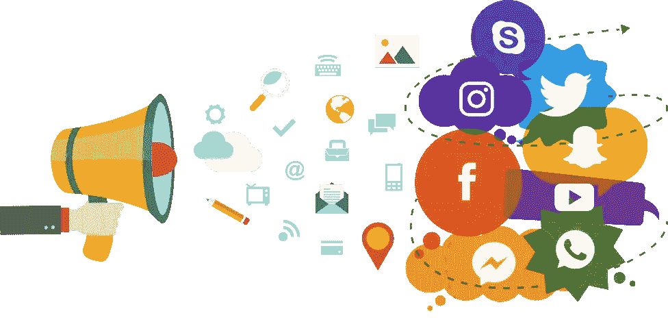

# 社交媒体正在摧毁年轻一代。怎么才能避免呢？

> 原文：<https://blog.devgenius.io/social-media-is-destroying-the-youth-generation-how-can-you-avoid-it-4ecbc13cc51?source=collection_archive---------8----------------------->

> 社交媒体已经成为我们日常生活中不可或缺的一部分，在年轻人中尤其流行。虽然社交媒体有很多好处，但如果使用不当，也会对职业生涯有害。

来源:www.kindpng.com

以下是社交媒体破坏职业生涯的一些方式，以及如何避免这些陷阱的一些建议:

1.  **发布不当或冒犯性内容:**留意你在社交媒体上发布的内容很重要，因为这可能会产生长期后果。雇主可能不太可能雇用有发布攻击性或不当内容历史的人，因为这可能损害公司的声誉。
2.  **参与网上争论或对抗:**社交媒体可能是冲突的温床，在网上参与和他人的争论或对抗是很有诱惑力的。然而，这些类型的互动会损害你的声誉，让你显得不专业。
3.  **过度分享个人信息:**虽然在社交媒体上分享你个人生活的每一个细节可能很诱人，但重要的是要记住，你的网上形象是你职业形象的反映。避免分享过多的个人信息或任何可能被认为不合适或不专业的信息。
4.  在社交媒体上花费太多时间:人们很容易被卷入社交媒体的无尽卷轴中，但重要的是要记住，你的时间最好花在其他有助于你职业生涯的任务上。将社交媒体的使用限制在合理的时间内，以避免工作进度落后或错过重要机会。
5.  **忽视你的网络声誉:**你的网络声誉会对你的职业生涯产生重大影响，所以小心管理它很重要。定期谷歌自己，清理任何可能出现的负面或不适当的内容。
6.  **发布不专业的照片或内容:**虽然拥有个人生活并在社交媒体上分享个人照片没问题，但注意你发布的内容很重要。避免发布可能被认为不专业或不合适的照片或内容。这包括任何可能被视为冒犯、非法或违反雇主政策的行为。
7.  **忽略在线隐私设置:**你的社交媒体档案本质上是你个人品牌的延伸，所以小心管理它们很重要。请确保适当设置您的隐私设置，并且只接受来自您认识和信任的人的好友或关注者请求。这将有助于保护你的个人和职业声誉。
8.  **利用社交媒体的优势:**尽管注意社交媒体的潜在风险很重要，但它也可以成为建立和促进职业生涯的有力工具。用它来联系你所在领域的其他人，了解最新的行业趋势，展示你的技能和成就。
9.  **注意发布敏感信息的风险:**社交媒体是一个公共论坛，你发布的任何内容都有可能被任何人看到。意识到发布敏感信息的风险，如财务或个人信息，并考虑是否值得冒险在网上分享这些信息。
10.  **如果你在网上被骚扰或欺凌，寻求帮助:**如果你在社交媒体上被骚扰或欺凌，寻求帮助很重要。这可能包括与信任的朋友或家庭成员交谈，联系心理健康专家，或向社交媒体平台报告虐待行为。

来源:[www.kindpng.com](http://www.kindpng.com)

# 以下是一些你可以用来避免在社交媒体上花费太多时间的策略:

1.  设定限制:许多社交媒体平台允许你设定在上面花费时间的限制。考虑限制你的使用量，帮助你保持在合理的时间内。
2.  **使用工具跟踪你的使用情况:**有许多工具可以帮助你跟踪你的社交媒体使用情况，并帮助你保持在限制范围内。考虑使用这些工具之一来监控您的使用情况，并在您接近极限时收到提醒。
3.  **关闭通知:**每次收到通知时查看社交媒体可能很诱人，但这可能会导致过度使用。考虑关闭社交媒体应用的通知，或者将它们设置为在一天中的特定时段“请勿打扰”。
4.  **寻找保持联系的替代方式:**不要依赖社交媒体与朋友和家人保持联系，考虑寻找替代的沟通方式，如发短信、打电话或视频聊天。
5.  **为特定目的使用社交媒体:**不要漫无目的地浏览你的订阅，考虑为特定目的使用社交媒体，比如了解最新的行业新闻或与同事联系。这可以帮助你更有效地使用社交媒体，避免浪费时间。

遵循这些建议，你可以限制社交媒体的使用，避免它消耗你太多的时间。

来源:[www.pngtree.com](http://www.kindpng.com)

> 总的来说，年轻人应该注意他们如何使用社交媒体，并意识到他们的在线行为的潜在后果。对他们来说，以符合个人和职业目标的方式使用社交媒体也很重要，而不是让它消耗他们太多的时间或精力。

谢谢大家！