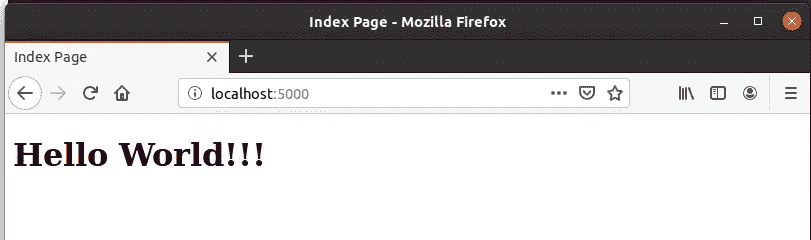

# C 语言中的套接字编程——加分

> 原文：<https://blog.devgenius.io/socket-programming-in-c-bonus-d794a0dc6f7?source=collection_archive---------11----------------------->


在本系列的前两篇博客中，我们看到了一个使用套接字的服务器-客户端通信的非常简单的实现，其中我们使用套接字创建了服务器和客户端。但是一般来说，我们的客户是我们提出请求的网络浏览器。因此，在这篇博客中，我将演示在我们预先构建的服务器上处理这些请求。

# 套接字创建和绑定

服务器的创建与前面完全相同。之前的代码只有一些小改动。

```
int sockfd, newsockfd;
int clilen;
struct sockaddr_in cli_addr, serv_addr;
int i;
char buffer[4096];

if ((sockfd = socket(AF_INET, SOCK_STREAM, 0)) < 0)
{
  printf("Cannot create socket\n");
  exit(0);
}

serv_addr.sin_family = AF_INET;
serv_addr.sin_addr.s_addr = htonl(INADDR_ANY);
serv_addr.sin_port = htons(5000);

if (bind(sockfd, (struct sockaddr *)&serv_addr, sizeof(serv_addr)) < 0)
{
  printf("Unable to bind local address\n");
  exit(0);
}

listen(sockfd, 5);
```

这里引入两个新函数， **htonl()** 和 **htons()** 。有用于将地址和端口号从本机字节顺序转换为网络字节顺序。嗯，听起来有点复杂。我给你简单解释一下。

基本上**字节顺序**就是系统中数字的顺序。例如，大端字节顺序将字的最高有效字节存储在最小的内存地址。

> 网络字节顺序总是被定义为大端顺序，这可能与主机的字节顺序不同。所以，我们需要转换它们。

# 处理来自浏览器的请求

HTTP 请求有一些包含请求方法类型(GET、POST 等)的预定义格式。)、路径、内容类型、用户代理等。因此，现在每当我们从浏览器收到请求时，它都是这种格式，我们需要解析它来提取所需的数据。

```
Sample request format:

GET / HTTP/1.1
Host: localhost:5000
User-Agent: Mozilla/5.0 (X11; Ubuntu; Linux x86_64; rv:69.0) Gecko/20100101 Firefox/69.0
Accept: text/html,application/xhtml+xml,application/xml;q=0.9,*/*;q=0.8
Accept-Language: en-US,en;q=0.5
Accept-Encoding: gzip, deflate
Connection: keep-alive
Upgrade-Insecure-Requests: 1
```

这里，GET 后面的“/”是客户端请求的路径，我们将返回一些 HTML 内容作为响应。

接受连接的代码与前面的一样，只有我们传输数据的部分会发生变化。

连接建立后，使用 recv()函数将请求存储在字符串缓冲区中，并从中提取方法类型和请求的路径。

```
if (strncmp(buffer, "GET ", 4) == 0)
{
    char *path = NULL;
    path = strtok(buffer, " "); // returns the string "GET"
    path = strtok(NULL, " ");   // returns the requested path
    if (strcmp(path, "/") == 0)
    {
        ...
    }
}
```

对于此示例，在请求路径“/”上，服务器将读取并发送存储在系统(即服务器)中的 index.html 文件的内容。

```
if ((file_fd = open("index.html", O_RDONLY)) == -1)
{
      printf("File error!");
      continue;
}
len = lseek(file_fd, (off_t)0, SEEK_END); // length of file                                                              /* lseek to the file end to find the length */
lseek(file_fd, (off_t)0, SEEK_SET);
```

在发送 HTML 内容之前，必须发送一些标题，如响应的状态码、内容长度、内容类型等。以便客户机(浏览器)能够理解作为响应的数据类型以及如何显示它。

```
Example:
HTTP/1.1 200 OK
Content-Length: 50
Content-Type: text/html
…
```

标题和 HTML 文件内容将使用 send()函数发送。

```
// writing headers into buffer string
sprintf(buffer, "HTTP/1.1 200 OK\nContent-Length: %ld\nConnection: close\nContent-Type: text/html\n\n", len);

// sending headers to client
send(newsockfd, buffer, strlen(buffer),0);

// sending file content
while ((ret = read(file_fd, buffer, 4096)) > 0)
{
    send(newsockfd, buffer, ret, 0);
}
```

现在，该文件可以包含大量内容，因此应该以字节块的形式发送，比如 4096 字节的块。

完成了！！！总之，我们使用套接字创建了一个简单的服务器，解析来自浏览器的请求，提取方法类型和请求路径，并基于此提供响应。对于不同的路径，可以重复相同的过程。

## 查看运行中的代码:

运行服务器代码，打开浏览器，输入服务器的地址(这里是 *localhost:5000/* )。定义的 index.html 在浏览器中加载并显示其内容。



输出

在这个例子中，我只展示了 GET 请求的处理。它还可以扩展到处理 POST 请求。我们只需解析 POST 请求，提取包含参数的路径和请求体。

```
POST request will have below format:

POST / HTTP/1.1
Host: localhost:5000
User-Agent: Mozilla/5.0 (X11; Ubuntu; Linux x86_64; rv:69.0) Gecko/20100101 Firefox/69.0
Accept: text/html,application/xhtml+xml,application/xml;q=0.9,*/*;q=0.8
Accept-Language: en-US,en;q=0.5
Accept-Encoding: gzip, deflate
Content-Type: application/x-www-form-urlencoded
Content-Length: 8
Connection: keep-alive
Referer: http://localhost:5000/
Upgrade-Insecure-Requests: 1

name=asde&age=17&...
```

> 参数(用户数据)将位于请求**的末尾(例如。name=asde & age=17)**

这一系列的服务器-客户端实现到此结束。如果你在这三个博客中的任何一个中发现任何困难，那么请发表评论。如果您发现任何问题或错误信息，请指出来。

表现出一些欣赏👏👏如果你觉得这个博客有帮助，请与你的同事分享。

更了解我:【https://linktr.ee/yashpaneliya】T2