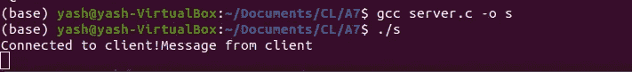
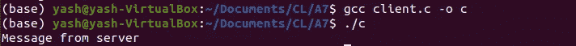

# C-Client 中的套接字编程

> 原文：<https://blog.devgenius.io/socket-programming-in-c-client-4408231f9e65?source=collection_archive---------14----------------------->


在前面的[部分](https://yashpaneliya.medium.com/socket-programming-in-c-server-ca86486f6b49)中，我们使用套接字创建了一个服务器。现在，我们将使用相同的套接字创建客户机，这些客户机将简单地向服务器发送一些字符串，并从服务器接收字符串。

# 创建一个套接字

因为我们在这个完整的例子中使用了 TCP 套接字，所以客户端必须拥有与服务器套接字相同类型的套接字(即 SOCK_STREAM)。对于这个例子，所有其他参数也将保持不变。

```
int sockfd;
/* Opening a socket is exactly similar to the server process */
if ((sockfd = socket(AF_INET, SOCK_STREAM, 0)) < 0)
{
  printf("Unable to create socket\n");
  return 0;
}
```

# 指定服务器

为了向服务器发送请求，托管服务器的地址和端口号是必需的。为了指定地址和端口号，将使用 sockaddr_in 类型的相同结构。
这里的变化是，你需要提供服务器的确切地址(不是 INADDR_ANY-like server)，否则请求可能会转到某个没有我们的服务器的随机地址。
对于本例，服务器将托管在本地机器上。要获得本地机器的 IP 地址，在终端中使用“**IP addr”**命令(对于 Linux)。

```
serv_addr.sin_family = AF_INET;
serv_addr.sin_addr.s_addr = inet_addr("<YOUR_IP_ADDRESS>"); // FORMAT: XXX.XXX.XXX.XXX
serv_addr.sin_port = 6000; // Must be same as server
```

# 连接到服务器

为了向指定的服务器发送请求，使用 connect()函数，该函数接受 socket FD、指向 sockaddr_in 结构的指针以及该结构的大小。

```
if (connect(sockfd, (struct sockaddr *)&serv_addr, sizeof(serv_addr)) < 0)
{
   printf("Unable to connect to server\n");
   return 0;
}
```

连接后，客户端可以发送或接收消息。但是，当服务器不发送时，recv()会阻塞进程，同样，当服务器不接收时，send()也会阻塞。

# 发送和接收数据

对于数据传输，使用 send()和 recv()函数。

```
for (i = 0; i < 100; i++)
    buf[i] = '\0';
recv(sockfd, buf, 100, 0);
printf("%s\n", buf);
for (i = 0; i < 100; i++)
    buf[i] = '\0';
while (1)
{
    strcpy(buf, "Message from client");
    send(sockfd, buf, 100, 0);
}
close(sockfd);
```

工作完成后需要关闭插座。否则不会被其他进程使用。

# 最终代码

```
int sockfd;
struct sockaddr_in serv_addr;
int i;
char buf[100];
/* Opening a socket is exactly similar to the server process */
if ((sockfd = socket(AF_INET, SOCK_STREAM, 0)) < 0)
{
    printf("Unable to create socket\n");
    return 0;
}
serv_addr.sin_family = AF_INET;
serv_addr.sin_addr.s_addr = inet_addr("<YOUR_IP_ADDRESS>");
serv_addr.sin_port = 6000;

if (connect(sockfd, (struct sockaddr *)&serv_addr, sizeof(serv_addr)) < 0)
{
    printf("Unable to connect to server\n");
    return 0;
}

for (i = 0; i < 100; i++)
    buf[i] = '\0';
recv(sockfd, buf, 100, 0);
printf("%s\n", buf);
for (i = 0; i < 100; i++)
    buf[i] = '\0';
close(sockfd);
```

## 查看运行中的代码:

打开两个终端，在一个终端上运行服务器代码，在另一个终端上运行客户端代码。



服务器输出



客户端输出

这里完成了一个非常简单的使用套接字的服务器-客户端通信的实现。在下一个也是最后一个[部分](https://medium.com/@yashpaneliya/socket-programming-in-c-bonus-d794a0dc6f7)，我将演示如何处理来自浏览器的请求。它将更加实用，因为我们通常在日常生活中从浏览器发送请求。

如果你在本博客中发现任何问题或错误信息，请发表评论。这将有助于我和许多其他学习者理解这个概念。

表现出一些欣赏👏👏如果你觉得这个博客有帮助，请与你的同事分享。

更了解我:[https://linktr.ee/yashpaneliya](https://linktr.ee/yashpaneliya)