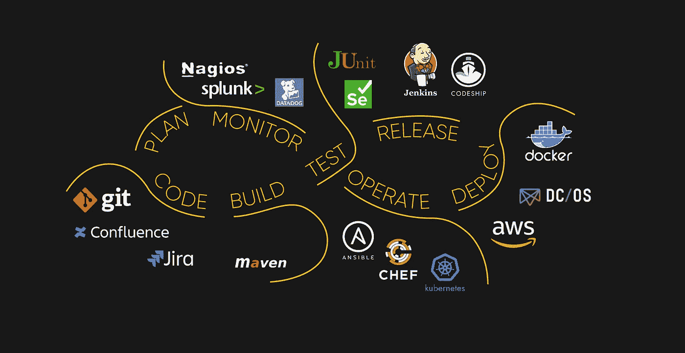
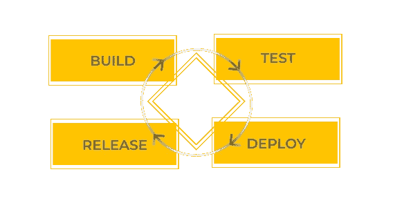

# 软件交付实践指南:部署和开发

> 原文：<https://blog.devgenius.io/software-delivery-practices-guide-deployment-and-development-a4647405cb67?source=collection_archive---------9----------------------->

在我们的实践中，我们会收到许多客户的请求，他们希望就组织他们的交付过程征求建议。UppLabs 的团队决定收集所有这些问题，并分享我们持久的专业知识。您应该监控什么以确保您的产品工作稳定并且没有任何遗漏的问题？如何从数据库崩溃中保存数据？可以使用哪些 DevOps 工具？

本文揭示了项目开发和部署的最佳实践，提供了基础设施和应用程序安全策略的清单，并回答了所有潜在的问题。

这篇文章最初发表在 Tonya Smyrnova 的 UppLabs 博客上。

# 1.监视系统

监控是任何软件开发过程的起点。我们的监控系统包括以下步骤:

*   健康检查—检查每个可能的问题，如数据库连接、磁盘空间等。；
*   错误日志——在应用程序旁边运行特定的服务，以发现 CPU 或内存使用中的错误；
*   延迟日志—识别并修复延迟问题和差距；
*   警告日志—对警告日志应用安全措施。
*   资源使用——为每项任务的资源和整体绩效创建列表。

附加的监控系统可以包括授权监控和审计日志。

[**询问 UppLabs 关于监控系统**](https://upplabs.com/contact-us/)

# 2.基础设施和应用安全策略

难怪攻击者的首要目标是个人数据和凭证。为了防止这种情况发生，我们有几个 [**安全实践**](https://upplabs.com/blog/security-practices-for-fintech-projects/) 可以应用:

*   用户授权；
*   自动注销；
*   数据加密和解密；
*   密码政策；
*   实际用户和组访问
*   双因素认证
*   网络分段。VPN 和专用网络；
*   应用补丁管理/更新管理；
*   最新的软件和操作系统
*   防火墙和防病毒软件；
*   SSH 密钥认证；
*   定期检查漏洞；
*   备份数据。

# 3.定期数据备份

每个数据库软件都需要备份运行状态、架构和存储数据的过程。数据备份确保在数据库崩溃或损坏的情况下创建重复的实例。它还可以作为恢复数据库的保护和保证。

存在以下类型的备份:

*   完整或定期备份—所有数据都被复制到另一个位置；
*   增量备份—自上次备份以来更改过的信息的备份；
*   差异备份—备份自上次运行完整备份以来所有更改的数据；
*   每日备份—每天定期备份。

# 4.DEVOPS 安全

更多的犯罪分子在网络空间进行网络威胁，试图破坏信息系统并窃取数据或金钱。在这种情况下，我们需要实施包括运营和安全专业知识的 DevOps 安全性。实际的 DevSecOps 方法需要考虑六个主要部分:

*   代码分析
*   变更管理
*   监控合规性
*   调查威胁
*   脆弱性评估
*   培养

[**询问 UppLabs 关于 DevOps 安全方法的各个组成部分！**](https://upplabs.com/contact-us/)

# 5.持续集成、交付(CI/CD)

开发人员使用持续集成将他们的变更合并到主分支。持续集成(CI)意味着检查应用程序及其到主分支的集成的测试自动化。持续交付(CD)是持续集成的发展，它将所有代码变更部署到生产环境中。该阶段包括以下检查:

*   测试覆盖
    检查和测量执行的测试数量；
*   代码标准
    检查你的源代码；
*   单元测试
    检查软件的单个单元和组件；
*   集成测试
    检查各种组合中的单个软件模块；
*   端到端(自动化)测试
    从头到尾检查一个应用流程；

# 6.DEVOPS 工具

DevOps 工具的主要目的是在软件开发生命周期中引入一个新的流程，并使用构建、测试、部署和发布等功能来自动化流程链。根据具体要求，开发运维工具通常分为三种主要类型:

过程链特征，UppLabs

*   测量工具——分析、测量和实施审计流程。
*   持续测试的工具——通过早期和经常的测试，在持续交付过程的每个阶段评估软件质量。
*   持续交付的工具

# 7.基础设施即代码(IAC)

基础设施即代码(IaC)是自动化基础设施所需的工具之一。IaC 使用配置文件，可以与 CI/CD 工具集成。通过正确的设置，代码可以自动将应用程序版本从一个环境转移到另一个环境进行测试。

基础设施即代码允许企业添加他们想要的任何基础设施组件，例如网络、数据库、虚拟机、负载平衡器和连接类型。这个过程很快就能得到结果，因为它使团队能够管理所需的云设置，并快速测试他们的应用程序。IaC 解决了三个主要挑战，如每个 IT 环境设置的高价格、设置时间的减少以及环境的不一致性。

## IaC 最佳实践包括:

*   在配置文件中定义规范和参数；
*   版本控制所有配置文件；
*   在将任何更改推向生产之前，始终要测试和监控环境；

将您的基础设施分成多个组件，然后通过自动化将它们组合起来。

[**下载 UppLabs**](https://share.hsforms.com/155GWR8MfT4Wqiatj7moEjA45lzw) 的最佳交付实践清单

# 8.测试

[**性能测试**](https://upplabs.com/services/quality-engineering-testing/) 关注的是一个处理系统如何在特定负载下工作，修复可能的 bug，并提供开发者的诊断。QA 工程师在项目中完成一项重要的任务。他们防止错误，并对开发过程和项目结果的质量负责。有不同的测试类型，如负载、压力、浸泡、峰值测试等。性能测试的主要规则是:

*   在开发中尽可能早地进行测试。
*   性能测试不只是针对已完成的项目。
*   进行多次性能测试，以确保结果一致。
*   应用程序通常涉及多个系统，如数据库、服务器和服务。
*   谷歌页面速度。

UppLabs 团队完全遵循这些规则。

# 9.自动化测试

在持续的开发运维过程中，从开发到测试再到部署，变化是持续的。代码被不断地测试、开发、交付和部署。在 CI/CD 管道中使用自动化测试的最大优势是:

*   更快的 bug 关闭(问题发现->问题修复->问题关闭)。
*   有效利用手中的综合资源。
*   并行执行测试的能力。
*   测试计划和执行的一致性。
*   自动化测试用例执行所需的技术技能的最低要求。

# 10.编码标准

每个公司都创建自己的编码标准。我们也这样做。这些标准在代码重构的情况下会很有用。他们也帮助开发人员依靠一些通用的基础，互相学习。

## 符合 UppLabs 的编码标准:

1.  同意您的团队代码实践来遵循。
2.  列出要使用的库和组件。
3.  扎实(面向对象设计的五个主要原则)，
    干(不重复自己原则)，
    亲亲原则(系统保持简单比复杂效果更好)。
4.  结对编程/代码审查。
5.  说出负责代码质量并将进行公关审查的技术负责人的名字。
6.  理解并最小化你的技术债务。

为您的项目下载完整的 UppLabs 软件交付实践清单！

[**下载 UppLabs 的最佳交付实践清单**](https://share.hsforms.com/155GWR8MfT4Wqiatj7moEjA45lzw)

# UPPLABS 如何提供帮助

我们的 [**软件开发公司**](https://upplabs.com/) 与客户端到端地工作，讨论所有可能的场景和问题，从战略到数字；我们带来转型成果。UppLabs 的任务是向您展示机会、需求和威胁。

作为您的开发团队，我们的保证包括:

1.  设计和应用适当的项目管理标准
2.  规划和监控项目(时间表和预算)
3.  [**管理项目风险**](https://upplabs.com/blog/key-elements-of-risk-management/)
4.  确保客户满意
5.  [**组织和激励项目团队**](https://upplabs.com/services/extended-team/)
6.  创建详细、全面、结构良好的技术文档
7.  评估、区分优先级、计划和协调测试活动
8.  [**开发**](https://upplabs.com/services/web-and-mobile-app-development/) 并对新产品和现有产品应用 [**开发和测试流程**](https://upplabs.com/services/quality-engineering-testing/) 以满足客户需求
9.  [提供**发现会话**提供](https://forms.gle/5CnUYAFuGovxkkAY7)
10.  CI/CD(持续集成和持续交付)

我们在新冠肺炎疫情 期间提供业务和软件开发 [**支持。
因此，您可以随时**](https://upplabs.com/blog/the-state-of-healthcare-industry-during-the-quarantine-2020/) **[**与 UppLabs**](https://upplabs.com/contacts/upplabs-calendly/) 预约通话，并将带有 [**价值主张**](https://upplabs.com/blog/value-proposition-to-validate-your-business-idea/) 的任务委托给我们！**

为你的下一个项目雇佣软件交付专家！