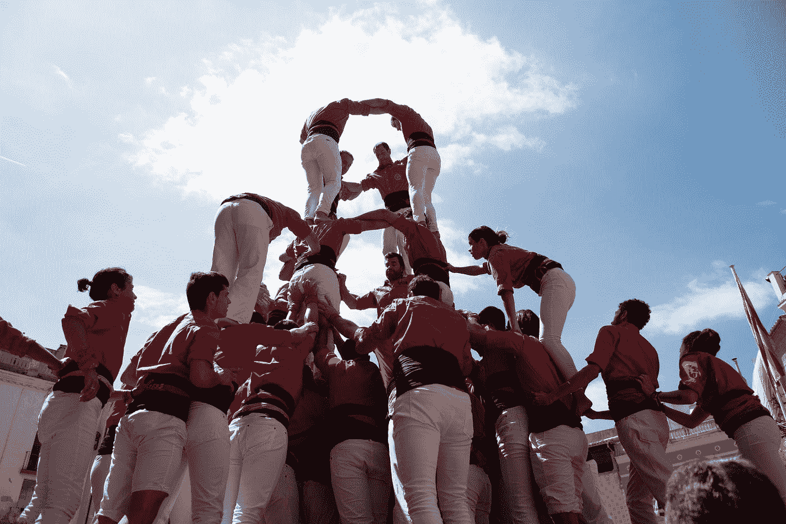

# 软件设计模式与团队管理

> 原文：<https://blog.devgenius.io/software-design-pattern-and-team-management-3c0f4f71e42d?source=collection_archive---------3----------------------->

共同点

在 [Unsplash](https://unsplash.com?utm_source=medium&utm_medium=referral) 上拍摄的 [ThisisEngineering RAEng](https://unsplash.com/@thisisengineering?utm_source=medium&utm_medium=referral)

> 如果你是一个好的工程师，你也可以成为一个伟大的领导者，使用设计模式来管理团队，并有效地沟通。

## 背景

我很幸运，现在已经在 it 行业工作了十多年。我从一名开发人员到应用程序架构师、企业架构师、经理、总监，一直到现在的 A-VP 职位，经历了各种行业，包括咨询、核心银行、零售和保险。

在这个旅程中，我热爱我的工作，我热爱编程，我热爱建立优秀的工程团队，这确保了帮助组织实现数字化转型战略并交付一致的商业价值。正如我在以前的一篇文章中提到的:

> 处于领导地位，这是个人的选择，并被警告这不是一个轻松的旅程；然而，这是一次自我挑战，一次学习之旅。

 [## 从工程师到领导者，你应该知道的五件事

### 最近写了很多技术导向的文章。如果你感兴趣，请点击下面的链接。

medium.com](https://medium.com/@jayhuang75/five-things-you-should-know-from-engineer-to-leadership-31a05938f0df) 

需要强调的是，因为这个旅程，在技术和领导力方面，这给了我一个独特的观点，以及如何通过软件设计模式管理团队的**的创造性思维。**

## 什么是软件设计模式？

设计模式代表了有经验的软件开发人员使用的最佳实践。

这些原则旨在使软件设计更容易理解，更容易维护，更容易扩展。

由 [Austin Distel](https://unsplash.com/@austindistel?utm_source=medium&utm_medium=referral) 在 [Unsplash](https://unsplash.com?utm_source=medium&utm_medium=referral) 上拍摄的照片

## 为什么管理层不同意？

作为工程师、程序员或架构师，您的工作是阐明需求并构建应用程序、代码库或解决方案，以一种**高效、成本优化且可扩展的**方式运行以交付业务价值。

作为经理/领导者，你的工作是阐明团队/组织的愿景，以**高效、成本优化和可扩展的方式**构建团队，以交付商业价值。

一个是管理技术/解决方案/代码，另一个是清晰地管理团队/个人。

整个最终目标状态是相同的，这意味着模式可以共享。

换句话说，这是关于你如何正确地做事情，有上下文。

让我们双击一个示例:

# S.O.L.I.D 原则和团队管理

> 南 O.L.I.D 是一个首字母缩写词，代表由 Robert C. Martin 理论化的面向对象编程和代码设计的五个原则。

安德鲁·凌在 [Unsplash](https://unsplash.com?utm_source=medium&utm_medium=referral) 上的照片

这是以下五个设计原则的首字母缩写词:

**【S】**单一责任原则
**【O】**笔/闭原则
**【L】**伊斯科夫替代原则
**【I】**界面分离原则
**【D】**依赖倒置原则

## 单一责任原则

> 一个类应该有且只有一个改变的理由。

英语中，“*做一件事，把它做好。”*

在管理方面:当你管理或设计团队时， ***清晰的责任是关键***；确保团队认识到他们的职责，并且他们有一个优先级，因为如果所有事情都是优先级，你或你的团队根本没有优先级。

照片由[乔希·卡拉布雷斯](https://unsplash.com/@joshcala?utm_source=medium&utm_medium=referral)在 [Unsplash](https://unsplash.com?utm_source=medium&utm_medium=referral) 拍摄

## [O]开放/封闭原则

> 您应该能够扩展一个类的行为，而无需修改它。

如果你对**面向对象编程** (OOP)有个大概的了解，你大概已经知道**多态性**。

简单来说，我们可以将一个可以是不同类型的 ***参数*** 传递给一个只有 ***一个实现*** 的函数，而不是单独的几个。

比如在 Golang 和 Rustlang 中，注释区会是带有“impl for”关键字的接口实现和 trait 实现。

照片由[马特·诺布尔](https://unsplash.com/@mcnoble?utm_source=medium&utm_medium=referral)在 [Unsplash](https://unsplash.com?utm_source=medium&utm_medium=referral) 上拍摄

在团队管理环境中，如果您管理一个以上的团队。您的团队或部门应该只有一个共同的目标和愿景。您所在部门的每个团队都应该遵循这些目标和愿景。

在这里，参赛队伍是*，而你分工的对象和视野应该是唯一的 ***一个实现*** 。*

## *伊斯科夫替代原理*

> *派生类必须可以替换它们的基类。*

*简单的英文说法:对于继承，在选择继承之前，我们需要想好前置条件和后置条件。*

*回到管理和团队建设的背景，尤其是在建立跨职能团队(例如)支持团队/运营团队时。*

*在一些公司环境中，除非你有许多全栈工程师，完全精通开发和基础设施，否则我们不能让团队支持他们关键职能范围之外的东西。*

*例如，如果一个团队支持基础设施，您不能要求他们也支持运行在基础设施之上的应用程序，即使他们在组织的同一个功能组中。*

**

*照片由[科学博士](https://unsplash.com/@scienceinhd?utm_source=medium&utm_medium=referral)在 [Unsplash](https://unsplash.com?utm_source=medium&utm_medium=referral) 上拍摄*

## *界面分离原理*

> *永远不要强迫客户端实现它不使用的接口，也不要强迫客户端依赖它们不使用的方法。*

*简而言之，*创建特定于客户端的细粒度接口。**

*这可以帮助我们设计团队的参与流程，确保它有意义并且不太普通。*

*例如，从业务流程的角度来看，每个团队都需要有一个参与流程或接受流程；这可以根据工作负载、企业目标和业务重要性来确定收入特性请求的优先级。*

*对于工程团队来说，J.I.R.A .的引入是有意义的，而对于运营团队来说，事故单-s . l . a .流程应该非常适合他们。*

## *[D]依赖性倒置原则*

> *高级模块不应该依赖于低级模块——两者都应该依赖于抽象。*

*在编程中，这是分离软件模块的方法。一个很好的例子就是将数据库驱动从 SQL 转换到 NoSQL。如果您依赖抽象接口来访问数据库，那么这将为您提供快速更改特定实现的能力，并确保系统正常工作。*

**

*micha Parzuchowski 在 [Unsplash](https://unsplash.com?utm_source=medium&utm_medium=referral) 上拍摄的照片*

*在管理上下文中，中层管理更像是抽象层。*

*他们对日常运营有足够的了解，也有足够的透明度来突出或总结运营问题、观察结果，并向高层领导提供改进建议，以确保愿景和执行反馈在健康的循环中保持一致。*

*有很多这样的例子，如果你想想那些你总是用来设计或构建伟大软件的原则或设计模式，你会意识到在软件设计模式和管理之间有很多共同之处。*

*当然，它们也是不同的。然而，这篇文章想引导你思考。*

*快乐阅读。欢迎分享你的软件设计模式和管理故事或思考。*

*下周末，我将回到一些编码和学习。*

*如果你想了解更多我以前的文章，请点击下面的链接。*

* [## 魏黄—中号

### 在媒介上阅读黄炜的作品。我喜欢学习。学会成功。Linkedin…

medium.com](https://medium.com/@jayhuang75)*