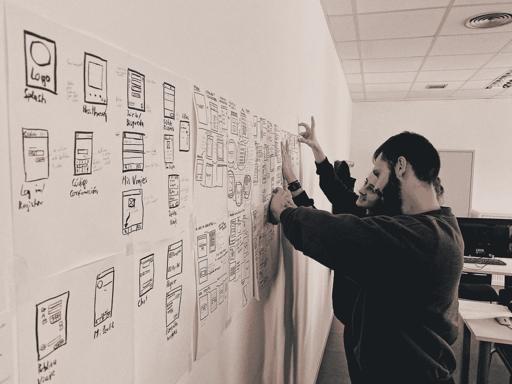

# 软件设计模式

> 原文：<https://blog.devgenius.io/software-design-patterns-1b41de14ab8b?source=collection_archive---------2----------------------->

软件设计模式概述

照片由[Á·阿尔瓦罗·伯纳尔](https://unsplash.com/@abn?utm_source=medium&utm_medium=referral)在 [Unsplash](https://unsplash.com?utm_source=medium&utm_medium=referral) 上拍摄

# 什么是软件设计模式？

维基百科说关于软件设计模式的以下内容-

> 软件设计模式是一种通用的、可重用的解决方案，用于解决软件设计中给定上下文中经常出现的问题。
> 
> 它不是一个可以直接转化为源代码或机器码的成品设计。相反，它是如何解决问题的描述或模板，可以在许多不同的情况下使用。
> 
> 设计模式是形式化的最佳实践，程序员可以用它来解决设计应用程序或系统时的常见问题。

设计模式是解决软件工程中常见问题的模板。它们提供了可重复的解决方案，您可以将这些解决方案应用于您遇到的一些常见问题。

设计模式不是可以导入到项目中的完整解决方案、代码、类或库。它们是解决问题的通用解决方案。每个项目都会有稍微不同的解决方法。

# 为什么要学习设计模式？

来源 Google/Giphy

你为什么会考虑学习设计模式呢？即使没有它们，你也可以编写代码。我可以给你几个理由-

*   **成为一名更好的软件工程师你需要知道的一些事情**——设计模式可以帮助你成为一名更好的软件工程师。在计算机程序中，很多时候一些复杂的问题可以通过使用设计模式轻松而优雅地解决。仅仅通过了解设计模式并知道如何应用，您就可以节省大量时间并提高您交付的代码的整体质量。所有这些都将帮助我们成长，成为一名更好的软件工程师。
*   **解决方案已经存在** —你生活中可能遇到的大部分问题，写代码都不新鲜。已经有一群人看到了这个问题，花了几天时间研究它，提出了一个解决方案，并且很可能在某个地方写了相关的文章。你可以利用他们的知识和经验。您不需要从头开始构建解决方案。你只需要学会识别它们。
*   **使用常用词汇改善想法的交流** —你可以通过使用设计模式名称来轻松传达你的想法，而不是描述所有的技术细节。这有助于你清楚地表达想法。
*   解决问题的标准方法——设计模式提供了一种久经考验的解决问题的方法。使用这些屡试不爽的方法来解决问题将会加速你的整个开发过程。在你的项目中使用设计模式也将帮助你发现问题，如果你没有使用它，你可能直到很晚才发现。
*   **代码可读性** —设计模式也提高了熟悉设计模式的人对代码的可读性。

# “四人帮”

早在 1994 年，一个由四个非常聪明的人组成的小组写了一本书，书名是 [*设计模式:可重用面向对象软件的元素*](https://amzn.to/3pq309a) 。这四个人是埃里希·伽马、理查德·赫尔姆、拉尔夫·约翰逊和约翰·维里西德斯。他们也被称为 GoF。

他们的书是软件工程领域的基石。这本书出版于 25 年前，至今仍很受欢迎，是软件工程师的必读书目。它记录了三类 23 种设计模式，即创造、结构和行为。

# 设计模式的类型

“四人帮”将他们的 23 种设计模式分为三组，即-

*   创造**—他们处理对象的创造。单例工厂是创造性设计模式的例子。**
*   ****结构** —它们处理对象之间的关系。适配器是结构设计模式的一个例子。**
*   ****行为** —它们处理对象之间的交互&通信。策略是行为设计模式的一个例子。**

# **常用的设计模式**

*   ****单例模式** —一个给定的类只能有一个实例。这是最常用的设计模式之一。Singleton 解决了确保一个类只有一个实例的问题。这种模式通常与 Facade、Factory &等其他模式一起使用，因为我们只需要这些类的一个实例。你可以在这里找到关于这个设计模式[的细节。](https://stellarsoftwarecompany.medium.com/design-pattern-singleton-fa0f676a5d16)**
*   ****策略模式** —该设计模式允许您在运行时选择算法/逻辑。例如，你的程序需要根据某种逻辑选择它需要使用的排序算法。**
*   ****适配器模式** —该设计模式用于连接两个不兼容的接口，这两个接口无法连接。它将现有的类包装在一个新的接口中，使其与客户端接口兼容。**
*   ****工厂模式** —该模式允许创建对象，而不必指定对象的确切类别。**
*   ****代理模式** —在代理模式中，一个类充当“某物”的接口。这个“东西”可能是从 REST API 获取 JSON 响应的网络请求，也可能是从本地缓存的数据库获取 JSON 响应。**

**这是一些常用的。GoF 在他们的书中总共提出了 23 种设计模式。以下是按它们分类的完整列表。我计划对他们每个人写一篇详细的博客。**

**GoF 的 3 大类 23 种设计模式**

# **我们的方法**

**我们将通过多个例子详细介绍每个设计模式。从概念到实际代码。我也将确保我分享的 git 回购的链接，你可以参考，重用和共享。**

**尽管我们将要讨论所有的 23 种设计模式，但是你不需要成为所有这些模式的专家。你需要知道少数几个重要的，并对其余的有一个基本的了解。**

# **程序设计语言**

**在更详细的讨论中，我将尝试使用多种语言来举例。Java 会是其中之一，第二语言可以是 C++或者 Swift 或者两者都是。**

# **反模式**

**在这一点上，我们覆盖反模式是谨慎的。我们将在接下来的博客中详细讨论这个问题。**

> **反模式是对反复出现的问题的常见反应，通常是无效的，并且有可能产生非常不利的后果。**

**顾名思义，反模式是对经常出现的问题的常见解决方案，这些问题会产生不好的结果。这些反模式解决方案在开始时可能看起来有效且合适，但无法给出好的结果。它们带来的不良后果多于良好后果。**

**反模式是软件工程中一些被认为是糟糕的编程实践的模式。与设计模式相反，设计模式是解决常见问题的常用方法，已经被形式化，并被普遍认为是一种良好的开发实践，反模式则相反，是不受欢迎的。**

**对于每一个反模式，通常都有一个有效的、文档化的和经过验证的解决方案。反模式通常是知识不足的结果。这些反模式已经在现实世界的项目中使用，并被发现是无效的。**

> **要正式区分实际的反模式和简单的坏习惯、坏实践或坏想法，至少要有两个关键要素:**
> 
> **一种普遍使用的过程、结构或行为模式，尽管最初看起来是对问题的适当而有效的反应，但其不良后果多于良好后果。**
> 
> **另一个解决方案是有记录的、可重复的，并且被证明是有效的。**

**反模式的一个常见例子是上帝对象或厨房水槽类。让一个类做许多事情。**

# **前进道路**

**四人帮写的书 [*设计模式:可重用面向对象软件的元素*](https://amzn.to/3pq309a) 是值得一读的书。此外，你还可以阅读 Eric & Elisabeth Freeman 的— [*头先设计图案*](https://amzn.to/3hhC3kW) 。我最喜欢的是 Head First 书。他们收藏了这么多书，我喜欢他们的风格。你应该看看这里的。**

**我计划就每一种设计模式写一篇详细的文章。在这里继续阅读。**

***撰写&编辑:Vivek Mittal***

** [## Vivek Mittal -首席软件工程师- Nuance Communications | LinkedIn

### 我是一名经验丰富的软件工程师，在软件工程方面有超过 10 年的经验。我有广泛的…

www.linkedin.com](https://www.linkedin.com/in/vivekmittal06/) 

# 附加阅读

 [## 设计模式—单例

### 最常见的设计模式——单一模式的详细讨论

medium.com](https://medium.com/dev-genius/design-pattern-singleton-fa0f676a5d16)  [## 设计模式—构建器

### Builder 设计模式的详细讨论

medium.com](https://medium.com/dev-genius/design-pattern-builder-1ad55ed26120)  [## 设计模式—状态

### 状态设计模式的深入探讨

medium.com](https://medium.com/dev-genius/design-pattern-state-e0ed37cd853a)**