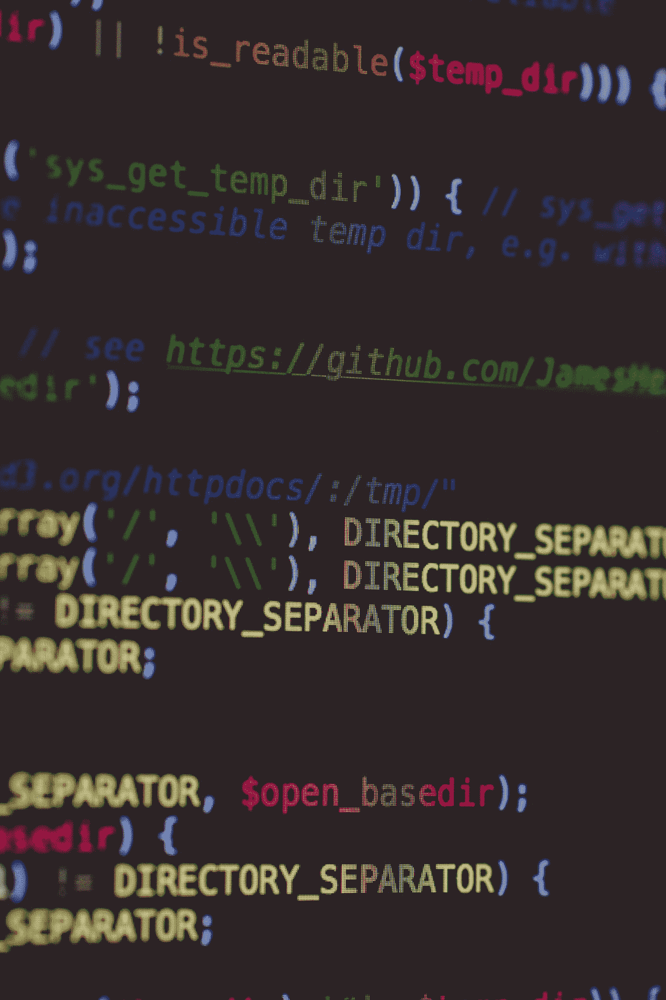

# 软件开发和冒名顶替综合症

> 原文：<https://blog.devgenius.io/software-development-and-imposter-syndrome-12082ecccb70?source=collection_archive---------15----------------------->

马库斯·斯皮斯克在 [Unsplash](https://unsplash.com?utm_source=medium&utm_medium=referral) 上的照片

冒名顶替综合症是一个在编程中谈论很多的问题，如何解决它，如何提高信心，这样它就不会露出它丑陋的一面。

我认为冒名顶替综合症实际上可能是一件*好事情。*

我做了 20 年的专业软件开发人员。我是自学的，我根本没有学位或 IT 资格。

我有冒名顶替综合症。

我在事业上相当成功，事实上，我面试过的每一份工作，都有人给了我。这不是尽管有冒名顶替综合症，而是因为它。

冒名顶替综合症意味着我们总是认为自己不够好，我们不像其他开发人员知道得那么多，我们是靠运气才走到今天这一步的。

即使是现在，在这个行业 20 年后，我仍然有那些感觉，尤其是在开始一份新工作的时候。我够好吗？我会失败吗？我会努力与受过正规教育的同事竞争吗？

回想起来，这些感觉是有益的，它们驱使我更加努力地工作，鞭策自己。这些感觉是我能做这份工作的原因。

冒名顶替综合症在这个行业非常普遍，大多数程序员都有不同程度的这种症状，事实上，我可能只认识一个根本没有这种症状的程序员。他也是我唯一解雇过的人。因为无能。

我的冒名顶替综合症可能源于我没有学位，或任何形式的正式资格。

当开始一份新工作时，你的许多同事都有 CS 学位，很容易认为你会被超越，因为你认为你是个骗子。

> 在初级水平上，自学成才的开发人员往往更好，实际上比毕业生好得多。

但是，在 20 年的职业生涯中，我和许多计算机专业的毕业生一起工作过，作为他们的下属、同事和老板，我学到了很多自学程序员和毕业生之间的区别。如果你打算攻读计算机科学学位，你可能希望在这一点上停止阅读…

在初级水平上，自学成才的开发人员往往更好，实际上比毕业生好得多。

在更高级的层面上，能力没有区别。

毕业生面临的问题是，他们必须从学术项目跳到商业项目，这是一个巨大的飞跃。甚至态度也需要改变，我记得和我团队中的一个下级讨论(争论)，他根本不能理解他不能选择自己的项目来写，我们必须做*客户想要的。*

自学成才的程序员要从业余项目跳到商业项目。这仍然是一个跳跃，但没有那么大。

需要澄清的是，当我谈论自学成才的开发人员时，我不是在谈论在 HackerRank 上花了 45 分钟的人，我是在谈论那些在业余时间实际上已经创建了真正的、可工作的软件的人。

如果你觉得自己作为一名程序员有冒名顶替综合症。拥抱它。