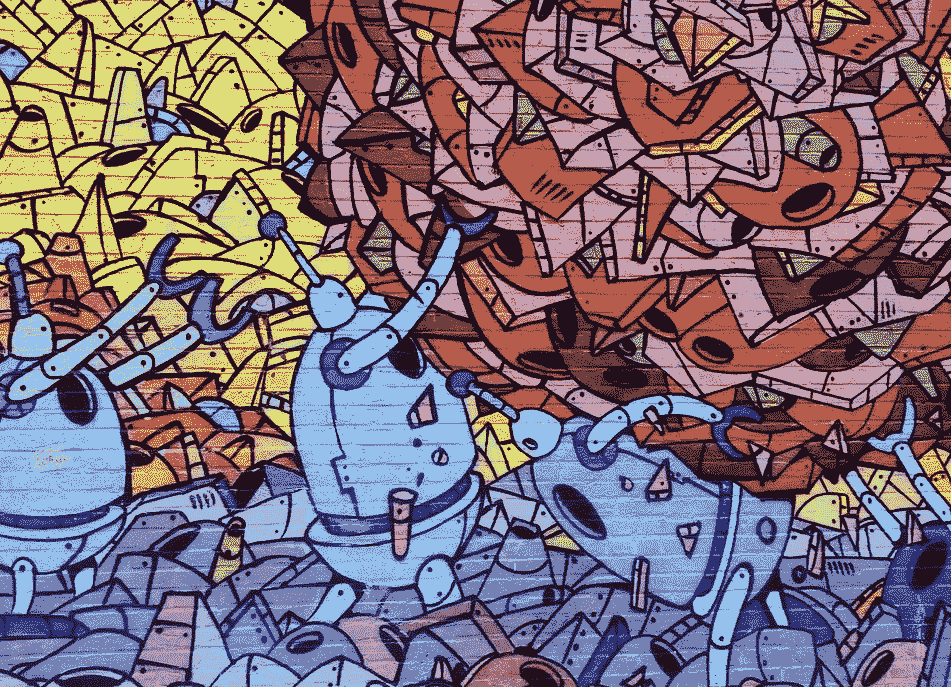

# 软件开发是一个创造性的过程；一幅原创杰作，而不是一幅数字画

> 原文：<https://blog.devgenius.io/software-development-is-a-creative-process-an-original-masterpiece-not-a-paint-by-numbers-1700e05e6d7b?source=collection_archive---------1----------------------->

## 随着创造而来的是潜在的失败

[涂鸦-墙壁-壁画-绘画](https://pixabay.com/photos/graffiti-wall-mural-painting-569265/)

> 没有失败就没有创新和创造力。句号。[T3【布伦布朗】](https://www.brainyquote.com/authors/brene-brown-quotes)

软件开发是一个创造性的过程，理解这一点有助于参与项目计划的每个人都有可能改变。你不可能有一个改变需求的固定计划和一个需要被用户接受的软件。

在不知道具体要构建什么的情况下，你无法确切地说出构建需要多长时间。[创建软件时没有任何保证](/there-are-no-guarantees-when-creating-software-to-survive-embrace-the-unknown-617664b5fe23)，[这就像一艘驶向未知目的地的船](/software-projects-are-like-a-boat-sailing-to-an-unknown-destination-a50a76d97552)

软件是一门艺术而不是一门科学，是基于需求创建软件的过程。作家的目标是每天创造如此多的词，他们不能保证质量，但他们有一个创造词的目标。创作是这个过程的第一部分，然后是编辑和提炼过程。

创建软件遵循以下步骤

*   了解业务，创建软件需求
*   将需求分为史诗/特征
*   将特性分解成详细的用户故事和详细的需求
*   构建软件
*   测试——测试人员根据需求测试功能
*   用户使用软件做他们的工作并给出反馈
*   改进解决方案，改变需求。迭代构建和测试阶段。
*   软件开始运行

没有人知道软件的细节要求，它应该如何工作，需要多长时间或者在这个过程中会出现什么问题。优先级可以改变，技术可以改变，人们可以离开，许多事情都有可能出错。大量的人、大量的时间和一个创造性的过程会产生问题、错误和紧急情况，从而导致延误。

每个人都忘记了创建软件的艰辛，几乎没有人第一次就做对了。创建软件可能很难，这就是为什么[斯托克代尔悖论——为什么乐观主义者不能在软件项目中生存](/stockdale-paradox-why-optimists-dont-survive-software-projects-27ada5b3fec1)。

**创造软件没有魔法，只有创造力、汗水和时间**

> 创造过程的魔力在于没有魔力——赛斯·戈丁

软件是一个迭代的发现过程。每解决一个问题，就离所需的解决方案更近了一步，每个人都学到了更多的业务和技术知识。错误软件的创造成为通向正确软件的道路。没有神奇的模板，但你需要创造力、努力工作和团队合作。

随着您对细节的深入了解，提出问题并获得答案，您会发现正确的需求。在用户看到应用程序工作之前，你不知道它应该是什么样子，或者应该如何工作。软件是一种工具，人们用它来创造软件，艰苦的工作是团队创造解决方案的思考。

软件开发中的动力就像一个醉汉跌跌撞撞地走向烤肉店，这不是一条直线，但你必须继续前进。

# **每次你创建错误的软件，你就离创建正确的软件更近了一步**

> 我在那里了解到，在现实世界——理查德·费曼，创新是一件非常困难的事情

最终的解决方案并不明确，它必须通过创建软件然后获得反馈来发现。用户只有在看到和使用软件时才知道他们在做什么。

项目结束时的软件与开始时提出的软件是不同的。看看一个项目的代码，bug 和变化显示了斗争和软件是如何进化的。发现软件需要如何工作是创造性过程的一部分，需要用户的反馈。

需求就像一个数独游戏，直到你输入了许多答案，你才意识到你当前的解决方案是错误的。

其他创造性任务

*   写书——没有人会出版初稿
*   创作一部电影——电影会经历多次反复和剪辑

这并不是说没有人知道创建软件会经历许多迭代和犯错误，而是事实上没有计划包含它。对第一稿成为最终版本的期望只发生在软件开发中。

# **创意计划**

> "我做了最坏的打算，但抱最好的希望。"―本杰明·迪斯雷利

大多数软件项目都违背了本杰明·迪斯雷利的建议，做最好的准备，不考虑最坏的情况。当您不知道需要构建什么以及需要多少次迭代时，您无法计划软件项目。会有错误、漏洞和一大堆人的问题，这会增加额外的延迟。

创建软件是一个创造性的过程，因此很难进行正确的规划。IT 项目估计有误并且[低估了](/underestimated)。按时交付任何软件项目几乎是不可能的。根据这个[博客](https://www.atspoke.com/blog/it/reasons-for-it-project-failure/)的说法，14%的项目失败，49%经历了范围蔓延，51%按时完成，57%在预算内完成。

40%以上的项目交付较晚并且超出预算，这是因为创建软件是一个创造性的过程，仅仅因为你有一个计划，你就不能准确预测它需要多长时间。

理解这是一个创造性的过程有助于你和所有参与的人理解计划需要有一定的安全边际，并且可能会改变。做好准备和计划可以减少这种影响，你可以制定一个明智的计划。