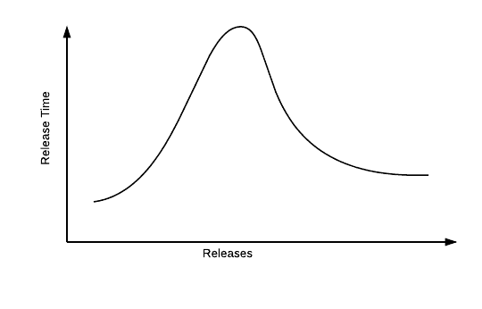
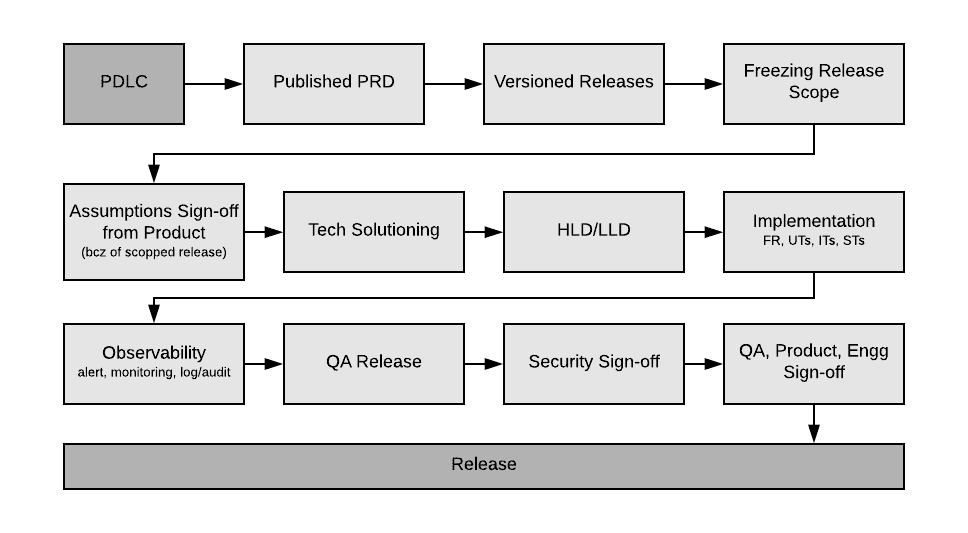

# 软件开发哲学

> 原文：<https://blog.devgenius.io/software-development-philosophy-f267547865fd?source=collection_archive---------39----------------------->

照片由 [Fotis Fotopoulos](https://unsplash.com/@ffstop?utm_source=medium&utm_medium=referral) 在 [Unsplash](https://unsplash.com?utm_source=medium&utm_medium=referral) 上拍摄

对于中到稍高规模的组织

我们的发展理念主要围绕两个方面:

1.  灵活
2.  质量

下面的文件是这个假设的衍生物。本文档并不打算涵盖所有可能的用例，也永远不会这样做。请运用常识，核心理念，并采取适当的决定。

以下文件中提供的细节是基于我的最佳判断。他们可以改变/修改基本情况。

# 介绍

**我们为之奋斗的是什么？**

作为一名软件工程师(我看到了微笑的:D)，我对那个乌托邦世界情有独钟；在没有沟通间隙的地方，所有的需求都是预先知道的，当你在进行编码时，你永远不会被打扰，你的估计是正确的，你的代码是鉴赏家一起研究几个小时的艺术品。

**但是地面现实是什么样子…**

各种混乱都会发生。无论你多么努力地控制，事情还是会失控。所以就像变化一样，混乱是事实，是不变的。参与的大脑数量越多，混乱就越大。

过程确实试图带来一些可预测性，但是你在哪里划线呢？我们必须让大脑做它该做的事，谁同意？

这个文档只是试图引入必要的稳定性，同时确保每个人都能够为整个开发生命周期的混合带来非常独特的味道。

# 什么是敏捷？

没有产品是一夜之间创造出来的。创造一个有用的产品需要多次循环和频繁的实验。

敏捷性是指团队快速推出小功能、收集反馈和进行过程修正的能力。这是一种滑坡。这绝不意味着我们以敏捷的名义发布不合标准的版本。请记住，我们发布的代码将在**产品**上运行，并影响现实世界中的生活。

到目前为止，我观察到的在现实世界中运行良好的情况类似于下图。

该图表示产品中新功能的发布。

我们通常从出门开始。这需要很快，以便获得产品/业务想法的一些验证。然而，一旦我们有了一个好主意，我们就开始把时间投入到问题的更多非功能方面；建立强有力的监测能力，投资建立安全网。所有这些将确保未来周期的更高敏捷性。

# 什么是优质软件？

有许多属性可以包含在内，以形成一个全面的质量定义，因此，看看是什么原因造成了质量的缺乏可能会导致更好地理解；“质量的缺失是从产品被运输之时起，产品给社会带来的损失”。

用于产品的持续改进；需要及时、持续的评估和监测。这些可观察性方面是软件开发过程中软件质量的核心职责。QA 还监控和评估**流程、标准和程序的质量。**

除了以产品/服务的质量为目标，一些标准模型也关注组织层面的软件开发过程的质量。最终，QA 的责任增加到运送高质量的产品和看到满意的客户。质量保证活动很重要，是一个组织的支柱。在敏捷开发中，测试并不局限于测试人员级别，开发人员也应该测试他们的程序，并在他们发现错误时修复它。错误在被发现的同一阶段就被修复了，不管是谁发现的，也不管是谁修复的。在开始一个新的迭代之前，紧密的客户协作被合并以获得已开发系统的有效和快速的反馈，从而提高产品质量。

一旦构建交付给 QA 团队进行认证，QA 团队应该开始功能测试，必须验证所有的需求。在这个阶段，即使是一个小问题也不应该被忽略。随着持续集成的出现，在构建交付给 QA 之前，大量的单元测试用例覆盖已经满足了构建标准。功能验证阶段确保存在给定的要求，并且构建为下一阶段的测试做好准备。对同一段代码的多次迭代测试通常被称为回归测试，其中一旦现有的错误被修复，需要验证产品仍然保持给定的需求，这将通过自动化套件中的持续改进来完成；是的，自动化是快速、敏捷和持续发布的唯一途径。

下一阶段是两个或更多不同的功能相互对话，并用真实数据测试协议。作为功能方式验证的系统行为、所有组件的稳定性、数据正确性、服务/组件的可靠性、非功能(主要是性能、安全性)测试等。一旦所有计划的测试完成，报告的错误被修正，发布就准备好了。如果存在一些已知的问题，并且所有涉众都知道这些已知的问题，那么将这些问题添加到发行说明中，并发布产品。

# 高级开发过程

我们会有一个连续的开发周期，每周都有检查点。我们可以选择每天站起来评估每个人的进步。在每周/两周一次的会议上(敏捷世界中的回顾术语)，我们将快速总结所有已实现的目标，并计划下周将要发生的事情(整理/计划)。我们还将讨论阻碍顺利发展的各种其他问题，并创建将在本次会议上讨论的行动项目

# SDLC 过程

