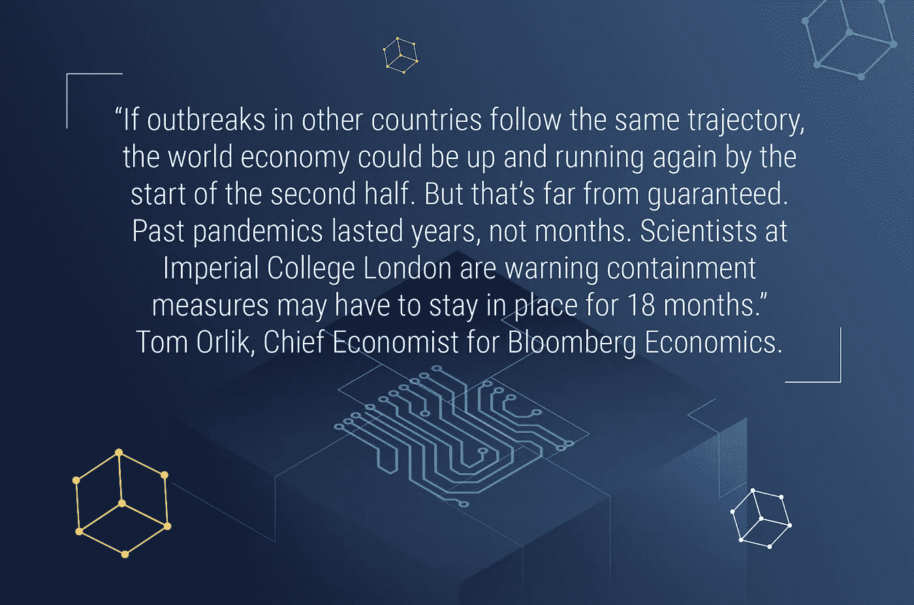
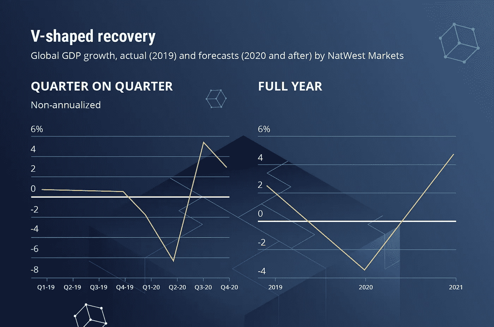
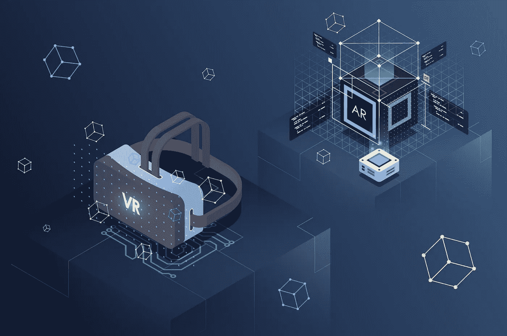

# 今天的软件开发:投资还是不投资？

> 原文：<https://blog.devgenius.io/software-development-today-to-invest-or-not-to-invest-956352d3b49d?source=collection_archive---------43----------------------->

不久前，企业主还准备投资软件开发项目，但全球形势已经改变了这一点。

考虑到当今经济学家的共识，即疫情将导致严重的经济衰退，更不用说其他严重的后果，人们对是否有必要将资金投入到软件解决方案的创造中有很多恐惧和怀疑。

即使从发展项目中走出一步，我们今天生活的世界也让我们许多人暂停投资。但是这种“冻结”模式真的有效吗？让我们试着找到答案。

# 预测和评估

因为目前的局势将如何发展，会持续多久，会产生什么影响，都有很多不确定性，世界变得沮丧，特别是在决策方面。但这不是人类第一次面对和应对不可预见事件的后果。这使得我们可以对将要发生的事情做出预测，以下是其中的一些:

与此同时，苏格兰皇家银行集团的投资银行部门 NatWest Markets 预测，形势将如下发展:

虽然也有其他经济复苏的情景，包括“U”、“W”和“L”形，但他们都预计经济将在 2020 年下半年复苏。尽管事态的进一步发展仍充满不确定性，但现在重要的是为重启做准备。

从悲观走向乐观，无论是在人们的头脑中，还是在可能会经历衰退和增长的几个阶段的经济中，重要的是遵循一种在未来会为自己买单的战略。一个最好的例子是由[的约翰·邓普顿爵士](https://en.wikipedia.org/wiki/John_Templeton)提出的，他说

> 最悲观的时候是买入的最佳时机，最乐观的时候是卖出的最佳时机。

问题是，买什么和投资什么才能在未来获利？

# 为什么要投资软件开发？

目前，预防性保健措施被认为是比任何其他事情都重要的优先事项。然而，袖手旁观，看着你的企业崩溃不是一个解决办法。那么软件开发如何帮助公司生存并在市场上获得竞争优势呢？

*   考虑到大多数企业尚未准备好在新环境中运营，规划和建立支持远程工作实践并提高其生产力的**策略非常重要**。
    这可以通过终端安全软件、视频会议平台、[高效团队协作解决方案](https://emerline.com/blog/online-collaboration-tools)、报告系统、时间和考勤管理系统、[在线员工服务平台](https://emerline.com/projects/employee-service-platform)等轻松实现。
*   此外，企业主是时候接受这个事实了，世界已经变了，不管是好是坏，它再也不会回到我们过去的“正常”状态了。尽管力不从心，但人们已经尝到了数字化**的好处**，这意味着它将成为大流行后服务和产品交付的必需品。
*   很多我们之前知道的东西在不久的将来都会变得毫无用处，尤其是涉及到**客户行为**的时候。有了合适的软件解决方案，企业可以获得对客户品味、偏好、需求的有意义的洞察，并据此制定策略。
*   如今，许多企业一进入“安静模式”，就应该把更多的时间投入到战略问题上。例如，彻底计划用户需要哪些软件解决方案，并向技术合作伙伴提供更全面的概念，而不仅仅是餐巾纸上的想法。尽管这个想法很简单，但在有经验的软件专业人士的手中，它完全有可能成为你业务中的一颗宝石。
*   最后但同样重要的是，现在是与伟大的专业人士组织有效和有益的合作的最佳时机，这些专业人士交付完全满足并超出所有期望的软件解决方案。

正如巴克明斯特·富勒曾经说过的，

> “不要对抗力量，要利用它们”。

因此，现在正是开始在一个由不可预见的情况改变的新环境中为你的成功铺平道路的恰当时机。

# 缓解新冠肺炎危机的软件解决方案

当谈到软件开发时，哪些解决方案被认为是最有前途的？我们披露了一些可以帮助公司在现在和大流行后的世界中获取利益的信息。

# 虚拟和增强现实

考虑到许多公司现在都是在家工作， [AR/VR 开发](https://emerline.com/technologies/augmented-reality)和实施可以帮助他们建立一个协作、实践培训的环境。根据 Perkins Coie 和 XR Association 进行的[增强和虚拟现实调查报告](https://www.perkinscoie.com/images/content/2/1/v4/218679/2019-VR-AR-Survey-Digital-v1.pdf)，49%的企业受访者将实施虚拟现实，以确保他们的员工在未来获得真实世界的培训条件。

在目前的情况下，智能城市技术可以减轻冠状病毒的影响。最能说明问题的例子之一是中国用于识别高温人群的无人机。由于此类[物联网技术](https://emerline.com/technologies/iot)显示出巨大的潜力，因此成为政府投资的重点技术之一。此外，根据商业内幕智能城市报告，智能技术预计到 2025 年将达到 2950 亿美元。

# 行为分析软件

尽管分析的[潜力](https://emerline.com/projects/sales-analytics-platform)不受某个应用领域的限制，但我们提供了一个案例，展示了它在此时此刻和以后对企业的帮助。疫情已经改变了顾客的行为方式，而且这不是最后一次。在隔离和隔绝成为过去之后，我们应该期待什么？在行为分析软件的帮助下，公司可以获得关于客户行为的宝贵见解，并据此采取行动。

除了上面列出的，公司现在必须展望未来，选择 CRM，ERP，商业智能和其他程序，这将有助于他们适应不断变化的环境，并在竞争激烈的市场中生存。

此外，还有一件更重要的事情需要提及:它是**系统弹性**现在受到前所未有的考验。因为疫情推动公司以新的方式运营，即做出实时决策、应对业务连续性挑战和工作量变化，所以弹性成为关键的成功因素。

# 底线

在疫情和大流行后的世界中，软件开发被认为是公司在这场混乱后重新站立起来的方法之一。这种投资不仅仅是生存措施，因为它们也成为对未来商业成功的宝贵贡献。

在 Emerline，我们提供广泛的[软件开发服务](https://emerline.com/services/software-engineering)，让我们的客户能够享受到强大、用户友好、量身定制的解决方案带来的好处。我们有完善的远程工作和交付实践，我们总是对新项目持开放态度，并乐意将您的想法转化为技术解决方案。随时联系我们。

*最初发表于*[T5【https://emerline.com】](https://emerline.com/blog/best-time-for-development-is-now)*。*