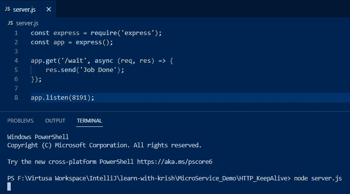
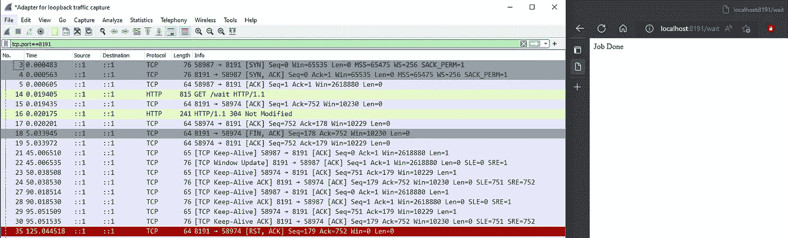
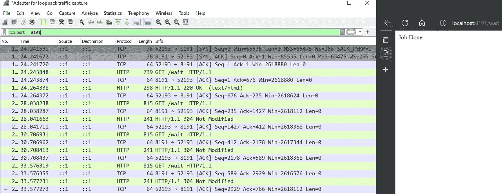
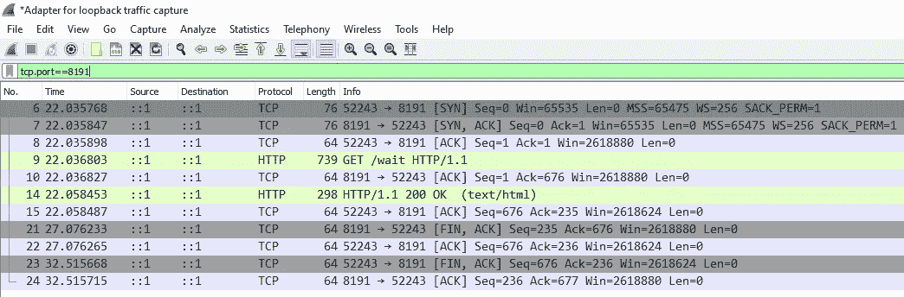
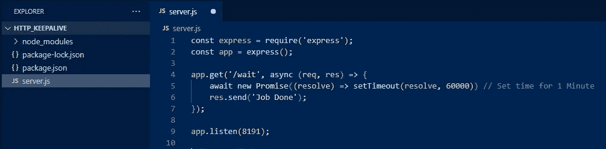
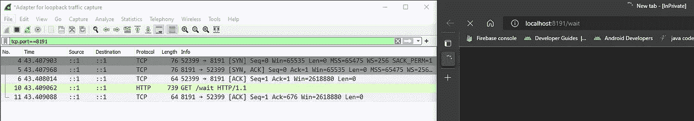
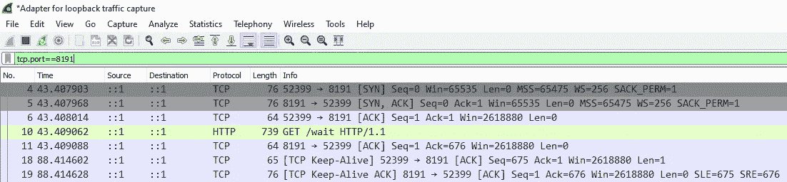
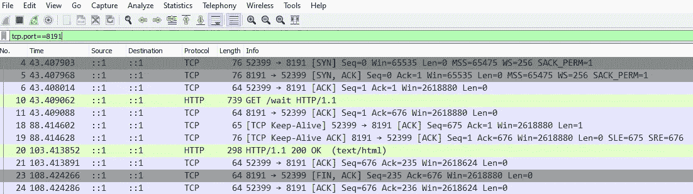
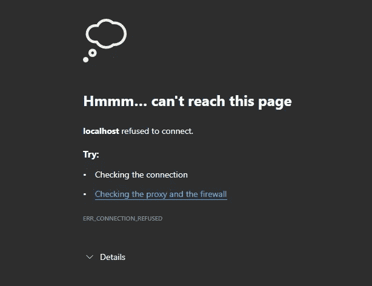
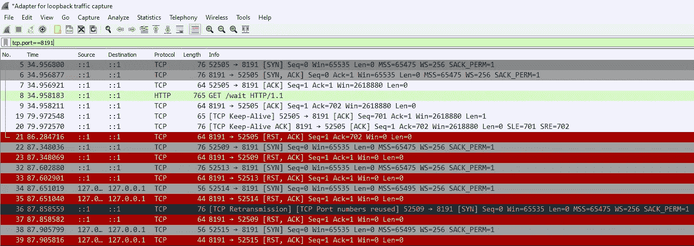

# 软件工程师必须了解 HTTP Keep Alive(使用 Wireshark 演示)

> 原文：<https://blog.devgenius.io/software-engineer-must-know-about-http-keep-alive-demo-using-wireshark-8bb2803eecf3?source=collection_archive---------12----------------------->

读者们好，

每次工作时，每个后端开发者都会抱怨系统太慢或者没有响应或者服务太慢。有时开发人员说系统运行良好，但有时很慢。我们需要弄清楚为什么慢或者为什么它有时变得很慢。如果您认为可以添加更多实例来扩展它。但是它制造了更多问题，却没有解决问题。这是一个关键问题为什么？问题传递给不同的团队，例如开发团队传递给网络团队说网络慢，网络团队说不，这是服务器端的问题，问题传递到每个地方。因为这是你的服务，你不能告诉谁是错的，否则你有一个明确的证据，为什么它很慢。

当我们使用 HTTP 时，有两个分支叫做
1。持久性 HTTP
2。非持久性 HTTP

非持久性 HTTP 主要是 HTTP 1.0，我们不使用它，但有时当我们处理遗留系统时，您可能会使用它。然而，当我们打开一个连接时，我们发送一条消息，得到响应，然后关闭连接。

我们有一个叫 **RTT 的东西，往返时间。**因此，你将数据包发送到服务器，然后返回到客户端，这就是我们所说的往返时间。为了发送消息，我们需要打开一个连接，发送消息，获得响应，然后关闭连接。

例如，假设您需要打开一个包含 10 个 JavaScript 文件的 HTML 页面。现在，您必须向服务器发送 10 个不同的请求来获取文件。所以这个过程很慢，所以他们引入了 HTTP 1.1，即**持久性 HTTP** 。

再次强调持久性 HTTP 有两个部分。
1。隧道
2。没有隧道

主要是 **HTTP 1.1 走隧道**。这是如何工作的，你建立连接，你发送消息，你得到响应，最后你关闭连接。这个程序很像 TCP。但是这里有一个棘手的部分。
如果你正在发送一个请求到后端服务器，服务器正在做一些任务或忙于任务。由于此 HTTP get 关闭连接，因为服务器没有响应。为了避免这种情况，我们使用了一种叫做**保持活动状态**的特殊技术。这意味着我们只需向服务器发送 ping 命令，告诉它保持连接。有时，如果我们发送一个请求，你得到响应，你发送另一个请求，告诉服务器保持连接。

让我们看一看 Wireshark 的演示

## 考虑场景 1:

## **第一步:**
我们需要使用 **Express 模块编写 Node.js 代码。然后我们需要运行代码**

> 如果您的项目中没有安装 express，只需在您的 PowerShell 上使用以下代码
> **NPM install Express** 安装 Express 并获取所需的文档

## **第二步:** 打开 Wireshark，打开环回接口，过滤 8191 端口流量。
***TCP . port = = 8191***

## **第三步:** 打开你最喜欢的浏览器，在搜索栏上输入“***【localhost:8191/wait】***，点击回车键。

## 步骤 4:
检查 Wireshark

Wireshark 连接中的前 3 行以 **SYN** 开始，然后是 TCP 3 次握手中的 **SYN ACK** 和 **ACK** 。之后，我们可以看到 HTTP 发送请求并得到响应。
第 18 行服务器**发送 FIN** 关闭连接，对于响应客户端也发送 ACK，但是**客户端没有关闭连接。
后**指不定客户端发送 Keep-alive 以保持连接。因此，服务器正在做的是**向客户端**发送一个重置包(最后一行红色)。

## 考虑场景 2:

如果我们连续发送请求，让我们检查后端如何表现。

现在我在浏览器中处于私人模式，并不断发送请求。我们可以看到连接在前 3 行打开，我们请求 HTTP 上的连接，得到响应并继续。我们可以看到**没有鳍。** 这里发生的是，**客户端只是跳过了与后端的对话，后端并没有试图关闭连接。**这就是**持久性 HTTP** 的含义。

## 考虑场景 3:

在这里，我所做的是发送一个请求，得到响应并关闭浏览器。

我们可以看到，在发送消息之前，连接照常初始化。之后，HTTP 发送消息，客户端得到响应。这是一个重要的部分。在服务器**关闭连接发送 FIN** 和客户端响应**之后，当我们关闭浏览器**时，这意味着**客户端也通过发送 FIN 包到服务器**来关闭连接。这是一个完整的循环。

## 考虑场景 4:

在这种情况下，我们需要对代码做一个小的修改。

在这里，请求将到来并等待 1 分钟，然后服务器将响应。看看 Wireshark 会发生什么。

发送消息等待 1 分钟。在浏览器中等待响应。

因为它没有接收到任何发送保持活动响应客户端

1 分钟后，客户端得到服务器的响应。

## 惊人的正确！！！

## 我们还有另一种情况:

让我们检查一下，如果我们在 1 分钟内关闭服务器，会发生什么。

在这种情况下，在完成连接之前，服务器由于某种原因崩溃了。自从保活时间后服务器没有响应，现在服务器不断向客户端发送 RST 数据包。因为客户端试图启动与服务器的新连接。客户端向服务器发送请求，但服务器关闭连接。

参考—[https://youtu.be/Yf06faA5-JY](https://youtu.be/Yf06faA5-JY)