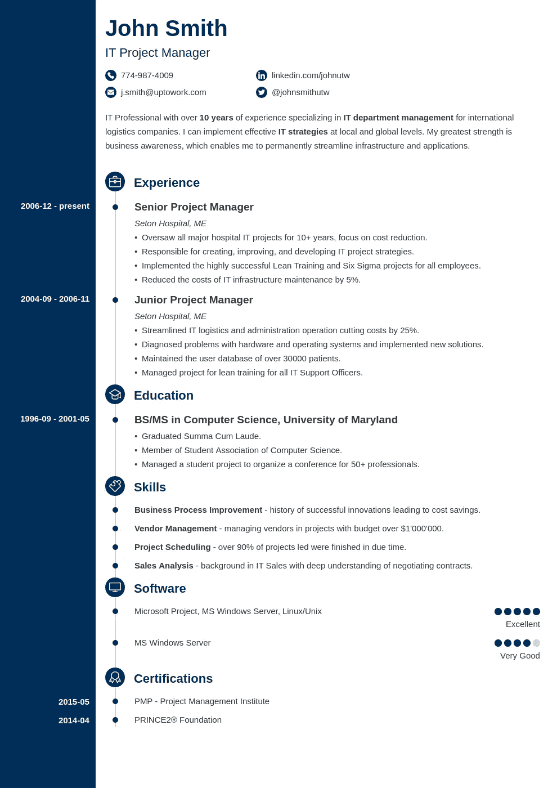

# 软件工程实习生面试简而言之

> 原文：<https://blog.devgenius.io/software-engineering-intern-interviews-in-a-nutshell-3e68b38f137?source=collection_archive---------3----------------------->

大家好，我将要分享我自己面对实习生面试的经验。几周前，当我完成学位课程的第二年时，我开始申请实习生面试。

当你申请面试时，你应该准备好一份有吸引力的简历。一份有吸引力的简历应该包括

1.  你在本科学习期间学习的模块。
2.  你贡献的任何软件项目。
3.  你拥有的技术技能和软技能。
4.  你完成的任何额外的文凭。
5.  如果你有博客或 Youtube 教程频道，也可以提及。
6.  如果你有一个 GitHub Repo 也提到这一点。
7.  如果你以前有工作经验，也要提到这些。
8.  最后是你参加的课外活动。

以一种非常有创造性的方式(陈述事实)包括上述事实是非常重要的，因为你的简历需要在所有这些列表中脱颖而出。你可以使用 Photoshop 或 Illustrator 以创造性的方式设计你的简历。

来自互联网的简历样本(所有版权属于该材料的所有者)

一旦你的简历被列入候选名单，他们会打电话给你进行面试。

# **面临第一次面试？**

在面对人生中的第一次面试之前，我们都会感到紧张(这很正常，因为这是我们人生中的一个关键时刻)。

**《第一印象就是最后印象》**

即使你很紧张，你也应该能够成功地面对面试，否则你会被淘汰。

**在面试开始前，微笑着和他们打招呼。(我面对的大多数面试，面试官都很好:)所以没有必要紧张，这对你没有帮助，而不是你会搞砸面试。一旦你们互相介绍并坐下，面试就开始了。**

你需要在面对面试之前意识到这些事情。

1.  **面向对象的概念**

很有可能会有人质疑 OOP 概念以及你是如何在项目中应用它们的。所以准备好，让自己适应 OOP 概念的实际应用。如果他们要求使用代码进行解释，也要准备好写下代码。他们可能会问你最喜欢的编程语言，并从这个开始提问。如果你说 Java 是你的最爱。他们可能会问**当你将一个 java 类标记为 final 时会发生什么？**

2.**数据库概念(SQL 和 NoSQL)和查询**

此外，他们可能还会对数据库概念提出疑问。(以归一化为例)。为什么要正常化？。然后他们可能会询问 SQL 查询。也要准备好写下问题。还要熟悉 SQL 连接。

你可能也听说过 NoSQL 科技公司。确保你知道 SQL 和 NoSQL 的区别。(学习一些 NoSQL 的技术比如 MongoDB，FireBase)。也要学会使用它们来实现。

3.**算法**

如果你是计算机系或系统工程系的学生，也要准备好面对算法问题。主要是搜索算法，图算法，排序算法(知道算法是怎么工作的)。还要熟悉时间复杂度和算法分析。有时他们可能会要求你写下代码。(最好做好最坏的打算)。

当涉及到实现软件时，学习使用算法的实际方法。

4.**项目和编程语言**

最后，他们可能会就你在简历中提到的项目向你提问。从我的经验来看，他们可能会要求解释一个项目，你是如何实现它的，其中使用了什么技术，以及你为什么也使用这些技术。

也有可能从你在简历中提到的技术中提问。他们可能会提问，以确认你是否对这些技术感到满意。

这是我自己的经验，我已经与你分享。他们询问的问题可能因组织而异。但是也要为上述问题做好准备。

作为一个去面试的实习生，不要因为自己被一两次面试拒绝而难过。如果你努力了，如果你善于面对面试，你一定会得到你应得的。永远对自己有信任和信心。

祝大家好运！！！