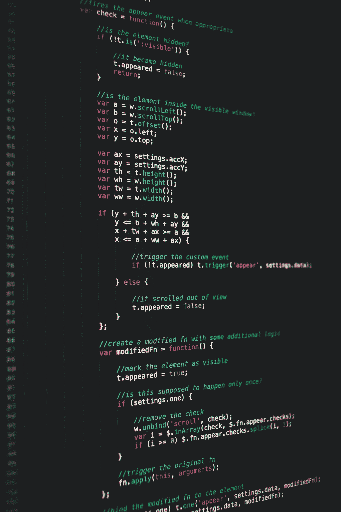

# 软件工程——没人告诉我的事情

> 原文：<https://blog.devgenius.io/software-engineering-things-no-one-told-me-1eeef27fccab?source=collection_archive---------41----------------------->

我目前是在澳大利亚学习的二年级软件工程学生。从高中开始，我就知道自己想从事与编程或计算机相关的工作。我一直对科技产品感兴趣，觉得 UI/UX 很有趣。我从来没有按照我的梦想去做，我从来没有研究过事情实际上是怎么做的。我不知道我在做什么。在开始上大学之前，我知道 java 和 html 基础知识。高中毕业后，我在部队呆了两年，这让我觉得自己精神上有所欠缺。

# 第一年

第一年真的很艰难，尽管我只学了两门计算机科学课程，另外两门是基础统计学和基础 Arduino/机器人课程。我真的对大学感到兴奋，并计划着如何保持领先地位。这些在第一年都没有发生。有很多拖延和挫折。我跟不上大学的步伐。我周围的大多数朋友和其他学生似乎都经历了这一切。

在军队的整整两年里，我一直梦想着在大学里表现出色，提前学习一些东西。我没有采取任何行动。从第一次接触课程、课程要求和作业开始。我很害怕，觉得自己一无所知。所有这些突然的想法，放弃，逃跑，寻找另一所大学，寻找出路等等。我刚想起来。父母、学校的朋友和我周围的每个人都尽力让我平静下来，但我不为所动。

我仍然不知道这些想法背后的原因是什么。我认为是因为缺乏自尊和能力。第一学期，在朋友们的帮助下，我通过了计算机科学课程，但最终我没有通过数学和统计课程。

老实说，我的失败没有任何借口。我没有表演是因为我自己的努力。我没有主动去问问题，去了解我有疑问的事情。

Gary Vaynurchuk 总是谈论苦难如何爱公司，这就是我最后做的。我会不停地告诉别人我的故事，说我做不好，因为这样那样的原因我做不了。这是一个我必须拥有并承担责任的错误。“这是我自己的错，我不能老想着这件事”。

# 第二学期

略有不同的故事我决心不让任何课程不及格。我的结构化编程入门课上的一位讲师激励我继续尝试。我没有亲自去找他寻求帮助。但是他的讲座充满了能量和动力。他会谈论编译你的代码，即使你认为它可能不工作，并继续尝试。你的电脑遇到错误也不会爆炸。很简单。

第一学期我迷路了。第一学期，我在精神上和身体上都感觉不像我自己(*听起来仍然像是一个借口*)。我不知道我在做什么。我决定做我真正不擅长的事情。我开始跟踪乔科·威灵克。一个前海豹突击队员，在凌晨 4 点醒来，好像他还在军队或者在执行任务。冬天，我会在凌晨 4-4:30 醒来，然后吃第一顿早餐。早餐后花一个小时在健身房。健身房结束后，我会做好当天的所有饭菜，然后准备上课/辅导/实验。这种情况一直持续到学期结束，最终我通过了所有的课程。

# 第二年

我经历了和第一年第一学期相似的阶段。因为在线课程和实验室，我开始失去精力和对一切的兴奋。我开始非常积极地进行家庭锻炼、瑜伽、健康饮食，但很快所有的生产力技巧都被抛到了九霄云外。我变得无精打采，对学业不感兴趣。无能的想法再次击中了我。我会向几乎所有我认识的人寻求建议，我试过看托马斯·弗兰克的视频和其他生产率大师的视频，但似乎都不起作用。

我不再寻求建议，而是问自己

> 我为什么要这么做？
> 
> 有“为什么”的人能忍受任何“如何”？

作者:弗里德里希·尼采

我发现这句话是我每天生活的燃料。我们经常迷失在运动中，我们经常忘记问自己为什么要做你正在做的事情。我们这样做只是为了合群，或者因为你应该这样做。这个问题是我问过自己的最重要的事情。通常我们复习课程，考试后马上就把它忘得一干二净。我真心希望在每学期的四个月里吸收尽可能多的知识。很好地理解概念，我可以教别人。尤其是引用我的 java 讲师的类比，我之所以能如此清楚地记得关于结构化编程的概念，就是因为他的类比。这几乎就像我已经在我的脑海里形成了一个链表，每个类比后面都有一个概念。

这学期我一直在努力学习计算机体系结构课程，我不确定它会有多好，因为我不能正确完成三个作业中的两个。对此我并不难过，我确实后悔没有寻求帮助，但现在我的热情和兴趣又回来了。我知道我为什么这么做。我知道为什么这对我很重要。不是钱，不是课程，也不是学位，我真的喜欢解决问题，喜欢用代码把问题分解并构建东西。

我发现这最初令人沮丧，只是没有努力理解和应用概念。对于任何一个刚开始编程或者刚拿到计算机科学学位，没有任何背景的人来说

1.  确保你对学习充满热情，而不是为了学习而学习。
2.  尝试超越课程，探索更多在线内容。
3.  在学期间隙，应用前几个学期学到的概念，创建更多的项目，可能是 api，app，只是简单的数据结构问题。
4.  遇到困难时寻求帮助。不要等到最后一刻才去寻求帮助。
5.  不管你有多累，早点开始分配任务。计算机科学作业不是一两天就能完成的。在你把事情做对之前，你需要多次实验和尝试。

感谢阅读伙计们。感激不尽。从现在开始，我会在这个账号上分享更多这样的故事。