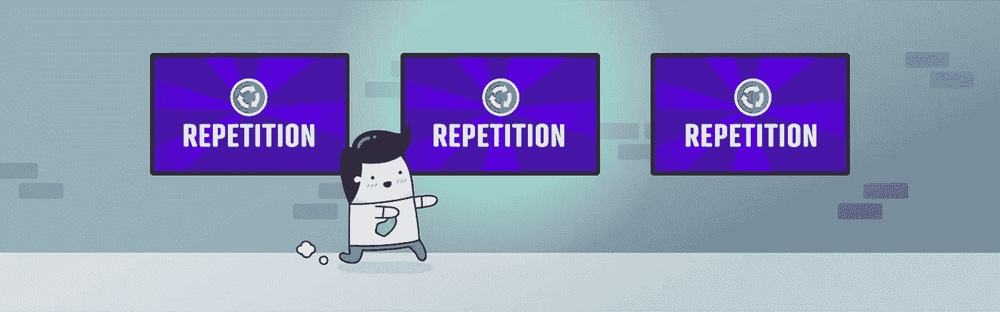

# 软件工程师的成功之路

> 原文：<https://blog.devgenius.io/software-engineers-path-to-success-3eac309f5096?source=collection_archive---------17----------------------->

在该领域取得成功&跟上新技术

众所周知，软件行业是不断发展变化的*。从某种编程语言的新更新，如何解决已知错误的新方法，新趋势，框架，模式，范例，扩展，插件，等等。在这个工作领域，有很多东西需要跟上才能保持活跃和知识渊博。作为一名新人，我们如何能够在继续提高我们的知识和技能的同时跟踪所有这些不断的变化呢？即使作为一个已经成名的知名开发人员，你如何确保自己*总是*与你选择的领域保持同步？*

*我的软件工程课程即将结束，随之而来的是各种不同的情绪。兴奋，焦虑，更糟糕的是，路西法本人，骗子综合症。总是在你的肩膀上，在你耳边低语，你不可能认为你能在这个领域取得成功，或者你不够好，或者有人会比你更好。我们都经历过这样或那样的事情。那么，我们该如何准备去对抗这些消极的想法，或者更好的是，利用它们为我们带来优势？对我来说，这意味着创造我的*成功之路*。
我将与您分享它们，无论您是否和我一样(*一个刚从学校毕业的 SWE* )，或者您已经在这一行工作，想要分享一些知识以缓解一些焦虑的想法，或者只是想听听业内新的声音要说些什么。*

# *作为一名大三学生，我的成功之路分为五步*

**

## *0.5 基础语言*

*选择你的第一种计算机语言来编码，并且精通它。这可能是最具挑战性的部分之一，至少在我看来是这样。这是很多有抱负的程序员要么真的喜欢它并继续前进，要么讨厌它并重新考虑他们的选择。当你选择首先学习哪种语言时，可能会非常困难，需要考虑的因素很多，但最终，你只需选择最适合你的兴趣或未来目标的语言。我个人是从 JavaScript 开始的。*

*基础意味着你的构建模块、HTML、CSS 和 JavaScript，在你的旅程中你最终会用到它们。这些是你要一砖一瓦地打下的主要基础，在学习另一种语言之前，要真正理解这些概念。我不会坐在这里说，如果你不先打好基础，你将来就不会成功，但我要说的是，你很可能不会像你本可以做到的那样好。在你能跑之前，你必须学会如何走路。*

*在做了一些研究后，JavaScript 一直是我见过的向有抱负的开发人员提及和推荐的首选语言。由于很多原因，它是工作领域非常受欢迎的语言，它可以用于后端和前端开发，并且它不会很快消失。*

* [## 为什么要学 JavaScript？初学者指南(2022 年更新)

### 如果你想成为一名 web 开发人员，你会想知道学习什么编程语言。不仅如此，你还会…

careerfoundry.com](https://careerfoundry.com/en/blog/web-development/should-you-learn-javascript/)* 

## *1.0 构建项目*

**

*现在，你已经奠定了你的基础。现在是时候挑战你刚刚学到的东西，并通过*建造*东西来应用它了。一开始我很犹豫要不要开始自己构建，我认为我还没有准备好，或者我需要继续看教程或者继续学习语法。可以理解，但是没有比通过自己构建一个项目来实际应用技能和知识更好的方法了。没有人要求你建造下一个大东西。你所要做的就是为你自己建造一些东西或者展示给你的朋友们！选择一个你觉得令人兴奋的项目，让它成为你自己的享受，因为如果你没有从中得到哪怕一点点乐趣，你可能会问自己为什么你想成为一名开发人员。因为，开发者的工作是编程和构建应用程序，如果你没有从中得到乐趣，你就永远不会想继续做下去，或者随着时间的推移你会讨厌它。这应该是有趣的部分。让你的创造力和解决问题的能力得到考验！*

* [## 初学者的 10 个编码项目

### 学习编码是一种令人满意的、有回报的体验——尤其是如果你正在用在线编程自学的话…

www.codecademy.com](https://www.codecademy.com/resources/blog/coding-projects-for-beginners/)* 

## *1.5 专攻一个框架*

**

*现在你已经打下了基础，构建了一些小东西，是时候学习一个框架了。选择一个你知道将适用于你想成为的或者目前感兴趣的开发人员的框架。如果你想成为一名 web 开发人员，你会想为你正在编写的任何编程语言选择一个 web 开发框架。然而，如果你想成为一名移动开发者，你会想要选择一个移动操作系统和与之配套的合适的框架。*

*这是你旅程的一部分，你必须选择你想做什么或专攻什么。这需要时间，就像学习你的基础一样。但是，如果您已经正确地奠定了基础，并且对*‘why’s*和*‘how’s*有了很好的理解，那么学习它的一个框架应该不会像没有您现在获得的先验知识那样困难。*

* [## 2022 年最流行的编程语言和框架

### 如今，几乎任何线上和线下业务都急需技术转型。所以，很难想象…

www.softermii.com](https://www.softermii.com/blog/top-programming-languages-and-frameworks-for-software-development)* 

## ***2.0 构建项目***

**

*我希望你已经明白了这里的游戏计划。学习一些东西，然后通过建立一些东西来应用它。根据你选择的框架和基础语言，试着找一个同时使用了*和*的项目教程。通过这种方式，你将在你刚刚学习的基础和新框架上得到更多的实践。*

* [## 9 个激动人心的 React 项目创意&初学者主题 2022 | upGrad 博客

### 因此，您已经掌握了 React 的基础知识，并且对 JavaScript 也有了扎实的掌握。既然基础教程…

www.upgrad.com](https://www.upgrad.com/blog/react-project-ideas-topics-beginners/)  [## 使用 Ruby on Rails 可以构建 11 种类型的应用

### 想知道下一个创业项目使用什么平台？说到构建 MVP，Ruby on Rails 仍然…

naturaily.com](https://naturaily.com/blog/ruby-on-rails-apps) 

## **2.5 学一门数据库技术**

ost 软件开发人员将需要了解一些数据库技术，因为您将使用的大多数应用程序都有一个后端数据库。所以现在也开始学习这个是明智的。根据我的研究，学习 SQL 将给你一个更好的工作基础，以及一个很好的开始和对数据库的介绍。有许多不同的 SQL 技术，根据我的观察和阅读，它们与 SQL 非常相似，如果您已经掌握了一种 SQL 技术的基础知识，那么在它们之间进行切换就不会有太大的困难。

 [## 如何在不同类型的 SQL 中找到自己的路

### MySQL、PostgreSQL、SQL Server……为什么会有这么多 SQL 方言存在？你应该选择哪一个？

towardsdatascience.com](https://towardsdatascience.com/how-to-find-your-way-through-the-different-types-of-sql-26e3d3c20aab) 

## **3.0 构建全栈应用**

在这一点上，您已经有了一个非常坚实的基础和框架，并且您已经了解了数据库以及如何使用它们*(基本查询、创建表、将表连接在一起以获取数据、插入、更新和删除数据等)。).*

现在你已经完全准备好构建你的第一个 ***全栈 web 应用了！*这就是让你成为一个伟大的开发者的原因。衡量一个优秀的开发人员的标准不是你能记住多少特定的语法、方法等等。它是你所拥有的坚持不懈的精神和想要学习如何使事情运转的动力。
我相信你听说过谷歌是开发者最好的朋友，这是千真万确的。我们没有被期望知道所有的事情，那是不可能的，我们所能做的就是学习如何使用提供给我们的工具来做一些事情。随之而来的是大量的谷歌搜索。**

 [## 8 个激动人心的全栈编码项目创意&初学者主题| upGrad 博客

### 一个全栈开发人员是一个工程师，他可以通过处理…

www.upgrad.com](https://www.upgrad.com/blog/full-stack-coding-project-ideas-topics-for-beginners/)  [## 学习全栈开发的 10 个最佳基于项目的教程

### 这才是真正神奇的地方——我第一次接触这个全筹码的世界时，我感到敬畏。

medium.com](https://medium.com/for-self-taught-developers/10-best-project-based-tutorials-to-learn-full-stack-development-d172fe5c3aac) 

## **3.5 联网**

你可以构建东西，你现在要么是自学成才的开发者，要么刚刚拿到学位。恭喜你！现在，作为一名初级软件工程师，你进入这个世界的第一步是什么？你如何让自己出去找工作或结识志同道合的人？通过良好的关系网！

在我看来，这个过程的这一部分并没有被提及，我认为这是因为作为一名开发人员，我们大部分时间都在电脑前工作，我们没有机会每天与其他人进行那么多的互动。我觉得这很讽刺，因为科技将全球数百万人联系在一起。找到你的支持团体对你的成功至关重要。无论你是为了工作需要建立关系网，还是为了互相交流想法。人际关系网非常重要，尤其是在这个领域，你永远不知道在任何给定的时刻你可能在和谁说话。那个人可能是通向巨大机遇的桥梁。永远保持轻松、愉快和真实。没有人喜欢自以为无所不知的人，在夸夸其谈和保持谦逊之间找到最佳平衡点，因为你不可能无所不知。

既然我们谈到了这个话题，如果你想联系的话，这是我的关联账户。
[https://www.linkedin.com/in/sofiaversoza/](https://www.linkedin.com/in/sofiaversoza/)

 [## 如何通过社交网络找到工作

### 当你终于有机会聊天时，再次避免立即进行电梯推销的诱惑。并开始…

www.breakinto.tech](https://www.breakinto.tech/how-to-network-tech-industry-job)  [## 技术网络

### 澄清愚蠢的辩论，一劳永逸地由马特盖茨

whartontechtoks.medium.com](https://whartontechtoks.medium.com/networking-in-tech-78ff290c9036) 

## **4.0 自由职业者**

T 在我的研究中，我看到很多人提到这一点。无论你是初级还是高级开发人员，自由职业都是不断挑战你作为程序员和创意者的能力的好方法。如果你已经在这个领域，这是另一个带来更多收入的好方法。或者如果你还没有这方面的工作，这是一个很好的敲门砖，因为它展示了真实世界的经验。如果你已经通过网络建立了一个网络，这应该更容易做到，因为你已经开始把自己放在那里，并建立这些联系。我想在某种程度上，你甚至可以说*【被同行接受】*。希望，在这一点上，你会明白所有这些步骤作为一个整体一起工作来巩固你作为一个开发者的角色。

 [## 凯尔·普林斯路的自由职业套装

### 获得完整的自由职业套餐，辞掉工作或赚取额外收入，开始掌控自己的生活。的…

studywebdevelopment.com](https://studywebdevelopment.com/freelancing.html)  [## 自由网络开发者指南:如何通过自由编程工作赚钱

### 开发人员走自由职业路线是很常见的。对于许多刚刚完成免费代码营的人来说，这是真的…

www.freecodecamp.org](https://www.freecodecamp.org/news/freelance-web-developer-guide/) 

## **4.5 读取&示教**

真正巩固你的知识的最好方法之一就是把它教给另一个人。你不仅可以帮助曾经和你处境相同的人，还可以在现有的基础上获得更多的自信。这对所有参与者来说都是一个双赢的局面。
看别人的代码。阅读关于新技术、趋势、语言等的文章。多读一些像这样的博客，了解这个领域的新声音，这是保持活力和寻找教学机会的好方法。我们之前都被 stack overflow 救过一两次或者上百次，现在你通过不断挑战自己获得了更多的知识和技能，你可以回馈和帮助你的社区。你可以成为解决堆栈溢出问题的幕后推手，拯救他人在工作或学校的一天，成为你希望刚开始时就有的老师。

 [## 门徒效应:你如何通过教别人来学习

### 门生效应是一种心理现象，在这种现象中，教学、假装教学或准备教学信息…

effectiviology.com](https://effectiviology.com/protege-effect-learn-by-teaching/)  [## 你在授课时更好地学习一课的真正原因

### 学习和思考都是深层次的社会活动。这不是传统的观点(罗丹的标志性雕塑，“The…

www.businessinsider.com](https://www.businessinsider.com/why-teaching-helps-you-learn-2013-7) 

## **5.0 重复**

T2:我们已经走了很多地方。从学习到建设。从网络到自由职业。从跟上新的事物到把它教给其他人。我们涵盖的所有这些步骤都是为了巩固你的技能，让你站在对你作为程序员的日常生活至关重要的*新趋势的顶端。
至于我们的最后一步，很简单，你以前都做过。跟上就好。你应该学习新的语言，新的语言框架，新的数据库技术，不管你现在学的是什么语言，它们都可以更好地工作，继续构建应用程序，不管是为了练习还是为了更新你的文件夹，如果有机会，继续教学。如果你不断重复我们已经谈到的所有这些步骤，我毫不怀疑你会成为最好的自己，无论你在这个领域选择什么样的道路，你都会有足够的知识。坚持不懈永远是关键！*

 [## 重复的原因:重复如何帮助我们学习

### 我们都经历过那个神奇的时刻，经过几天，几个月，甚至几年的练习，我们终于成功了…

medium.com](https://medium.com/peak-wellbeing/the-reason-for-repetition-how-repetition-helps-us-learn-10d7eea43e95) 

# ***结论***

说到底，这些只是一个软件工程师学生在接近课程结束时所说的话，她正在慢慢地从学习过渡到在现实世界中应用东西。就像我之前提到的，这种转变会让你产生很多情绪。当我写这封信的时候，我想让你知道，对于我已经走了这么远，我感到恐惧和欣喜，如果出于任何原因你也有同样的感觉，我希望我给你带来了哪怕是一点点的宽慰，你并不孤独，你将会做很多伟大的事情。我相信你！祝你旅途好运！*