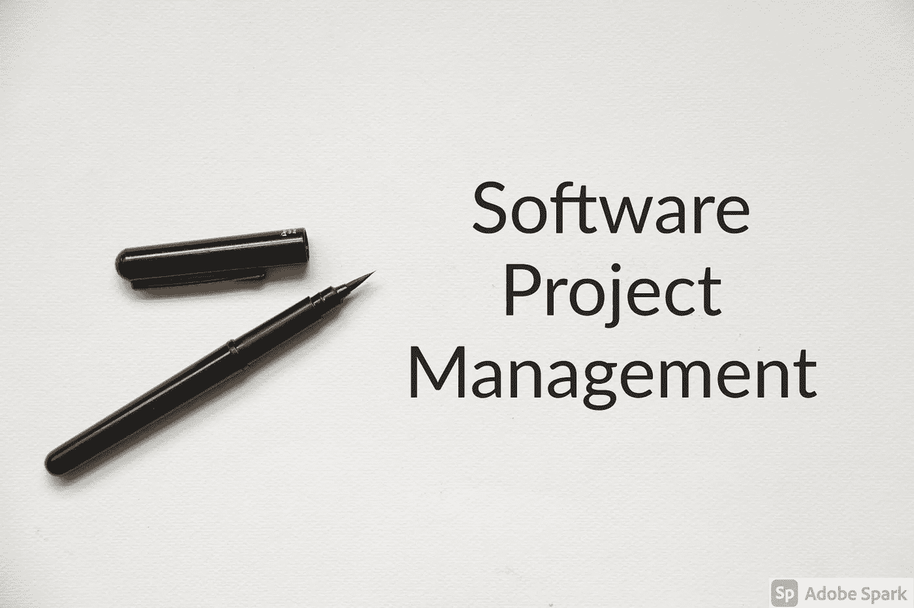
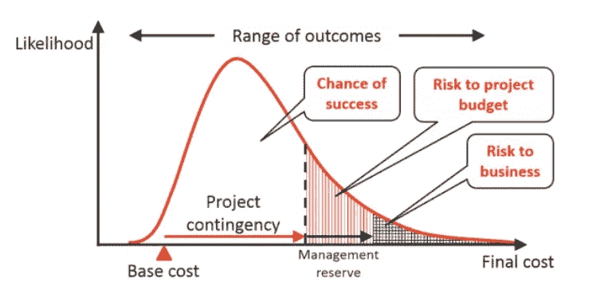
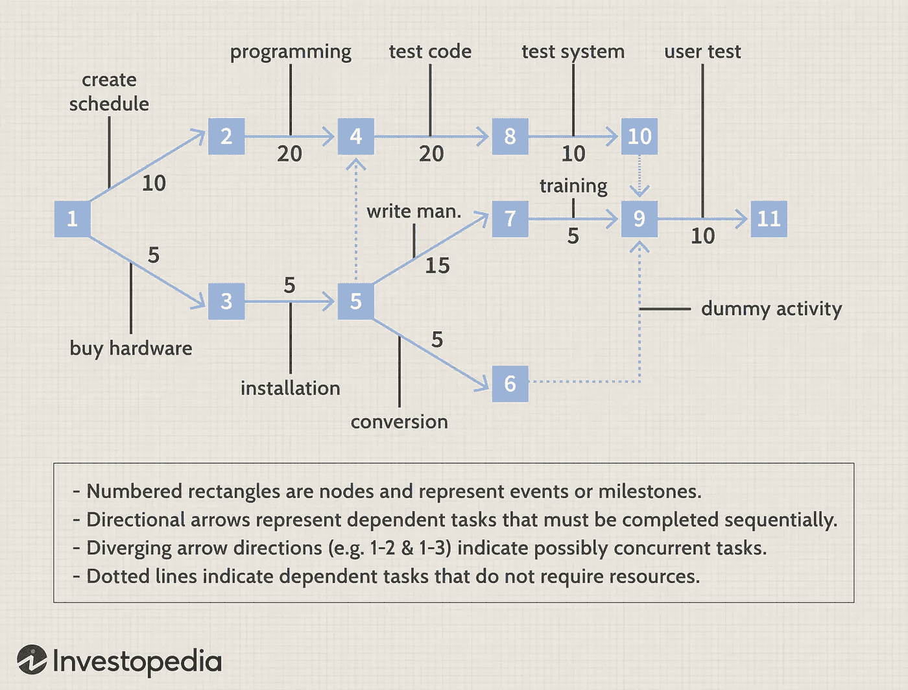

# 软件项目管理 101

> 原文：<https://blog.devgenius.io/software-project-management-overview-a4a7d1118062?source=collection_archive---------2----------------------->

***注*** *:本帖以后会更新。*

软件项目管理处理从想法到最终产品的项目开发。它涉及到不同的概念。

# 软件项目的问题

([来源](https://www.cio.com/article/3065984/8-challenges-affecting-software-project-management.html))

1.  全球化导致更多的竞争，让你的想法变得陈旧。
2.  更新旧系统和基础设施。
3.  有限的软件知识专长。
4.  多重用户需求。
5.  第三方集成和接口问题。
6.  测试过程需要很长时间，而且通常很复杂。

# 谁是利益相关者？什么是管理控制？

*   利益相关者是对公司及其产品和服务感兴趣的人。
*   利益相关者包括管理层、员工、客户、股东等。
*   利益相关者是指直接或间接受到公司业绩和声誉影响的人。
*   **管理控制—** 管理者影响组织成员实施战略的过程。

## 管理控制的特征

([来源](http://businessmanagementideas.com))

*   管理控制执行计划(短期、长期)、沟通、评估等活动。
*   管理控制通过一种叫做目标一致性的策略来影响员工更多地工作。他们实现员工的个人目标，以便更多地工作。
*   监测财务和非财务绩效。

## 管理结构

*   管理控制结构——投资中心将监控收入中心、成本中心等。
*   管理控制流程—目标、规划、预算、绩效、差异分析、绩效衡量。这是一个迭代的过程。

# 软件过程工作流

([来源](https://www.geeksforgeeks.org/process-workflows-in-software-project-management/))

是导致软件开发的一系列相关活动。

*   管理工作流程— 包括软件开发计划(SDP)、业务案例、愿景等。
*   环境工作流程— 自动化流程，减少人为错误。
*   需求工作流程——分析问题以理解它并找到合适的解决方案。
*   设计工作流程——软件建模将解决软件设计问题。
*   实施工作流-设计由编程组件实施。
*   评估工作流程——评估产品质量。
*   部署工作流程—向用户交付最终产品。

# 项目控制周期

([来源](https://www.lucidchart.com/blog/the-4-phases-of-the-project-management-life-cycle))

1.  启动—识别问题。了解深度。定义需要提供的产品或服务。找出谁会从这个项目中受到更大的影响。开发一个用例。记录流程。
2.  规划—创建项目计划(项目的阶段、要执行的任务)。将过程可视化。估算预算。收集资源。估计风险。举行会议。
3.  执行—创建任务和组织工作流。向团队成员简要介绍他们的任务。与团队成员、客户、高层管理人员沟通。监督工作。管理预算。
4.  结束—分析项目和团队绩效。记录项目结束。进行评审。计算已用和未用的预算。

# 项目范围

([来源](https://www.potential.com/articles/project-scope/))

这是关于你需要交付什么，做什么。为了开发一个项目，我们需要对做什么和如何做有清晰的认识。这被称为项目范围。

1.  确定需求。
2.  确认你项目的目标。你应该明确你的目标，你的目标应该是可衡量的和可实现的。
3.  描述你需要做什么以及如何去做。
4.  满足期望。
5.  识别约束并管理它们。
6.  确定必要的变化。

# 如何为您的项目选择技术

([来源](https://intersog.com/blog/code/how-to-choose-the-right-tech-stack-for-your-software-development-project/)

选择一种技术来建造一个项目涉及许多因素。

*   个人喜好。
*   其他公司的推荐。
*   网上调查。
*   过往经历。

## 项目类型

*   简单的项目——简单的网站可以使用模板和 CMS(客户管理服务)来构建。
*   中级项目——使用框架构建。
*   复杂的项目——混合了编程语言、框架和 CMS。

你也可以选择一种流行的、有用户社区的语言或框架，以获得更快的参考和支持。

# 实用人工制品

([来源](https://www.geeksforgeeks.org/pragmatic-artifacts/))

神器是我们开发的软件。实用工件是关于回顾项目的开发。有一些问题:

*   评审人员不理解或者不学习工件(项目)所使用的语言。
*   审阅者无权访问工具。
*   文档应该清晰，有好的语法和数学符号，但情况并非总是如此。
*   应做好记录以备将来参考。
*   在线文档可以很容易地被修改，使审查者产生怀疑。

# 软件原型和类别

([来源](https://www.guru99.com/software-engineering-prototyping-model.html))

一个迭代的过程，在这个过程中原型被构建、测试并在此基础上进行修改。使用试错法。类别包括:

1.  快速一次性原型——根据客户反馈快速开发。直到顾客满意为止。
2.  进化原型——原型是根据客户的反馈逐步开发和改进的。
3.  增量原型——几个单独开发的小原型被合并成一个。
4.  极限原型——用于 web 开发。基本原型是在 HTML 中完成的。完成了实验并开发了最终样机。

# COCOMO 模型

([来源](https://www.geeksforgeeks.org/software-engineering-cocomo-model/))

*   代表建设性成本模型。由巴里·博姆于 1970 年开发。这是一个基于代码行的回归模型。

使用的关键参数有:

1.  工作——所需的劳动量。
2.  计划—所需的时间。

使用的模型有:

1.  有机——适用于小团队和容易理解的问题。
2.  半分离型——如果团队规模、经验和知识介于有机模式和嵌入式模式之间。
3.  嵌入式—大型团队的复杂项目。

*   基本 COCOMO 给出粗略计算。
*   中级 COCOMO 考虑了成本驱动因素。
*   详细的 COCOMO 考虑了各个项目阶段的影响。

关于公式和计算，请访问这个[网站](https://www.geeksforgeeks.org/software-engineering-cocomo-model/)。

# 基于用例的评估

([来源](https://en.wikipedia.org/wiki/Use_case_points))

在开发过程中预测软件规模的软件评估技术。与 UML(统一建模语言)一起使用。使用用例图。

**未调整的用例权重—** 根据用例的复杂性计算。

*UUCW =(简单用例总数 x 5) +(平均用例总数 x 10) +(复杂用例总数 x 15)*

**未调整的演员权重—** 根据演员的数量和复杂程度计算。

*UAW =(简单行动者总数×1)+(平均行动者总数×2)+(复杂行动者总数×3)*

**技术复杂性因素—** 考虑系统的技术因素。

*TCF = 0.6 + (TF/100)*

**环境复杂性因素—** 系统的环境考虑因素。

*ECF = 1.4 + (-0.03 x EF)*

**用例点—** 结合了上述所有方法。

*UCP = (UUCW + UAW) x TCF x ECF*

***注:*** *举例及详细计算，请访问* [*网站*](https://en.wikipedia.org/wiki/Use_case_points) *。*

# 生命周期过程中的阶段

([来源](http://www.student.apamaravathi.in/meterials/spm/unit3.pdf))

## 工程阶段

小团队执行设计和合成(将小块组合成大块)。

1.  初始阶段——实现利益相关者和项目目标之间的协作和交流。
2.  精化——选择一个架构，并通过一次或多次迭代构建一个原型。

## 生产阶段

大型团队执行构建、测试和部署。

1.  构造—所有组件和功能都集成到主应用程序中。
2.  产品化—检查软件的质量，并执行 beta 测试以有效发布软件。

# 软件工作量估算

([来源](https://melsatar.blog/2018/01/15/5-steps-to-software-development-effort-estimation/)

寻找软件项目工作量的准确数字的过程。例如——开发项目需要几个月，需要多少资源等。

## 评估过程

1.  范围界定——您需要做什么以及如何做。
2.  分解——将软件分解成小的组件。
3.  确定规模—使用不同的评估技术来评估产出。
4.  专家和同行评审。
5.  估算最终确定-估算的结论。

**功能点分析**——在需求已知但实现未知的情况下，对软件项目的早期工作进行评估。

COCOMO 模型也用于估算工作量。

***注*** *:详细计算请访问* [*网站*](https://melsatar.blog/2018/01/15/5-steps-to-software-development-effort-estimation/) *。*

# 蒙特 卡罗模拟

([来源](https://www.investopedia.com/terms/m/montecarlosimulation.asp#:~:text=A%20Monte%20Carlo%20simulation%20is,in%20prediction%20and%20forecasting%20models.))

用于对无法使用随机变量分析建模的流程中的不同结果进行建模。解释预测中风险和不确定性的影响。用例是金融、工程和科学。

我们绘制了成本和成功可能性之间的图表。这样，我们衡量不同的结果，并选择最好的一个。下图将以简单的方式说明分析。

***事实*** *:因地名蒙特卡洛而得名，一座以赌场闻名的城市。*

蒙特卡洛分析。资料来源:ProProfs

# PERT 分析

*   代表程序评估和审查技术。
*   提供说明项目时间表和项目范围的图表。

PERT 图将可视化开发过程。在下图中，每个节点都是一个事件。节点之间的线会告诉我们做什么(任务)。第 1–2 行和第 1–3 行告诉我们，为了更好地利用时间，应该同时完成“创建时间表”和“购买硬件”这两项任务。

PERT 图。来源:Investopedia

# 估计每项活动的工作量和资源分配

([来源](https://www.guru99.com/an-expert-view-on-test-estimation.html))

执行测试估计是为了找出完成一项任务需要多少时间。这是一个重要的过程。

问了两个问题—

1.  需要多长时间？
2.  要花多少钱？

我们估计:

1.  资源——所需的资源，如人员、资金和设备。
2.  时间——项目的宝贵时间点。
3.  人类技能——知识和技术技能。
4.  成本预算。

## 估算技术

1.  工作分解结构——将任务分成小块。
2.  三点评估—基于统计数据。
3.  功能点法——测量大小并给每个功能一个权重。

## 过程

*   将项目分成小任务——使用工作分解结构。
*   给团队成员分配任务。
*   **估计完成每项任务的工作量:**

1.  **功能点法:**

评估任务的大小——任务是简单、中等还是复杂，并分配权重。

*总工作量=总功能点*预计功能点*

2.**三点评估:**

这里我们考虑 3 个参数来估计所需的时间。

*a =最佳情况；m =最有可能；b =最坏情况*

我们将这些值代入**双三角分布**公式

*E = (a+4m+b)/6*

*   估计时间和成本后，我们将验证/评估项目。