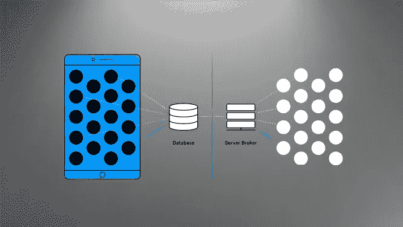

# 从 android 角度看软件可扩展性

> 原文：<https://blog.devgenius.io/software-scalability-from-android-perspective-c6ff8551b574?source=collection_archive---------27----------------------->

我们每天都要处理成千上万行代码。而每一行都改变了我们一个个写代码的视角。在我们将代码转化为产品之前，编写代码没有任何意义。产品是可以持续很长时间的东西。为此，我们努力使我们的产品高效且可扩展。

让我们从全新的角度开始编写代码。

> *为了更好地理解，我们将参考一个* [*新闻应用*](https://github.com/ashujhaji/Kotlin-MVVM-LiveData-Room) *，还将看到一些知名应用的范例。*

我们的项目中有几件事应该说清楚:

1.  数据加载问题。
2.  数据呈现问题。
3.  内存利用率。

大多数社交网络应用程序，如脸书、Instagram、Twitter，在编写软件时很少使用 pro 方式，这使其更加可靠、易于使用和更具可扩展性。

以下是编写代码时需要记住的几个步骤:

# 记忆效率

对于面向对象的编程，我们需要创建新的对象实例，并引用它。但是在这个过程中，我们也有必要在需要的时候重用已经创建的对象。一些解决方案是单例类(Java)或对象类(Kotlin)。

再来说说项目层面的同一个问题。我们不想创建一个以上的活动或片段(Android)对象的实例。为此，我们使用[依赖注入(DI)](https://developer.android.com/training/dependency-injection) 。在模块化代码编写中，依赖注入扮演着重要的角色。简而言之，我们创建一个对象的实例，并在需要时注入它，而无需再次创建实例。

在 android 中有许多 DI 库，如[*Koin*](https://insert-koin.io/)*(Kotlin)*、* [*匕首*](https://square.github.io/dagger/) (Java)等*。* [这里的](https://github.com/ashujhaji/Kotlin-MVVM-LiveData-Room/tree/master/app/src/main/java/com/pixerapps/assignment/di)是我们项目中 Koin 的简单实现。*

# ***数据持久性***

*尽量不要等待网络响应来显示在你的应用程序中。为了解决这个问题，我们使用了一种叫做数据持久化的技术，或者更简单地说，叫做缓存。缓存是一种用来提高速度、平衡负载、提高数据检索性能等的技术。一些常用的工具有 [Redis](https://redis.io/) 等。*

*说到移动，我们称之为数据持久性。android 中有多个库，如 [*境界*](https://realm.io/)*[*房间*](https://developer.android.com/topic/libraries/architecture/room?gclid=EAIaIQobChMIqozwtd356QIVkH8rCh1PhQvvEAAYASAAEgJP0PD_BwE&gclsrc=aw.ds) *等。*我们在[项目](https://github.com/ashujhaji/Kotlin-MVVM-LiveData-Room)中使用了 Room，因为它具有生命周期意识且易于使用。对于图像缓存我们可以使用**或者 [*壁画*](https://frescolib.org/) *。*****

# **线程安全**

**让我们将操作分成两个线程，即*主线程*和*后台线程。*所有繁重的操作，如网络通话、媒体下载、长时间计算等。应该总是在后台线程上。以及诸如数据呈现、图像呈现等 UI 呈现部分。应该在主线程上。通过这样做，我们可以利用我们的 CPU，防止我们的应用程序出现 ANR(应用程序不响应)问题。**

**在科特林图书馆，我们有[协同例程](https://kotlinlang.org/docs/reference/coroutines-overview.html)来处理它。协同例程处理 IO 线程上的所有异步或非阻塞操作，以及主线程上的同步或阻塞操作。**

# **生命周期意识**

**对于一个应用程序来说，重要的是要有生命周期意识，以防止在旋转屏幕或在后台运行应用程序时崩溃。假设在慢速互联网上，您发送了一个网络呼叫，但由于慢速互联网，它需要一些时间来发送响应。在此期间，你退出应用程序，它现在在后台。一段时间后，应用程序得到网络响应，并试图在用户界面上呈现它。但我们的应用程序无法执行此操作，因为它目前不可见，并且已经崩溃。**

**为此，有一个 android 的生命周期感知架构组件，**。*实时数据有一个观察器，当且仅当可以呈现时，它观察变化并将其呈现在 UI 上。***

# **让我们编码吧——新闻应用**

**通过记住以上所有要点，我们为一个新闻应用程序编写了一个项目。在深入之前，我们先了解一下流程。**

**我们在服务器上有一个数据源。我们获取它并将其存储到持久数据库(房间)中。有一个观察者在房间里观察数据。并将其呈现在屏幕上。**

**[*点击此处进入项目*](https://github.com/ashujhaji/Kotlin-MVVM-LiveData-Room)**

****

**建筑理解**

**需要理解的几点:**

1.  **UI 与房间交互，而不是直接与服务器交互。**
2.  **服务器响应最初存储在 Room db 中，而不是任何列表中。**
3.  **房间发出由 UI 观察的 LiveData 对象。**
4.  **我们最初显示来自我们的持久数据库的数据，它阻止了网络调用上的应用程序的可靠性。**

**感谢阅读这篇文章。随时询问任何问题或建议。**

**另请参阅:**

**[*我♥️事件*](https://medium.com/@ashujha.1996/i-%EF%B8%8F-eventbus-878c8aa93662)**

**[*响应处理器(改型+协同程序)*](https://medium.com/@ashujha.1996/response-handler-retrofit-co-routine-378b306aa1b)**