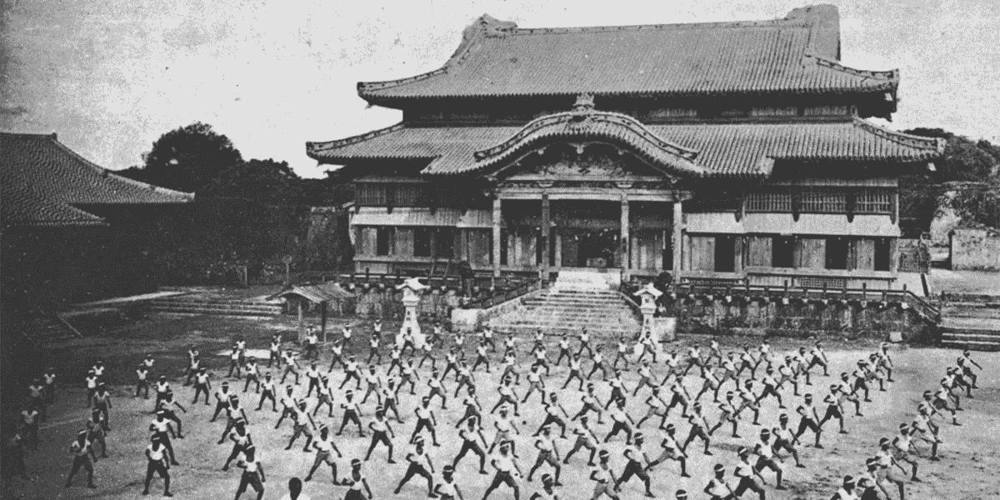

# 软件团队和空手道

> 原文：<https://blog.devgenius.io/software-teams-karate-421ff1ce5425?source=collection_archive---------0----------------------->

什么是软件团队？我们在团队中需要角色或老板吗？

[https://yamatokarate.com/history/](https://yamatokarate.com/history/)

从我还是个孩子开始，直到几年前，我一直在练习空手道，也一直在为许多公司做软件开发。

在软件行业中,“团队”这个术语很常见。事实上，这意味着软件公司的能力是由团队组织的。但是什么是团队，为什么我要把它和空手道混在一起？。

## 集体努力

空手道是一项个人运动，不是吗？。事实上，一个卡拉特卡是因为他/她的道场而成为他/她。道场是练空手道的地方(和你一起训练的人)。
在空手道比赛中，空手道腰带以上的人排在第一行，首先是黑带，接着是棕带、蓝带等等。这是因为在空手道中，第一线的人有责任去教导后面的人。他们不是你的老板，你需要尊重他们，因为他们比你更了解空手道，你需要向他们学习，[那是你的工作，他们的责任](https://medium.com/dev-genius/do-you-trust-me-19f411708e4d)。

你信任上级同事，但他们也信任你。当你进行对打时(对打是空手道的一部分，在其中一个人使用从基翁和形学到的技术来训练对手)，你和你的对手都遵循一些规则，双方都信任对方以避免受伤，但他们都会尽最大努力。我认为团队的规模很重要，如果你需要相互信任的话(较小的团队最好是 5-8 人)。

你的老师(你的老师，这是一个非常糟糕的翻译抱歉)是为了准备课程，将它分成不同的阶段，以提高他们的卡拉特卡的技能。老师会解决冲突，他/她会照顾他们的学生，但一切的结果都在团队中。如果小组对每项技术都投入热情和努力，这门课就会成功。老师正在创造一个空手道学习将会成功的环境，他/她是一个仆人领导。

在我看来，软件开发人员的主要职责应该是作为一个团队成长。相互信任，向有更多经验的人学习，倾听新人的心声。在空手道白带中，卡拉特卡是特殊的，他们需要其他人的努力才能成长。但他们也在所有问题上挑战他/她的老师，黑带培训师需要回答问题并找到答案。在软件中也是一样，新加入者有着新鲜的眼光，他们的问题可能向你解释了你的团队的问题。

## 角色

空手道没有角色，有基于你的知识的学位。平时我们老师会为每个人准备一节课，一个计划。没有人能领导空手道，只有天生的领导者能在你需要的时候帮助你(想想教练、伙伴，不管你叫什么)。

没有筒仓，没有受过不同训练的专家。我们能做任何技术。的确，有人擅长对打，有人擅长打形，等等。我们没有相同的天赋，但是在空手道中，每个空手道手都能够以足够的质量完成任何技术。如果他/她不能做到这一点，那么培训就是答案。

软件也是一样，有些人在某些领域比其他人更专业，但我们作为个体是团队的一部分。所以我们需要有知识来完成任何任务。这是技术领导、团队领导、Scrum Master(不管你们公司叫什么名字)的努力，创造一个团队中的每个人都有足够的知识来完成任何任务的环境。我对此的建议列表(针对销售线索):

*   你们两人一组工作，任何任务都可以由任何一对搭档来完成。
*   经常轮换你的搭档(每周几次)。
*   尽可能多地委派给你的团队，委派意味着信任(没有微观管理)。
*   允许团队成员犯错误，但你需要确保他们从这些错误中吸取教训并采取行动。
*   做出决定来解决实际问题，如果团队做出决定会更好，否则你必须做出决定。

我们需要向其他人学习，那么为什么不效仿空手道，使用结对/围攻来学习呢？。

## 技能

学空手道一言难尽。你需要几年时间来掌握一些技术，并且需要一辈子才能成为真正的专家。我是黑带，但当我通过考试时，我 18 岁(我从 5 岁开始学空手道)，我的老师告诉我，我将从那一刻开始学习空手道。

我们学习空手道，一次又一次重复同样的技术，每次都努力提高。这是空手道背后的哲学，努力一次又一次地改进每一个动作，这在你作为卡拉特卡的生活中不会改变。当你掌握了某样东西，你就可以开始考虑改变它，改进它，这就是 Shuhari 的想法。

> “众所周知，当我们学习或训练某样东西时，我们会经历*舒*、*哈*、*日*几个阶段。这些阶段解释如下。在*舒*中，我们重复这些形式并训练自己，以便我们的身体吸收我们祖先创造的形式。我们仍然忠实于这些形式，没有任何偏差。接下来，在*哈*阶段，一旦我们训练自己获得形式和动作，我们就进行创新。在这个过程中，模板可能会被破坏和丢弃。最后，在 *ri* 中，我们完全脱离了形式，打开了创造技术的大门，到达了一个我们按照自己的内心/思想所渴望的那样行动的地方，不受阻碍，同时也没有超越法律。”[https://en.wikipedia.org/wiki/Shuhari](https://en.wikipedia.org/wiki/Shuhari)

事实上，为了学习如何更好地开发，软件社区从空手道中复制了形的概念。

> “一个**代码形**是[编程](https://en.wikipedia.org/wiki/Computer_programming)中的一个练习，它帮助[程序员](https://en.wikipedia.org/wiki/Programmer)通过练习和重复来磨练他们的技能。”[https://en . Wikipedia . org/wiki/Kata _(编程)](https://en.wikipedia.org/wiki/Kata_(programming))

dojo 概念也被复制:

> 编码 Dojo 是一个基于简单编码挑战的编程会话。不同技能水平的程序员被邀请平等地参与有意的实践。我们的目标是在一个非竞争性的环境中与其他软件开发人员一起学习、教学和提高。[https://code.joejag.com/2009/the-coding-dojo.html](https://code.joejag.com/2009/the-coding-dojo.html)

在空手道中，形是教授空手道的方式，它是老师用来教授学生空手道的神器。有很多针对不同知识水平的形，可以学到更多的东西。空手道是一种与自己的斗争，目的是提高自己，团队会让你更快地达到目标。你的开发者生涯应该遵循同样的原则。

要学习一些软件技术(TDD、进化设计、CI/CD、婴儿步骤),你需要投入时间，重复卡塔，通过努力提高。用团队来做，团队就是你要训练的地方。每个用户故事，技术任务两人一组，练习你想提高的技术。你可以一个人做，但是如果你在你的道场里做，你会学到更多。