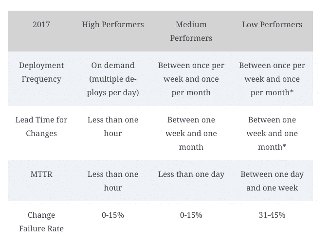

# 软件，工程部分

> 原文：<https://blog.devgenius.io/software-the-engineering-part-87172d48f337?source=collection_archive---------3----------------------->

软件团队在那里解决客户的问题，寻找使用技术使客户生活更轻松的方法。这是软件工程的形态之一，但还有更多。软件本身产生了一系列我们需要解决的问题。

切尔诺比尔

当你不得不管理一个非常复杂的系统时，切尔诺贝利事故是现实世界中可能发生的结果。
实际上产生这种事故的规则和软件中任何人的规则基本上是一样的，故障模式:

> 突然的冲动和过度的紧张都会引发灾难性的失败。在这两种情况下，系统中的某个部分会在其他部分出现故障之前开始出现故障。在《招致灾难》一书中，詹姆斯·r·齐尔斯将这些称为“系统中的裂缝”。他将一个濒临失败的复杂系统比作一块金属上有细微裂纹的钢板。在压力下，裂纹会越来越快地扩展。最终，裂纹传播速度超过音速，金属发生爆炸。最初的触发因素和裂纹扩散到系统其余部分的方式，以及损坏的结果，统称为故障模式。
> [发布第二版](https://www.amazon.es/Release-Design-Deploy-Production-Ready-Software/dp/1680502395/ref=tmm_pap_swatch_0?_encoding=UTF8&qid=1631955795&sr=8-1)

在任何系统中，这些裂缝都是由于系统中任何部分的人为错误而触发的。不可能找到避开它们的方法。任何系统都有各种各样的故障模式。我们所能做的最好的事情就是设计我们的系统来对这些故障模式做出反应，并使损失最小化。

回到软件，当我谈论系统时，我指的是应用程序、服务器、系统中涉及的人员、遵循的流程等等。所以我们作为工程师的工作就是思考如何最小化与我们正在解决的问题无关的复杂性，而是与我们如何解决问题有关的复杂性(偶然的复杂性)。

关于偶然的复杂性包含了什么的一些想法:

*   技术债务:我把它定义为我们所做的所有决定，这些决定现在对我们的系统来说是个问题。软件是一种交易，所以在这个特定的时刻，这种交易是可以支付的，但现在它是一种成本。
*   遗留代码:我把遗留代码理解为没有测试的代码，我害怕改变的东西。
*   [因缺乏信任或自动化而采取决策的官僚作风。](/do-you-trust-me-19f411708e4d?sk=f939c7a213e05aa7d4dd96ee3f7c4f6b)
*   [系统不同部分之间的耦合](/its-the-coordination-stupid-f3581bbf25cd?sk=644c395aad2747e8409c2f81d5917897)(团队的边界)
*   [团队中的知识转移](/software-teams-karate-421ff1ce5425?sk=35ae3ddbd707d5d86d681e1d8a08524b)
*   很多我今天不明白的事情。

偶然的复杂性反映在团队的表现中，但是如何衡量表现呢？

## 4 个关键指标

[Accelerate](https://www.amazon.com/Accelerate-Software-Performing-Technology-Organizations/dp/1942788339) 这本书从 [DORA](https://www.devops-research.com/research.html) 报告中摘录了 4 个衡量标准，可以用来根据团队的表现对其进行分类:

*   交付周期:从代码被签入版本控制系统到它被部署到生产环境所花费的平均时间。
*   部署频率:一段时间内部署到生产环境的次数。
*   平均恢复时间:解决或回滚生产中的错误所需的时间。
*   变更失败百分比:生产变更(软件发布和配置变更)失败的百分比。

交付周期和部署频率衡量交付性能进度，而平均恢复时间和变更失败率与系统的稳定性更相关。

基于这种分类，该书确定了三个集群:

> 令人惊讶的是，这些结果表明，在提高性能和实现更高水平的稳定性和质量之间没有折衷。相反，高绩效者在所有这些指标上都做得更好。这正是敏捷和精益运动所预测的，但我们行业中的许多教条仍然基于一个错误的假设，即更快的移动意味着与其他绩效目标进行权衡，而不是实现和加强它们。
> [加速](https://www.amazon.com/Accelerate-Software-Performing-Technology-Organizations/dp/1942788339)

这本书还认识到，高绩效团队有一套技术和管理实践来实现这些结果:

*   [连续交货](https://javi-kata.medium.com/ci-cd-for-dummies-b45ed917f9dc?sk=28eede1d5fec71121eea4954583130e9)
*   具有一些原则的架构:
    ——我们可以在不需要集成环境的情况下完成大部分测试。
    -我们可以独立于其他应用程序/服务部署或发布我们的应用程序。
*   精益原则

所以我要说的是软件的技术实践、架构决策和管理实践，它们都对我们所创造的产品质量有着重要的影响。
事实上，这就是我们所说的“软件工程师”，我们在这些领域的决策应该以上述实践为指导。