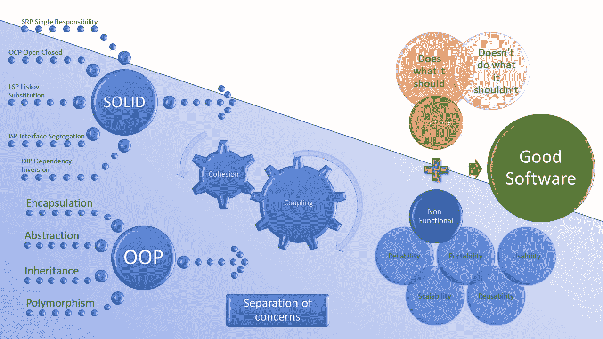
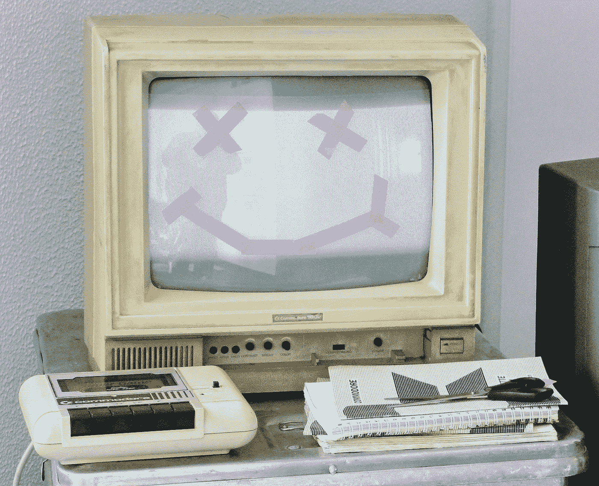

# 坚实是旅程的一部分，而不是目标

> 原文：<https://blog.devgenius.io/solid-is-part-of-the-journey-not-the-goal-658c17787335?source=collection_archive---------5----------------------->

## 不要以为你用了 SOLID 就破解了软件质量

## 什么是好的软件？

在面试了一批新开发人员后，我有时间思考他们是如何处理两个问题的，**什么是可靠的**？还有**什么才是好软件**？

# ***什么是固体？***

无一例外，他们都能解释什么是坚实的原则，并对其含义给出合理的描述。但当被问及原因时？然后答案开始消失。很明显，他们已经学会了一种公式化的方式来编写软件以实现目标，他们认为稳定是目标，而不是过程。

> ***“扎实不是目标它是旅程的一部分”***

SOLID 是一套很好的原则，它让我们踏上了提高内聚性和耦合性的旅程，这是朝着获得更好的重用、可用性、可维护性和可伸缩性的方向迈出的一步。好软件的天堂不仅需要这些好的设计和构造，还需要功能的关键组成部分，既要实现所需的功能，又要在不中断的情况下处理意外情况。

为了完整起见，SOLID 是 2000 年五个原则的缩写。

*   单一责任——一个类改变的原因不能超过一个
*   **O** pen/closed —打开用于扩展，关闭用于修改
*   **L** iskov 替换——可用其子类型替换的对象
*   接口分离——特定于客户端的接口比通用接口更好
*   依赖倒置——依赖于对具体细节的抽象

# 什么是好的软件？

好软件的定义比“源代码中有大量注释”的老一套回答更进一步，它要求我们思考如何培训和教育人们成为具有清晰愿景和目标的伟大软件工程师，而不仅仅是能够有效编码并遵守编码标准和原则的程序员。

> ***【源代码中的大量注释】***

不加选择的大量注释也不是解决代码质量或可维护性的方法。一致的命名标准，以及对方法、函数和变量的有意义的描述，比解码用作函数名的缩写更有用。有几篇关于优秀软件特征的好文章，所以我把它们放在了最后，而不是详细列出。

甚至一个简单的回答“好的软件如预期的那样运行”或者“相对来说没有错误”也是描述期望结果的更好的答案。

这两个快速回答都是对更好答案的简要总结

好软件…

*   做它应该做的
*   不做不该做的事

# 做它应该做的

它满足了交付功能以满足用户期望的初衷，因此他们可以获得一些好处。

这样做也保持了一组非功能性的需求，除非有问题，否则用户不会注意:

*   安全性
*   表演
*   轻便
*   可用性
*   可量测性
*   和睦相处
*   可维护性

# 不做不该做的事

它不会在不考虑安全性、速度和易用性的情况下，很差、不完整、不一致地实现功能。实事求是地说，所有的软件都会有缺陷(缺陷、异常、意想不到的特性)。只要这些不妨碍软件的主要操作，并且是不经常的和不重要的，那么用户通常同意它被称为好软件。如果项目的下一个开发人员对结构和设计有一定程度的文档、逻辑和模式，并且可以轻松地重新构建和部署它，那么他可能会说它很好。

照片由 [ETA+](https://unsplash.com/@etaplus?utm_source=medium&utm_medium=referral) 在 [Unsplash](https://unsplash.com?utm_source=medium&utm_medium=referral) 上拍摄

# 最后的想法

工程学已经发展出一套简单易记的原则。不幸的是，这种营销的成功之处在于，一些新员工认为它是最重要的。我们所有人都有责任教育新开发人员创造**好软件**所需的全套最佳实践，或者创造一种聪明的方法来记住所有其他优秀的设计和质量原则，因为 KISS 似乎很有效…

> “接吻——保持简单，笨蛋”

# 进一步阅读

*   **坚实原则备忘单**[https://www . Monte rail . com/hub fs/PDF % 20 content/SOLID _ cheat sheet . PDF](https://www.monterail.com/hubfs/PDF%20content/SOLID_cheatsheet.pdf)

 [## 自文档软件和门有什么共同点？

### 活文档—第 2 部分

medium.com](https://medium.com/geekculture/what-do-self-documenting-software-and-doors-have-in-common-6ad95063570a)  [## 如果你不遵守神盾局的原则呢？

### 糟糕设计的后果

medium.com](https://medium.com/dev-genius/what-if-you-dont-follow-s-o-l-i-d-principles-cbca0c787aea)  [## 什么让软件变得好？

### 许多品质构成了好的软件。

levelup.gitconnected.com](https://levelup.gitconnected.com/what-makes-software-good-920ab5732862)