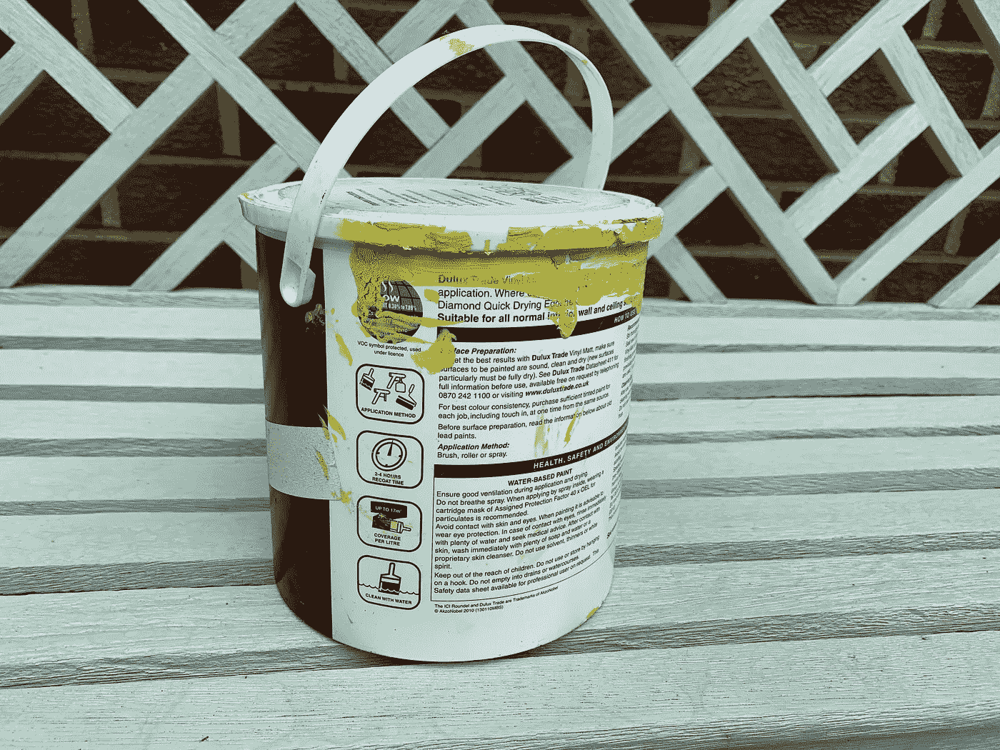
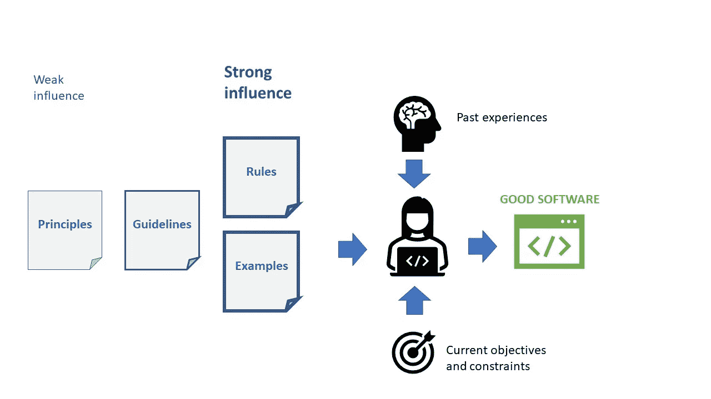
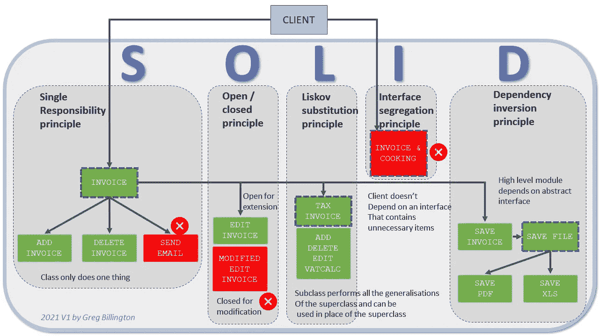

# 固体还不够清楚！

> 原文：<https://blog.devgenius.io/solid-isnt-enough-a631aa73f4c3?source=collection_archive---------4----------------------->

## 用更简单的方式而不是原则传达好的含义

## 我们需要说明和例子而不是原则吗？

一罐颜料上的简单说明——文章作者(格雷格·比灵顿)拍摄

昨天有人问我什么是"**好软件**，我再一次给出了我一贯的回答，它不仅仅是坚实的原则。在思考工程师通常不清楚什么是好的这个问题时，我做了一个快速实验。我谷歌了“**固体原理**”然后谷歌了“**固体原理小抄**”，看看业界在思考固体时指的是什么浓缩和压缩笔记。第一个震惊是谷歌搜索结果中没有太多图片，其次，结果只是 5 个原则的简单列表。

如果我们甚至不能给他们清晰和简单的指导，我们怎么能期望编写软件的人创造出优秀的产品呢？

如果我们给他们潜在的理论，它依赖于他们的理解和解释，我们是否应该更规范一点，给人们指导方针？或者更坚定一点，提供规则和例子？毕竟，当我们在制造医疗设备、汽车和飞机时，难道我们不需要确保它真的是好代码吗？

# 好的软件是如何开发出来的？

作者图片(Greg Billington)

开发人员创建软件，他们产品的感知质量是一系列因素和对他们的影响的直接结果:

*   **过去的经历** —哪些工作取得了好的结果(来自同事、经理、用户的积极反馈)，哪些导致了不好的经历(抱怨、缺陷、加班)。
*   **当前目标和约束** —项目目标、公司编码标准、团队期望等。
*   **对美好事物的感知**——受公认为规范的价值观、原则和指导方针的影响。由当前技术领域的工匠来完成。

# 对善的感知

当前广泛持有的对粘性的感知是可靠的，这在一系列原则中有所描述。这些原则是工程的基础，用专家可以理解和解释的公式或数值来表达。

> 但是我们做错了吗？

斯文·米克在 [Unsplash](https://unsplash.com?utm_source=medium&utm_medium=referral) 上拍摄的照片

建筑商用一套规则建造房子，而不是用一套原则。

建筑工人=用他们的双手将材料组装成我们称之为房子的结构的实际人员，包括砖瓦工、电工和管道工等专业人员。

这些原则可能包括:

*   **重力** — *g* = 9.80665 米/秒 2
*   莫尔力矩理论
*   应力=力/面积

建筑师可能有他们用来建造房子的设计模式的子集，或者经验法则、跨度距离、承重梁的厚度等。然后，他们依靠结构工程师来检查拟议的设计是否符合物理定律，这些公式是建筑物如何抵抗重力而不会破裂或开裂的原则。

建筑检查员使用一组规则:

*   必须有防潮层
*   屋顶的倾斜度必须大于 x 度，以确保雪落下

这些都很容易解释，明确和直接，以防止错误，并确保建筑物不会倒塌。

盖房子的人参考的是一套原则吗？或者一套关于材料(油漆罐的一面)和蓝图的说明，以及规则(用铅垂线把墙弄直)。砌砖工人很少拿出计算器来检查牛顿定律是否被正确应用。

# 实例证明

那么如何才能用简单的格式表达固体呢？

一种方法是通过**示例**来展示，这消除了必须理解原理的认知负担，但也可以传达**如何、**以及一点注释**为什么**。

作者的实例图片(格雷格·比灵顿)

上面的图表可能并不完美，但它强调了如何在一个例子中解释所有 5 个原则，以通用的方式显示什么应该做，什么不应该做(红色是不好的，绿色是好的)。

# 可靠的指示

另一种方法是创建规则和指令，并使它们易于掌握和交流。没有人说这必须是艰苦的工作，使用乐趣和幽默效果很好，甚至可能是一个卡通片？这些原则需要提炼为日常指导，我们需要就一套共同的原则达成一致。

遵循一套规则比遵循一套原则容易。标志和标签的激增表明，这种方法在引导行为向所要求或所期望的方向发展方面发挥了作用。

由[亚当·格里菲斯](https://unsplash.com/@aggriffith?utm_source=medium&utm_medium=referral)在 [Unsplash](https://unsplash.com?utm_source=medium&utm_medium=referral) 上拍摄的照片

# 最后的想法

复杂主题的交流从来都不容易，但是如果我们不能在一罐油漆上创造出等同于说明的东西，那么作为一个行业，我们就不太可能进步，好的软件将仍然是遥不可及的天堂。

我们需要专家将原则提炼成简单的指令和例子，以便更容易培训和教育工程师。

# 进一步阅读

 [## 坚实是旅程的一部分，而不是目标

### 什么是好的软件？

blog.devgenius.io](/solid-is-part-of-the-journey-not-the-goal-658c17787335)  [## 不用抢劫银行，用一根纯金棒就能做出伟大的软件。

### GOLD 能像 SOLID 做编码那样做开发吗？

blog.devgenius.io](/make-great-software-with-a-pure-s-o-l-i-d-gold-bar-without-raiding-a-bank-7090528c154f)  [## 照片中的神盾局原则

### 如果你熟悉面向对象编程，那么你可能听说过坚实的原则。

medium.com](https://medium.com/backticks-tildes/the-s-o-l-i-d-principles-in-pictures-b34ce2f1e898) 

# 关于作者的更多信息

**Greg** 是一名经验丰富的软件专业人士，也是[**outsource . dev**](https://outsource.dev/)**，**的首席技术官，他曾在多家公司工作过，现在热衷于帮助他人在软件开发、管理和外包方面取得成功。

如果你喜欢这篇文章，请鼓掌👏和**跟着**我。