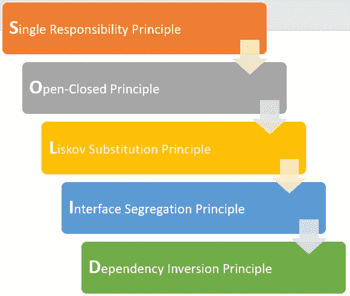

# 固体原理第 1 部分

> 原文：<https://blog.devgenius.io/solid-principles-part-1-67b244fbac06?source=collection_archive---------13----------------------->

**坚实**指面向对象编程中的五个设计原则，旨在减少代码腐烂，提高软件的价值、功能和可维护性。坚实的原则帮助用户开发耦合度较低的代码。如果代码是紧密耦合的，那么一组类是相互依赖的。为了更好的可维护性和可读性，应该避免这种情况。



# 使用可靠原则的好处

当你结合使用 S.O.L.I.D 的所有原则时，开发易于管理的软件就变得更容易了。

*   **干净:**扎实的原则让代码干净规范。
*   **可维护:**在坚实原则的帮助下，我们的代码变得更易于管理和维护。
*   **可伸缩:**易于重构或更改代码。
*   **冗余:**坚实的原则避免冗余代码。
*   **可测试:**可以很容易地进行单元测试。
*   **可读性:**坚实的原则使得代码简单易读。
*   **独立:**通过减少依赖性，代码变得独立。
*   **可重用:**代码变得可重用。

# 1.单一责任

单一责任原则(SRP)声明一个类的改变不应该有一个以上的原因。这意味着代码中的每个类或类似的结构应该只有一项工作要做。

课堂上的一切都应该和那个单一的目的相关。这并不意味着您的类应该只包含一个方法或属性。

可以有许多成员，只要他们与单一责任相关。当改变的一个原因发生时，类的多个成员可能需要修改。

**例如**，让我们看看下面的 Employee 类，它保存了关于雇员的信息以及雇员管理身份验证过程的登录和退出方法。

```
data class Employee(
    var EmpId: Long,
    var EmpName: String,
    var EmpPassword: String
){
    fun LogIn(){
        // This method will do signing in operations
    }

    fun LogOut(){
        // This method will do signing out operations
    }
}
```

现在让我们假设我们需要对登录和注销方法中的身份验证过程进行一些更改，我们的 Employee 类将会受到影响。这给一个类增加了不止一个责任。

当这种情况发生时，我们应该把我们的班级分开。这意味着雇员类应该只有一个责任，即保存雇员信息。

为了解决这个问题，我们应该创建一个新的类来管理认证过程，并将登录和注销功能移到这个类中。

```
data class Employee(
    var EmpId: Long,
    var EmpName: String,
    var EmpPassword: String
)

class AuthenticationService(){
    fun LogIn(){
        // This method will do signing in operations
    }

    fun LogOut(){
        // This method will do signing out operations
    }
}
```

# **2。开闭原理**

开闭原则(OCP)指出，类应该对扩展开放，但对修改关闭。“对扩展开放”意味着你应该设计你的类，这样当新的需求产生时，新的功能可以被添加。**“关闭修改”**意味着一旦你开发了一个类，你就不应该修改它，除非是为了纠正错误。

原则的这两个部分似乎是矛盾的。但是，如果您正确地构造了类及其依赖项，您就可以在不编辑现有源代码的情况下添加功能。

一般来说，您可以通过引用依赖关系的抽象来实现这一点，比如接口或抽象类，而不是使用具体的类。可以通过创建实现接口的新类来添加功能。

**让我们举个例子。**

下面的代码有一个名为 area factory 的类，用于计算形状的面积。仔细看一下代码，我们会发现我们有一个 if-else 语句来分隔形状，随着形状的增加，它们将继续以这种方式增长，因为该类没有对修改关闭，也没有对扩展开放。因此，这违反了我们的开闭原则。

```
class Rectangle {
    private var length;
    private var height; 
    // getters/setters ... 
}

class Circle {
    private var radius; 
    // getters/setters ...
}

class AreaFactory {
    public fun calculateArea(shapes: ArrayList<Object>): Double {
        var area = 0;
        for (shape in shapes) {
            if (shape is Rectangle) {
                var rect = shape as Rectangle;
                area += (rect.getLength() * rect.getHeight());                
            } else if (shape is Circle) {
                var circle = shape as Circle;
                area += (circle.getRadius() * cirlce.getRadius() * Math.PI);
            } else {
                throw new RuntimeException("Shape not supported");
            }            
        }
        return area;
    }
}
```

我们将在**接口**的帮助下**修复**这个问题。

```
public interface Shape {
    fun getArea(); 
}

public class Rectangle: Shape {
    private var length;
    private var height; 
    // getters/setters ... 
    @Override
    public getArea(): Double {
        return (length * height);
    }
}

public class Circle : Shape{
    private var radius; 
    // getters/setters ...
   @Override
    public getArea() : Double {
        return (radius * radius * Math.PI);
    }
}

public class AreaFactory {
    fun calculateArea(shapes: ArrayList<String>): Double {
    var area: Double = 0.toDouble();
    for (shape in shapes) {
            area += shape.getArea();
        }
        return area;
    }
}
```

# **3。利斯科夫替代原理**

Liskov 替换原则(LSP)适用于继承层次结构，它规定您应该设计您的类，以便可以用子类替换客户端依赖项，而客户端不知道这种变化。

因此，所有子类都必须以与基类相同的方式操作。子类的特定功能可能不同，但必须符合基类的预期行为。要成为真正的行为子类型，子类不仅要实现基类的方法和属性，还要符合其隐含的行为。

如果子类不能执行属于父类的行为，我们可能不会在执行该行为的方法中编写任何代码，否则当对象想要使用它时，我们会抛出一个错误。但是这些行为会造成代码污染和不必要的代码拥挤。

**我们来举个例子。**

假设我们有一个名为 Vehicle 的抽象类。这个抽象类有一些方法。当我们创建诸如 Car，Truck 等子类时。扩展车辆抽象类对我们来说很好。

```
abstract class Vehicle{
    protected var isEngineWorking = false
    abstract fun startEngine()
    abstract fun stopEngine()
    abstract fun moveForward()
    abstract fun moveBack()
}

class Car: Vehicle(){
    override fun startEngine() {
        println("Engine started")
        isEngineWorking = true
    }

    override fun stopEngine() {
        println("Engine stopped")
        isEngineWorking = false
    }

    override fun moveForward() {
        println("Moving forward")
    }

    override fun moveBack() {
        println("Moving back")
    }
}

class Bicycle: Vehicle(){
    override fun startEngine() {
        // TODO("Not yet implemented")
    }

    override fun stopEngine() {
        // TODO("Not yet implemented")
    }

    override fun moveForward() {
        println("Moving forward")
    }

    override fun moveBack() {
        println("Moving back")
    }
}
```

在上面的代码中，你可以看到，当我们创建自行车类时，方法 start engine 和 stop engine 是无用的，因为自行车没有引擎。

为了解决这种情况，我们可以创建一个新的子类来扩展 Vehicle。这个课程将会和有引擎的车辆一起学习。

```
interface Vehicle{
    fun moveForward()
    fun moveBack()
}

abstract class VehicleWithEngine: Vehicle{
    private var isEngineWorking = false
    open fun startEngine(){ isEngineWorking = true }
    open fun stopEngine(){ isEngineWorking = false }
}

class Car: VehicleWithEngine(){
    override fun startEngine() {
        super.startEngine()
        println("Engine started")
    }

    override fun stopEngine() {
        super.stopEngine()
        println("Engine stopped")
    }

    override fun moveForward() {
        println("Moving forward")
    }

    override fun moveBack() {
        println("Moving back")
    }
}

class Bicycle: Vehicle{
    override fun moveForward() {
        println("Moving forward")
    }

    override fun moveBack() {
        println("Moving back")
    }
}
```

固体原理延续部分-2…..[https://app-devo PS . medium . com/solid-principles-part-2-1 f 158 a 53 D8 b 5](https://app-devops.medium.com/solid-principles-part-2-1f158a53d8b5)